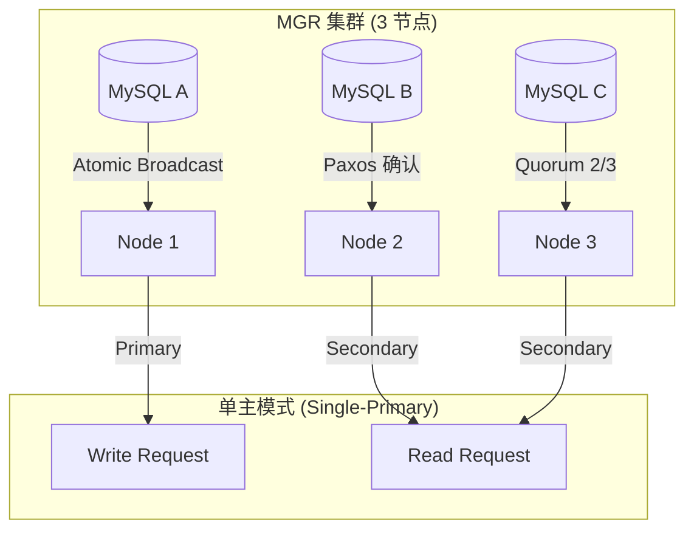

## MySQL 高可用集群架构

企业级 MySQL 架构的底线是**高可用（High Availability）**。当单点故障发生时，集群必须能在秒级完成自动故障转移（Failover），保证业务无感知。本章深入剖析 MGR（Group Replication）、InnoDB Cluster、以及代理层路由（ProxySQL/MySQL Router）三大主流高可用方案。

---

## 一、 MGR（MySQL Group Replication）—— 原生分布式事务集群

MGR 是 MySQL 官方在 5.7.17 推出的原生集群方案，基于 **Paxos 共识协议**实现多主/单主模式的强一致性复制。

### 1. 核心原理：基于 Group Communication System（GCS）

MGR 内部由 GCS 提供可靠的组通信能力，所有节点通过以下机制协同：

- **Membership（成员管理）**：基于 `group_replication_group_name` 组名发现节点，通过 `group_replication_start_on_startup=OFF` 手动控制加入。
- **Atomic Broadcast（原子广播）**：事务变更通过 Paxos 协议在组内广播，**超过半数节点确认（Quorum）** 才提交，单点故障自动降级。
- **Conflict Detection（冲突检测）**：每个事务包含 `transaction_write_set_extraction` 哈希值，若两个节点并发修改同一行，后到节点检测冲突并回滚。



### 2. 单主 vs 多主模式对比

| 特性 | Single-Primary（推荐生产） | Multi-Primary |
| :--- | :--- | :--- |
| **写入入口** | 仅 Primary 节点可写 | 任意节点可写 |
| **冲突检测** | 简单（仅 Secondary 节点只读） | 复杂（需处理跨节点写冲突） |
| **延迟** | 低（写入路径单一） | 较高（需多节点 Paxos 共识） |
| **适用场景** | 读写分离架构、核心 OLTP | 多活多写、跨机房容灾 |

**单主模式切换流程**：
1. Primary 节点心跳超时（`group_replication_member_expel_timeout`）或宕机。
2. 剩余节点触发新选举（基于 `group_replication_member_weight` 权重配置）。
3. 新 Primary 发送 `group_replication_bootstrap_group` 重新初始化组通信。
4. Secondary 节点自动重连新主并同步增量 binlog。

### 3. 部署配置示例

**MySQL 8.0 MGR 单主模式配置**（3 节点，IP: 10.0.0.1/2/3）：

```ini
# my.cnf (每节点单独配置 server_id, ip_address)
[mysqld]
server_id=1
gtid_mode=ON
enforce_gtid_consistency=ON
binlog_format=ROW
master_info_repository=TABLE
relay_log_info_repository=TABLE
transaction_write_set_extraction=XXHASH64
group_replication_group_name="aaaaaaaa-bbbb-cccc-dddd-eeeeeeeeeeee"
group_replication_start_on_startup=OFF
group_replication_local_address= "10.0.0.1:33061"
group_replication_group_seeds= "10.0.0.1:33061,10.0.0.2:33062,10.0.0.3:33063"
group_replication_ip_whitelist="10.0.0.0/24"
group_replication_member_weight=50
```

**初始化 Primary 节点（仅第一次执行）**：

```sql
SET GLOBAL group_replication_bootstrap_group=ON;
START GROUP_REPLICATION;
SET GLOBAL group_replication_bootstrap_group=OFF;
```

**Secondary 节点加入**：

```sql
CHANGE MASTER TO
  MASTER_USER='repl',
  MASTER_PASSWORD='repl123',
  FOR CHANNEL 'group_replication';
START GROUP_REPLICATION;
```

---

## 二、 InnoDB Cluster—— 全栈自动化运维方案

InnoDB Cluster 是 MySQL 官方基于 MGR 的**全栈封装**，包含三个组件：

- **MySQL Shell**：CLI 工具，提供 `dba` 命令自动化部署。
- **MySQL Router**：轻量级代理，自动感知主从切换并路由流量。
- **InnoDB ReplicaSet**：MGR 集群实例的逻辑抽象。

### 1. 部署流程（3 分钟极速上线）

```bash
# 1. 安装 MySQL Shell
curl -LO https://dev.mysql.com/get/mysql-shell-8.0.36-macos11-x86-64bit.dmg

# 2. 连接任意节点并初始化集群
mysqlsh root@localhost:3306

# 3. 检查环境并部署 MGR
dba.checkInstanceConfiguration('root@localhost:3306');
dba.configureInstance('root@localhost:3306', {restart: true});

# 4. 创建 InnoDB Cluster
var cluster = dba.createCluster('myCluster');

# 5. 动态扩容（新节点自动同步）
var node2 = cluster.addInstance('root@localhost:3307');

# 6. 检查集群状态
cluster.status();
```

### 2. MySQL Router 自动路由

Router 启动后自动从 Metadata Server（Cluster 中任意节点）拉取拓扑信息：

- **读写端口（6446）**：自动路由到 Primary 节点。
- **只读端口（6447）**：自动路由到所有 Secondary 节点。
- **故障切换**：Primary 宕机后，Router 10 秒内发现并重新查询 Metadata，将读写流量切到新 Primary。

```bash
# 启动 Router
mysqlrouter --bootstrap root@localhost:3306 --directory /etc/mysqlrouter

# 启动后监听端口
netstat -an | grep "6446"  # 读写
netstat -an | grep "6447"  # 只读
```

### 3. 与纯 MGR 对比

| 维度 | 纯 MGR | InnoDB Cluster |
| :--- | :--- | :--- |
| **运维复杂度** | 高（需手动配置 MGR、Binlog、GTID） | 低（MySQL Shell 一键部署） |
| **客户端感知** | 需自行实现连接池重连 | MySQL Router 自动 failover |
| **监控能力** | 依赖第三方（如 Prometheus） | 内置 `cluster.status()` JSON 输出 |
| **适用场景** | 高度定制化、已有代理层 | 快速上线、标准化运维 |

---

## 三、 代理层路由：ProxySQL vs MySQL Router

当集群规模扩大到 10+ 节点，或需要精细化流量控制时，代理层成为必需。

### 1. ProxySQL —— 高性能 SQL 路由与缓存

ProxySQL 是基于 Lua 的高性能代理，支持：

- **读写分离**：自动将 `SELECT` 分流到 Slave，`INSERT/UPDATE/DELETE` 路由到 Master。
- **查询缓存**：`query_rules` 规则缓存高频查询结果（如字典表）。
- **连接池**：复用后端 MySQL 连接，减少连接握手开销。
- **流量治理**：限流（max_queries_per_second）、熔断（hostgroup 状态标记）。

**核心配置（MySQL 5.7+ 读写分离）**：

```sql
-- 添加后端 MySQL 实例
INSERT INTO mysql_servers (hostgroup_id, hostname, port) VALUES (1, '10.0.0.1', 3306); -- Master
INSERT INTO mysql_servers (hostgroup_id, hostname, port) VALUES (2, '10.0.0.2', 3306); -- Slave1
INSERT INTO mysql_servers (hostgroup_id, hostname, port) VALUES (2, '10.0.0.3', 3306); -- Slave2

-- 读写分离规则
INSERT INTO mysql_query_rules (rule_id, active, match_pattern, destination_hostgroup, apply) VALUES
(1, 1, '^SELECT.*FOR UPDATE$', 1, 1), -- SELECT FOR UPDATE 走 Master
(2, 1, '^SELECT', 2, 1); -- 普通 SELECT 走 Slave

-- 加载配置并保存
LOAD MYSQL SERVERS TO RUNTIME;
SAVE MYSQL SERVERS TO DISK;
LOAD MYSQL QUERY RULES TO RUNTIME;
SAVE MYSQL QUERY RULES TO DISK;
```

**故障切换集成（使用 `mysql_replication_hostgroups`）**：

ProxySQL 自动监控 Master/Slave 状态，当 Master 宕机，将 Slave 提升为主库后自动调整流量路由。

### 2. MySQL Router vs ProxySQL 选型建议

| 特性 | MySQL Router | ProxySQL |
| :--- | :--- | :--- |
| **设计目标** | InnoDB Cluster 轻量路由 | 高性能通用 SQL 代理 |
| **复杂度** | 低（自动化集成） | 中高（需手动配置规则） |
| **功能** | 基础读写分离 | 查询缓存、限流、SQL 审计 |
| **性能** | 低延迟（~50μs） | 高吞吐（10w+ QPS） |
| **推荐场景** | InnoDB Cluster 快速部署 | 大规模集群、精细化控制 |

---

## 四、 高可用架构演进路线图

### 1. 初期阶段（1~2 年，< 1000 QPS）

- **方案**：主从复制 + MHA（Master High Availability）
- **缺点**：MHA 依赖 SSH 切换，故障转移时间 ~30 秒。

### 2. 中期阶段（2~5 年，1000~10000 QPS）

- **方案**：MGR 单主模式 + 自研连接池（如 ShardingSphere-Proxy）
- **优势**：秒级 failover，强一致性。

### 3. 高级阶段（5 年+，> 10000 QPS）

- **方案**：InnoDB Cluster + ProxySQL + 分库分表
- **架构分层**：

  ```text
  Client -> [ProxySQL: 读写分离/缓存] -> [InnoDB Cluster: 3 节点 MGR]
                                     -> [Sharding-Table: 16 库 64 表]
  ```

---

## 五、 高可用测试与验证

### 1. 故障注入测试

使用 `kill -9` 模拟主库宕机：

```bash
# 查看当前 Primary
mysql -h 10.0.0.1 -e "SELECT VARIABLE_VALUE FROM performance_schema.global_variables WHERE VARIABLE_NAME='group_replication_primary_member';"

# 强制杀掉主库进程
kill -9 $(pgrep mysqld)

# 观察秒级切换（从日志或 cluster.status()）
tail -f /var/log/mysql/error.log | grep " Primary"
```

### 2. 压力测试

使用 `sysbench` 压测代理层高可用：

```bash
# 高并发读写压测
sysbench oltp_read_write --threads=100 \
  --mysql-host=proxysql-ip --mysql-port=6446 \
  --time=60 --report-interval=10 run
```

### 3. 监控指标

| 指标 | 阈值 | 工具 |
| :--- | :--- | :--- |
| `group_replication_member_state` | `ONLINE` | Prometheus + MySQL Exporter |
| `Seconds_Behind_Master` | `< 1` | pt-heartbeat |
| `thread_running` | `< max_connections * 0.8` | Grafana |
| `aborted_connects` | `< 10/分钟` | ELK 日志分析 |

---

## 六、 常见故障排查

### 1. MGR 节点被驱逐（Expelled）

**现象**：`SHOW RELAYLOG EVENTS IN 'mysql-relay-bin.000001';` 显示 `Group membership changed`。

**排查步骤**：
1. 检查网络延迟：`ping`、`netstat -s | grep -i packet`。
2. 查看 MGR 日志：`cat /var/log/mysql/error.log | grep "Group replication"`。
3. 检查 `group_replication_connection_state`：`SELECT * FROM performance_schema.replication_group_members;`。

**解决**：增加 `group_replication_member_expel_timeout`（默认 5 秒）或优化网络。

### 2. ProxySQL 读写分流失效

**现象**：`SELECT` 语句也被路由到 Master。

**排查**：
1. 检查 `mysql_query_rules` 是否启用：`SELECT rule_id, active, match_pattern, destination_hostgroup FROM mysql_query_rules;`。
2. 确认 `apply=1` 且顺序正确（`rule_id` 小的优先匹配）。
3. 查看执行计划：`EXPLAIN SELECT * FROM mysql.global_variables WHERE variable_name='query_processing_engine';`。

**解决**：调整 `mysql_query_rules` 顺序，确保 `SELECT FOR UPDATE` 规则在普通 `SELECT` 之前。
