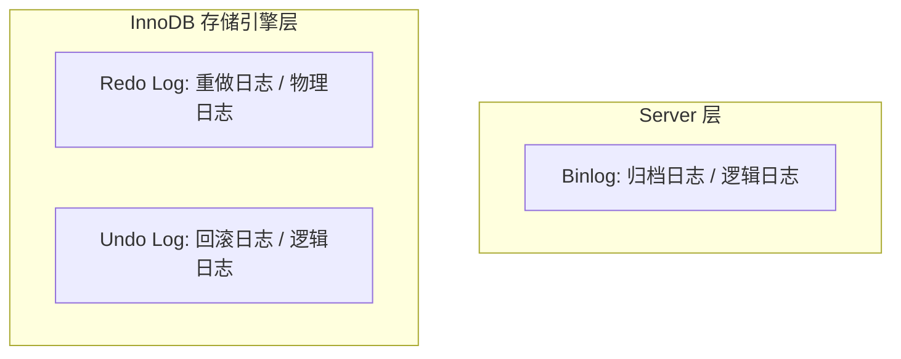
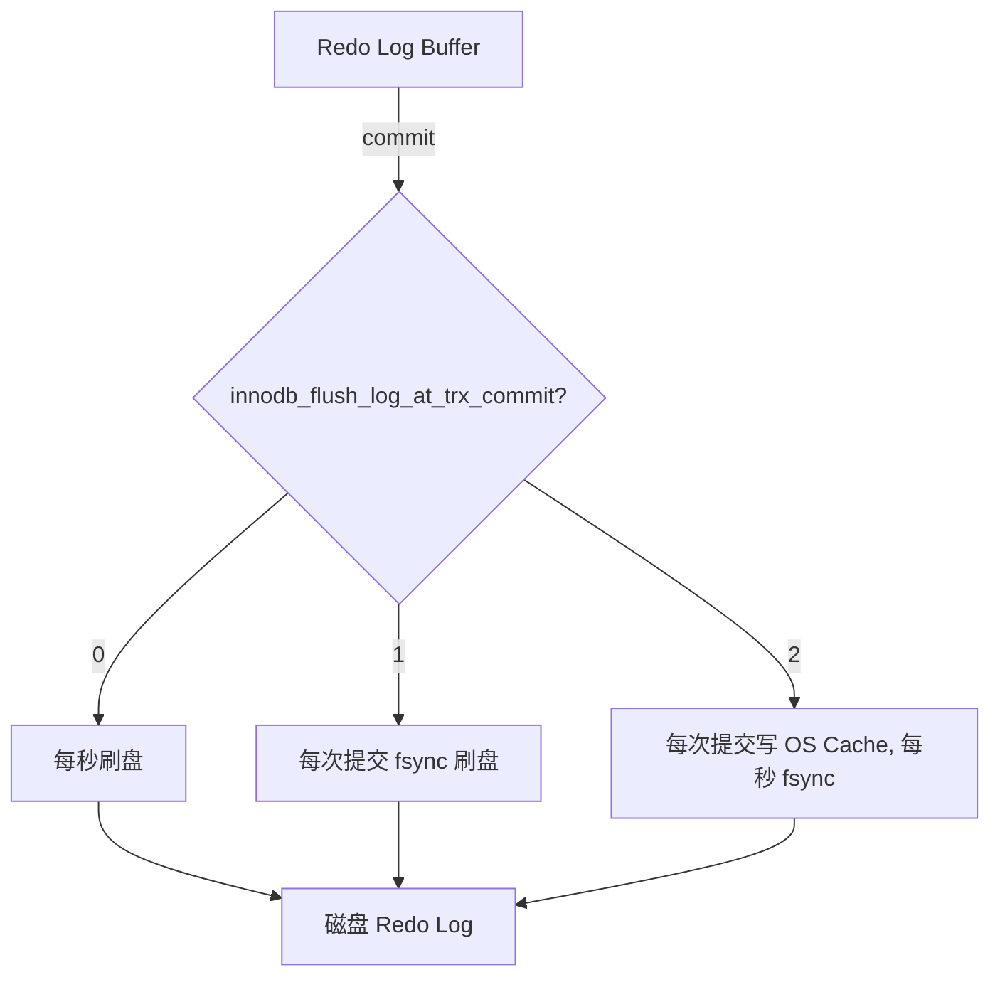
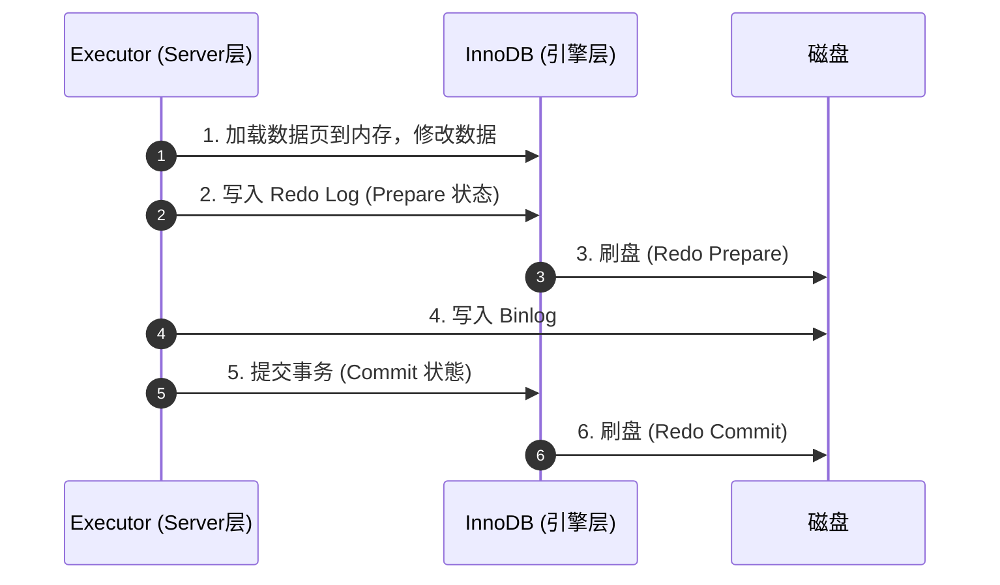
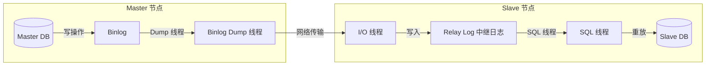

## MySQL 日志系统与主从复制原理

在生产环境中，数据库的**高可用性**、**数据持久性（Crash-Safe）**以及**主从一致性**是企业级架构的底线。MySQL InnoDB 引擎通过一套精妙的日志系统（Redo Log、Undo Log、Binlog）和主从复制机制，完美地支撑了这些非功能性需求。

---

## 一、 MySQL 三大日志深度剖析

MySQL 架构分为两层：**Server 层**（负责 SQL 解析、优化、执行等）和 **存储引擎层**（InnoDB，负责数据读写）。日志系统也据此划分：

### 1. Redo Log（重做日志）—— 保证持久性与 Crash-Safe

- **作用**：确保事务提交后，即使数据库发生异常宕机，已提交的数据也不会丢失，实现 **Crash-Safe**。
- **原理：WAL（Write-Ahead Logging，预写日志）**：
  - 在 MySQL 中，如果每次修改都直接写入磁盘，会产生大量的随机 I/O，性能极差。
  - 因此，InnoDB 采用 WAL 机制：当数据发生修改时，先将修改记录写入 **Redo Log Buffer（内存）**，并更新内存中的数据页（Buffer Pool）。随后，在合适的时机将 Redo Log 顺序写入磁盘。
  - 顺序写磁盘的速度远快于随机写数据页，从而极大地提升了数据库的写性能。

- **刷盘策略（`innodb_flush_log_at_trx_commit`）**：

  这是调优数据库写入性能与安全性的核心参数：

| 参数值          | 刷盘行为                                                                                           | 安全性与性能                                                                          |
| :-------------- | :------------------------------------------------------------------------------------------------- | :------------------------------------------------------------------------------------ |
| **`0`**         | 每次事务提交时，只将日志留在 Redo Log Buffer 中。每秒由后台线程写入 OS Cache 并调用 `fsync` 刷盘。 | **性能最高，最不安全**。MySQL 崩溃或服务器断电都会丢失 1 秒的数据。                   |
| **`1`（默认）** | 每次事务提交时，都必须将日志写入 OS Cache 并调用 `fsync` 刷入磁盘。                                | **最安全，性能最差**。保证强一致性，绝对不丢数据。                                    |
| **`2`**         | 每次事务提交时，只将日志写入 OS Cache（操作系统缓存），每秒由后台线程调用 `fsync` 刷盘。           | **折中方案**。MySQL 崩溃不丢数据（因为在 OS Cache 中），但服务器断电会丢失 1 秒数据。 |

---

### 2. Binlog（归档日志）—— 保证备份与主从复制

- **作用**：用于数据备份、恢复，以及主从复制。
- **对比 Redo Log**：

| 维度         | Redo Log（重做日志）                                       | Binlog（归档日志）                                       |
| :----------- | :--------------------------------------------------------- | :------------------------------------------------------- |
| **实现层**   | InnoDB 存储引擎特有。                                      | MySQL Server 层实现，所有引擎通用。                      |
| **日志类型** | **物理日志**。记录的是“在某个数据页上做了什么修改”。       | **逻辑日志**。记录的是 SQL 语句或原始行数据。            |
| **写入方式** | **循环写**。空间固定，写满后会覆盖开头，无法用于历史恢复。 | **追加写**。写满一个文件后新建下一个，保存历史所有记录。 |

- **Binlog 格式对比**：
  - **`STATEMENT`**：记录 SQL 语句。日志量极小，但如果 SQL 中包含 `UUID()`、`NOW()` 等动态函数，会导致主从数据不一致。
  - **`ROW`（推荐）**：记录每一行数据的实际变更。绝对安全，但日志量极大（如一个 `UPDATE` 影响了 10 万行，会记录 10 万条变更）。
  - **`MIXED`**：折中方案。默认使用 STATEMENT，遇到可能导致不一致的函数时自动切换为 ROW。

---

### 3. Undo Log（回滚日志）—— 保证原子性与 MVCC

- **作用**：
  1. **实现事务回滚（原子性）**：当事务需要回滚时，InnoDB 会读取对应的 Undo Log，执行相反的逻辑操作（如原本是 `INSERT`，回滚时执行 `DELETE`）。
  2. **支撑 MVCC（多版本并发控制）**：Undo Log 保存了数据的历史版本，形成了版本链，供快照读（SELECT）使用。

---

## 二、 核心机制：两阶段提交（2PC）

在更新一条数据时，既要写 Redo Log，又要写 Binlog。如果写完其中一个后数据库突然宕机，就会导致两份日志数据不一致，进而导致主从数据不一致。

为了解决这个问题，MySQL 引入了**两阶段提交（Two-Phase Commit）**机制：

### 3. 崩溃恢复（Crash Recovery）逻辑

当数据库在两阶段提交的任意时刻宕机，重启后会按照以下规则恢复：

1. **如果 Redo Log 处于 Commit 状态**：说明事务已完全提交，直接确认提交。
2. **如果 Redo Log 处于 Prepare 状态**：
   - 拿着该事务的 XID（全局事务ID）去 **Binlog** 中寻找对应的记录。
   - **如果 Binlog 中存在该 XID**：说明 Binlog 已经写成功，事务是安全的，**继续提交**。
   - **如果 Binlog 中不存在该 XID**：说明在写 Binlog 前就宕机了，为了防止主从不一致，**回滚事务**（利用 Undo Log）。

---

## 三、 MySQL 主从复制原理

主从复制是实现读写分离、高可用架构的基石。

### 1. 复制流程

1. **Master 节点**：当有写操作时，写入 Binlog。**Binlog Dump 线程** 监听 Binlog 的变更，并将 Binlog 内容发送给 Slave。
2. **Slave 节点（I/O 线程）**：接收 Master 发来的 Binlog，并将其顺序写入本地的 **Relay Log（中继日志）**。
3. **Slave 节点（SQL 线程）**：读取 Relay Log 中的变更，并在本地重放（Replay），从而保持与 Master 的数据一致。

---

### 2. 复制方式演进

- **异步复制（Asynchronous）**：
  - **原理**：Master 写入 Binlog 后，立即向客户端返回成功，不关心 Slave 是否收到。
  - **缺点**：如果 Master 宕机且数据未同步到 Slave，强行切换会导致**数据丢失**。
- **半同步复制（Semi-Synchronous）**：
  - **原理**：Master 写入 Binlog 后，必须等待**至少一个 Slave** 收到并写入 Relay Log 反馈 ACK 后，才向客户端返回成功。
  - **优点**：极大地提升了数据安全性，保证了主从切换时数据不丢失。
- **组复制（MGR, MySQL Group Replication）**：
  - **原理**：基于 Paxos 共识协议的多主/单主复制。要求超过半数节点同意，事务才能提交，实现了真正的强一致性与高可用。
