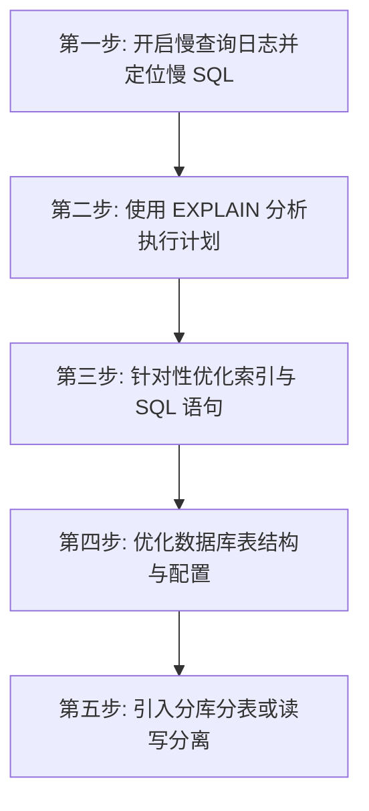
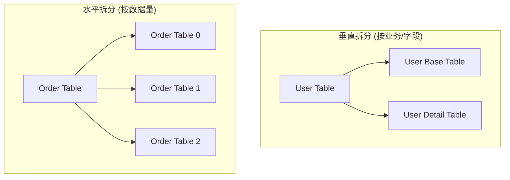

## MySQL 慢 SQL 优化与分库分表

在实际生产环境中，随着业务数据量的爆发式增长，单机数据库往往会遇到性能瓶颈。掌握慢 SQL 的排查与优化步骤，以及分库分表的架构设计，是高级 Java 工程师和架构师的必修课。

---

## 一、 慢 SQL 排查与优化五步法

当线上系统出现数据库响应慢、CPU 飙高时，通常需要按照以下步骤进行系统化排查和优化：



### 1. 第一步：开启慢查询日志并定位慢 SQL

- 在配置文件 `my.cnf` 中配置慢查询日志：

  ```ini
  slow_query_log = 1                  # 开启慢查询日志
  long_query_time = 1                 # 超过 1 秒的 SQL 记录为慢 SQL
  slow_query_log_file = /var/log/mysql/slow.log # 日志路径
  ```

- 使用 **`mysqldumpslow`** 工具对慢日志进行分类汇总，找出执行次数最多、耗时最长的 Top SQL。

### 2. 第二步：使用 EXPLAIN 分析执行计划

- 慢 SQL 前面加上 `EXPLAIN` 关键字，查看 MySQL 是如何执行该 SQL 的。
- **核心关注字段**：
  - **`type`（访问类型）**：
    - `system` > `const` > `eq_ref` > `ref` > `range` > `index` > `ALL`。
    - **要求**：生产环境中的 SQL 访问类型至少要达到 **`range`** 级别，力求达到 `ref`，**绝对避免 `ALL`（全表扫描）**。
  - **`possible_keys`**：可能用到的索引。
  - **`key`**：实际用到的索引。如果为 `NULL`，说明没有用到索引。
  - **`rows`**：估算需要扫描的行数。数值越小越好。
  - **`Extra`（额外信息）**：
    - `Using filesort`：说明 MySQL 无法利用索引进行排序，需要进行外部排序，**需要优化**。
    - `Using index`：说明使用了覆盖索引，不需要回表，性能极佳。
    - `Using temporary`：使用了临时表（常见于 `GROUP BY` 未加索引），**需要优化**。

---

### 3. 第三步：常见慢 SQL 优化套路

**索引失效口诀（模型数空运最快）**：

- **模**：模糊查询以 `%` 开头（如 `LIKE '%abc'`），索引失效。
- **型**：类型转换。如字段是 `varchar`，查询时没加单引号 `WHERE phone = 13800000000`，导致隐式类型转换，索引失效。
- **数**：对索引列进行函数操作或数学运算（如 `WHERE YEAR(create_time) = 2026` 或 `WHERE age + 1 = 18`），索引失效。
- **空**：`IS NULL` 或 `IS NOT NULL` 在某些情况下可能导致索引失效（取决于数据分布）。
- **运**：使用 `OR` 连接，如果 `OR` 前后的列有一个没有索引，则整个 SQL 的索引失效。
- **最**：违背**最左匹配原则**。在联合索引 `(a, b, c)` 中，如果跳过了 `a` 直接查询 `b` 或 `c`，索引失效。
- **快**：范围查询右边的列索引失效。在联合索引 `(a, b, c)` 中，如果 `WHERE a = 1 AND b > 2 AND c = 3`，则 `c` 无法用到索引。

**超大分页（Deep Paging）优化**：

- **问题**：`LIMIT 1000000, 10` 会导致 MySQL 扫描 1000010 行数据，然后丢弃前 1000000 行，只返回 10 行，I/O 开销极大。
- **优化方案（延迟关联）**：

  先通过覆盖索引只查询主键 ID，再通过主键关联查询整行数据，避免大范围的回表：

  ```sql
  -- 优化前
  SELECT * FROM user ORDER BY create_time LIMIT 1000000, 10;

  -- 优化后
  SELECT u.* FROM user u
  INNER JOIN (
      SELECT id FROM user ORDER BY create_time LIMIT 1000000, 10
  ) t ON u.id = t.id;
  ```

---

## 二、 分库分表架构设计

当单表数据量突破 2000 万，或者单库并发读写 QPS 达到瓶颈时，需要引入分库分表。

### 1. 拆分维度

- **垂直拆分**：
  - **垂直分库**：按业务模块将不同的表拆分到不同的数据库中（如商品库、订单库、用户库）。
  - **垂直分表**：将一张表中不常用的、大字段（如 `text`、`blob`）拆分到另一张扩展表中，提高主表的缓存命中率。
- **水平拆分**：
  - **水平分表**：将一张表的数据按某种规则（如 Hash 取模）拆分到多张结构相同的表中，解决单表容量瓶颈。
  - **水平分库**：将多张分表分散到不同的物理数据库实例中，分摊读写压力。



### 2. 分片键（Sharding Key）的选择与路由规则

分片键是分库分表中最核心的概念，决定了数据最终落在哪张表/哪个库。

- **哈希分片（Hash）**：如 `user_id % 1024`。数据分布均匀，不易产生热点，但扩容时需要进行数据迁移。
- **范围分片（Range）**：如按时间（按月分表）或按自增 ID 范围。扩容简单，无需迁移数据，但容易产生写热点（最新的数据总是落在最新的表里）。

### 3. 分库分表带来的副作用及解决方案

分库分表虽然解决了容量和并发问题，但也引入了极大的系统复杂度：

- **跨库关联查询（JOIN）问题**：
  - **解决办法**：
    - **字段冗余**：将常用字段冗余到各表中，避免 JOIN。
    - **全局表**：将一些字典表/配置表在每个库中都保存一份。
    - **应用层组装**：在 Java 代码中分步查询，然后在内存中进行数据组装。
- **分布式全局唯一 ID 问题**：
  - **解决办法**：使用雪花算法（Snowflake）、美团 Leaf、Redis 自增等。
- **分布式事务问题**：
  - **解决办法**：使用分布式事务中间件（如 Seata），或采用本地消息表、RocketMQ 事务消息实现最终一致性。
