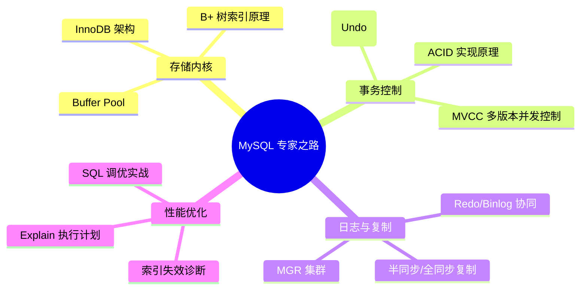

## MySQL 关系型数据库体系

本专题带你从底层的索引 B+ 树结构、InnoDB 存储引擎内核，一路深入到分库分表与性能调优的艺术。

---

## 🗺️ MySQL 核心进阶地图

---

## 🚀 第一阶段：内核基础与存储引擎 (Storage Engine)

- [索引原理与 InnoDB 引擎](index-engine.md)：为什么是 B+ 树？解密聚簇索引与覆盖索引。
- [MVCC 与锁机制深度解析](mvcc-locks.md)：读已提交、可重复读及其底层 ReadView 实现。

---

## 🏗️ 第二阶段：日志体系与高可用 (Reliability)

- [日志体系与复制原理](logs-replication.md)：深入 Redo Log、Binlog 二阶段提交（2PC）。

---

## ⚡ 第三阶段：性能诊断与调优 (Performance Tuning)

- [MySQL 性能调优实战指南](optimization.md)：执行计划详解与生产慢查询优化。
- [MySQL 核心面试真题复盘](interview-mysql.md)：高频大厂必考点汇总。
