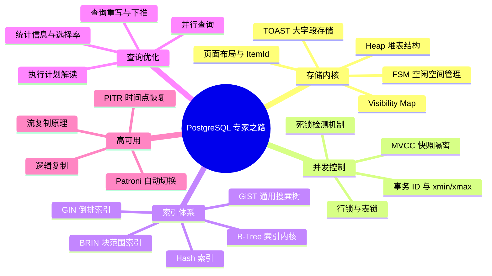

## PostgreSQL 数据库知识体系

PostgreSQL 是功能最强大的开源关系型数据库，以其严格的 ACID 合规性、丰富的扩展生态（PostGIS、TimescaleDB、pgvector）和先进的 MVCC 实现著称。本体系从存储引擎内核出发，贯穿查询优化、高可用架构，直达生产运维实战。

---

## 核心进阶路线图

---

## 第一阶段：存储引擎与核心原理

### 1.1 存储结构

- [Heap 存储、页面结构与 TOAST 机制](core/0-storage-heap.md)：Page 8KB 布局、ItemId 行指针数组、Tuple 头部标志位（xmin/xmax/ctid），以及 TOAST 大字段分级压缩存储原理。
- [MVCC 多版本并发控制与事务隔离](core/1-mvcc-transaction.md)：PostgreSQL MVCC 与 MySQL InnoDB 的本质差异、快照读的 xmin/xmax 可见性判断、事务 ID 回绕（Wraparound）风险与 Autovacuum 防护机制。

### 1.2 索引体系

- [索引类型与选型指南](core/2-index-types.md)：B-Tree 页分裂与 HOT 更新优化、GIN 倒排索引（全文检索/数组）、GiST（地理空间/范围）、BRIN 块范围索引（时序数据）与 Hash 索引适用场景全景对比。

---

## 第二阶段：查询优化与性能调优

- [执行计划深度解读](tuning/0-explain-analyze.md)：`EXPLAIN ANALYZE BUFFERS` 全字段解析、Seq Scan vs Index Scan vs Bitmap Scan 选型逻辑、Join 算法（Nested Loop/Hash Join/Merge Join）代价模型。
- [统计信息与查询优化器](tuning/1-statistics-optimizer.md)：`pg_statistic`/`pg_stats` 统计信息结构、`ANALYZE` 触发时机、选择率估算（MCV/直方图）、扩展统计（多列相关性）与 `enable_*` 参数调试。
- [关键参数调优手册](tuning/2-configuration-tuning.md)：`shared_buffers`/`work_mem`/`maintenance_work_mem`/`effective_cache_size` 黄金配置、WAL 参数调优、连接池（PgBouncer）与 `max_connections` 权衡。

---

## 第三阶段：高可用与运维实战

- [流复制原理与搭建实战](ha/0-streaming-replication.md)：WAL 段文件结构、`wal_level` 参数梯度、Primary/Standby 物理复制搭建、`pg_replication_slots` 复制槽与复制延迟监控。
- [逻辑复制与跨版本迁移](ha/1-logical-replication.md)：逻辑解码（Logical Decoding）、发布/订阅（Publication/Subscription）模型、`pglogical` 双向复制与零停机大版本升级方案。
- [Patroni 高可用集群实战](ha/2-patroni-ha.md)：Patroni + etcd/Consul 架构、DCS 仲裁机制、自动主从切换（Failover/Switchover）流程、HAProxy + VIP 流量路由与脑裂防御。
- [备份恢复与 PITR 实战](ha/3-backup-recovery.md)：`pg_basebackup` 物理备份、WAL 归档配置、PITR（Point-In-Time Recovery）时间点恢复操作步骤、pgBackRest/Barman 企业级备份方案对比。

---

## 与 MySQL 核心差异速查

| 维度 | PostgreSQL | MySQL InnoDB |
|:---|:---|:---|
| MVCC 实现 | 旧版本行存储在原表（Heap）中 | 旧版本存储在独立 Undo Log 段 |
| 读操作 | 快照读不加锁，旧版本直接在表中读 | 快照读通过 Undo 链回溯 |
| 写放大 | UPDATE = INSERT 新行 + 旧行标记删除 | UPDATE 原地修改，写 Undo |
| 垃圾回收 | Autovacuum 异步清理死元组 | Purge 线程异步清理 Undo |
| 事务 ID | 32 位，存在回绕风险 | 64 位，无回绕问题 |
| 表锁粒度 | 丰富（8种锁模式） | 表锁/行锁/间隙锁 |
| 索引类型 | B-Tree/Hash/GIN/GiST/BRIN/SP-GiST | B+Tree/Hash/全文索引 |
| JSON 支持 | 原生 JSONB（二进制，可索引） | JSON 类型（字符串存储） |
| 扩展性 | 极强（自定义类型/操作符/索引方法） | 有限 |
