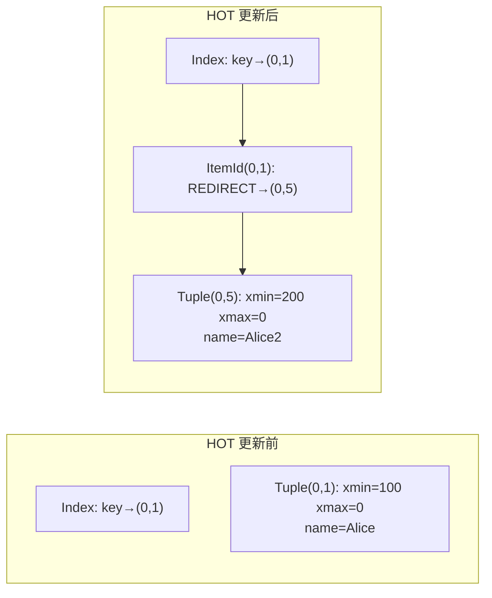
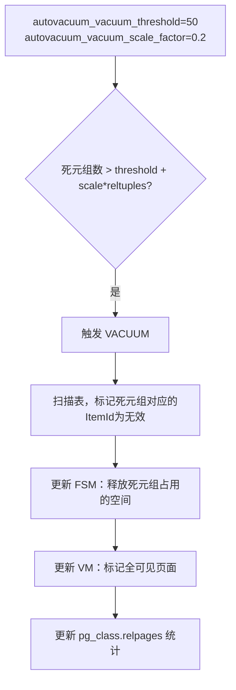

## PostgreSQL Heap 存储、页面结构与 TOAST 机制

---

## 一、页面物理结构（Page Layout）

PostgreSQL 以固定大小的 **Page（默认 8KB）** 为最小 I/O 单位管理所有数据。每个表文件（Heap Relation）由连续的 Page 组成。

```
┌────────────────────────────────────────────┐  ← Page 起始（偏移 0）
│  PageHeaderData (24 bytes)                 │
│  pd_lsn        (8B) — 最近修改此页的WAL LSN │
│  pd_checksum   (2B) — 页面校验和            │
│  pd_flags      (2B) — 标志位               │
│  pd_lower      (2B) — 空闲空间起始偏移      │
│  pd_upper      (2B) — 空闲空间结束偏移      │
│  pd_special    (2B) — 特殊空间起始偏移      │
│  pd_pagesize   (2B) — 页大小与版本          │
├────────────────────────────────────────────┤
│  ItemId 数组（行指针，每项 4 bytes）         │
│  ItemId[1]: offset=xxxx, length=xxx, flags │
│  ItemId[2]: ...                            │
│  ItemId[n]: ...                            │
├─────────────── pd_lower ───────────────────┤
│              空闲空间 (Free Space)          │
├─────────────── pd_upper ───────────────────┤
│  Tuple N (最新插入的行，从上往下生长)        │
│  ...                                       │
│  Tuple 2                                   │
│  Tuple 1                                   │
├────────────────────────────────────────────┤
│  Special Space (索引特有，堆表为空)          │
└────────────────────────────────────────────┘  ← Page 结束（偏移 8192）
```

**关键设计**：
- `ItemId` 数组从页头向下增长，Tuple 数据从页尾向上增长，两者在中间相遇时页面已满
- `pd_lower` 到 `pd_upper` 之间是空闲空间，`FSM`（Free Space Map）追踪每页可用空间

### 1.1 查看页面内部

```sql
-- 启用 pageinspect 扩展
CREATE EXTENSION pageinspect;

-- 查看表第 0 页的页头信息
SELECT * FROM page_header(get_raw_page('orders', 0));
-- lsn | checksum | flags | lower | upper | special | pagesize | version | prune_xid

-- 查看第 0 页的所有行指针
SELECT lp, lp_off, lp_flags, lp_len
FROM heap_page_items(get_raw_page('orders', 0));
-- lp_flags: 1=正常行, 2=重定向(HOT链), 3=死行

-- 查看行的可见性信息（xmin/xmax 等）
SELECT lp, t_xmin, t_xmax, t_field3 AS t_cid, t_ctid,
       t_infomask, t_infomask2, t_data
FROM heap_page_items(get_raw_page('orders', 0));
```

---

## 二、Tuple（行）内部结构

每个 Tuple 由固定的头部（HeapTupleHeaderData）和用户数据组成：

```
HeapTupleHeader (23 bytes + padding)
┌────────────────────────────────┐
│ t_xmin  (4B) — 插入此行的事务ID │  → 可见性判断核心字段
│ t_xmax  (4B) — 删除/更新的事务ID│  → 0 表示行仍有效
│ t_cid   (4B) — 命令ID（同事务内）│
│ t_ctid  (6B) — 当前TID（块号+偏移）→ 指向最新版本（HOT 链）
│ t_infomask2 (2B) — 属性数量等   │
│ t_infomask  (2B) — 标志位       │  → HEAP_XMIN_COMMITTED 等
│ t_hoff  (1B) — 用户数据偏移     │
├────────────────────────────────┤
│ NULL 位图（可选）               │
├────────────────────────────────┤
│ 用户列数据（按 pg_attribute 顺序）│
└────────────────────────────────┘
```

### 2.1 ctid — 行的物理位置

`ctid` 是 PostgreSQL 的伪列，格式为 `(块号, 行号)`：

```sql
-- 查看行的物理位置
SELECT ctid, id, name FROM orders LIMIT 5;
-- ctid  | id | name
-- (0,1) | 1  | Alice
-- (0,2) | 2  | Bob
-- (1,1) | 3  | Carol   ← 第 1 页第 1 行

-- UPDATE 后 ctid 变化（新版本在新位置）
UPDATE orders SET name = 'Alice2' WHERE id = 1;
SELECT ctid, id, name FROM orders WHERE id = 1;
-- (0,5) | 1  | Alice2   ← ctid 已变，旧行 (0,1) 成为死元组
```

### 2.2 HOT（Heap Only Tuple）更新优化

当 UPDATE 的列**不属于任何索引**时，PostgreSQL 使用 HOT 更新：新 Tuple 写在**同一页面**，旧 ItemId 重定向到新 Tuple，避免更新索引。



```sql
-- 检查是否发生了 HOT 更新
SELECT n_tup_hot_upd FROM pg_stat_user_tables WHERE relname = 'orders';
-- n_tup_hot_upd 高说明 HOT 更新比例大（好事）
```

---

## 三、MVCC 死元组与 Autovacuum

### 3.1 死元组积累

PostgreSQL 的 MVCC 实现方式导致 UPDATE/DELETE 产生死元组（Dead Tuple）：

- `DELETE` → 旧行的 `t_xmax` 设为当前事务 ID，行仍在磁盘上
- `UPDATE` → 旧行标记删除，新行另写（或 HOT 写在同页）
- 死元组不立即清理，等待 Autovacuum

```sql
-- 查看各表死元组数量
SELECT relname,
       n_live_tup    AS 活跃行数,
       n_dead_tup    AS 死元组数,
       round(n_dead_tup::numeric / nullif(n_live_tup + n_dead_tup, 0) * 100, 2) AS 死元组占比,
       last_autovacuum,
       last_autoanalyze
FROM pg_stat_user_tables
ORDER BY n_dead_tup DESC
LIMIT 20;
```

### 3.2 Autovacuum 工作原理



```sql
-- 手动触发 VACUUM（不锁表）
VACUUM orders;

-- VACUUM ANALYZE：清理死元组 + 更新统计信息
VACUUM ANALYZE orders;

-- VACUUM FULL：重写整张表，回收磁盘空间（需要 AccessExclusiveLock！）
-- 生产环境用 pg_repack 替代
VACUUM FULL orders;  -- 慎用！

-- 查看 Autovacuum 运行情况
SELECT pid, datname, relid::regclass, phase, heap_blks_total,
       heap_blks_scanned, heap_blks_vacuumed, index_vacuum_count
FROM pg_stat_progress_vacuum;
```

### 3.3 事务 ID 回绕（Wraparound）危机

PostgreSQL 事务 ID（XID）是 32 位，最大约 42 亿。当 XID 接近耗尽时，系统拒绝写入并强制 VACUUM：

```sql
-- 监控事务 ID 消耗（距离回绕的剩余量）
SELECT datname,
       age(datfrozenxid) AS xid_age,
       2147483648 - age(datfrozenxid) AS remaining_xids
FROM pg_database
ORDER BY xid_age DESC;
-- xid_age 超过 15 亿时应立即关注

-- 查看各表的冻结进度
SELECT relname,
       age(relfrozenxid) AS table_xid_age,
       pg_size_pretty(pg_total_relation_size(oid)) AS total_size
FROM pg_class
WHERE relkind = 'r'
ORDER BY age(relfrozenxid) DESC
LIMIT 20;
```

---

## 四、TOAST 大字段存储机制

PostgreSQL 单行大小受页面 8KB 限制。超过约 2KB 的字段通过 **TOAST（The Oversized-Attribute Storage Technique）** 处理。

### 4.1 TOAST 策略

| 策略 | 说明 | 适用场景 |
|:---|:---|:---|
| `PLAIN` | 不压缩不外存，直接内联 | 小固定长度类型（int/float） |
| `EXTENDED` | 优先压缩，仍大则外存（默认） | 大多数可变长类型 |
| `EXTERNAL` | 不压缩，直接外存（可部分读取） | 大 bytea（需要 substring） |
| `MAIN` | 优先压缩内联，尽量不外存 | — |

```sql
-- 查看列的 TOAST 策略
SELECT attname, attstorage
FROM pg_attribute
WHERE attrelid = 'documents'::regclass
  AND attnum > 0;
-- attstorage: p=PLAIN, x=EXTENDED, e=EXTERNAL, m=MAIN

-- 修改 TOAST 策略（对已有数据不追溯）
ALTER TABLE documents ALTER COLUMN content SET STORAGE EXTERNAL;
```

### 4.2 TOAST 表结构

每个有可 TOAST 字段的表都有对应的 TOAST 表（`pg_toast.pg_toast_<oid>`）：

```sql
-- 找到某表的 TOAST 表
SELECT reltoastrelid::regclass AS toast_table
FROM pg_class
WHERE relname = 'documents';

-- TOAST 表结构
-- chunk_id   int4   — 原行的 OID（关联主表）
-- chunk_seq  int4   — 分块序号（从 0 开始）
-- chunk_data bytea  — 实际数据分片（最大 ~2KB/chunk）

-- 查看 TOAST 表占用大小
SELECT pg_size_pretty(pg_total_relation_size('pg_toast.pg_toast_12345'));
```

### 4.3 TOAST 对查询的影响

```sql
-- TOAST 解压是按需的：SELECT 只取用到的列
-- 如果只查 id 和 title，content（TOAST 列）不会被读取
SELECT id, title FROM documents WHERE id = 1;  -- 不触发 TOAST 解压

-- 全列查询时才解压 content
SELECT * FROM documents WHERE id = 1;  -- 触发 TOAST 解压

-- EXTERNAL 存储允许部分读取（无需解压整个字段）
SELECT substring(content FROM 1 FOR 100) FROM documents WHERE id = 1;
-- 只读取前 100 字节对应的 chunk，高效！
```

### 4.4 膨胀监控

```sql
-- 监控表和 TOAST 表的膨胀情况
SELECT
    c.relname AS table_name,
    pg_size_pretty(pg_relation_size(c.oid)) AS table_size,
    pg_size_pretty(pg_relation_size(c.reltoastrelid)) AS toast_size,
    pg_size_pretty(pg_total_relation_size(c.oid)) AS total_size
FROM pg_class c
WHERE c.relkind = 'r'
  AND c.reltoastrelid != 0
ORDER BY pg_total_relation_size(c.oid) DESC
LIMIT 20;
```
