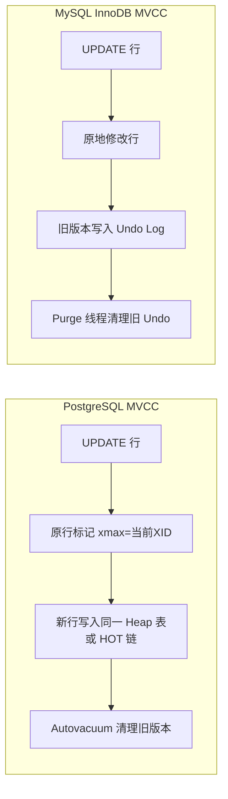

## PostgreSQL MVCC 多版本并发控制与事务隔离

---

## 一、PostgreSQL MVCC 与 MySQL InnoDB 的本质差异

两者都实现了 MVCC，但底层机制截然不同：



| 维度 | PostgreSQL | MySQL InnoDB |
|:---|:---|:---|
| 旧版本位置 | 表文件内（死元组） | 独立 Undo Log 段 |
| 索引指向 | 每个版本在索引中都有条目（Index-only scan 需 VM） | 索引始终指向最新行，通过回表+Undo 回溯 |
| 读性能 | 可能需要遍历多个旧版本 | 快照读通过 ReadView + Undo 链 |
| 写放大 | 大（UPDATE = 两次写：旧行标记 + 新行插入） | 相对小（原地改 + Undo） |
| 表膨胀 | 频繁 UPDATE/DELETE 后表文件膨胀 | 膨胀主要在 Undo 段 |
| 清理方式 | Autovacuum（可调，异步） | Purge 线程（自动，后台） |

---

## 二、快照（Snapshot）与可见性判断

PostgreSQL 的每个事务持有一个**快照（Snapshot）**，记录事务开始时哪些 XID 已提交、哪些还在运行。

### 2.1 快照的内容

```c
// 快照结构（简化）
typedef struct SnapshotData {
    TransactionId xmin;     // 所有 xid < xmin 的事务已提交
    TransactionId xmax;     // 所有 xid >= xmax 的事务尚未开始
    TransactionId *xip;     // [xmin, xmax) 之间仍在运行的事务列表
    int           xcnt;     // xip 数组长度
} SnapshotData;
```

### 2.2 行可见性判断规则

对于一个 Tuple（行），判断其对当前快照是否可见：

```
可见条件：
1. t_xmin 已提交 AND t_xmin < snapshot.xmax AND t_xmin 不在 snapshot.xip 中
   （插入此行的事务已提交，且在快照之前）
2. AND（t_xmax = 0 OR t_xmax 未提交 OR t_xmax >= snapshot.xmax OR t_xmax 在 snapshot.xip 中）
   （删除/更新此行的事务未提交，或在快照之后）
```

```sql
-- 演示可见性：事务隔离实验
-- Session 1
BEGIN;
SELECT txid_current();  -- 假设返回 500

-- Session 2（同时执行）
BEGIN;
INSERT INTO test VALUES (1, 'hello');  -- xmin = 501
COMMIT;

-- Session 1（未提交）
SELECT * FROM test;  -- 看不到 id=1（501 > 500 时，取决于隔离级别）
-- Read Committed：看得到（每条语句取新快照）
-- Repeatable Read：看不到（事务开始时的快照）
COMMIT;
```

### 2.3 事务隔离级别

PostgreSQL 实现了 SQL 标准的四种隔离级别（但 Read Uncommitted 实际等同于 Read Committed）：

| 级别 | 脏读 | 不可重复读 | 幻读 | 串行化异常 |
|:---|:---|:---|:---|:---|
| Read Uncommitted | 不可能 | 可能 | 可能 | 可能 |
| **Read Committed（默认）** | 不可能 | 可能 | 可能 | 可能 |
| Repeatable Read | 不可能 | 不可能 | 不可能* | 可能 |
| Serializable | 不可能 | 不可能 | 不可能 | 不可能 |

*PostgreSQL 的 RR 通过 MVCC 实现了幻读防护（不同于 MySQL 需要间隙锁）

```sql
-- 设置事务隔离级别
BEGIN ISOLATION LEVEL REPEATABLE READ;
-- 或
SET TRANSACTION ISOLATION LEVEL SERIALIZABLE;

-- 查看当前会话默认隔离级别
SHOW default_transaction_isolation;

-- 修改默认隔离级别
SET default_transaction_isolation = 'repeatable read';
```

---

## 三、锁机制

### 3.1 表级锁（8 种模式）

PostgreSQL 有 8 种粒度的表锁，从弱到强：

| 锁模式 | 典型操作 | 与自身冲突 |
|:---|:---|:---|
| `ACCESS SHARE` | `SELECT` | 否 |
| `ROW SHARE` | `SELECT FOR UPDATE/SHARE` | 否 |
| `ROW EXCLUSIVE` | `INSERT/UPDATE/DELETE` | 否 |
| `SHARE UPDATE EXCLUSIVE` | `VACUUM/ANALYZE/CREATE INDEX CONCURRENTLY` | 是 |
| `SHARE` | `CREATE INDEX` | 否 |
| `SHARE ROW EXCLUSIVE` | `CREATE TRIGGER` | 是 |
| `EXCLUSIVE` | 某些 `ALTER TABLE` | 是 |
| `ACCESS EXCLUSIVE` | `DROP/TRUNCATE/LOCK TABLE/ALTER TABLE` | 是 |

```sql
-- 查看当前锁等待
SELECT
    pid,
    locktype,
    relation::regclass AS table_name,
    mode,
    granted,
    pg_blocking_pids(pid) AS blocked_by
FROM pg_locks l
JOIN pg_stat_activity a USING (pid)
WHERE NOT granted
ORDER BY pid;

-- 找出锁等待链（完整锁依赖图）
WITH RECURSIVE lock_chain AS (
    SELECT pid, pg_blocking_pids(pid) AS blocking_pids
    FROM pg_stat_activity
    WHERE cardinality(pg_blocking_pids(pid)) > 0
)
SELECT * FROM lock_chain;
```

### 3.2 行级锁

```sql
-- 悲观锁：FOR UPDATE（最强行锁）
SELECT * FROM orders WHERE id = 1 FOR UPDATE;

-- 跳过锁定的行（非阻塞，用于队列场景）
SELECT * FROM jobs WHERE status = 'pending' LIMIT 1 FOR UPDATE SKIP LOCKED;

-- 共享锁（允许其他事务也加共享锁，但阻止排他锁）
SELECT * FROM orders WHERE id = 1 FOR SHARE;

-- 查看行锁（等待中的）
SELECT pid, relation::regclass, mode, granted
FROM pg_locks
WHERE locktype = 'relation';
```

### 3.3 死锁检测与预防

PostgreSQL 使用后台进程检测死锁（默认 `deadlock_timeout = 1s`），检测到后自动回滚代价小的事务。

```sql
-- 查看死锁检测间隔
SHOW deadlock_timeout;

-- 死锁日志（postgresql.conf）
log_lock_waits = on       -- 记录等待超过 deadlock_timeout 的锁
deadlock_timeout = 1s     -- 死锁检测间隔

-- 预防死锁的编码规范：
-- 1. 多表操作按固定顺序加锁（如：总是先锁 users 再锁 orders）
-- 2. 使用 SELECT FOR UPDATE 替代多条语句
-- 3. 尽量缩短事务持锁时间
```

---

## 四、Serializable Snapshot Isolation（SSI）

PostgreSQL 的 `SERIALIZABLE` 隔离级别使用 SSI（序列化快照隔离）算法，通过检测读写依赖循环来防止串行化异常，而不是用传统的锁表。

```sql
-- SSI 示例：检测写倾斜（Write Skew）
-- Session 1
BEGIN ISOLATION LEVEL SERIALIZABLE;
SELECT SUM(amount) FROM accounts WHERE type = 'checking';  -- 读操作

-- Session 2
BEGIN ISOLATION LEVEL SERIALIZABLE;
SELECT SUM(amount) FROM accounts WHERE type = 'savings';   -- 读操作

-- Session 1
UPDATE accounts SET amount = amount - 100 WHERE type = 'checking';
COMMIT;

-- Session 2
UPDATE accounts SET amount = amount - 100 WHERE type = 'savings';
COMMIT;  -- 可能报错：ERROR: could not serialize access due to read/write dependencies
-- PostgreSQL 检测到循环读写依赖，回滚其中一个事务
```

---

## 五、Advisory Locks（咨询锁）

应用层分布式锁的轻量级实现，不与任何数据库对象关联：

```sql
-- 获取会话级咨询锁（事务结束不自动释放）
SELECT pg_advisory_lock(12345);        -- 阻塞直到获取
SELECT pg_try_advisory_lock(12345);    -- 非阻塞，返回 boolean

-- 释放咨询锁
SELECT pg_advisory_unlock(12345);

-- 获取事务级咨询锁（事务结束自动释放）
SELECT pg_advisory_xact_lock(12345);
SELECT pg_try_advisory_xact_lock(12345);

-- 使用字符串作为锁 key（hashtext 转换为数字）
SELECT pg_advisory_lock(hashtext('my_job_lock_key'));

-- 查看当前持有的咨询锁
SELECT pid, classid, objid, mode, granted
FROM pg_locks
WHERE locktype = 'advisory';
```
