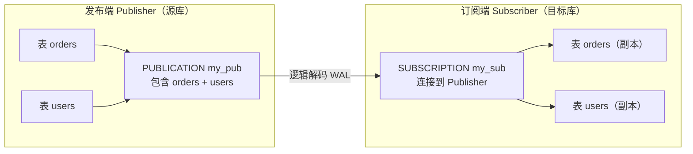
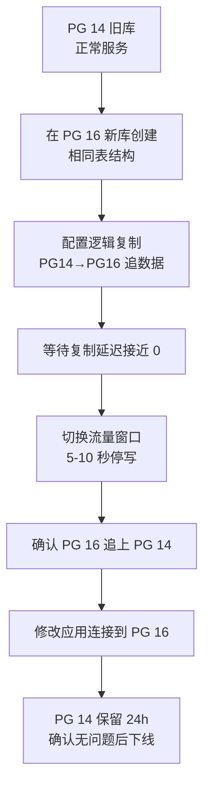

## PostgreSQL 逻辑复制与跨版本迁移

逻辑复制基于**行级变更**（而非物理 WAL 块），支持跨版本、跨平台、选择性表复制，是零停机大版本升级和数据集成的核心工具。

---

## 一、逻辑复制 vs 物理复制

| 维度 | 物理复制（流复制） | 逻辑复制 |
|:---|:---|:---|
| 复制粒度 | 整个数据库集群（块级别） | 选定的表（行级别） |
| 跨版本 | 不支持（必须版本相同） | 支持（PG 10+） |
| 跨平台/架构 | 不支持 | 支持 |
| DDL 同步 | 自动 | **不自动**（需手动同步） |
| 初始数据同步 | `pg_basebackup` | 发布时自动复制初始快照 |
| Standby 可写 | 不可写（只读） | 可写（订阅端可独立操作） |
| 适用场景 | HA 高可用、灾备 | 版本迁移、数据集成、读写分离 |

---

## 二、核心概念：发布 / 订阅



---

## 三、配置逻辑复制

### 3.1 发布端（源库）

```ini
# postgresql.conf
wal_level = logical          # 必须是 logical（高于 replica）
max_replication_slots = 10
max_wal_senders = 10
```

```sql
-- 创建复制用户
CREATE ROLE replicator WITH REPLICATION LOGIN PASSWORD 'repl_pass';
GRANT SELECT ON ALL TABLES IN SCHEMA public TO replicator;

-- pg_hba.conf 允许订阅端连接
-- host replication replicator <subscriber_ip>/32 scram-sha-256

-- 创建发布（发布指定表）
CREATE PUBLICATION my_pub FOR TABLE orders, users, products;

-- 发布所有表
CREATE PUBLICATION all_tables_pub FOR ALL TABLES;

-- 只发布 INSERT（不复制 UPDATE/DELETE，适合日志表只追加场景）
CREATE PUBLICATION insert_only_pub FOR TABLE events
    WITH (publish = 'insert');

-- 查看当前发布
SELECT pubname, puballtables, pubinsert, pubupdate, pubdelete
FROM pg_publication;

-- 查看发布包含的表
SELECT * FROM pg_publication_tables WHERE pubname = 'my_pub';
```

### 3.2 订阅端（目标库）

```sql
-- 目标库必须先有相同结构的表（逻辑复制不传 DDL）
-- 可以用 pg_dump 导出结构：
-- pg_dump -h source_host -U postgres --schema-only mydb | psql -h target_host mydb

-- 创建订阅
CREATE SUBSCRIPTION my_sub
CONNECTION 'host=192.168.1.10 port=5432 user=replicator password=repl_pass dbname=mydb'
PUBLICATION my_pub;

-- 查看订阅状态
SELECT subname, subenabled, subslotname, subsynccommit
FROM pg_subscription;

-- 查看各表的同步状态
SELECT subname, relid::regclass AS table_name, srsubstate
FROM pg_subscription_rel
JOIN pg_subscription ON srsubid = oid;
-- srsubstate: i=初始化, d=数据同步, s=已同步, r=正在流式复制
```

### 3.3 监控复制延迟

```sql
-- 发布端：查看逻辑复制槽状态
SELECT slot_name, plugin, active, confirmed_flush_lsn,
       pg_size_pretty(pg_wal_lsn_diff(pg_current_wal_lsn(), confirmed_flush_lsn)) AS lag
FROM pg_replication_slots
WHERE slot_type = 'logical';

-- 订阅端：查看接收 LSN
SELECT received_lsn, latest_end_lsn, latest_end_time
FROM pg_stat_subscription;
```

---

## 四、行过滤与列过滤（PG 15+）

PostgreSQL 15 引入发布端行过滤和列过滤，实现更精细的数据同步：

```sql
-- 行过滤：只复制 status = 'active' 的用户
CREATE PUBLICATION active_users_pub FOR TABLE users
    WHERE (status = 'active');

-- 列过滤：只同步部分列（排除敏感字段如 password_hash）
CREATE PUBLICATION safe_users_pub FOR TABLE users
    (id, name, email, created_at);  -- 不包含 password_hash

-- 组合使用
CREATE PUBLICATION filtered_pub FOR TABLE orders (id, user_id, amount, created_at)
    WHERE (amount > 1000);
```

---

## 五、零停机大版本升级方案

利用逻辑复制实现从旧版本（如 PG 14）到新版本（PG 16）的零停机迁移：



### 5.1 操作步骤

```bash
# 步骤 1：用 pg_dump 导出新库的表结构（不含数据）
pg_dump -h pg14_host -U postgres --schema-only mydb | \
    psql -h pg16_host -U postgres mydb

# 步骤 2：在 PG14 创建发布
psql -h pg14_host -U postgres mydb -c "
CREATE PUBLICATION migration_pub FOR ALL TABLES;"

# 步骤 3：在 PG16 创建订阅（会自动同步初始数据）
psql -h pg16_host -U postgres mydb -c "
CREATE SUBSCRIPTION migration_sub
CONNECTION 'host=pg14_host port=5432 user=replicator password=xxx dbname=mydb'
PUBLICATION migration_pub;"

# 步骤 4：监控同步进度
psql -h pg16_host -c "
SELECT relid::regclass, srsubstate
FROM pg_subscription_rel;"
# 等所有表都到 r 状态（流式复制）
```

```sql
-- 步骤 5：切换窗口（停写 ~5 秒）
-- PG14 上：
BEGIN;
-- 锁定所有写入（或在应用层停止写入）
SET default_transaction_read_only = on;

-- 确认 PG16 的 received_lsn 追上 PG14 的当前 LSN
SELECT pg_current_wal_lsn();  -- PG14 当前位置

-- PG16 上确认已追上：
SELECT received_lsn FROM pg_stat_subscription;
-- 两者一致后，切换应用连接到 PG16

-- 步骤 6：清理（PG16 上删除订阅，PG14 上删除发布）
-- PG16:
DROP SUBSCRIPTION migration_sub;
-- PG14:
DROP PUBLICATION migration_pub;
```

---

## 六、常见问题

### 6.1 订阅端缺少主键

逻辑复制的 UPDATE/DELETE 需要能唯一定位行，表必须有主键或复制标识：

```sql
-- 方案 1：添加主键（推荐）
ALTER TABLE my_table ADD PRIMARY KEY (id);

-- 方案 2：设置 REPLICA IDENTITY FULL（性能差，记录整行旧值）
ALTER TABLE my_table REPLICA IDENTITY FULL;

-- 方案 3：使用唯一非空索引
ALTER TABLE my_table REPLICA IDENTITY USING INDEX my_unique_index;

-- 查看各表的复制标识设置
SELECT relname, relreplident  -- d=default(PK), n=nothing, f=full, i=index
FROM pg_class
WHERE relkind = 'r' AND relname NOT LIKE 'pg_%';
```

### 6.2 DDL 变更同步

逻辑复制不自动同步 DDL，需手动在两端都执行：

```sql
-- 正确流程：先在订阅端执行 DDL，再在发布端执行
-- 订阅端先加列：
ALTER TABLE orders ADD COLUMN discount numeric DEFAULT 0;
-- 然后在发布端加列：
ALTER TABLE orders ADD COLUMN discount numeric DEFAULT 0;
-- 若顺序反了，中间有数据写入该列，订阅端会报错
```

### 6.3 复制槽积压磁盘

订阅端长时间离线导致发布端 WAL 积压：

```sql
-- 监控复制槽积压
SELECT slot_name,
       pg_size_pretty(pg_wal_lsn_diff(pg_current_wal_lsn(), confirmed_flush_lsn)) AS lag_size
FROM pg_replication_slots
WHERE slot_type = 'logical';

-- 若积压超过磁盘容量上限，删除不活跃槽
SELECT pg_drop_replication_slot('migration_sub');
-- 注意：删除槽会导致该订阅无法继续，需重新创建订阅
```
