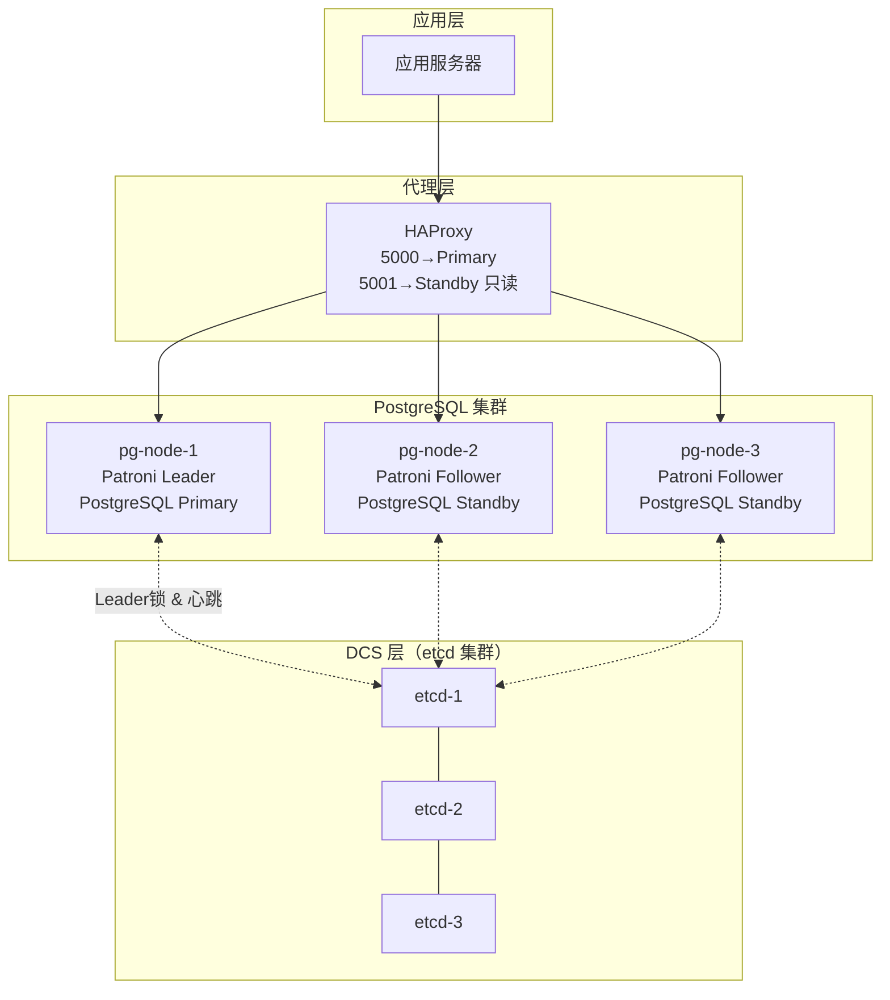

## Patroni 高可用集群实战

Patroni 是目前生产环境最主流的 PostgreSQL 高可用方案，通过 DCS（etcd/Consul/ZooKeeper）实现分布式共识，自动完成故障检测和主从切换。

---

## 一、架构总览



**关键组件**：
- **Patroni**：运行在每个 PostgreSQL 节点上的 HA 代理
- **DCS（etcd）**：分布式协调服务，存储集群状态和 Leader 锁
- **HAProxy**：负载均衡器，通过 Patroni REST API 检测哪个节点是 Primary

---

## 二、安装与配置

### 2.1 安装

```bash
# 所有节点安装
pip3 install patroni[etcd3]
# 或指定版本
pip3 install 'patroni[etcd3]>=3.0.0'

# 验证
patroni --version
```

### 2.2 patroni.yml 配置（每个节点）

```yaml
# /etc/patroni/patroni.yml（pg-node-1）

scope: pg-cluster          # 集群名称（所有节点相同）
namespace: /service/
name: pg-node-1            # 本节点名称（每个节点唯一）

restapi:
  listen: 0.0.0.0:8008
  connect_address: 192.168.1.11:8008

etcd3:
  hosts:
    - 192.168.1.21:2379
    - 192.168.1.22:2379
    - 192.168.1.23:2379

bootstrap:
  dcs:
    ttl: 30                         # Leader 锁 TTL（秒）
    loop_wait: 10                   # 心跳间隔（秒）
    retry_timeout: 10
    maximum_lag_on_failover: 1048576  # 允许的最大复制延迟（1MB）
    synchronous_mode: false          # 是否启用同步复制模式

  postgresql:
    use_pg_rewind: true
    use_slots: true
    parameters:
      wal_level: replica
      hot_standby: on
      max_wal_senders: 10
      max_replication_slots: 10
      wal_log_hints: on              # pg_rewind 必须开启
      shared_preload_libraries: 'pg_stat_statements'

postgresql:
  listen: 0.0.0.0:5432
  connect_address: 192.168.1.11:5432
  data_dir: /var/lib/postgresql/data
  bin_dir: /usr/lib/postgresql/16/bin
  config_dir: /var/lib/postgresql/data

  authentication:
    replication:
      username: replicator
      password: repl_password
    superuser:
      username: postgres
      password: pg_password

  parameters:
    shared_buffers: 8GB
    work_mem: 64MB
    maintenance_work_mem: 2GB
    effective_cache_size: 24GB
    max_connections: 200
    log_min_duration_statement: 500

tags:
  nofailover: false          # 禁止切换到此节点时设为 true
  noloadbalance: false       # 禁止此节点接受只读流量时设为 true
  nosync: false              # 禁止此节点作为同步 Standby 时设为 true
```

### 2.3 启动

```bash
# 所有节点启动 Patroni（第一个节点会初始化 Primary）
systemctl start patroni
systemctl enable patroni

# 查看日志
journalctl -u patroni -f
```

---

## 三、日常运维命令

```bash
# 查看集群状态
patronictl -c /etc/patroni/patroni.yml list
# + Cluster: pg-cluster -------+----+-----------+
# | Member    | Host           | Role   | State   | TL | Lag in MB |
# +-----------+----------------+--------+---------+----+-----------+
# | pg-node-1 | 192.168.1.11:5432 | Leader | running | 1  |           |
# | pg-node-2 | 192.168.1.12:5432 | Replica| running | 1  | 0.0       |
# | pg-node-3 | 192.168.1.13:5432 | Replica| running | 1  | 0.0       |

# 计划 Switchover（主动切换，零停机）
patronictl -c /etc/patroni/patroni.yml switchover pg-cluster \
    --master pg-node-1 \
    --candidate pg-node-2 \
    --scheduled now \
    --force

# 手动 Failover（紧急切换）
patronictl -c /etc/patroni/patroni.yml failover pg-cluster \
    --master pg-node-1 \
    --candidate pg-node-2 \
    --force

# 重启某个节点的 PostgreSQL（Patroni 会协调）
patronictl -c /etc/patroni/patroni.yml restart pg-cluster pg-node-2

# 重载配置（不重启）
patronictl -c /etc/patroni/patroni.yml reload pg-cluster

# 暂停 HA（维护窗口期间防止自动切换）
patronictl -c /etc/patroni/patroni.yml pause pg-cluster
# 恢复
patronictl -c /etc/patroni/patroni.yml resume pg-cluster

# 修改集群 DCS 配置（postgresql 参数等）
patronictl -c /etc/patroni/patroni.yml edit-config pg-cluster
```

---

## 四、HAProxy 配置

```ini
# /etc/haproxy/haproxy.cfg

global
    maxconn 100000
    log /dev/log local0

defaults
    mode tcp
    timeout connect 4s
    timeout client 30m
    timeout server 30m

# 主库入口（读写）
frontend pg_primary
    bind *:5000
    default_backend pg_primary_backend

backend pg_primary_backend
    option httpchk GET /primary
    http-check expect status 200
    default-server inter 3s fall 3 rise 2 on-marked-down shutdown-sessions
    server pg-node-1 192.168.1.11:5432 check port 8008
    server pg-node-2 192.168.1.12:5432 check port 8008
    server pg-node-3 192.168.1.13:5432 check port 8008

# 只读副本入口（读分离）
frontend pg_replicas
    bind *:5001
    default_backend pg_replica_backend

backend pg_replica_backend
    option httpchk GET /replica
    http-check expect status 200
    default-server inter 3s fall 3 rise 2
    server pg-node-1 192.168.1.11:5432 check port 8008
    server pg-node-2 192.168.1.12:5432 check port 8008
    server pg-node-3 192.168.1.13:5432 check port 8008
```

**工作原理**：HAProxy 定期调用 Patroni 的 REST API：
- `GET /primary` → 只有 Primary 返回 200，其他返回 503
- `GET /replica` → 只有健康的 Standby 返回 200

---

## 五、备份恢复

### 5.1 pg_basebackup 物理备份

```bash
# 基础备份（备份到本地目录）
pg_basebackup \
    -h 192.168.1.11 \
    -U replicator \
    -D /backup/base/$(date +%Y%m%d) \
    --wal-method=fetch \
    --checkpoint=fast \
    --compress=9 \
    --progress

# 验证备份完整性
pg_verifybackup /backup/base/20240101
```

### 5.2 WAL 归档配置（PITR 基础）

```ini
# postgresql.conf
archive_mode = on
archive_command = 'cp %p /backup/wal/%f'
# 或使用 pgBackRest（推荐生产）
archive_command = 'pgbackrest --stanza=main archive-push %p'
```

### 5.3 PITR 时间点恢复

```bash
# 1. 停止 PostgreSQL
pg_ctl stop -D /var/lib/postgresql/data

# 2. 恢复基础备份
rm -rf /var/lib/postgresql/data
cp -r /backup/base/20240101 /var/lib/postgresql/data

# 3. 创建恢复配置（postgresql.conf 或 recovery.conf）
cat > /var/lib/postgresql/data/postgresql.auto.conf << 'EOF'
restore_command = 'cp /backup/wal/%f %p'
recovery_target_time = '2024-01-15 14:30:00'
recovery_target_action = promote
EOF

# 4. 创建 recovery.signal 触发恢复模式
touch /var/lib/postgresql/data/recovery.signal

# 5. 启动 PostgreSQL（开始重放 WAL 直到目标时间点）
pg_ctl start -D /var/lib/postgresql/data

# 6. 监控恢复进度
tail -f /var/log/postgresql/postgresql.log
# LOG: recovery stopping before commit of transaction, time 2024-01-15 14:30:01
# LOG: pausing at the end of recovery
```
