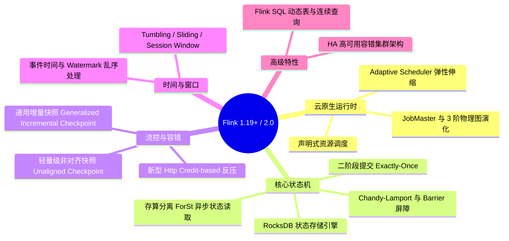

## 🌊 Apache Flink 1.19+ 实时计算技术栈

在大规模高吞吐、极低延迟的实时流处理场景下，Apache Flink 已经成为行业绝对的事实标准。针对最新的 Flink 1.19+ / 2.0-Alpha 演进路线，本专题将聚焦**流批一体架构**、**存算分离状态后端**、**轻量级非对齐快照**以及**基于 Credit 网络的新型反压机制**。

---

## 🗺️ Flink 1.19+ / 2.0 实时计算技术网图

---

## 🚀 第一阶段：引擎基石与运行时架构 (Runtime)

- [运行时架构与执行图解析](1-architecture.md)：全面解析 Flink 云原生部署模型下 TaskManager/JobMaster 的协调关系，深入探究 Slot 共享与隔离机制，以及从逻辑 StreamGraph 经 JobGraph 到物理 ExecutionGraph 的编译内幕。

---

## 💾 第二阶段：状态后端与一致性快照 (State & Checkpoint)

- [状态管理与一致性快照原理](2-state-checkpoint.md)：深度挖掘 Keyed State & Operator State，解析 Flink 基于 Chandy-Lamport 变体的分布式快照 Barrier 机制底色，并推演出真正的端到端恰好一次（Exactly-Once）语义实现。

---

## ⚡ 第三阶段：反压机制与极速容错 (Backpressure & Unaligned Checkpoint)

- [网络流控、反压机制与非对齐快照](3-backpressure.md)：起底基于 Netty Credit-based 网络层传输机制，并针对反压极端下快照对齐超时的痛点，全面解析 Flink 现代非对齐快照（Unaligned Checkpoint）的极速容错实现思路。

---

## ⏱️ 第四阶段：时间语义与窗口计算 (Time & Window)

- [时间语义与 Watermark 机制](4-time-watermark.md)：深入解析 Event Time、Processing Time，以及用于处理乱序数据的核心控制流屏障 Watermark 生成与传递机制。
- [窗口机制详解](5-windowing.md)：剖析 Tumbling、Sliding、Session 窗口的切分逻辑，及窗口函数、触发器 (Trigger) 和驱逐器 (Evictor) 架构。

---

## 📊 第五阶段：SQL 与高可用 (SQL & HA)

- [Flink SQL 与表 API](6-flink-sql.md)：解密动态表 (Dynamic Table)、连续查询 (Continuous Query) 及底层 Calcite 优化器。
- [HA 高可用机制](7-high-availability.md)：详述基于 ZooKeeper / Kubernetes 的 JobManager 故障选举与恢复机制，确保生产 7x24 不间断。
