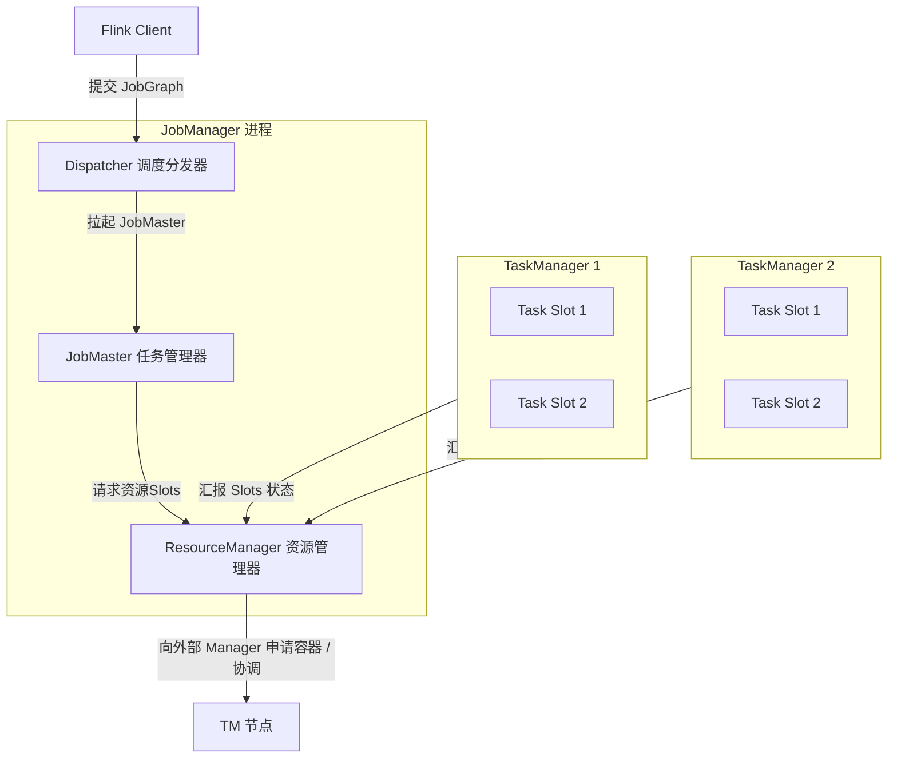
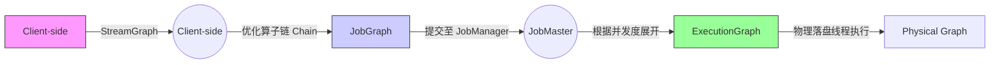
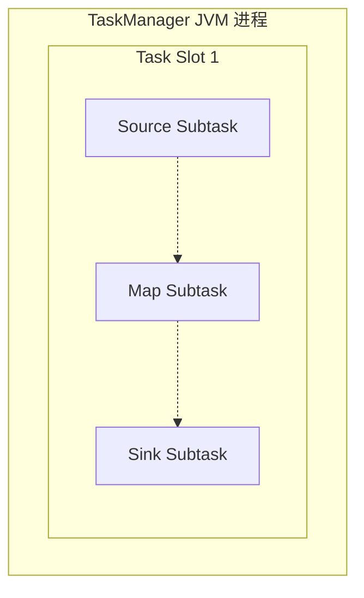

## Flink 1.19+ 运行时架构与执行图演化原理

要真正掌握 Apache Flink 1.19+ 的高吞吐流级处理性能，首先要彻底理解它的拓扑执行图演变底色、物理 Slot 分派法则以及最新的声明式调度逻辑。

---

## 一、 Flink 核心角色与集群组件剖析

在 Flink 1.19+ 的生产运行环境中，一个活动集群总是由两个分布式进程相互配合服务：一个 **JobManager** 与一组 **TaskManager**。

### 1. JobManager 职责定位

- **Dispatcher**（事件分发器）：暴露 Web UI 端口与 REST API 接口。当接收到 Flink 客户端的 JAR 包提交后，为其拉起一个专属 of 守护线程——**JobMaster**。
- **JobMaster**：单作业的物理“心脏”。负责将 `JobGraph` 还原转换为真实并发的 `ExecutionGraph`，向资源管理器申请 Task Slot，分发任务（Task）并统筹 Checkpoint 快照的一致性状态合并。
- **ResourceManager**：适配多种底层环境（Flink 1.19+ 深度适配 YARN, Kubernetes 声明式 Pod），负责管理集群中的 **Task Slot**。

### 2. TaskManager 职责定位

- Flink 的物理执行载体（Worker 进程）。
- 每一个 TaskManager 内部都有一个 JVM 虚拟机进程，而 Slot（任务槽）是 Flink 为其在 TaskManager 内部划分出的独家计算资源单元（仅进行线程级**内存隔离**，不隔离 CPU）。

---

## 二、 三大执行图（StreamGraph $\rightarrow$ JobGraph $\rightarrow$ ExecutionGraph）

Flink 从静态代码到动态分布式 Task 的演变，要经过极其优美且具有阶段特征的三层逻辑图变换：

### 1. 第一阶段：StreamGraph（流计算流图）

- **生成位置**：Flink Client 服务端（本地环境，无序分布式网络）。
- **特点**：是对算子关系的一对一逻辑模拟。
- **核心逻辑**：代码里声明的 `map`、`flatMap`、`filter` 在图里都被表述为一个 `StreamNode`，算子间的流动路线表述为 `StreamEdge`。

### 2. 第二阶段：JobGraph（作业优化图）

- **生成位置**：Flink Client。
- **合并优化：算子链（Operator Chain）**
  - 如果上下游算子间的数据流动没有网络跨节点开销（**One-to-One 窄依赖传递**），且上下游 **并发度（Parallelism）完全一致**，Flink 会强制执行**算子融合合并**。
  - 将多个紧密关联的算子合并到一个物理执行子任务（`JobVertex`）中，能避免跨线程的数据序列化、反序列化以及队列交互开销，极大地提高吞吐性能。
- **输出**：生成 dynamic `JobGraph`。

### 3. 第三阶段：ExecutionGraph（动态物理调度图）

- **生成位置**：JobMaster（JobManager 进程内部）。
- **转换核心：并发度的彻底展开（Explode）**
  - Flink 根据用户设置的算子并发度，把 `JobVertex` 横向拆分成真正的物理并发节点（`ExecutionVertex`）。
  - 在这个阶段，数据传输通道（如 `IntermediateResultPartition` 和 `InputGate`）被精确规划，支持了网络 Shuffle 的定位。

---

## 三、 Task Slot（任务槽）与 Slot Sharing 共享逻辑

许多初学者会混淆并发度（Parallelism）、TaskManager 数量与 Task Slot 的关系。Flink 通过**槽位共享机制**精妙地打破了静态分配的痛点。

### 1. Flink Slot 资源划定

- 每一个 Slot 占用 TaskManager JVM 的固定堆空间。
- **重要规则**：Slot 只是**内存资源**的分配单位。如果 TaskManager 有 3 个 Slot，它会将可用堆内存均匀划分为 3 份。多个 Slot 会共享同一套堆外内存与 CPU。

### 2. 槽位共享（Slot Sharing）

- **Slot Sharing Group（默认 `default` 组）**：
  同一作业的不同物理子任务（例如：一个 Source 子任务、一个 FlatMap 子任务与一个 Sink 子任务），只要属于同一个 `SlotSharingGroup`，就可以**放入同一个 Task Slot 中执行**。
- **优势保障**：
  - **极致的并发能力**：即使集群总 Slot 数等于最大算子并发度，作业也能全流水线（Pipeline）畅通无阻地运行。
  - **规避计算资源“热点失效”**：非槽位共享情况下，轻量级的 `Source` / `Filter` 算子会一直挂着一个 Slot 不释放极度浪费，而繁重的 `Window Join` 算子 Slot 经常爆满。槽位共享使得计算链路天然平衡了 CPU 损耗开销。

---

## 💡 Flink 1.19+ 运行时经典高频面试题

### Q1: 一个 Parallelism = 6 的 Flink 作业，至少需要多少个 Slot？需要多少个 TaskManager？

**答**：
1. **Slot 数量**：在启用默认拓扑**槽位共享**机制下，Flink 运行时所需的槽位数量等于整个拓扑中**算子所设置的最大并发度**。因此，至少需要 6 个 Task Slot。
2. **TaskManager 数量**：无法直接锁定，这完全取决于集群的 TaskManager 配置。例如：
   - 若每个 TaskManager 配置的槽数 `taskmanager.numberOfTaskSlots = 3`，则需 `6 / 3 = 2` 台 TaskManager。
   - 若配置为 `taskmanager.numberOfTaskSlots = 1`，则需 6 台 TaskManager。

### Q2: 为什么 Flink 1.19+ 推荐声明式资源调度（Declarative Scheduling）？

**答**：
在传统的主动调度（Active Scheduling）模型中，Flink 必须明确知道需要申请多少 Container 才会向 Kubernetes/YARN 提起请求。
而在 **1.19+ 引入的声明式调度模型**中，JobMaster 仅需向 ResourceManager **声明最终期望达到的算子并发总资源**（例如：“当前作业需要 20 个 Slots 才能满并发运行，但最低 4 个 Slots 也能跑起来”）。
这极大提高了 Flink 的弹性自适应机制，支持在 K8s 环境下自动匹配底层的弹性伸缩，甚至能解决由于个别机器损坏导致 Slot 不足时的自动降级运行问题。
