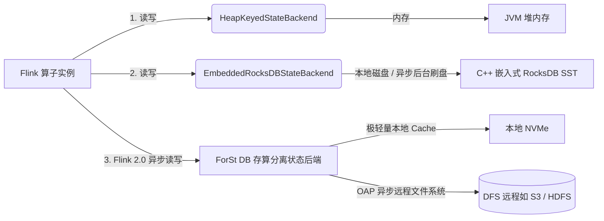
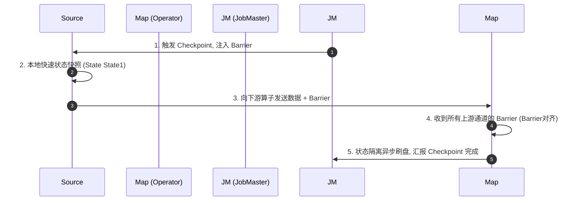
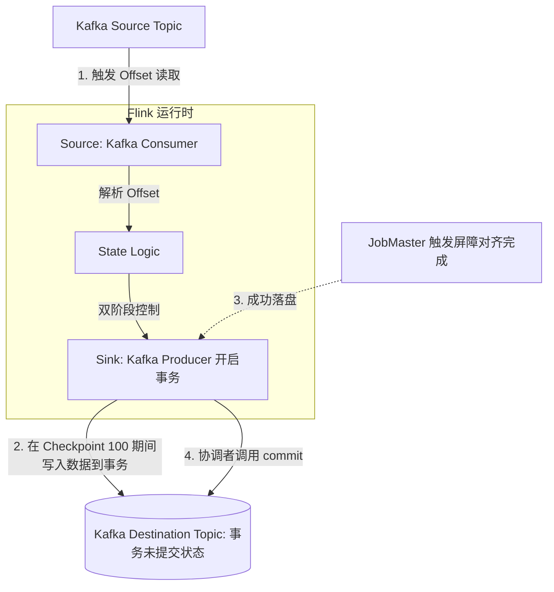

## Flink 1.19+ 状态管理与 Exactly-Once 语义

Apache Flink 之所以能从众多流处理引擎（如 Storm, Spark Streaming）中脱颖而出，核心就在于其**功能强大且容错、高可靠的状态（State）管理**。在面对每日千亿级数据规模时，Flink 依然能够优雅地保证事务的一致性，达成端到端“恰好一次”（Exactly-Once）的世界级流处理标杆。

---

## 一、 状态后端：RocksDB 与 Flink 2.0 存算分离 ForSt

Flink 提供了两种主要的状态管理和物理存储后端。在最新的 Flink 1.19+ 甚至 Flink 2.0-Alpha 演变中，状态后端发生了颠覆性的变化：

### 1. 传统的两种选择：配置选型与调优

- **HashMapStateBackend（堆内存状态后端）**：
  - **特点**：状态对象以 Java 形式存在于 TaskManager JVM 的**堆内存**中。
  - **优劣分析**：读写性能达到极致（微秒级），但受限于 JVM 堆大小（溢出 OOM），且大状态下 GC 停顿明显。
  - **场景**：窗口轻量、状态量极小的海量数据过滤场景。
- **EmbeddedRocksDBStateBackend（RocksDB 状态后端）**：
  - **特点**：状态序列化后写入 TM 节点本地的 **RocksDB 嵌入式 C++ 数据库**，通过 LSM-Tree 树结构将状态向本地磁盘平滑写盘。
  - **优劣分析**：不受内存大小限制，可存储海量 TB 级状态。缺点是读写必须经过 Java 到 C++ 的 JNI 序列化序列，吞吐耗时通常是微秒级到毫秒级。

### 2. 演进前沿：Flink 2.0 / 1.19+ ForSt 状态后端进程

- 传统的 RocksDB backend 一直存在**由于阻塞同步 IO 造成性能损耗**以及**本地磁盘故障恢复代价极大**的问题。
- **ForSt（RocksDB-like State Backend / 存算分离）**：
  在 Flink 1.19+、2.0 推进中，系统将异步状态处理 API（State Processor API V2）深层整合。状态底层读写不仅可以支持异步执行（IO-Agnostic），更彻底实现了**状态数据存入外部介质（如 HDFS / S3 远程对象存储）**，本地仅保留高频热数据 Cache 块。这意味着计算节点漂移和崩溃恢复（Failover）无需再拉取几十 GB 的本地数据，实现了“秒级无缝迁移”（Cloud Native State Disaggregation）。

---

## 二、 容错与一致性快照：Chandy-Lamport 分布式屏障机制

要想在分布式计算中进行快照保存且不中断流工作，Flink 巧妙地在数据流中注入了特殊的控制信号——`Checkpoint Barrier`（检查点屏障），从而实现了其专有的 **Chandy-Lamport 变体算法**：

### 1. 对齐快照的详细流程（Aligned Checkpoint）

- 当 JobMaster 的协调线程（Checkpoint Coordinator）开启 Checkpoint 时，会通知 Source 算子在输出流中灌入 `Barrier`。
- `Barrier` 就像流水线上的一条虚拟横截面红线。当一个算子包含多个输入通道（Channels）时：
  1. 它必须**等到所有接收通道的第一波红线 Barrier 全部到达该算子**。
  2. 这期间如果一些快通道的正常数据提前到达了，算子无法立即处理（需阻碍这部分新数据的输入进入，或者放入输入缓冲区暂存）。
  3. 待红线全部对齐，该算子把本地状态持久化写盘，生成新的 Checkpoint，然后继续向下游广播对齐 Barrier。

---

## 三、 突破分布式锁链：端到端的 Exactly-Once 一致性

即使 Flink 内部通过检查点快照（Checkpoint）做到了在计算节点失败时状态完美回传，但如果外部世界（消息队列 Kafka、下游目标数据库）没有事务协作，也依旧会发生：
- 重复消费已完成的数据。
- 重复将数据写入 Sink 数据库中。

为此，真正落地 **End-to-End Exactly-Once**，必须要求：**上游支持重溯（Kafka Offset 状态化） + 内部状态幂等 $\rightarrow$ 下游支持两阶段提交（2PC）事务关联**。

### 1. Two-Phase Commit (2PC) 实现协议

Flink 的 `TwoPhaseCommitSinkFunction` 提供了一个通用且清晰的模板：
1. **预提交（Pre-Commit）阶段**：
   - 伴随着 Barrier 到达 Sink，Flink 开启下游事务（如开启一个新的 Kafka Transaction）。
   - Flink 把所有计算好的数据正常投递到这个新建的未提交事务中，生成本地 Checkpoint 暂存区。
2. **正式提交（Commit）阶段**：
   - 如果整条管道中没有任何节点崩溃。当 Source 到 Sink 的 Barrier 彻底对齐，JobMaster 协调器确认“本轮全体 Checkpoint 100 已经落盘成功”。
   - Sink 收到 JobMaster 对 Checkpoint 100 的成功回调指令，调用原生事务的 `commit` 接口，使这一轮次的所有输出瞬间对外部消费者可见。
   - 若其中任何一个算子在 Checkpoint 执行中发生致命宕机，本轮次未提交的事务会自动被 Kafka/数据库依据超时机制丢弃，在下一次恢复拉取到 Checkpoint 99 开始时完美衔接，规避了数据重复和断流漏单。

---

## 💡 Flink 状态与容错经典高频面试题

### Q1: 增量 Checkpoint（Incremental Checkpoint）与通用增量快照（Generalized Incremental Checkpoint）区别是什么？

**答**：
- **增量 Checkpoint（RocksDB）**：基于 RocksDB 的 LSM-Tree 树结构。RocksDB 内置的 SST 文件是不会发生修改的只读块。在进行 Checkpoint 写入时，Flink 仅仅只需将那些自上次快照以来**新生成的 SST 追加增量文件备份到 HDFS**，已存在覆盖 of SST 文件只做逻辑索引引用。
- **通用增量快照（Flink 1.19+）**：Flink 1.19 提供的 GIC 机制更进一步，实现了计算状态到状态落盘在内部的解耦。它的核心基于日志记录（Journaling）。通过引入专门的 Changelog 管道组件，状态的局部细小改变会被实时以 Journal 的细粒度方式持久化到远端，实现毫秒级的超短 Checkpoint，直接解决了 RocksDB 同步刷盘造成的峰值 IO 抖动。

### Q2: 既然有非对齐 Checkpoint，为什么默认依旧最常启用 Aligned Checkpoint（对齐快照）？

**答**：
非对齐快照虽然能大大降低在反压下的快照完成耗时，但它的代价非常昂贵：它在生成快照时**必须把链路中各个网络传输介质缓冲区（Network Buffers）里的在途（In-Flight）数据一并抓取、序列化并合并写入快照中**。
这意味着，生成的 Checkpoint 文件由于包含大量的在途数据包，其占用体积比普通的增量 Aligned Checkpoint 要大得多，造成更大的网络和存储介质写入损耗。因此，当系统网络条件极其健康、几乎无反压时，应该继续优先使用对齐块 Checkpoint 来节省存储空间。
