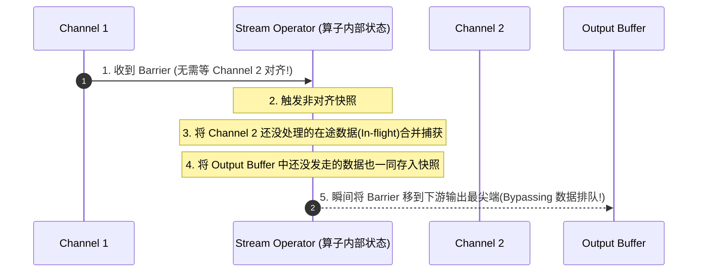

## Flink 1.19+ 现代网络层、反压控制与非对齐快照机制

流式计算的核心难题之一在于面对流量冲击时的自我保护机制，即**反压（Backpressure）**。如果下游算子的处理速率跟不上上游突发的流量速度，Flink 必须拥有一套快速而精准的节流通知策略，把这股过载压力自底向上反馈到源头 Source 节点。

本篇深度起底 Flink 自 1.15+ 并延续到 1.19+ 的 **Credit-based（基于系统信用额度分配）反压网络机制**，并深度打通在反压阶段，如何配合 **Unaligned Checkpoint（非对齐快照）** 瞬间破除计算延迟阻塞的实战机制。

---

## 一、 Flink 现代基于信用（Credit-based）的反压流量机制

在 Flink 1.5 之前的早期遗留版本中，反压采用由于基于 TCP 滑动窗口（Window）控制。这种策略最致命的缺陷是，同一个 TaskManager 内的不同物理 Slot 往往共享了相同的物理 TCP 通道。如果某一个 Slot 的计算发生了严重的阻塞，局部的 TCP 缓冲区爆满，这直接导致**另外不相干的健康 Slot 也无法通过该 TCP 底层通道继续传输数据**，发生误杀。

为了彻底实现 Slot 之间的网络流控解耦，Flink 引入了一套精妙的**应用层 Credit 机制**：

```mermaid
graph TD
    subgraph TM_Sender [TaskManager A (发送端 (槽位 1))]
        LogicA[Operator Subtask] -->|1. 将数据写入预分配 Buffer| OutPool[LocalBufferPool (Sender)]
        OutPool -->|4. TCP 连接发送数据包| Netty[Netty Client]
    end

    subgraph TM_Receiver [TaskManager B (接收端 (槽位 2))]
        NettyServer[Netty Server] -->|5. 分发读取| InPool[LocalBufferPool (Receiver)]
        InPool -->|6. 主动消费提取并计算| LogicB[Operator Subtask Business]
    end

    InPool -.->|2. 发送信令: 剩余 Buffer 块数 -> Credit| OutPool
    LogicB -->|3. 计算完毕释放 Buffer| InPool
```

### 1. Credit 运行机理与状态划分

1. **输入与输出缓冲区池（LocalBufferPool）**：
   每一个 Subtask 在创建时，都会被独立配给一定数量的 Network Buffer 缓冲区。
   - 发送端拥有 **ResultPartition**（逻辑输出）；
   - 接收端对应拥有 **InputGate**（逻辑输入）。
2. **反向信令与额度确认 (Credit)**：
   - 接收端（Receiver）会定期向发送端（Sender）宣告它**当前还剩余多少可用的空闲 Buffer**。这部分的数量在网络层被声明为 **Credit（信用值）**。
   - **核心规则**：发送端在网络通信发送数据前，必须持有接收端的 Credit 值（即：一个 Credit 标识接收端准备好接收一个 Buffer 大小的数据包）。
   - **如果 Credit 变为 0**：发送端立刻被应用层网络线程冻结、不再向该接收端发送数据，数据在发送端的 ResultPartition 队列里堆积。发送端本地的 BufferPool 满负荷，从而向上游级联推进节流。

这样，**即便 TCP 通道保持通畅，受阻的 Slot 通道会被应用层流控单独卡死，而同在一台宿主机的另一个正常 Slot 通道由于 Credit 依然充裕，可以保持无阻塞通行。**

---

## 二、 现代反压下传统 Checkpoint 为什么会失效或超时？

在前面学习的 [状态管理与一致性快照原理](2-state-checkpoint.md) 中我们知道，要想达成 Aligned Checkpoint（对齐检查点），算子必须要等待所有的输入通道对应的组件发送对齐屏障 Barrier：

```mermaid
graph LR
    A[Source 算子] -->|1. 触发 Barrier| B((网络传输介质 TCP/Netty))
    B -->|2. 排在数据队列的最末尾 (反压阻塞)| C[下游 各种计算 算子]
```

### 1. 致命的“慢数据排队”灾难

- 在严重的 Flink 流量反压之下，接收端的 BufferPool 和中间的网络通信通道早已被之前挤压、没算完的数据包塞得满满当当。
- 因为 Barrier 本质上是在**逻辑流中按先后顺序依次和数据包一起排队前行**的普通控制帧。
- 此时：这个用来救命和容错的 `Barrier` 帧，被迫卡在成百上千个等待被计算、消费的普通历史数据包屁股后面动弹不得。
- **结果**：下游的算子长时间等不到对齐 Barrier $\rightarrow$ Checkpoint 产生严重超时（Checkpoint Expired Timeout）并被宣告作废失败 $\rightarrow$ 状态无法可靠保存一旦挂载将重溯几个小时。

---

## 三、 Flink 破局解法：现代非对齐快照（Unaligned Checkpoint）

为了解决在反压过载的极端下快照根本无法对齐并总是超时的痛点，Flink 引入了高度创新的 **Unaligned Checkpoint（非对齐检查点）**：

### 1. 非对齐 Checkpoint 触发流程

在非对齐模式下，只要 Barrier 悄然来到了算子底层的第一个物理接收 Channel 的顶部，**算子根本不需要进行任何痛苦的等待和对齐操作**，立刻对算子实行瞬间“急刹车并拍照”：



1. **强行旁路并越位（Barrier Bypassing）**：
   算子接收到红线 Barrier 后，将其从底层的 Input Buffer 队列里抽离提取出来，**直接推送到已经准备向其下游发送的 Output Buffer 队列的最前方**。这意味着 Barrier 瞬间绕过了正在排队的庞大数据包，以极速传递到下游。
2. **在途数据并归归档（In-flight Data Sizing）**：
   既然算子不再等待，为了能够完美还原崩塌时一瞬间的时空切面状态，快照里除了需要保存当前算子的内部物理 State 之外，还**被迫要把所有已经在网络中飞行、还没算完的那部分数据（In-flight data）原样打包写入快照中**。
3. **状态持久化**：
   在途网络数据 + 已经输出还未发出的数据 + 算子物理状态，共同作为本轮的非对齐 Checkpoint。

---

## 💡 Flink 反压与流控高频面试题

### Q1: 在线上运行中，如何快速定位或排查 Flink 任务中的反压问题？

**答**：
1. **通过 Flink Web UI 查看反压指数（Backpressure Monitor）**：
   Docusaurus 界面中，可以直接点击某个 Task，查看其 `Backpressure` 标签。Flink 通过采样物理计算线程处于阻断（Blocked）或轮询等待的比例：如果多于 `0.5` 则状态标识为 HIGH。
2. **通过 Flink 运行时指标定位**：
   - 关注 `isBackPressured`、`outPoolUsage` 和 `inPoolUsage` 这三个网络组件指标。
   - 如果一个 Subtask 它的 `outPoolUsage`（输出缓冲池利用率）一直维持在接近 `1.0` 的绝对高位，而下游 Subtask 的 `inPoolUsage`（输入缓冲池利用率）也同样爆满，说明**下游才是真正阻滞计算性能的罪魁祸首**，瓶颈被由于下游向下反推。
   - 如果一个 Subtask 的 `outPoolUsage` 极低，但 `inPoolUsage` 极高，这通常说明是**当前算子自身的业务计算性能不够（或者内部发生了死锁、高耗时外部同步 I/O 请求、CPU 飙高）**，在这里把队列拖垮了。

### Q2: 为什么开启 Unaligned Checkpoint 会增加外部存储盘（如 HDFS / S3）的 IO 压力？

**答**：
因为 Aligned Checkpoint（对齐快照）保存的纯粹只有已经流经算子、落于持久化状态管理器（其本质就是只包含 RocksDB 或 HashMap 里的 State 对象）内部的数据。
而 **Unaligned Checkpoint 除了 State 对象外，还打包拉走了包含管道中处于排队、发送、未消费完的整个 Buffer 内存区内的 “在途飞行数据包”**。
这些在途飞行数据包动辄几十兆到几百兆，且数量极度庞大和琐碎，这意味着每次保存快照向底层存储传输的数据容量与 SST 文件数大大攀升，直接带来磁盘和网络带宽的高强拉伸与写入吞吐挑战。
