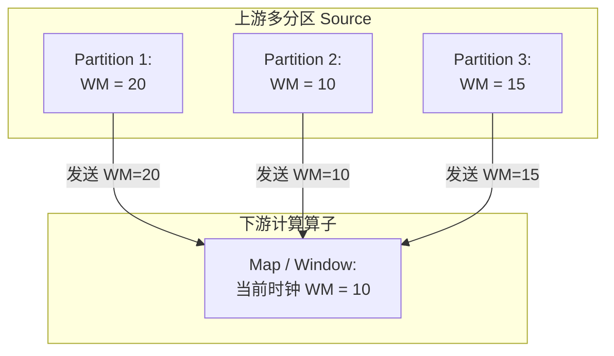

## Flink 时间语义与 Watermark 核心机制

在真实的流处理世界中，由于网络延迟、分布式系统中的时钟漂移或设备断线重连，数据抵达流处理系统的时间往往和事件真实发生的时间**不一致（乱序到达）**。Flink 通过精巧的时间语义与 **Watermark（水位线）** 机制，优雅地解决了这种无界数据流的乱序与延迟处理难题。

---

## 一、 Flink 的三大时间语义

Flink 支持三种时间语义来衡量无界流演进的坐标轴：

1. **Event Time（事件时间）**：
   - **定义**：事件在设备（如传感器）或系统中**真正发生的时间**（通常数据本身附带时间戳字段）。
   - **特性**：不受网络延迟和 Flink 内部处理速度影响，结果完全确定且可复现。**现代 Flink (1.12+) 严格推荐并默认采用的时间语义。**
2. **Processing Time（处理时间）**：
   - **定义**：数据到达 Flink 某个特定的执行算子时，所在的 TaskManager 机器操作系统的**当前本地时间**。
   - **特性**：性能最高、延迟极低，但如果数据发生堆积，处理时间会导致相同的数据在重放时产生完全不同的窗口划分结果。
3. **Ingestion Time（注入时间 - 历史概念）**：
   - **定义**：数据进入 Flink Source 算子的时间。
   - 现已被 Flink 废弃或很少使用，它在内部会被当作特殊的 Event Time 统一实现。

---

## 二、 乱序终结者：Watermark（水位线）原理

在使用 **Event Time** 时，最大的挑战是：系统怎么知道“**属于某个时间段的数据已经全部收集齐了**”，也就是何时可以触发计算？

由于乱序的存在，单纯依靠时间戳不够，Flink 引入了 **Watermark** 作为逻辑时钟。

### 1. Watermark 的本质定义

- **Watermark 纯粹是一条特殊的控制流记录（Control Record）**。它与普通数据包一样，顺着数据流方向不断流动。
- **核心断言**：当一个算子接收到 $Watermark(t)$ 时，明确向系统声明：**“我保证，所有时间戳 $T \\le t$ 的数据都已经到达了，以后不会再有比 $t$ 更早的数据过来了。”**

### 2. 应对乱序：Watermark 的生成规则

假设我们要容忍最多 3 秒的数据乱序，它的生成策略是：
$$ Watermark = Max(当前观察到的最大事件时间) - 允许乱序的最大容忍界限 (Bound) $$

**案例分析 (乱序容忍 = 3s)**：
1. 产生数据 `EventTime = 10`。 此时 $Watermark = 10 - 3 = 7$。
   - **系统认为：**所有时间 $\\le 7$ 的数据全到了。如果有 0~7 的窗口，直接关窗计算。
2. 产生数据 `EventTime = 15`。 此时 $Watermark = 15 - 3 = 12$。
3. 产生数据 `EventTime = 11`。（这叫**迟到数据**，但它 $11 > 12$ 不成立，实际上它依旧在系统的容忍期内，正常被处理，不会丢弃）。
4. （如果设定的容错时间极短或者数据乱序极其极其严重怎么办？见下面第三节的侧输出流）。

---

## 三、 Watermark 的广播传递对齐（Alignment）

类似于 Checkpoint Barrier 的机制，Watermark 在多并行度 (Parallelism) 环境下，也存在**多路对齐木桶原理**。

**多条输入流对齐规则**：下游算子的当前可用逻辑时钟（当前 Watermark），取其所有上游输入通道中 **最小的那个 Watermark（短板效应）**。
- 这确保了下游算子绝不冒进。在上述例子中，即使 Partition 1 和 3 的流走的很快，下游由于 Partition 2 只给出了 WM=10 的断言，下游只能认为“系统整体还没准备好 10 之后的数据”。

---

## 四、 兜底方案：三重保证对付极端迟到数据

那么如果极端情况下，水管爆了、网络瘫痪导致一条本该 1 分钟前达到的数据，3 分钟后才姗姗来迟，比减去乱序容忍后的 Watermark 还要晚，怎么办？Flink 共有三层防线：

1. **第一层：Watermark 乱序容忍度 (Out-of-orderness Bound)**。放宽 Watermark 减去的时间。这是最基本的容错。
2. **第二层：允许迟到（Allowed Lateness）**。即使窗口被 Watermark 触发关闭并派发了第一次结果，但**并不立刻销毁窗口状态内存**，而是为了某些迟到数据再保留一段时间（如 1 分钟 `allowedLateness(Time.minutes(1))`）。迟到数据落入后，会再次触发更新计算。
3. **第三层：侧输出流（Side Output）**。连 Allowed Lateness 都错过了的陈年老数据，不会强行计算，而是作为“异构数据”打入旁路（Side Output Tag）进行离线修正告警，保证系统主干极净。