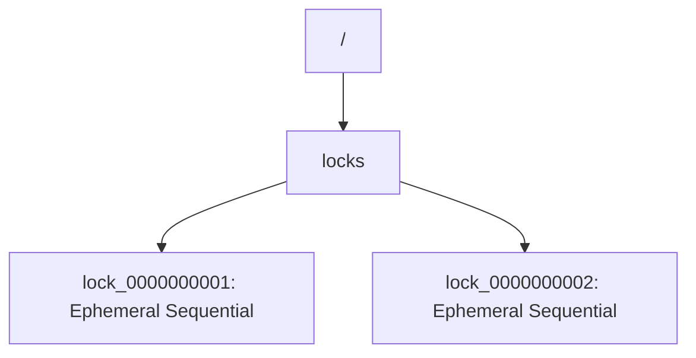
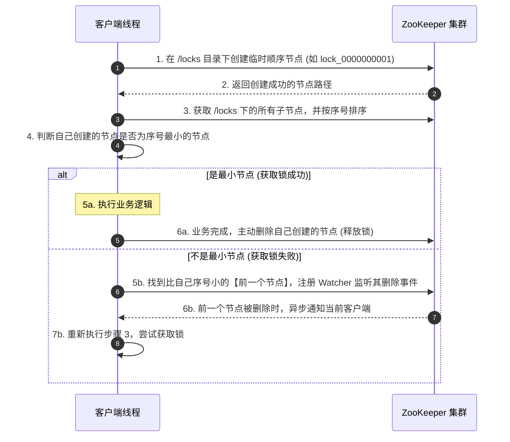

## ZooKeeper 分布式锁与高可用原理

在分布式微服务架构中，除了使用 Redis 实现分布式锁外，**ZooKeeper（简称 ZK）** 是另一种极为重要的工业级分布式锁解决方案。基于其强一致性（CP 架构）的特点，ZK 分布式锁在安全性、可靠性上有着天然的优势。

---

## 一、 ZooKeeper 核心机制

要理解 ZK 分布式锁，必须先掌握 ZK 的两个核心特性：**节点类型** 和 **Watcher 监听机制**。

### 1. 树形节点结构与节点类型

ZooKeeper 的数据模型类似于文件系统，是一个树形层次结构。每个节点被称为一个 **Znode**。

Znode 主要分为以下四种类型：

- **持久节点（Persistent）**：节点创建后，除非显式调用删除操作，否则一直存在。
- **持久顺序节点（Persistent Sequential）**：在持久节点的基础上，ZK 会自动在节点名称后面追加一个单调递增的 10 位数字。
- **临时节点（Ephemeral）**：**生命周期与客户端会话（Session）绑定**。如果客户端与 ZK 服务器断开连接（会话超时），该节点会被 ZK 自动删除。
- **临时顺序节点（Ephemeral Sequential）**：结合了临时节点和顺序节点的特性。**这是实现 ZK 分布式锁的基石**。

---

### 2. Watcher 监听机制

Watcher 是 ZooKeeper 的发布/订阅机制。客户端可以在指定的 Znode 上注册一个 Watcher，当该 Znode 发生特定事件（如节点创建、删除、数据变更）时，ZK 服务器会异步通知客户端。

- **特点**：**一次性触发**。一旦 Watcher 被触发，就会被自动移除。如果需要持续监听，客户端必须在收到通知后重新注册。

---

## 二、 ZooKeeper 分布式锁实现原理

为了避免高并发下的**“惊群效应（Herd Effect）”**（即一个锁释放，成百上千个线程同时被唤醒去抢锁，造成服务器性能剧烈抖动），ZK 分布式锁通常采用**临时顺序节点**来实现。

### 1. 加锁与释放锁流程

### 2. 核心步骤详解

1. **创建锁节点**：

   每个尝试加锁的客户端，都在指定的锁目录（如 `/locks`）下创建一个**临时顺序节点**（如 `lock_0000000001`）。

2. **判断是否获取锁**：

   客户端获取 `/locks` 目录下的所有子节点，并进行升序排序。

   - 如果当前客户端创建的节点序号是**最小的**，说明当前客户端排在最前面，**成功获取锁**。
   - 如果不是最小的，说明锁已被他人持有。

3. **精准监听（避免惊群效应）**：

   如果获取锁失败，客户端**不需要**监听整个 `/locks` 目录，也**不需要**监听序号最小的那个节点。

   - 客户端只需找到排在自己**前一位**的那个节点（例如，自己是 `lock_0000000003`，前一位就是 `lock_0000000002`），并对其注册 **Watcher 监听**。
   - 这样，当持有锁的客户端释放锁（删除节点）时，只会唤醒排在它后面的那一个客户端，其他客户端继续静默等待。整个过程是有序且高效的。

4. **释放锁**：
   - **主动释放**：业务执行完毕，客户端显式调用删除节点接口。
   - **被动释放（防死锁）**：如果客户端在执行业务时突然宕机，其与 ZK 的 Session 断开，由于创建的是**临时节点**，ZK 会自动将该节点删除，锁被安全释放，彻底杜绝了死锁问题。

---

## 三、 ZooKeeper 锁与 Redis 锁（Redlock）多维度对比

在实际选型中，我们需要根据业务场景在 Redis 锁和 ZK 锁之间进行权衡：

| 对比维度           | Redis 分布式锁（Redisson）                                                 | ZooKeeper 分布式锁（Curator）                                          |
| :----------------- | :------------------------------------------------------------------------- | :--------------------------------------------------------------------- |
| **架构类型**       | **AP 架构**。追求高可用和极致吞吐量。                                      | **CP 架构**。追求强一致性和绝对可靠性。                                |
| **实现原理**       | 基于 `SETNX`、Lua 脚本及看门狗续期机制。                                   | 基于临时顺序节点与 Watcher 监听机制。                                  |
| **一致性与安全性** | **弱一致性**。主从切换时可能发生锁丢失（Redlock 算法有争议且维护成本高）。 | **强一致性**。基于 ZAB 协议，半数以上节点写入成功才算成功，绝对安全。  |
| **性能与吞吐量**   | **极高**。纯内存操作，单机可达数十万 QPS。                                 | **中等**。由于需要频繁创建、删除节点，且涉及磁盘 I/O，性能弱于 Redis。 |
| **死锁防范**       | 依赖锁的过期时间（TTL）和看门狗续期。若宕机，需等待 TTL 到期。             | 依赖临时节点。若客户端宕机，Session 断开，锁立即可靠释放。             |
| **惊群效应防范**   | 客户端通常需要自旋尝试，对 Redis 压力较大。                                | 完美解决。每个节点只监听其前驱节点，唤醒开销极小。                     |

### 架构师选型建议

- **优先选择 Redis 分布式锁**：
  - 适用于**高并发、高吞吐量**，且对**极少数情况下的锁丢失有一定容忍度**的业务场景（如商品秒杀、防重复提交、短信发送限制等）。
- **优先选择 ZooKeeper 分布式锁**：
  - 适用于**并发量中等**，但对**数据一致性、安全性要求极高，绝对不允许锁丢失**的金融级业务场景（如资金转账、订单对账、分布式任务调度等）。

---

## 四、 工业级利器：Curator 客户端分布式锁实现

在 Java 生态中，一般不会直接调用 ZooKeeper 原生客户端来手写自研锁逻辑（因为面临着复杂的连接重连 Session 丢失、Watcher 重新注册、节点状态轮询判断等细节坑）。我们统一接入原汁原味的、由 Apache 维护的 **Curator** 开源客户端框架。

### 1. Curator 核心重试策略：防网络瞬断抖动

Curator 提供了完备的分布式自愈设计。实例化 `CuratorFramework` 时，必须要指定底层重试策略（Retry Policy）：

- **`ExponentialBackoffRetry` (指数退避重试)**：
  - 规定基础等待时间（Base Sleep Time）和最大重试次数。
  - **策略机理**：重试等待跨度计算公式如下：
    $$T_{\text{sleep}} = \min(T_{\text{max\_sleep}}, T_{\text{base}} \times 2^{\text{retry\_count}})$$
  - 随着重试次数累加，休眠退避时间呈指数级陡峭上扬，能有效避免物理断网故障发生时大量线程因无缝、高频重连引发的集群雪崩灾难。
- **`RetryNTimes`**：允许直接设置固定的最大重试次数和每次重载的硬性休眠间隔。

### 2. `InterProcessMutex` (可重入排他锁) 底层实现原理解析

Curator 最具代表性、最常用的是基于可重入特性的 `InterProcessMutex`：

1. **可重入的实现：Thread 线程映射 Map**：
   - 原生的 ZooKeeper 节点是不存在“线程概念”的。
   - Curator 内部通过维护一个并发的容器 `ConcurrentMap<Thread, LockData>` 来做本地代理。
   - `LockData` 中记录了当前线程所拥有的**加锁临时顺序节点路径**（`lockPath`）和**重入计数器**（`lockCount`）。
   - 当同一个线程再次发起 `acquire()` 时：
     - Curator 首先判定当前线程在本地 `LockData` Map 中是否存在记录。
     - 若存在，直接将 `lockCount` 自增 $+1$，**完全不需要再去 ZooKeeper 服务器做任何网络创建节点写入**，从而实现超轻量级本地重入晋升，极大地保护了并发带宽。
2. **释放重入锁 (Release)**：
   - 每次执行 `release()`，本地 `lockCount` 自减 $-1$。
   - 只有当 `lockCount` 归 $0$ 时，才会发起远程 ZooKeeper 调用删除该临时顺序节点，彻底交出分布式锁的所有权。

---
