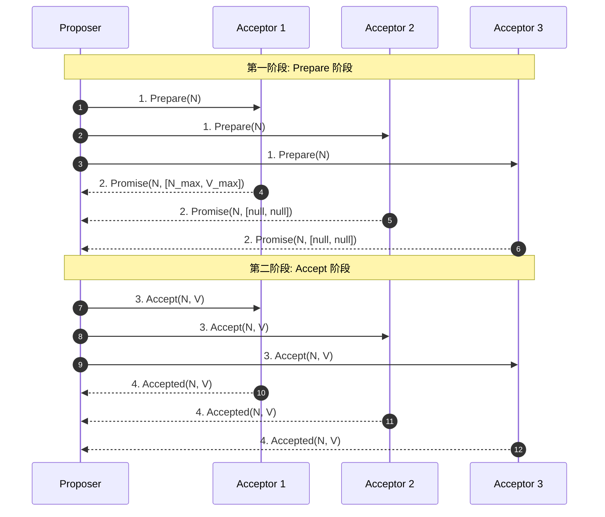
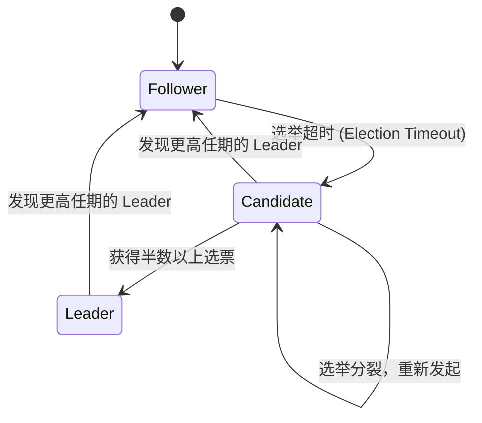
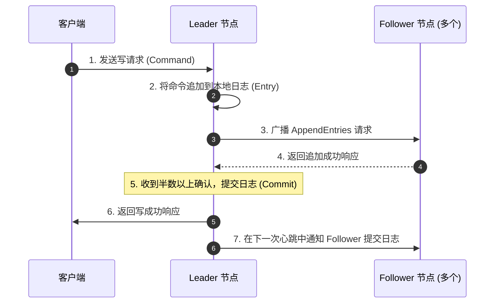
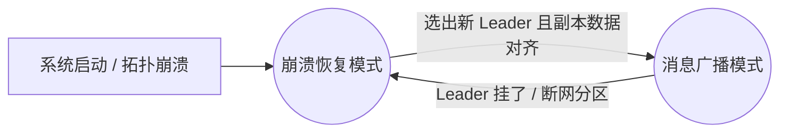

## 分布式共识协议：Raft 与 Paxos

在分布式系统中，为了保证多副本数据的一致性，必须使用共识协议。**Paxos** 是共识协议的开山鼻祖，而 **Raft** 则是目前工业界应用最广泛、最易于理解的共识协议（如 Consul、Etcd、Nacos CP 模式等底层都基于 Raft）。

---

## 一、 Paxos 协议：分布式共识的基石

Paxos 协议由 Leslie Lamport 于 1990 年提出。由于其高度抽象和复杂性，被称为“最难理解的算法”。

### 1. 节点角色

Basic Paxos 中，节点分为三种角色（一个节点可以同时扮演多种角色）：

- **Proposer（提议者）**：负责提出议案（Proposal）。
- **Acceptor（决策者）**：负责对议案进行投票和决策，决定议案是否通过。
- **Learner（学习者）**：不参与决策，只负责获取并同步最终达成的共识结果。

### 2. Basic Paxos 的二阶段执行流程

**第一阶段：Prepare 阶段**：

1. **Proposer** 选择一个唯一的提议编号 $N$，向半数以上（Quorum）的 **Acceptor** 发送 `Prepare(N)` 请求。
2. **Acceptor** 收到 `Prepare(N)` 请求后，做出如下承诺（Promise）：
   - 承诺不再接受任何编号小于或等于 $N$ 的提议。
   - 如果之前已经通过（Accepted）过提议，则返回已通过的提议中编号最大的那个提议的值 `V_max` 和编号 `N_max`。

**第二阶段：Accept 阶段**：

1. 当 **Proposer** 收到半数以上 Acceptor 的 Promise 响应后，它需要决定提议的值 $V$：
   - 如果响应中包含任何已被通过的值，则 $V$ 必须等于这些值中编号最大的那个值 `V_max`。
   - 如果响应中不包含任何已被通过的值，则 Proposer 可以自由决定提议的值 $V$。
2. 随后，Proposer 向这些 Acceptor 发送 `Accept(N, V)` 请求。
3. **Acceptor** 收到 `Accept(N, V)` 请求后，只要它没有承诺过拒绝编号为 $N$ 的提议，就会通过（Accepted）该提议。

---

## 二、 Raft 协议：易于理解的共识算法

Raft 协议的核心思想是**“分而治之”**。它将复杂的共识问题拆分为三个子问题：**Leader 选举（Leader Election）**、**日志复制（Log Replication）** 和 **安全性（Safety）**。

### 1. 节点状态与任期（Term）

Raft 集群中的节点在任何时刻都处于以下三种状态之一：

- **Leader（领导者）**：负责处理所有客户端请求，进行日志复制。同一时刻只能有一个 Leader。
- **Follower（跟随者）**：完全被动，只响应 Leader 和 Candidate 的请求。
- **Candidate（候选人）**：主动发起选举，争夺 Leader 席位。

Raft 将时间划分为任意长度的**任期（Term）**，任期用连续的整数表示。每个任期都以一次选举开始。

---

### 2. Leader 选举流程

1. **触发选举**：Follower 在一个随机的**选举超时时间（Election Timeout，通常在 150ms ~ 300ms 之间）**内没有收到 Leader 的心跳（AppendEntries），就会将自己的状态转为 Candidate，任期号（Term）加 1，并向自己投一票。
2. **发起投票**：Candidate 向集群中其他节点发送 `RequestVote` 请求。
3. **投票规则**：
   - 每个节点在每个任期内只能投一票（先到先得）。
   - **日志完整性校验（安全性限制）**：如果 Candidate 的日志没有投票节点的日志新（通过比较最后一条日志的 Term 和 Index），投票节点会拒绝投票。这保证了**新选举出的 Leader 一定包含所有已提交的日志**。
4. **成为 Leader**：Candidate 获得半数以上节点的选票后，正式升级为 Leader，并立即向所有节点发送空日志（心跳包）以确立权威，阻止其他节点发起选举。

---

### 3. 日志复制流程

Raft 采用强领导者模型，所有数据的写入都必须经过 Leader。

1. **接收请求**：Leader 接收到客户端的写请求，将命令作为一个新的 Entry 追加到自己的日志中。
2. **广播复制**：Leader 向所有 Follower 广播 `AppendEntries` 请求。
3. **半数确认**：当 Leader 收到半数以上 Follower 的成功响应后，将该 Entry 标记为**已提交（Committed）**，并应用到本地状态机，向客户端返回成功。
4. **异步提交**：Leader 在后续的心跳包中通知 Follower，Follower 收到通知后也将该日志提交并应用到自己的状态机。

---

## 三、 ZooKeeper 核心 ZAB 协议剖析

除了 Paxos 与 Raft，Apache ZooKeeper 底层使用的是专门为其量身定制的 **ZAB (ZooKeeper Atomic Broadcast，意为原子广播协议)**。它是一种支持**崩溃恢复**的原子广播协议，专门用来保障主备模型下系统数据状态的一致性。

### 1. ZAB 的两种核心工作模式

ZAB 协议在其整个生命周期中，会在这两种基础模式之间往复交替运行：

#### 崩溃恢复模式 (Crash Recovery)

当系统刚刚启动、或者作为核心的 Leader 突然宕机、网络断分区隔断时，ZAB 协议就会无缝切入崩溃恢复状态。该阶段包含两大核心子任务：
1. **Leader 选举**：选出一个全新且绝对合法的 Leader 节点。
   - **唯一事务 ID 标识：ZXID**。`ZXID` 是一个 64 位的无符号长整型，高 32 位为 `epoch`（代表纪元/任期），低 32 位为 `counter`（单调递增的事务计数器）。
   - **选举规则（ZXID 最大化原则）**：在选举时，节点之间会相互发送 `Vote` 报文。规则为：**优先选举 epoch 更高、或者 epoch 相同但事务 counter 序号最大（即数据最新）的节点作为 Leader**；如果上述两者皆相同，则选举 `myid`（节点物理编号）最大的实例，从而避免了“由于 Leader 数据落后导致数据丢失”的问题。
2. **数据同步（Synchronization）**：
   - 当新 Leader 产生后，第一件事就是要求所有 Follower 向它发送自己的最大事务。
   - **对齐补全**：Leader 会比对自己的事务列表与 Follower 的差异。如果发现 Follower 缺失了某些提议，Leader 会直接发送 `DIFF` 报文将其补齐。
   - **清退未提交事务**：如果发现某个 Follower 上存在旧 Leader 崩溃前提出、但未能在半数以上节点达成共识（即全局未提交）的历史脏事务，新 Leader 会要求 Follower 强制丢弃这些日志，退回到一致的高水位节点，从而确保全局事务的严格一致。

#### 消息广播模式 (Message Broadcast)

当 Leader 确立且集群内超过半数的 Follower 与 Leader 完成了数据同步对齐，ZAB 协议便宣告恢复结束，进入广播主流程：
- 消息广播本质上是一个 **两阶段提交的简化版**。
- 为保证绝对的顺序性，Leader 为每个 Follower 节点都单独维护了一个 **FIFO（先进先出）的 TCP 发送队列**。
- **广播步骤**：
  1. Leader 收到客户端写请求，将其包装为 Proposal，生成带最新 `epoch` 的 `ZXID`。
  2. 将 Proposal 塞入每个 Follower 对应的 TCP 队列，进行单向广播。
  3. Follower 收到消息，首先将其顺序写入本地磁盘日志，并向 Leader 反馈一个 ACK 物理响应。
  4. Leader 只要收到**半数以上**节点的 ACK 响应，就会向所有 Follower 广播发送一条 `COMMIT` 报文。Follower 收到 Commit 报文后，正式把数据提交应用到内存 ZooKeeper 树中。

---
