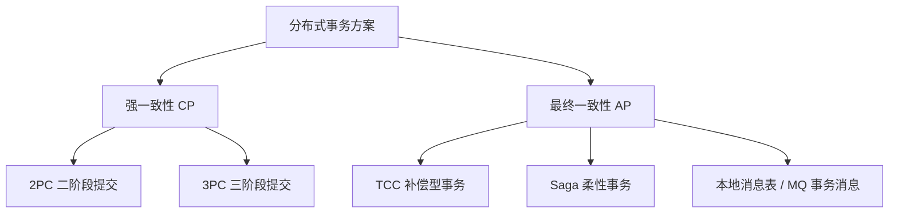
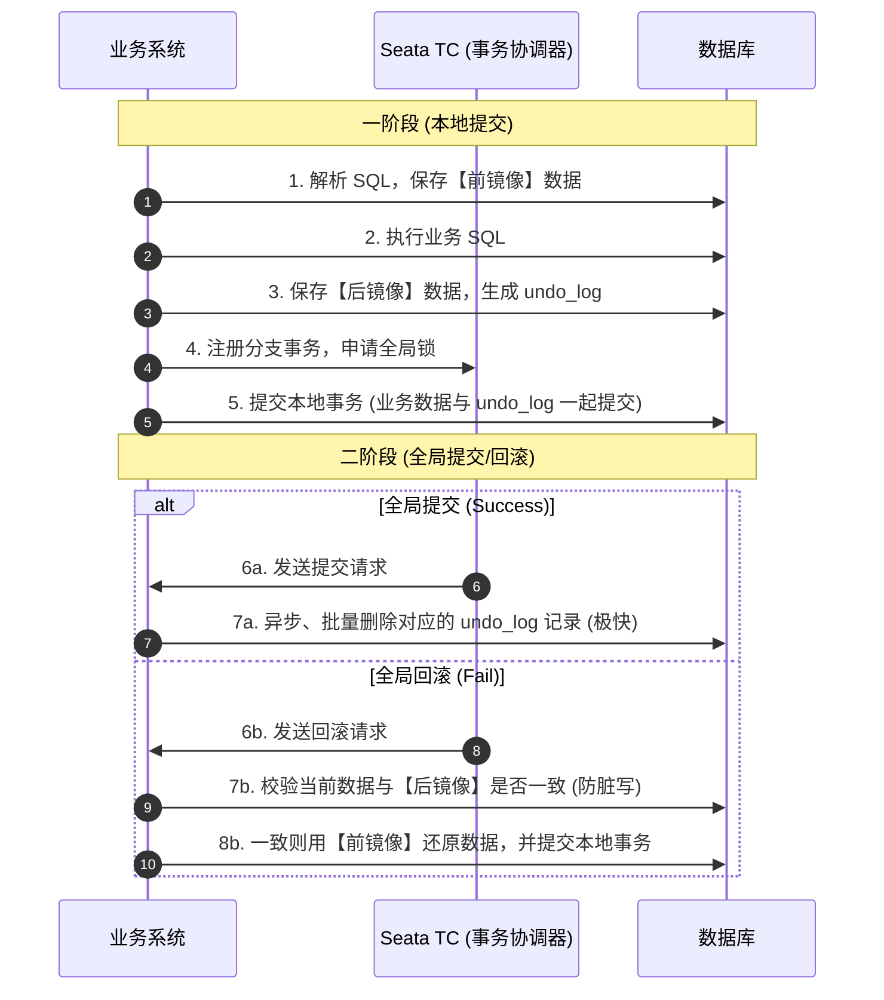

## 分布式事务原理与 Seata 实战

在微服务架构中，一个复杂的业务流程往往需要调用多个微服务，每个微服务都拥有自己独立的数据库。传统的本地事务（ACID）无法保证跨服务、跨数据库的数据一致性，必须引入**分布式事务**。

---

## 一、 分布式事务理论基石：CAP 与 BASE

在设计分布式事务方案之前，必须理解分布式系统的基本理论。

### 1. CAP 定理

CAP 定理指出，在一个分布式系统中，以下三个特性**无法同时满足**，最多只能同时满足两个：

- **Consistency（一致性）**：所有节点在同一时刻看到的数据完全一致。
- **Availability（可用性）**：系统提供的服务必须一直处于可用状态，每个请求都能收到非错响应（但不保证数据最新）。
- **Partition Tolerance（分区容错性）**：分布式系统在遇到任何网络分区故障时，仍然能够对外提供服务。

> **核心结论**：在分布式系统中，网络分区（P）是客观存在的，无法避免。因此，架构师只能在 **CP（强一致性）** 和 **AP（高可用性）** 之间进行权衡：

- **CP 架构**：为了保证强一致性，在网络分区发生时，必须拒绝部分请求或让其等待，牺牲可用性（如 ZooKeeper）。
- **AP 架构**：为了保证高可用，允许不同节点的数据在短时间内不一致，牺牲强一致性，追求**最终一致性**（如 Eureka、Nacos AP 模式、Seata AT 模式）。

### 2. BASE 理论

BASE 理论是对 CAP 中 AP 方案的延伸，是现代分布式系统设计的核心指导思想：

- **Basically Available（基本可用）**：分布式系统在出现故障时，允许损失部分可用性（如响应时间延长、非核心功能降级），但保证核心功能可用。
- **Soft State（软状态）**：允许系统中的数据存在中间状态（如“支付中”、“处理中”），并认为该中间状态不影响系统的整体可用性。
- **Eventually Consistent（最终一致性）**：系统中的所有数据副本，在经过一段时间的同步后，最终能够达到一致的状态，而不需要实时强一致。

---

## 二、 常见分布式事务解决方案

### 1. 2PC (Two-Phase Commit) 二阶段提交

- **角色**：协调者（Coordinator）和参与者（Participants）。
- **流程**：
  1. **准备阶段（Prepare Phase）**：协调者向所有参与者发送 `prepare` 请求，参与者执行本地事务但不提交，并锁定资源，向协调者反馈是否就绪。
  2. **提交阶段（Commit Phase）**：如果所有参与者都反馈就绪，协调者发送 `commit` 指令，参与者提交事务并释放锁；如果有任意一个参与者反馈失败或超时，协调者发送 `rollback` 指令，参与者回滚本地事务。
- **致命缺点**：
  - **同步阻塞**：所有参与者在等待协调者指令时都处于阻塞状态，占用数据库连接和锁资源，并发性能极差。
  - **单点故障**：如果协调者在第二阶段宕机，参与者将一直处于悬挂状态，无法释放资源。
  - **数据不一致**：如果在第二阶段，协调者发送的 `commit` 指令因为网络原因只被部分参与者收到，会导致部分提交、部分未提交的数据不一致问题。

---

### 2. TCC (Try-Confirm-Cancel) 补偿型事务

TCC 是一种应用层面的柔性事务方案，将业务逻辑拆分为三个方法：

- **Try（尝试）**：完成所有业务检查，**预留/冻结**业务资源。
- **Confirm（确认）**：真正执行业务，只使用 Try 阶段预留的资源。Confirm 阶段默认不会出错，如果出错需要重试。
- **Cancel（取消）**：释放 Try 阶段预留的资源。

**TCC 的三大核心痛点及解决方案**：

- **空回滚（Null-Cancel）**：
  - **场景**：Try 阶段因为网络超时未执行，但协调者已决定回滚，发送了 Cancel 请求。
  - **解决办法**：在分支事务记录表中增加状态字段。Cancel 执行时，先判断 Try 是否执行过，若未执行，则进行空回滚。
- **幂等性（Idempotence）**：
  - **场景**：由于网络抖动，Confirm 或 Cancel 请求被重复发送。
  - **解决办法**：通过全局唯一的事务 ID（XID）和分支 ID 进行幂等校验，确保多次执行结果一致。
- **悬挂（Hanging）**：
  - **场景**：Cancel 请求因为网络拥堵先于 Try 请求到达参与者。此时执行了空回滚，随后 Try 请求到达，导致预留的资源被永久悬挂。
  - **解决办法**：在执行 Try 时，先检查当前分支的 Cancel 是否已经执行过。如果 Cancel 已经执行过，则直接拒绝 Try 的执行。

---

## 三、 Seata 分布式事务框架

Seata（Simple Extensible Autonomous Transaction Architecture）是阿里开源的工业级分布式事务解决方案。它提供了 **AT**、**TCC**、**SAGA** 和 **XA** 四种事务模式。

### 1. Seata AT 模式（无侵入、最常用）

AT 模式是 Seata 的王牌模式，对业务代码**零侵入**。其底层基于**拦截 JDBC 驱动**，自动生成回滚日志（Undo Log）来实现。

**AT 模式的读写隔离机制**：

- **写隔离**：
  - 在一阶段本地事务提交前，Seata 会向 TC（Transaction Coordinator）申请**全局锁**。
  - 如果另一个非 Seata 管理的事务尝试修改同一行数据，由于无法获取全局锁，该修改会被阻塞或拒绝，从而在全局层面避免了脏写。
- **读隔离**：
  - 默认隔离级别是读未提交（Read Uncommitted）。
  - 如果需要达到读已提交（Read Committed），需要使用 `SELECT ... FOR UPDATE`，Seata 会拦截该语句并申请全局锁，确保读取到的是已提交的全局事务数据。

---

## 四、 Seata 生产实战与高频追问

### 1. Seata AT 模式的脏写与脏读问题及解决方案

- **脏写（Dirty Write）**：
  - **场景**：事务 A（Seata 管理）在一阶段修改了数据并提交，但尚未释放全局锁。此时，非 Seata 管理的本地事务 B 绕过 Seata 直接修改了同一行数据并提交。随后事务 A 发生异常需要回滚，回滚时 Seata 校验【后镜像】与当前数据库数据，发现不一致（已被 B 修改），导致**回滚失败**，必须人工介入。
  - **解决方案**：
    1. **全员接入 Seata**：所有对该表进行写操作的业务方法都必须加上 `@GlobalTransactional`，确保全部受全局锁控制。
    2. **引入 `@GlobalLock`**：对于不需要开启全局事务但会修改相关数据的本地方法，加上 `@GlobalLock` 注解。它不会开启全局事务，但在本地事务提交前会去申请全局锁，从而避免脏写。
- **脏读（Dirty Read）**：
  - **场景**：事务 A（Seata 管理）在一阶段修改了数据并提交了本地事务，但全局事务尚未提交。此时，事务 B（普通查询）读取了该行数据。如果事务 A 随后回滚，事务 B 读取到的就是脏数据。
  - **解决方案**：
    - 如果业务对读隔离有极高要求，查询语句必须使用 `SELECT ... FOR UPDATE`。Seata 会拦截该语句，在本地事务提交前去 TC 申请全局锁。如果全局锁被其他未提交的全局事务持有，则查询会被阻塞，直到锁释放，从而实现**读已提交（RC）**。

### 2. Seata 与本地事务 `@Transactional` 混用的坑

- **问题描述**：
  - 在 Spring 中，我们经常将 `@GlobalTransactional` 和 `@Transactional` 混用。
  - 如果 `@GlobalTransactional` 标注在最外层方法，而内层方法标注了 `@Transactional`，当内层本地事务提交后，一阶段数据已经落库并生成了 `undo_log`。
  - **严重 Bug 场景**：若内层方法由于 RPC 调用超时或本地逻辑异常抛出错误，按 Spring 规则，外层的本地域事务将触发回滚，但由于内层本地事务之前已经 `commit`（作为独立连接或者传播属性新建），本地物理回滚无法触达已提交的分支。
  - **规避秘籍**：
    1. 确保在 `@GlobalTransactional` 包裹的整个调用链内部，凡是本地数据库操作，都必须有 Spring `@Transactional` 护航。
    2. 设置正确的事务传播行为（默认 `REQUIRED`），使所有本地 `DataSource` 统一归入外层同一个本地数据库连接，跟 Seata 代理的 Connection 周期强绑定，达到本地回滚与全局感知的一致性。

---

## 五、 Saga 柔性事务模式及其隔离性保障

对于长周期运行（Long-Running Process）且可能接入外部未注册 Seata 代理第三方系统的分布式事务（如跨国航空订票、调用第三方支付网关），AT 与 TCC 因对锁和资源持有周期过长、不符合效率要求。为此，我们需要引入 **Saga 模型**。

### 1. Saga 的前向与后向恢复机制

Saga 将一个长事务拆分为多个**顺序关联的本地子事务**：  
$T_1, T_2, T_3, \dots, T_n$

针对每个子事务 $T_i$，都需要在业务层显式定义一个对应的**补偿事务 $C_i$**。Saga 的流转不要求全局锁，有以下两种恢复恢复策略：

- **正向恢复（Forward Recovery）**：如果子事务 $T_i$ 失败，则通过后台不断重试来促使其完成：  
  $T_1 \to T_2 \to T_3(\text{超时重试}) \to \dots \to T_n$，适用于业务上必须保证成功的场景（如给客户补偿代金券）。
- **反向/后向恢复（Backward Recovery）**：如果子事务 $T_i$ 失败，则按相反顺序串行执行已完成子事务的补偿段进行物理回退：  
  $T_1 \to T_2 \to T_3(\text{失败}) \to C_2 \to C_1$，使系统状态回滚到初始节点。

### 2. Saga 的核心痛点：缺乏隔离性（No Isolation）

Saga 模式由于在一阶段各本地事务执行完毕后**立即释放本地锁且不向 TC 申请全局锁**。因此，Saga 严格来说不满足 ACID 中的缩写 **I (Isolation，隔离性)**。这极易在并发读写下引发数据灾难：

- **脏写（Dirty Write，丢失更新）**：
  - **场景**：Saga 事务 A 修改了商品库存（$10 \to 9$），尚未提交全局事务。此时普通本地事务 B 也执行写操作（$9 \to 8$）并交付。最后 Saga A 整体失败引发回滚，执行补偿事务 $C_1$（将库存还原 $+1$ 到 10）。导致事务 B 的更新写入彻底丢失。
- **脏读（Dirty Read，不可重复读）**：
  - **场景**：Saga A 执行扣减，用户在中间状态看到了余额的暂时减少；随后 Saga A 崩溃回溯钱被退回，给用户产生了余额突变诡异感。

### 3. 学术界与工程界的隔离性自愈补救

虽然物理上不存在全局锁，但我们在应用层可以通过以下“软垫”机制进行隔离性重塑：

1. **特异性锁表设计（Semantic Lock / 语义锁）**：
   - 应用设计状态字段。例如账户表字段 `balance`，再设置 `lock_balance`。
   - 当 Saga A 进行扣款 Try 类似阶段时，并不直接物理扣除 `balance`，而是把款项转入 `lock_balance`（状态标记为 `PENDING`），使其他并发事务能够看到有一笔金额正在锁定，阻止其他并发进程对该锁定额的重复使用。
2. **悲观更新策略（Pessimistic View）**：
   - 保证补偿事务 $C_i$ 的设计具有 **交换律（Commutative）**。
   - 比如回滚时使用 `UPDATE account SET balance = balance + 100`（原子的增加），而不是通过前镜像硬性复原 `SET balance = 500`。这样即使在此期间有其他并发写改变了余额，原子的累加或累减更新也不会导致更新丢失。
3. **后置检查（Post-Check）**：
   - 在主流程执行到最后一步、或者需要真正划款落袋时，再次做一致性 Double-Check，若不符则退款报错进行人工审计。

---

### 3. 一阶段提交本地落库细节与 Spring `@Transactional` 的协作

在 Spring 框架应用中，我们经常将 `@GlobalTransactional` 和 `@Transactional` 结合使用。如果最外层方法被 `@GlobalTransactional` 标记，而其调用的子方法包含 `@Transactional` 事务，需要高度防范事务在底层两阶段时序下的运行缺陷：

- **问题描述**：内层子方法的物理本地事务提交早于 Seata 本身的分支锁定与二阶段决断。
  - **严重 Bug 场景**：若内层方法由于网络 RPC 瞬时断开、甚至本地其他无锁计算执行异常导致抛错，按 Spring 逻辑，外层的本地域事务被标记为 Rollback。但由于内层方法的本地事务在之前已经物理 `commit`（已经真实脱离 Spring 的 Session），本地机制完全无法将其撤销，造成脏数据落袋，除非 TC 强行干预。
  - **规避秘籍**：
    1. 确保在 `@GlobalTransactional` 包裹的整个调用链内部，凡是本地数据库操作，都必须有 Spring `@Transactional` 护航。
    2. 设置正确的事务传播行为（默认 `REQUIRED`），使所有本地 `DataSource` 统一归入外层同一个本地数据库连接，跟 Seata 代理的 Connection 周期强绑定，达到本地回滚与全局感知的一致性。
  - **最佳实践**：
    1. 尽量避免在同一个方法链中无节制地混用不同的非标事务代理。
    2. 确保外层 `@GlobalTransactional` 包裹的方法内部，所有本地事务的异常都能正确向上抛出，让 Seata 协调器（TC）能够精准感知分支事务的状态。

### 4. Seata TC（事务协调器）的高可用部署

在生产环境中，TC 是整个分布式事务的核心枢纽，必须保证其高可用：

- **注册中心与配置中心**：TC 支持接入 Nacos、Consul、Eureka 等注册中心，实现服务发现与动态扩容。
- **存储模式（Store Mode）**：
  - **file 模式**：单机运行，事务日志存在本地文件中，性能高但不具备高可用性。
  - **db 模式（推荐）**：多实例共享同一个数据库，事务日志存在数据库中，通过数据库保证一致性，支持水平扩展。
  - **redis 模式**：高并发场景下推荐。将事务日志存在 Redis 中，兼顾了高可用与极高的读写性能。

---
