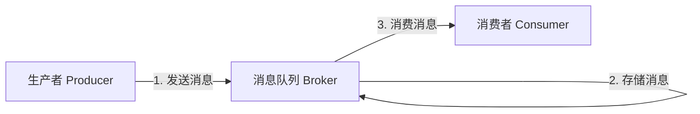
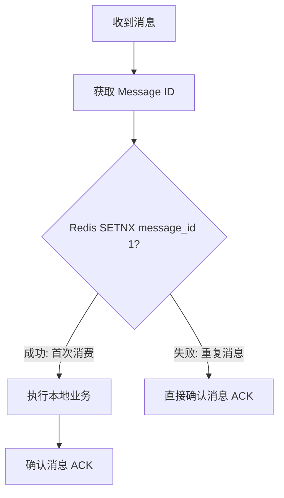
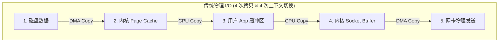

## 消息队列高可用与消息丢失解决方案

在分布式系统中，消息队列（Message Queue, MQ）承担着**异步解耦**、**削峰填谷**和**分布式事务最终一致性**的核心职责。在高级面试中，如何保证消息不丢失、如何处理重复消息（幂等性）以及 Kafka 为什么能实现超高吞吐量，是必考的硬核考点。

---

## 一、 消息队列如何保证消息不丢失？

消息从生产者发出，到消费者成功消费，会经历三个阶段。任何一个阶段出现故障，都可能导致消息丢失。我们以 **Kafka** 和 **RocketMQ** 为例进行系统化剖析：

### 1. 第一阶段：生产者发送阶段（Producer）

- **丢失原因**：消息在网络传输中丢失，或者 Broker 宕机导致写入失败，而生产者误以为发送成功。
- **解决方案**：
  - **使用带回调的发送方法**：不要使用单向（Oneway）发送，而是使用同步发送或带回调的异步发送，确保能收到 Broker 的确认响应（ACK）。
  - **配置重试机制**：开启生产者端的自动重试（如 Kafka 的 `retries` 参数）。
  - **配置合理的 ACK 级别（以 Kafka 为例）**：
    - `acks=0`：生产者发送消息后不等待任何确认，性能最高，最易丢消息。
    - `acks=1`（默认）：只需等待 Leader 副本写入成功即返回，如果 Follower 还没同步 Leader 就宕机，会丢消息。
    - `acks=-1`（或 `all`）：**最安全配置**。必须等待 ISR（In-Sync Replicas）中所有的副本都写入成功，才算发送成功。配合 `min.insync.replicas > 1`，可确保绝对不丢消息。

---

### 2. 第二阶段：Broker 存储阶段

- **丢失原因**：消息写入 Broker 的 Page Cache（页缓存）后，还没来得及刷入磁盘，Broker 突然断电宕机。
- **解决方案**：
  - **开启同步刷盘**：将刷盘策略改为同步刷盘（如 RocketMQ 的 `SYNC_FLUSH`）。但这会极大地降低写入吞吐量。
  - **多副本冗余（推荐）**：采用主从架构或多副本机制。生产者发送消息时，要求至少写入两个以上的物理节点才算成功（如 RocketMQ 的同步双写 `SYNC_MASTER`，或 Kafka 的多副本同步）。
  - 在 Kafka 中，确保 `unclean.leader.election.enable=false`（禁止非 ISR 中的落后 Follower 选举为 Leader，防止数据倒退）。

---

### 3. 第三阶段：消费者消费阶段（Consumer）

- **丢失原因**：消费者收到消息后，**自动提交了 Offset（消费位移）**，但随后在执行本地业务逻辑时抛出异常或宕机。此时 Broker 认为该消息已被成功消费，导致消息丢失。
- **解决方案**：
  - **关闭自动提交，改为手动提交**：在本地业务逻辑完全执行成功后，再显式调用 API 提交 Offset（如 Kafka 的 `commitSync()` 或 `commitAsync()`）。
  - **代价**：如果业务执行成功但提交 Offset 时网络卡顿，可能会导致消息被重复消费。因此，**消费者端必须做幂等性设计**。

---

## 二、 消费者如何保证消息消费的幂等性？

**幂等性**：多次执行同一个操作，其结果与执行一次完全相同。

分布式网络中，**“至少一次（At-Least-Once）”** 投递是绝大多数 MQ 的默认保证。当网络出现抖动，确认信号（ACK）未能及时送达生产者或 Broker 时，就会触发重试，从而产生重复消息。

### 1. 幂等性的核心思想

- 必须为每条消息生成一个**全局唯一的 Message ID**（如订单号、雪花 ID）。
- 消费者在处理消息前，先根据 Message ID 判断该消息是否已经被消费过。

### 2. 工业级幂等性解决方案

**方案一：利用数据库唯一索引（Unique Index）**：

- **适用场景**：插入数据的操作（如创建订单、新增用户）。
- **原理**：在数据库中为业务唯一标识（如 `order_no`）建立唯一索引。当重复消息到来时，再次插入会抛出 `DuplicateKeyException`，消费者捕获该异常并直接确认消息即可，不会产生脏数据。

**方案二：利用 Redis / 数据库去重表（分布式锁）**：

- **适用场景**：更新操作或复杂的混合业务。
- **流程**：
  1. 消费者收到消息后，先尝试将 Message ID 写入 Redis（使用 `SETNX`，并设置合理的过期时间）。
  2. 如果写入成功（返回 1），说明是首次消费，继续执行本地业务逻辑。
  3. 如果返回失败（0），说明该消息已被处理过，直接丢弃并确认消息。

---

## 三、 高并发下如何实现消息顺序消费？

在许多业务场景下，消息的执行顺序至关重要（例如：订单创建 $\to$ 支付 $\to$ 发货 $\to$ 订单完结）。若重试机制导致发货消息比创建消息先到达消费者，将直接导致业务流转错乱。

### 1. 生产者端：分区锁死（Partition/Queue Pinning）

- **原理**：要想保证顺序，首先要保证相同业务 ID 的消息被**发送到同一个分区/队列中**。
  - **以 RocketMQ 为例**：在发送时传入 `MessageQueueSelector`，根据业务主键（例如订单号）进行 Hash 路由，锁定并写入特定的队列。
  - **以 Kafka 为例**：发送物理数据时显式指定 `key`（如 `order_id`），Kafka 会自动根据 key 算出的 Hash值路由分配到同一个 Partition 中。

### 2. 服务端：分区顺序保障

- 服务端（Broker）内部对于同一个 Partition 来说，本身就是通过连续追加（Append-Only）日志实现的，这在物理上保证了分区内消息的**先进先出 (FIFO)**。

### 3. 消费者端：单线程重放

- **RocketMQ 的顺序消费**：
  - 消费者端必须使用 `MessageListenerOrderly` 监听器替换普通并发监听器。
  - **多层锁定机制**：
    1. **Broker 队列锁定**：Consumer 的负载均衡线程会在本地请求向远程 Broker 获取排他锁（Lock），确保当前 Queue 在集群中只被这一个 Consumer 节点持有。
    2. **本地线程锁定**：在本地消费时，消费线程池分配到该队列后，会使用 Java 本地排他锁（`synchronized`）双重锁定该 Queue 的本地实体，确保**同一时刻只有一个工作线程可以处理该队列里的高吞吐消息**，从而彻底避免了多线程并发导致的先后顺序颠倒。
- **Kafka 的顺序消费**：
  - Kafka 的 Partition 默认只能分配给同一个 Consumer Group 里的某个固定 Consumer 节点进行单线程拉取。
  - 如果在 Consumer 节点内部，为了提升吞吐量开启了多线程并发处理，则**必须在应用层根据消息 Key 重新做一致性 Hash 路由**，分派给本地特定线程去按序处理，严禁无序多线程粗暴抢占。

---

## 四、 深入内核：零拷贝（Zero-Copy）技术

Kafka 与 RocketMQ 是公认的吞吐量之王，其底层读写吞吐的核心利器之一，正是对操作系统的**零拷贝（Zero-Copy）**的极致压榨。

### 1. 传统 I/O 传输的四次拷贝与四次切换

当我们需要向外（如网卡）发送一个大文件数据时，传统的流程如下：

在此期间，系统发生了：
- **4 次上下文切换**：用户态 $\to$ 内核态 $\to$ 用户态 $\to$ 内核态 $\to$ 用户态。
- **4 次数据拷贝**：其中 2 次是无脑消耗 CPU 的内存值拷贝，在大并发下对内存带宽和 CPU 产生极大挤压。

### 2. 零拷贝方案一：Mmap（内存映射）

Mmap 将磁盘文件直接映射到操作系统的内核虚拟地址空间。

- **过程**：映射建立后，用户应用缓冲区与内核缓冲区实现“虚拟同步共享”。当执行写操作时，数据直接从内核 Page Cache 拷贝到 Socket Buffer：  
  `磁盘 --> Page Cache (Mmap 共享) --> Socket Buffer --> 网卡`
- **提效**：发生了 **3 次拷贝**（减少为 1 次 CPU 拷贝，2 次 DMA 拷贝）和 **4 次上下文切换**。
- **物理缺陷**：映射建立有最高容量限制（通常单映射单文件不超过 $1.5 \sim 2\text{GB}$）。**RocketMQ 其 CommitLog 默认设计为 1GB**，正是为了契合 `mmap` 的映射极限。

### 3. 零拷贝方案二：Sendfile（极速零拷贝）

对于无需在 JVM/程序内部对报文数据进行任何逻辑修改、只管搬运文件的场景（如 Kafka 发送日志分片），操作系统提供了 `sendfile` 系统调用。

- **过程**：直接在内核态完成数据在物理 Page Cache 与网卡设备之间的流转：  
  `磁盘 --> Page Cache --> 网卡`
- **提效**：发生了 **2 次拷贝**（完全消除 CPU 拷贝，全由物理 DMA 搬运）和 **2 次上下文切换**（由于在内核一次性流转，用户态不需要打断切换）。
- **效果**：这也是 Kafka 达成超写并发和近物理极限网卡带宽吞吐的技术底气。

---
