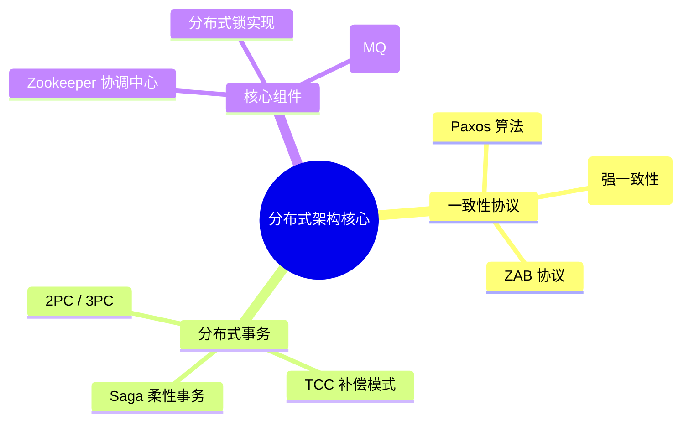

## 分布式系统架构图谱

在海量请求下，如何保障数据的一致性、可用性与分区容错性？本专题涵盖分布式协议、事务、锁及消息队列的核心理论与实践。

---

## 🗺️ 分布式进阶技术栈

---

## 🚀 第一阶段：一致性理论基础 (Consensus)

- [共识算法：从 Paxos 到 Raft](consensus.md)：深入解析分布式系统如何达成共识。

---

## 🏗️ 第二阶段：分布式事务与锁 (Consistency)

- [分布式事务全解方案](transactions.md)：对比 2PC 与 TCC，解决 CAP 权衡痛点。
- [基于 ZooKeeper 的分布式锁](lock-zookeeper.md)：从临时顺序节点到监听机制。

---

## ⚡ 第三阶段：核心中间件 (Middleware)

- [消息队列原理与实践](message-queue.md)：解耦合、异步化与削峰填谷。
