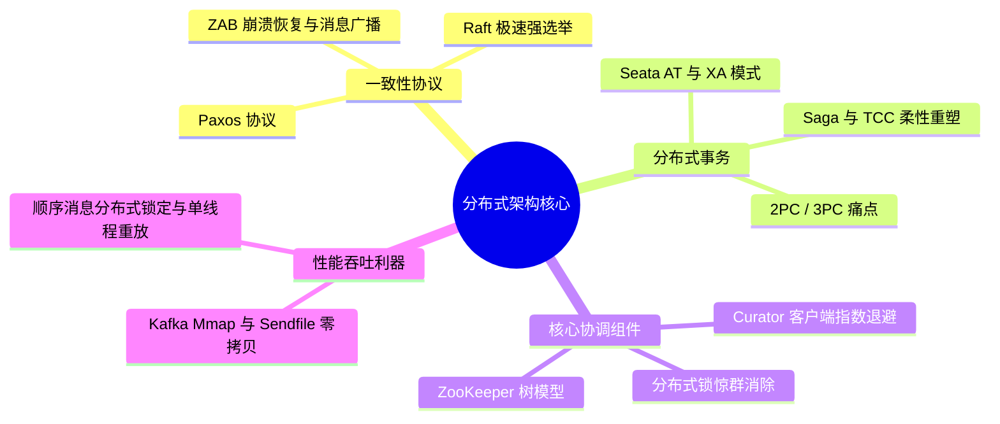

## 分布式系统架构图谱

在海量请求下，如何保障数据的一致性、可用性与分区容错性？本专题涵盖分布式协议、事务、锁及消息队列的核心理论与实践。

---

## 🗺️ 分布式进阶技术栈

---

## 🚀 第一阶段：一致性理论基础 (Consensus)

- [共识算法：从 Paxos 到 ZAB](consensus.md)：深入解析 Paxos 二阶段过程、Raft 的 Safety 机制以及 ZooKeeper 的 ZAB 原子组播内幕。

---

## 🏗️ 第二阶段：分布式事务与锁 (Consistency)

- [分布式事务全解方案](transactions.md)：剖析 2PC 顽疾、TCC 三重异常（空回滚/幂等/悬挂）对抗，以及 Saga 架构隔离性自愈修复。
- [基于 ZooKeeper 的分布式锁](lock-zookeeper.md)：探索临时顺序节点极致防惊群监听，以及 Curator 可重入 `InterProcessMutex` 的 Thread 映射实现。

---

## ⚡ 第三阶段：核心中间件机制 (Middleware)

- [高并发零拷贝与顺序消费](message-queue.md)：“端到端”防消息丢失保障方案、高吞吐零拷贝（Mmap vs Sendfile）以及顺序消费的多级分布式锁定实现。
