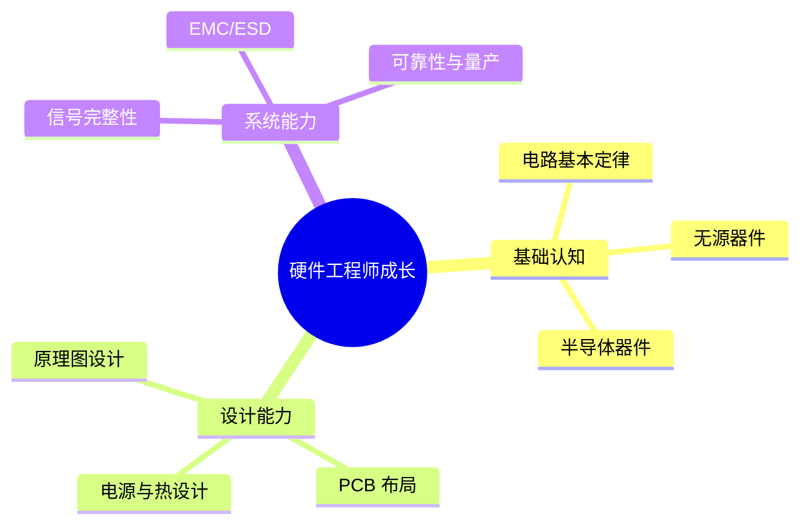

## 硬件工程师成长路线

从小白到高级硬件工程师，成长的关键不只是“会画原理图”，而是能把器件选型、模拟/数字设计、电源、热设计、PCB 布局、EMC/ESD、可靠性和量产制造串成一套完整工程能力。

### 学习目标

- **第一阶段**：建立电路基本认知，掌握电压、电流、阻抗、放大、开关等核心概念。
- **第二阶段**：掌握常用器件和典型电路，理解运放、ADC/DAC、开关电源、MCU 外设等设计思路。
- **第三阶段**：进入系统级工程能力，完成 PCB 设计、信号完整性、EMC/ESD、可靠性与量产规范。

---

## 推荐学习顺序

1. **先建立“看图”能力**：理解电压、电流、串并联、RC 网络、二极管与三极管。
2. **再建立“做图”能力**：掌握常见电源、放大、接口、MCU、通信线路的典型连接方式。
3. **最后提升“落地”能力**：从原理图到 PCB、从样板到量产，理解工程化和可靠性要求。

---

## 章节导航

- [01 电路基础入门](basic/01-electronics-foundations.md)
- [02 无源器件与数字基础](basic/02-passive-components-and-digital-foundations.md)
- [03 半导体器件与电源设计](advanced/03-semiconductor-and-power-design.md)
- [04 模拟信号链与 ADC/DAC](advanced/04-analog-signal-chain-and-adc-dac.md)
- [05 原理图与 PCB 布局](advanced/05-schematic-and-pcb-layout.md)
- [06 EMC/ESD/可靠性与量产](advanced/06-emc-esd-reliability-and-production.md)
