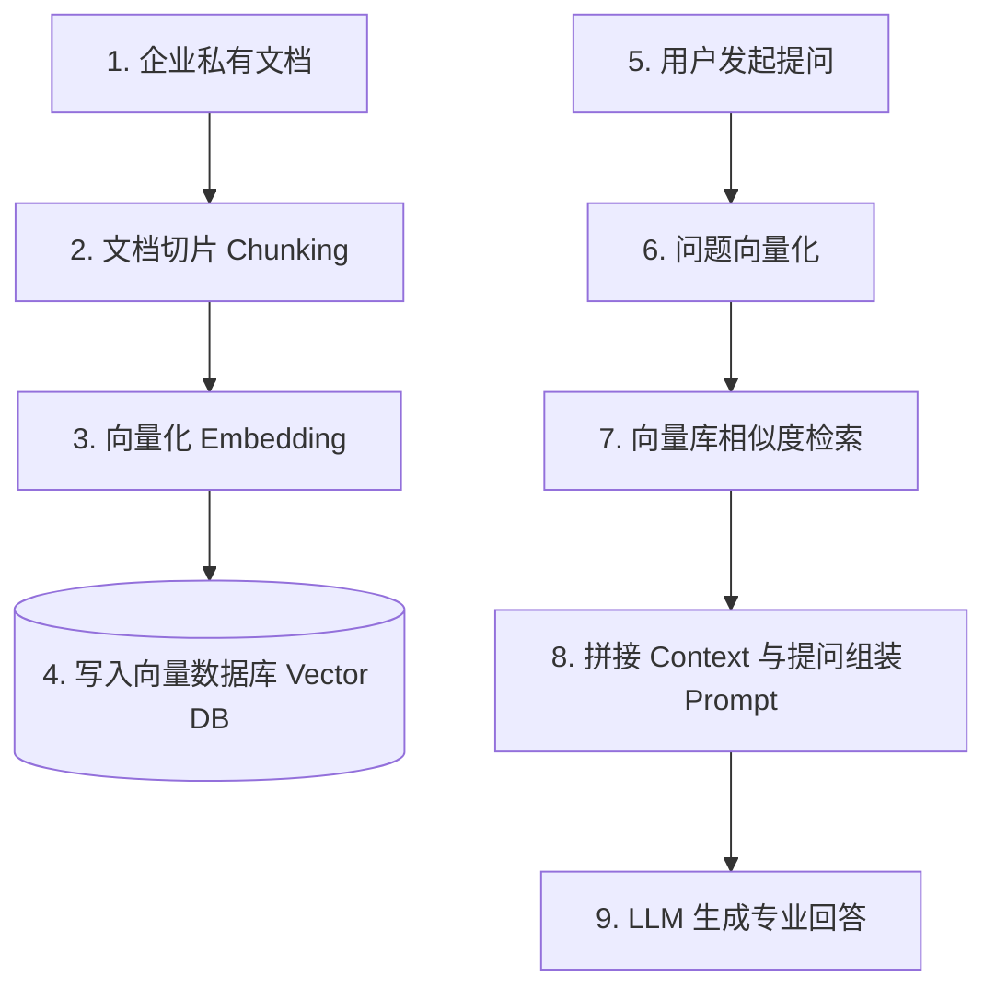

# 十、2026 AI 结合与工程实践

本章涵盖 AI 辅助研发效能提升、大模型 API 在 Java 生态下的工程化集成与高性能流式响应，以及 RAG（检索增强生成）在 Java 应用中的落地。

---

## 68. AI 编码工具与生成代码质量把控

随着大模型的发展，AI 辅助编码已成为后端工程师的标配技能。

### AI 辅助开发流最佳实践

- **辅助场景**：编写单元测试用例（尤其是各种复杂的 Mock 场景）、生成重复性的样板代码（如 DTO 与 Entity 的转换）、以及重构低效的传统算法。

### 如何验证 AI 生成代码的正确性

AI 生成的代码可能存在幻觉（Hallucination）或隐藏的安全隐患（如边界值处理不当、并发控制不当、内存溢出风险）。

1. **严格的单元测试覆盖（Unit Test Coverage）**：
   - 使用 AI 生成代码后，要求同时生成对应的单元测试。
   - 必须特别设计**边界值测试**（如空指针、空集合、数值溢出）、异常输入测试以及并发压测。确保单测分支覆盖率（Branch Coverage）达到 85% 以上。
2. **人工多重 Review 与安全规约**：
   - 关注 AI 是否使用了已被废弃的 API，或者引入了不安全的第三方库。
   - 仔细审查涉及并发操作（如使用非线程安全的 `HashMap` 导致死循环风险）和数据库事务（如声明式事务失效场景）的代码块。

---

## 69. Java 系统接入大模型工程实践

将大语言模型（LLM）API 集成到传统的 Java 后端系统时，面临流式响应、高时延兜底及成本控制等多重工程挑战。

### 基于 WebFlux 实现 SSE 流式响应

由于大模型生成文本是逐字输出的（流式输出），传统的阻塞式同步 HTTP 响应会导致客户端长时间处于等待挂起状态，用户体验极差。

在 Java 中，推荐基于 **WebFlux** 与 **Server-Sent Events (SSE)** 实现流式响应：

```java
import org.springframework.http.MediaType;
import org.springframework.web.bind.annotation.GetMapping;
import org.springframework.web.bind.annotation.RestController;
import reactor.core.publisher.Flux;

@RestController
public class LlmController {

    @GetMapping(value = "/chat/stream", produces = MediaType.TEXT_EVENT_STREAM_VALUE)
    public Flux<String> chatStream(String prompt) {
        // 调用 Spring AI 或大模型标准客户端，返回响应式流 Flux
        return openAiClient.chatFlux(prompt);
    }
}
```

- **优势**：底层的 Netty 采用非阻塞 I/O，能抗住极高并发的流式长连接，且允许客户端实时渲染输出，极大提升了用户体验。

### 超时熔断与降级策略

大模型接口的响应时延（TTFT，首字时间）通常在数百毫秒到数秒之间。

- **降级机制**：使用 Sentinel 等工具对大模型 API 进行超时保护（如设置首字超时为 3 秒）。
- **兜底**：一旦触发超时或接口限流（Rate Limit），触发降级逻辑，向用户返回预先生成的本地缓存数据、或提示系统繁忙并提供异步通知入口。

### Token 成本控制与缓存设计

大模型的 Token 费用是企业的重要开销。
- **语义缓存（Semantic Cache）**：
  - 在接收到用户的 Prompt 时，不直接发起大模型调用。
  - 先将用户的 Prompt 通过 Embedding 转换为向量，到向量数据库（如 Milvus）中进行相似度检索。
  - 若能匹配到历史相似度极高（如相似分度大于 0.95）的提问，直接将数据库中缓存的答案返回，从而减少了大量的重复 Token 消耗与网络耗时。

---

## 70. RAG 基础与 Java 生态集成落地

RAG（Retrieval-Augmented Generation，检索增强生成）是通过结合私有知识库检索，解决大模型知识陈旧与幻觉问题的主流方案。

### RAG 核心处理流



### Spring AI 与 LangChain4j 的集成选型

- **Spring AI**：
  - **特点**：Spring 官方原生支持的 AI 框架，深度契合 Spring Boot 开发体验，配置简单。
  - **支持**：提供了对主流大模型（OpenAI、Ollama等）以及常见向量数据库（Milvus、Chroma、Pgvector）的自动配置，非常适合纯 Spring Boot 后端项目快速接入。
- **LangChain4j**：
  - **特点**：专为 Java 平台打造的高性能大模型工具库（受 Python LangChain 启发）。
  - **优势**：
    - 提供了极其灵活的声明式智能体（Agent）编写方式。
    - 内置了丰富的文档加载解析器（Document Loaders，支持 Word、PDF、Text）、强大的切片工具（Chunking Splitters）。
    - 拥有更成熟的工具调用（Tool Use / Function Calling）和记忆体（Memory）管理机制，是目前 Java 构建复杂 AI 应用（Agent）的首选库。
