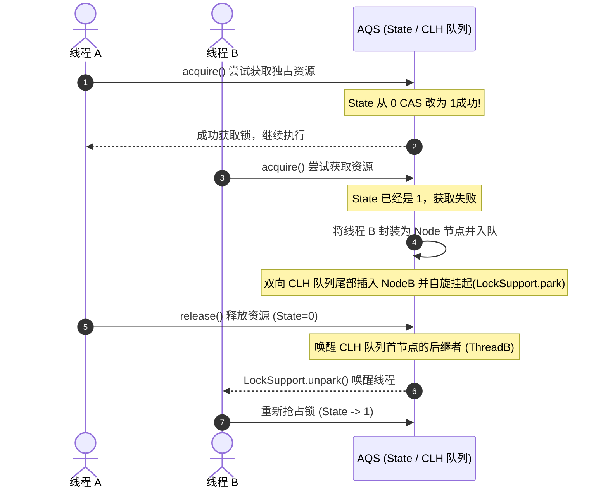
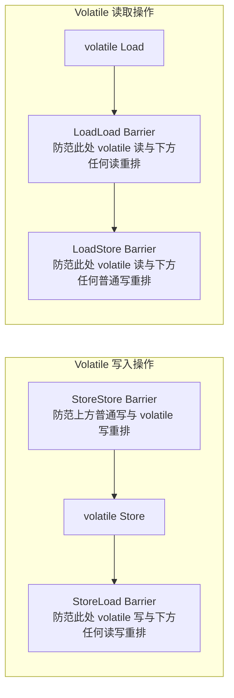
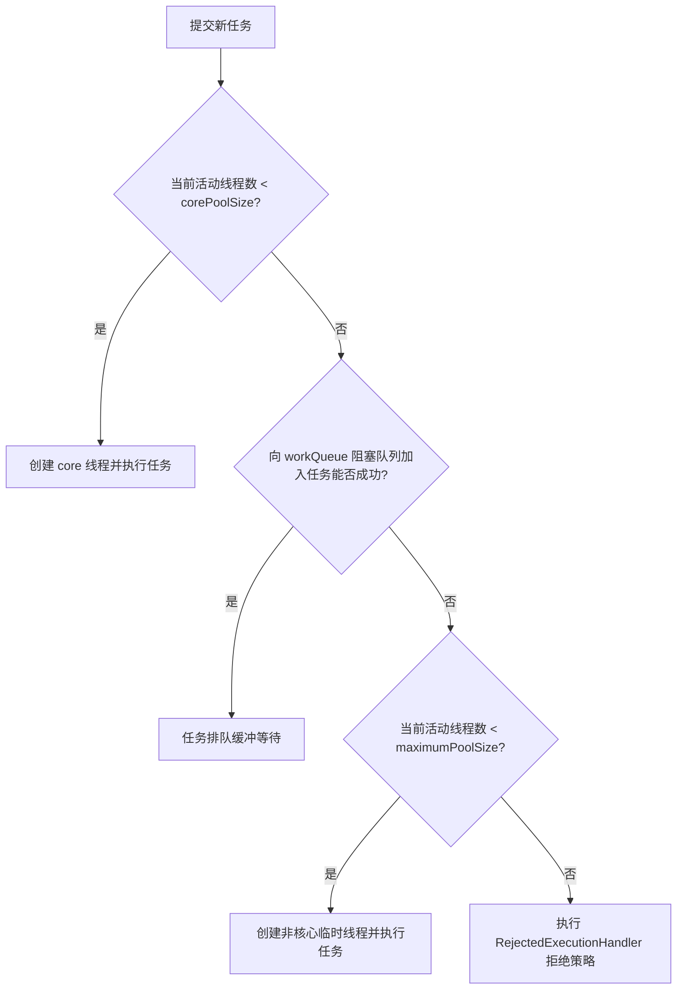

## JUC 并发编程核心面试真题

本专栏致力于为中高级 Java 开发人员提供最硬核、直击底层原理、结合生产实战的 JUC 并发编程与多线程面试真题剖析。每个知识点都配有详尽的答案、核心源码流程、以及辅助理解的 Mermaid 架构图或底层内存屏障模型。

---

## 模块二：高并发与多线程（JUC）

### Q1：深入剖析 AQS（AbstractQueuedSynchronizer）的底层多线程同步工作模型？

`AbstractQueuedSynchronizer` 是 JUC 并发包的核心基石，驱动了 `ReentrantLock`、`Semaphore`、`CountDownLatch` 等诸多高级同步锁。

#### 1. 核心三大要素

- **`state` 状态标记**：

  AQS 内部物理维护了一个 `volatile int state` 变量，用来表示同步状态。通过配合 `compareAndSetState`（基于 CPU 的 CAS 指令）来实现无锁状态转换。

  - 在 `ReentrantLock` 中，`state = 0` 代表空闲，`state > 0`（支持重入）代表被持有。

- **CLH 双向 FIFO 阻塞等待队列**：

  基于自旋和双向链表构建的虚拟队列。未抢占到同步状态的线程，会被包装成一个 `Node` （包含等待状态 `waitStatus`、前驱 `prev`、后继 `next`、关联的线程引用 `thread`），并利用 CAS 安全地追加到队尾。

- **线程挂起与唤醒机制**：

  依靠 `LockSupport.park(this)` 将抢锁失败的线程安全挂起，不占用 CPU 资源。释放资源时，持有锁的线程调用 `LockSupport.unpark(s.thread)` 唤醒队列中第一个合法唤醒点（如 `nextNode`，非 `CANCELLED` 的节点）。

#### 2. 公平锁与非公平锁的 AQS 实现差异（以 ReentrantLock 为例）

- **非公平锁（NonfairSync）**：

  在调用 `lock()` 抢占锁的瞬间，当前线程会**无视队列排队**，直接进行一次 `compareAndSetState(0, 1)`。如果物理锁恰好刚刚释放、或者 state 清零，非公平线程会强行插队获得锁。

- **公平锁（FairSync）**：

  在尝试获取锁（`tryAcquire`）时，会强制调用 `hasQueuedPredecessors()` 判断 AQS 等待队列中是否有前驱节点在排队。如果有比自己更早到达的线程挂在队列中，则必须老实入队挂起，严禁插队行为。

---

### Q2：高并发中 `volatile` 关键字如何保证可见性与防范重排序？底层屏障是什么？

`volatile` 是 JVM 提供的一种轻量级多线程自同步机制，提供了两个根本性保证：**保证共享变量的可见性** 与 **禁止指令重排序（有序性）**，但**不保证原子性**（如 `i++`）。

#### 1. 保证可见性的硬件与 CPU 底层：MESI 缓存一致性协议

- JVM 会在该字段的汇编指令前添加一个 **`lock` 前缀指令**。

- `lock` 前缀指令会发出信号，使该处理器核心上对应的 Cache Line（缓存行）立即写回系统内存。

- 借助 CPU 的 **MESI 缓存一致性协议** 与 **总线嗅探技术（Bus Snooping）**，其他核心检测到该内存地址的值已改变，会将其本地 Cache 中的相应缓存行直接置为**失效（Invalid）**状态，当其他核心再次读取该变量时，被迫从主内存中重新加载。

#### 2. 禁止指令重排序：JMM 内存屏障（Memory Barrier）

编译器和 CPU 为了榨干执行效能，在不破坏单线程语义（As-if-serial）的前提下，会对指令进行优化排序。为了控制这种行为，Java 内存模型（JMM）在 `volatile` 读写操作前后插入了 $4$ 种内存屏障：

- **`StoreStore` 屏障**：在每个 `volatile` 写操作之前插入。确保在 `volatile` 写之前，其前面所有的普通写操作均已向主内存写入。

- **`StoreLoad` 屏障**（开销最大）：在每个 `volatile` 写操作之后、以及后续任何读写操作之前插入。确保 `volatile` 写对其他处理器可见后，才能执行后续操作。

- **`LoadLoad` 屏障**：在每个 `volatile` 读操作之后、后续任何读操作之前插入。确保先前读取的数据被后续指令消费之前，重新加载了最新数据。

- **`LoadStore` 屏障**：在每个 `volatile` 读操作之后、后续任何普通写操作之前插入。确保读操作在写执行前完成。

---

### Q3：`ThreadPoolExecutor` 的核心参数如何协同？线上遇到了 OOM 问题如何排查并优雅监控调优？

#### 1. 核心参数协同与工作流

`ThreadPoolExecutor` 的工作流包含 $3$ 大物理区域（核心线程、阻塞队列、非核心线程）。

- **三大缓冲拒绝机制**：

  若队列满了，且活动线程数达到 `maximumPoolSize`，会触发拒绝策略（默认 `AbortPolicy` 抛出异常；或者是 `CallerRunsPolicy` 哪个线程提交的哪个线程执行，降低产生 OOM 的缓冲压力）。

#### 2. 为什么生产环境推荐“禁止使用 `Executors` 快速创建线程池”？

- **`Executors.newFixedThreadPool()` & `newSingleThreadExecutor()`**：

  底层采用 `LinkedBlockingQueue`，其默认容量为 `Integer.MAX_VALUE`。如果生产环境遭遇突发并发，线程池核心线程全部被占用，海量任务将堆积入无界队列。这直接导致其占满老年代 JVM 内存，最终抛出 **`java.lang.OutOfMemoryError: Java heap space`**。

- **`Executors.newCachedThreadPool()`**：

  创建的线程最大值限制为 `Integer.MAX_VALUE`。这意味着在极端多任务下，为了不被队列阻塞，它会疯狂创建新线程。由于每一线程默认分配 1MB 栈内存，也会导致 **`java.lang.OutOfMemoryError: unable to create new native thread`** 崩溃。

#### 3. 动态配置、监控与调优

为了防止线程池参数硬编码无法自适应线上波动，我们可以结合配置中心（如 Nacos、Apollo）设计**动态化配置线程池**，并暴露接口提供监控：

- **动态修改方法**：`ThreadPoolExecutor` 暴露了 `setCorePoolSize`、`setMaximumPoolSize`、`setKeepAliveTime` 等运行时热变更方法。在检测到流量激增时，可直接调整分配。

- **全方位指标监控**：

  我们可以设计个后台定时轮询（或集成 Prometheus），拉取各项运行指标：

  - `getActiveCount()`：当前正在执行任务的线程数。
  - `getQueue().size()`：当前阻塞队列中堆积的任务数（极高时发出报警！）。
  - `getCompletedTaskCount()`：自初始化以来累计完成的任务数。

- **合理的参数估算公式**：

  - **CPU 密集型（计算、编解码、加解密等）**：

    频繁进行寄存器运算。
    `N_threads = N_CPU + 1`
    额外多出的 1 个线程是为了在发生偶然的 page fault 导致某个线程被操作系统挂起时，替补上去不浪费 CPU 限度。

  - **I/O 密集型（RPC 交互、MySQL 慢查询、文件读写等）**：

    由于大部分时间 CPU 处于等待 I/O 完成的空闲状态，线程数应设置得多一些。
    `N_threads = N_CPU * (1 + Wait_Time / Service_Time)`
    在标准互联网微服务中，推荐从 `2 * N_CPU` 开始试运行，并通过压测不断调优核心比。
