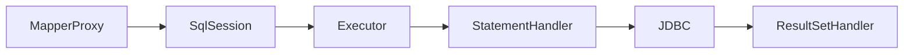

## MyBatis 与 HikariCP 核心面试真题

本专栏面向中高级 Java 工程师，覆盖 MyBatis 执行链路、缓存、插件与 HikariCP 连接池等高频考点。建议先阅读 [执行流程](../../java/persistence/1-mybatis-core-flow.md)、[插件与缓存](../../java/persistence/2-mybatis-cache-plugin.md)、[HikariCP 原理](../../java/persistence/0-mybatis-hikaricp.md)。

---

## 模块：持久层内核

### Q1：MyBatis 从调用 Mapper 方法到执行 SQL 的完整链路是什么？

**答：**

1. `MapperProxy.invoke` 拦截接口调用。
2. 解析为 `MapperMethod`，`statementId = 接口全限定名.方法名`。
3. `SqlSession` 委托 `Executor.query/update`。
4. `CachingExecutor`（若开启二级缓存）→ 真正的 `Simple/Reuse/BatchExecutor`。
5. 创建 `StatementHandler`，`ParameterHandler` 绑定参数，`PreparedStatement` 执行。
6. `ResultSetHandler` 将 `ResultSet` 映射为 Java 对象，回填一级缓存。

---

### Q2：`#{}` 与 `${}` 的本质区别？什么场景才能用 `${}`？

**答：**

| | `#{}` | `${}` |
| :--- | :--- | :--- |
| 机制 | 预编译占位 `?` + `TypeHandler` | 字符串直接替换进 SQL |
| SQL 注入 | 安全 | **高风险** |
| 适用 | 值参数 | 动态表名/列名/order by 字段 |

`${}` 仅能用于**服务端白名单校验后**的标识符拼接；任何用户输入禁止直接 `${}`。

---

### Q3：一级缓存与二级缓存的区别？为何分布式环境不推荐本地二级缓存？

**答：**

| 维度 | 一级缓存 | 二级缓存 |
| :--- | :--- | :--- |
| 作用域 | `SqlSession` | `Namespace`（Mapper） |
| 生命周期 | Session 关闭即灭 | 进程内跨 Session |
| 写入可见性 | 查询即写入 | 事务 `commit` 后才刷新到共享 Cache |
| 失效 | 任意写操作清空 Session 缓存 | 写语句 `flushCache`、显式 clear |

多实例部署时，各 JVM 二级缓存互不同步，A 节点更新 DB 后 B 节点仍可能读旧缓存 → **脏数据**。生产应改用 Redis / Spring Cache，并设计明确失效策略。

---

### Q4：MyBatis 插件能拦截哪些对象？分页插件一般拦哪里？

**答：**

只能拦四个接口：`Executor`、`StatementHandler`、`ParameterHandler`、`ResultSetHandler`。

分页插件（如 PageHelper）通常拦截 **`Executor.query`** 或 **`StatementHandler.prepare`**：

1. 改写 SQL，追加 `LIMIT/OFFSET`（或方言对应语法）。
2. 可选先发 `COUNT` 查询总行数。
3. 通过 `Plugin.wrap` 形成责任链，注册顺序影响外层/内层。

---

### Q5：什么是 N+1 查询？如何在 MyBatis 中避免？

**答：**

`<collection select="...">` / `<association select="...">` 嵌套查询时，查 1 次主表后再对每行发 1 次子查询，共 N+1 次。

**规避：**

- 使用 `JOIN` + 嵌套 `resultMap` 一次映射。
- 或业务层分两次查询后在内存组装（控制好数据量）。
- 禁止在大列表场景用嵌套 Select。

---

### Q6：HikariCP 为什么快？核心设计点有哪些？

**答：**

1. **无锁/低锁设计**：连接池状态用并发原语精心设计，减少同步开销。
2. **`ConcurrentBag` / 队列模型**：借还连接路径短。
3. **字节码生成**：代理 Connection 时减少反射开销。
4. **精简功能**：只做连接池该做的事，避免历史包袱。
5. **连接保活与泄漏检测**：`maxLifetime`、`leakDetectionThreshold` 等生产参数完善。

常考参数：`maximumPoolSize`、`minimumIdle`、`connectionTimeout`、`idleTimeout`、`maxLifetime`。

---

### Q7：Spring 集成 MyBatis 后，`SqlSession` 线程安全问题如何解决？

**答：**

原生 `SqlSession` **非线程安全**。Spring 使用 `SqlSessionTemplate` 作为线程安全门面：每次调用通过 `SqlSessionUtils` 从当前事务获取（或创建）Session，方法结束解绑。事务由 `PlatformTransactionManager` 统一提交/回滚，从而与 `@Transactional` 协同。

---

### Q8：动态 SQL 多参数时为什么必须 `@Param`？

**答：**

单参数时 MyBatis 可直接用参数对象属性或默认名；多参数且未使用 `@Param` 时，参数被封装为 `param1/param2` 或 `arg0/arg1`，XML 里写 `name` 会 `BindingException`。`@Param("name")` 把参数放入上下文 Map，OGNL 才能按名取值。

---

### Q9：Executor 的 Simple / Reuse / Batch 有何差异？

**答：**

- **Simple**：每次创建新 `Statement`，默认通用。
- **Reuse**：同一 Session 内按 SQL 缓存复用 `Statement`。
- **Batch**：`addBatch` 批量写，需 `flushStatements`；与返回自增主键、缓存行为需特别注意。

批量插入场景选 Batch + 合理 batch size，避免超大事务。

---

### Q10：线上慢 SQL / 连接池打满，如何用 MyBatis 侧手段排查？

**答：**

1. 插件拦截 `StatementHandler` 统计执行耗时，打慢 SQL 日志（脱敏）。
2. 检查是否逻辑分页、N+1、`SELECT *` 大字段。
3. 核对 HikariCP：活跃连接、等待线程、`leakDetectionThreshold` 是否报泄漏。
4. 结合 [Arthas / JVM 工具](../../java/jvm/3-tuning-tools.md) 看线程是否堵在 `getConnection`。
5. 索引与执行计划回到 MySQL 侧（见 [MySQL 面试](../database/7-interview-mysql.md)）。

---

## 总结

面试官真正想听的是：**代理如何接到 SQL 元数据、缓存边界在哪里、插件拦哪一层、连接池与事务如何和 Spring 协作**。把链路图画清，比背配置项更有用。
