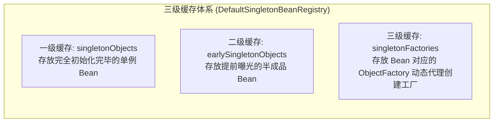
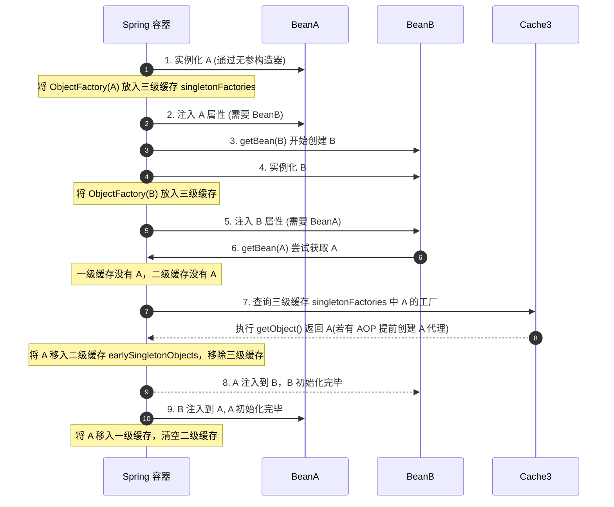
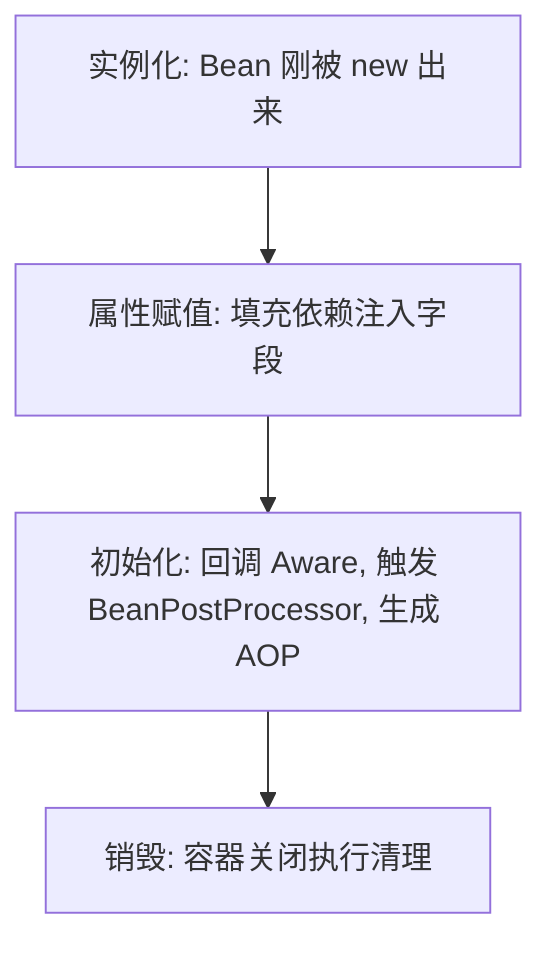

## Spring 核心与生态面试真题

本专栏致力于为中高级 Java 开发人员提供最硬核、直击底层原理、结合生产实战的 Spring 框架及微服务生态面试真题剖析。每个知识点都配有详尽的答案、核心源码流程、以及辅助理解的 IOC/AOP 依赖注入与缓存流转图。

---

## 📂 模块四：Spring 底层与微服务生态

### Q1：Spring 框架如何解决三级缓存下的循环依赖问题？只有二级缓存行不行？

在 Spring 中，单例 Bean 的创建过程被分解为：**实例化**（分配堆内存，通过构造器反射建空对象）与 **初始化**（依赖注入字段属性填入，调用配置方法）。以此为核心，Spring 提供了优雅的三级缓存。



#### 1. 经典三级缓存设计与核心流程

- **第一级缓存 `singletonObjects`**：

  存放完全属性注入、初始完成、可以直接投入业务使用的单例 Bean。

- **第二级缓存 `earlySingletonObjects`**：

  存放提前暴露的“半成品单例 Bean”（已在堆上反射创建出来，但可能还未完成字段属性 `@Autowired` 的值填入）。

- **第三级缓存 `singletonFactories`**：

  存放包装了该 Bean 构造实例的 **工厂对象 `ObjectFactory<?>`**。

#### 2. 三级缓存的核心运作逻辑



- **第一阶段（A 实例化完毕后）**：

  A 刚反射建立，Spring 通过 `addSingletonFactory` 将其生存控制权以及生成的 A 匿名构造 Lambda（`ObjectFactory`）写入**第三级缓存 `singletonFactories`** 中。

- **第二阶段（A 装配属性由于需要 B，触发 B 实例化加载）**：

  B 创建后在进行依赖注入。它也同样引用 `@Autowired A`，于是发起 `getBean("A")`。

- **第三阶段（B 反向拉取三级缓存中的 A）**：

  在三级缓存的 A 内，B 会调用 `ObjectFactory.getObject()`。在这里，Spring 的 `AbstractAutoProxyCreator` 会介入进行判断：**如果该 Bean A 需要切面代理（如 AOP），则当即生成一个 A 的动态代理（Proxy）对象返回；如果无 AOP，则原封不动将裸 Bean A 返回**。
  最后 B 将其装载，并将 A 从三级缓存挪出并存入**第二级缓存 `earlySingletonObjects`** 锁定其唯一引用。

- **第四阶段（B 成功完成注入，返回给 A 最终大功告成）**：

  B 彻底完成所有生命流程，移入一级缓存。A 获取到合法的 B 后，随之也走完余下各种 PostProcessor 初始，晋升到一级缓存，扫除临时缓存。

#### 3. 为什么只有两级缓存解决不了 AOP 场景下的循环依赖？

**结论：如果只是普通对象的互相引用，二级甚至一级就已经足够；但如果要支持“AOP 动态切面代理生成”的循环依赖，第三级缓存是不可舍去的唯一解。**

- **为什么不能直接在二级缓存中放裸对象，最后做 AOP？**：

  由于 Java 里的 AOP 代理是通过基于代理类包裹（或继承）原对象来实现的，**代理类对象（Proxy）和我们的原始裸对象在内存中是两个独立的物理引用**。如果不提早处理，B 在装载 A 时，由于 A 还未完成最终的 AOP 字节码构建，B 将会装载进一个**原始裸 A 对象**。

- **那为什么不在实例化之后立即无脑为所有 Bean 创建 AOP 代理，放入二级缓存？**：

  这严重打破了 Spring 的生命周期规范设计哲理和职责分离原则！
  在正常情况下，Spring 必须经历原始对象的属性填充 -> Aware 接口拉取 -> 全部生命流程之后，在最后一步通过 `BeanPostProcessor` 实现 AOP 代理。
  **第三级缓存（`ObjectFactory`）本质属于一种“延迟触发提前代理”的懒加载安全机制**：
  只有当且仅当“发生了实质性的循环依赖”（即 B 此时立刻需要拉取提前 of A）时，它才由第三级缓存里的 ObjectFactory 被动触发 AOP 代理生成并移入二级缓存。如果不存在循环依赖，AOP 永远是在最后一步、以最正常的生命周期标准执行代理。

#### 4. 追问：Spring 有哪些循环依赖是三级缓存也解决不了的？在项目开发中如何规避？

虽然三级缓存解决了单例属性注入的循环依赖，但以下场景它依然**无能为力**：
- **构造器注入循环依赖**：由于 A 实例化时构造器依赖 B，但 A 尚未实例化，无法将 `ObjectFactory` 提前暴露到三级缓存中。当去实例化 B 时，B 又需要 A 同样无法获取，最终抛出 `BeanCurrentlyInCreationException`。
  - *避坑方案*：在其中一个构造器参数前添加 **`@Lazy`** 注解，或更改为属性注入。
- **Prototype（原型/多例）作用域循环依赖**：对于 prototype 的 Bean，Spring 不会将其存入任何一、二、三级缓存。每次请求都会生成新对象，从而导致死循环。
  - *避坑方案*：将多例 Bean 重构为单例，或使用 Setter 注入并打破依赖关系。
- **`@Async` 异步 Bean 引发的循环依赖**：`@Async` 代理是在 Bean 初始化（`BeanPostProcessor`）后期的 `AsyncAnnotationBeanPostProcessor` 中生成的。它并不支持通过三级缓存的 `getEarlyBeanReference` 提前获取代理（它只返回裸对象）。
  当 B 注入 A 时，拿到的是 A 的原始裸对象；而 A 最终在容器中是 `@Async` 代理对象。在最后的依赖关系检查中，Spring 发现注入给 B 的 A 的地址与容器持有的 A（代理对象）地址不一致，于是报错。
  - *避坑方案*：在注入点上加上 `@Lazy`；或者将 `@Async` 方法抽取到一个独立的异步辅助类（Task/Helper）中，从根本上杜绝该类与其他 Service 的循环引用。

---

### Q2：Spring Bean 的生命周期是怎样的？如果让你设计，你会如何划分阶段，并在其中预留哪些扩展点？

在面试中，理解 Bean 的生命周期不能死记硬背，必须将其与 Spring 的职责分离机制结合起来。

#### 1. 四大核心阶段

1. **实例化（Instantiation）**：
   通过反射或工厂方法在堆内存中为对象分配空间，生成原始的“裸对象”。对应方法：`createBeanInstance()`。
2. **属性赋值（Populate）**：
   执行依赖注入，填充该对象的属性字段。对应方法：`populateBean()`。
3. **初始化（Initialization）**：
   执行生命周期的回调、感知接口（Aware）以及代理增强。对应方法：`initializeBean()`。
4. **销毁（Destruction）**：
   容器关闭时释放资源。



#### 2. 三大核心扩展点设计

Spring 设计了极其优秀的扩展接口，允许开发者深度定制 Bean：

- **BeanFactoryPostProcessor（工厂后置处理器）**：
  在所有 Bean **实例化之前**触发。操作的是 `BeanDefinition`（元数据名册），可以动态修改 Bean 的配置属性、替换 `${...}` 占位符。
- **Aware 感知接口**：
  在初始化阶段早期触发，使 Bean 能够感知到容器本身的环境。如通过实现 `ApplicationContextAware` 获取 Spring 上下文容器。
- **BeanPostProcessor（Bean 后置处理器）**：
  作用于**每个 Bean 初始化方法的执行前后**（`postProcessBeforeInitialization` 和 `postProcessAfterInitialization`）。**AOP 动态代理的织入** 就是在初始化之后的后置处理器中完成的。

详细生命周期代码追踪与流程图，请参参见 [Bean 生命周期](../../java/spring/core/0-bean-lifecycle.md) 与 [IoC 与 AOP 深度解析](../../java/spring/core/1-ioc-aop.md#一-spring-bean-的生命周期)。

---

### Q3：@Autowired 与 @Resource 有何区别？在同类型多 Bean 的情况下，Spring 又是如何决策的？

在开发中，依赖注入是非常频繁的操作。理清这两者的区别，对解决装配歧义有很大帮助。

#### 1. 核心机制对比

- **`@Autowired`**：由 Spring 原生提供，默认按照**类型（byType）**进行依赖寻找。底层由 `AutowiredAnnotationBeanPostProcessor` 实现。
- **`@Resource`**：属于 JSR-250 规范，默认按照**名称（byName）**进行依赖寻找。只有当找不到名称匹配的 Bean 时，才会回退按类型装配。底层由 `CommonAnnotationBeanPostProcessor` 实现。

#### 2. 存在同类型多 Bean 时的装配决策链

当使用 `@Autowired` 声明注入，且容器中存在多个相同类型的 Bean 时，Spring 会按照以下步骤进行裁决：

1. **基本查找**：在容器中筛选出所有匹配该类型的 Bean。
2. **唯一性判断**：若只有一个，则直接注入；若没有，且 `required = true`，则抛出异常。
3. **Primary 裁决**：检查这组同类型 Bean 中，是否有某一个标注了 `@Primary` 注解。如果有，则优先注入该主 Bean。
4. **Priority 排序**：检查是否有 JSR-250 规范中的 `@Priority` 优先级标记，数值越小优先级越高。
5. **属性名兜底匹配**：如果以上皆未成功，Spring 会尝试用**当前属性字段的变量名**去容器中匹配 Bean 的名字（即退化为 byName）。如果正好匹配上，则成功注入。
6. **Qualifier 精确匹配**：如果结合了 `@Qualifier("beanName")`，则跳过上述逻辑，直接按指定的名称在同类型中精准匹配。
7. **彻底失败**：如果上述所有关卡都未能决定唯一的 Bean，Spring 将抛出著名的 `NoUniqueBeanDefinitionException`。

有关这两个注解的源码级分析，请参考 [常用注解底层解析](../../java/spring/core/5-annotations.md#一-核心装配注解autowired-与-resource)。

---

### Q4：Spring 声明式事务 @Transactional 在什么情况下会失效？底层原理是什么？

这是一个极其经典的生产实践及高频面试题。Spring 事务底层基于 AOP 动态代理实现，因此绝大多数失效场景都是因为**绕过了代理对象**或**数据库/异常机制配置不合理**。

#### 1. 经典失效场景及根本原因

- **类内部自我调用（Self-Invocation）**：
  在同一个 Service 类中，非事务方法 A 内部直接调用了同一个类中的事务方法 B。
  - *原因*：方法 A 是通过 `this.B()` 调用的，`this` 代表当前裸对象本身，绕过了 Spring 生成的代理对象（Proxy），导致 B 的事务拦截器 `TransactionInterceptor` 无法被触发。
- **方法修饰符不是 public**：
  在 `private`、`protected` 或包私有的方法上标注了 `@Transactional`。
  - *原因*：Spring 事务管理器为了防止误切入，默认在解析切点时会检查方法访问权限。如果不是 `public`，则直接忽略。
- **异常被 swallow（吞掉）**：
  方法内使用 `try-catch` 捕获了异常且未重新向外抛出。
  - *原因*：Spring 事务只有在捕获到未处理的异常时，才会通过 AOP 切面触发 `rollback`。如果异常在内部被吞掉，Spring 认为方法成功结束，照常提交事务。
- **抛出了 Checked Exception（受检异常）**：
  方法抛出了 `IOException` 或 `SQLException` 等受检异常。
  - *原因*：Spring 默认只在遇到 `RuntimeException`（运行时异常）和 `Error` 时进行事务回滚。
  - *解决*：需要配置 `@Transactional(rollbackFor = Exception.class)`。
- **多线程/异步方法调用（@Async）**：
  事务方法 A 中启动了新线程去执行数据库操作。
  - *原因*：Spring 的事务上下文（包括数据库连接 Connection）是通过 `ThreadLocal` 绑定在当前线程上的。新线程无法共享父线程的 Connection，因此其操作不受原事务控制。

完整的 12 种失效场景及对应的解决方案，请参见 [事务传播与失效深度解析](../../java/spring/core/4-transaction.md#二-声明式事务-transactional-失效的-12-种场景)。

---

### Q5：为什么 @Configuration 注解默认是 CGLIB 代理的？如果关闭代理会有什么后果？

在 Spring 中，配置类可以用 `@Configuration` 声明，也可以用普通的 `@Component` 声明（通常称为 Lite 模式）。这两者在方法间互相调用时的行为差异极大。

#### 1. 保证单例的秘密：proxyBeanMethods = true

In `@Configuration` 中，`proxyBeanMethods` 默认是 `true`。这意味着 Spring 在加载此配置类时，会使用 CGLIB 生成配置类的子代理类（Full 模式）。

#### 2. 底层运行机制

假设我们有如下配置：

```java
@Configuration
public class MyConfig {
    @Bean
    public User user() {
        return new User();
    }

    @Bean
    public Order order() {
        // 方法内部直接调用了上面的 user() 方法
        return new Order(user()); 
    }
}
```

- **如果开启代理（默认）**：
  当执行到 `order()` 方法内部的 `user()` 调用时，CGLIB 拦截器会截获此方法调用。它不会执行 `user()` 方法本身，而是拦截并转为在 Spring 容器中调用 `beanFactory.getBean("user")`。这样保证了注入到 `order` 中的 `user` 实例和直接从容器中获取的 `user` 实例是同一个，确保了单例规范。
- **如果关闭代理（`proxyBeanMethods = false`）**：
  Spring 不会生成代理类，而是把它当作普通的 Java 对象。调用 `new Order(user())` 时，会直接进入 `user()` 方法体执行 `new User()`。这会导致 `order` 里的 `user` 是一个全新创建的对象，而容器中管理着另一个 `user`，破坏了单例模式。

#### 3. 最佳实践

如果配置类中的 `@Bean` 方法之间**不存在任何调用关系**，强烈建议配置为 `@Configuration(proxyBeanMethods = false)`。这样可以跳过 CGLIB 动态字节码的生成，使启动速度变快，并节省系统内存。

详细细节可参考 [常用注解底层解析](../../java/spring/core/5-annotations.md#三-配置类注解configuration-深度工作机制)。

---

### Q6：Spring Boot 自动装配原理是什么？它与 SPI 机制有什么联系？

Spring Boot 最核心的特点是“约定优于配置”和“开箱即用”，这在底层全部依赖于自动装配机制（Auto-Configuration）。

#### 1. 自动装配的核心流程

1. **入口注解**：启动类上的 `@SpringBootApplication` 是一个复合注解，其中最核心的是 `@EnableAutoConfiguration`。
2. **导入选择器**：`@EnableAutoConfiguration` 通过 `@Import` 引入了 `AutoConfigurationImportSelector`，该选择器负责动态向容器导入组件。
3. **SPI 读取**：
   - 在 Spring Boot 2.x 中，选择器通过 `SpringFactoriesLoader` 去扫描类路径下所有 jar 包里的 `META-INF/spring.factories` 文件。
   - 在 Spring Boot 3.x 中，改为读取 `META-INF/spring/org.springframework.boot.autoconfigure.AutoConfiguration.imports` 文件。
   - 读取这些文件中配置的 `EnableAutoConfiguration` 对应的自动配置类（如 `MySqlAutoConfiguration`、`RedisAutoConfiguration`）。
4. **条件裁决**：
   这些自动配置类上往往标注了大量的 `@Conditional` 条件注解（如 `@ConditionalOnClass`、`@ConditionalOnMissingBean`）。Spring 会根据当前应用中是否引入了相应的 jar 包或是否定义了相同的 Bean，来动态决定是否加载此配置类。

```mermaid
graph TD
    Start[应用启动] --> Autoconfig[@EnableAutoConfiguration 激活]
    Autoconfig --> Selector[AutoConfigurationImportSelector 扫描]
    Selector --> SPI["SPI 机制: 读取 imports 或 spring.factories"]
    SPI --> LoadConfig[加载所有的 XxxAutoConfiguration 配置类]
    LoadConfig --> Condition{是否满足 @ConditionalOnXxx?}
    Condition -->|Yes| Register[注册 Bean 进 IoC 容器]
    Condition -->|No| Filter[过滤丢弃，不加载]
```

关于 Spring Boot 的 SPI 加载机制 and 自定义 Starter 实践，可以参考 [Boot 扩展机制与 SPI](../../java/spring/boot/12-springboot-extension.md#一springboot-spi-机制详解)。

---

### Q7：Spring 的事件机制是同步还是异步的？在事务环境（Transaction）下使用有什么坑？

Spring 事件（Spring Events）是典型的**观察者模式**实现。在实际生产和面试中，事务与事件的交织是重点和难点。

#### 1. 默认执行模式：同步（Synchronous）

- 默认情况下，Spring 事件的发布是**同步**的。即主线程在调用 `publisher.publishEvent()` 时，会立即阻塞并依次调用所有匹配的监听器方法。
- **优点**：天然处于同一个线程内，因此可以**共享数据库事务连接**，支持事务的正常回滚。如果任一监听器抛出异常，整个主事务都会回滚。
- **缺点**：如果监听器执行耗时逻辑（如发送邮件、调用第三方），会拖慢主流程的接口响应时间。
- *异步化方案*：使用 `@Async` 注解标记监听器方法，配合 `@EnableAsync` 线程池异步执行（此时将失去事务一致性保证）。

#### 2. 事务环境下的经典巨坑：数据不一致

如果在主事务中直接发布事件，且监听器（同步或异步）去执行了不可逆的外部操作（如发送短信），而随后主事务由于最后一步报错发生**回滚**。此时会产生**数据回滚了，但短信已发出去**的脏数据现象。

#### 3. 终极解决方案：@TransactionalEventListener

Spring 提供了 `@TransactionalEventListener` 注解，用来将事件监听器绑定到发布者事务的生命周期上。核心属性是 `phase`（事务阶段）：
- **`AFTER_COMMIT`（默认）**：只有当主事务**成功提交后**，才触发监听器执行。完美解决上述“回滚后依然发短信”的问题。
- **`AFTER_ROLLBACK`**：主事务**回滚后**才执行，常用于做补偿处理。

> [!WARNING]
> **`AFTER_COMMIT` 阶段的致命陷阱：无法写入数据库**
> 在 `AFTER_COMMIT` 监听器中，底层的物理数据库连接事务已经提交并关闭。如果在此阶段直接执行 SQL 写入或修改操作，数据**不会被保存**或直接报错。
> **解决方法**：如果必须在提交后写库，需要在监听器方法上标注 `@Transactional(propagation = Propagation.REQUIRES_NEW)`，强制开启一个新的独立物理事务来执行写入。

详细原理与代码案例，请参考 [事件驱动与业务解耦](../../java/spring/core/7-spring-events.md)。

---

### Q8：Spring Cache 声明式缓存的实现原理是什么？同类方法自调用导致缓存失效，如何解决？

Spring Cache 提供了一种对缓存操作的抽象（Cache Abstraction），允许我们用几个注解就能享受到本地（Caffeine）或分布式（Redis）缓存。

#### 1. 底层实现原理：AOP 拦截

Spring 缓存基于 **AOP 动态代理** 和 **拦截器链** 机制：
1. 启动时，Spring 扫描 Bean 上的 `@Cacheable`、`@CachePut`、`@CacheEvict` 等注解，为其生成代理对象。
2. 客户端调用代理对象方法时，`CacheInterceptor` 会拦截该请求。
3. 拦截器解析 SpEL 计算 `key`，并根据名称调用 `CacheManager` 对应的 `Cache` 实例去执行 `cache.get(key)`。
4. 若命中缓存，则直接返回，**不再执行实际方法**；若未命中，则反射执行目标方法，将返回值通过 `cache.put()` 写入缓存，然后返回。

#### 2. 自调用导致缓存失效的原理与解决方案

- **失效原因**：在同一个类 `UserService` 中，非缓存方法 A 内部直接通过 `this.B()` 调用了带有 `@Cacheable` 注解的方法 B。由于 `this` 指向的是当前裸对象本身而非 Spring 生成的 AOP 代理对象，因此 `CacheInterceptor` 无法生效，缓存直接失效。
- **解决方案**：
  1. **类拆分（推荐）**：将带有缓存功能的方法 B 拆分到另一个独立的 Service 类中，由 A 通过 `@Autowired` 注入代理类调用。这是最符合单一职责原则的解法。
  2. **注入自身代理**：在 `UserService` 中使用 `@Autowired` 或 `@Resource` 延迟注入自身，通过注入的代理对象调用。
  3. **AopContext 获取**：使用 `((UserService) AopContext.currentProxy()).B()` 强制通过代理对象调用（需在启动类配置 `@EnableAspectJAutoProxy(exposeProxy = true)`）。

#### 3. 生产环境的“三防”解决方案（穿透、击穿、雪崩）

- **缓存穿透（查不存在的值）**：开启空值缓存（`cacheNullValues = true`）。
- **缓存击穿（热点 Key 失效）**：配置 `@Cacheable(sync = true)`。底层会启用同步锁，使得并发请求中只有一个线程能去数据库查数据并写回缓存，其他请求排队等待，避免数据库被压垮。
- **缓存雪崩（大面积过期）**：在 Redis 缓存配置类中自定义 `RedisCacheManager`，为不同的 cacheName 或者是通过序列化器在 TTL 上加上随机扰动值。

详细原理与生产实战，请参考 [缓存抽象与原理](../../java/spring/boot/16-spring-cache.md)。

---

### Q3：微服务异步链路日志/Trace丢失之痛：如何利用 Spring 的 `TaskDecorator` 编写完美透传 `ThreadLocal`（如 MDC 链路标签、用户信息）的业务级高性能线程池？其内存泄漏隐患如何规避？

#### 💡 典型大厂连环追问

* **追问 1**：为什么说在**高并发且池化复用**的场景下，绝对不能使用 `InheritableThreadLocal`？（线程复用导致上下文污染与内存溢出）。
* **追问 2**：在 `TaskDecorator` 内部重写的 `decorate(Runnable executable)` 方法中，由于涉及到了“提取父线程变量”与“子线程清洗注入”，这段代码的两个阶段分别是在**哪一个线程**中执行狂刷的？

#### 🛠️ 核心解析答题要点

1. **`InheritableThreadLocal` 为什么死于线程池**：

   `InheritableThreadLocal` 仅在**创建新物理线程**的一瞬间，通过 `parent.inheritableThreadLocals` 浅拷贝值到子线程。但是高并发下，我们必然采用**线程池（池化复用机制）**。池内的线程是反复重用不销毁的。
   当下一次其他客户端请求进来，复用该线程时，子线程读出来的依然是上一次请求遗存的垃圾数据。这就导致了严重的**业务上下文错乱污染**和**严重的本地内存泄漏**。

2. **Spring 神级救砖利器：`TaskDecorator` 优雅透传方案**：

   我们向 `ThreadPoolTaskExecutor` 注入自定义的 `TaskDecorator` 接口实现，对提交上来的 `Runnable` 进行装饰包装：

   ```java
   public class MdcTaskDecorator implements TaskDecorator {
       @Override
       public Runnable decorate(Runnable runnable) {
           // ⚠️ 第一阶段：抓取现场！此处由【提交任务的父线程】同步执行。
           Map<String, String> contextMap = MDC.getCopyOfContextMap();
           
           return () -> {
               try {
                   // ⚠️ 第二阶段：子线程装载！此处由【线程池分发的异步子线程】执行。
                   if (contextMap != null) {
                       MDC.setContextMap(contextMap);
                   }
                   runnable.run(); // 执行真实的业务
               } finally {
                   // ⚠️ 第三阶段：极致守护！子线程执行完毕后，物理彻底清空，防范内存重留！
                   MDC.clear();
               }
           };
       }
   }
   ```

3. **核心执行时机与内存泄漏防御点**：

   - `decorate()` 本身：在**父线程**提交 `execute()` / `submit()` 时同步激活，瞬间抓取当前的 MDC / Trace 键。
   - 内部匿名 `run()` ：在分配到**子线程**真正开始被调度时，装载并在最后强制 `MDC.clear()` 清除。
   - **至关重要的防范**：必须加 `try-finally` 并在 `finally` 里显式调用 `MDC.clear()` 或 `ThreadLocal.remove()`。这是因为子线程来自于线程池，如果不清空，子线程中的 `Thread` 内部成员 `ThreadLocalMap` 就会紧紧拽住该引用，多次执行后造成本地大内存溢出，直接报出 OOM。
