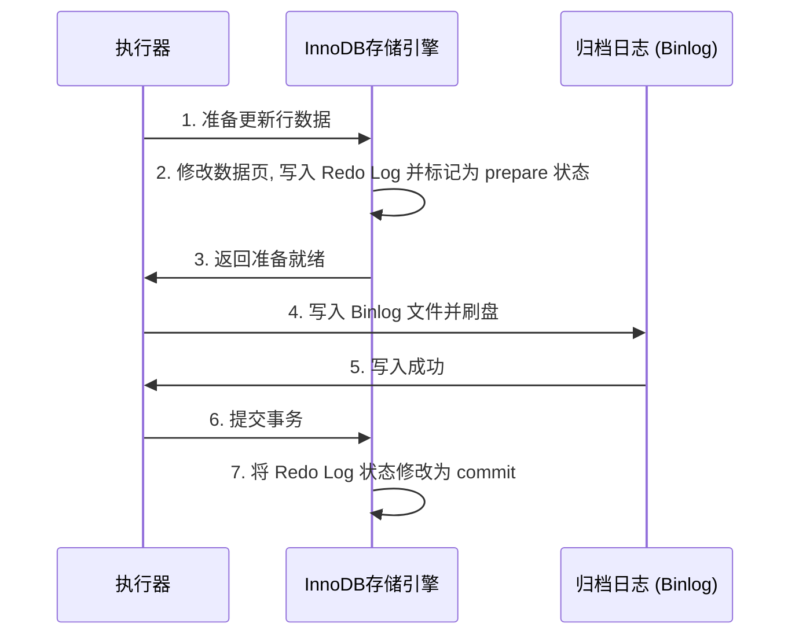
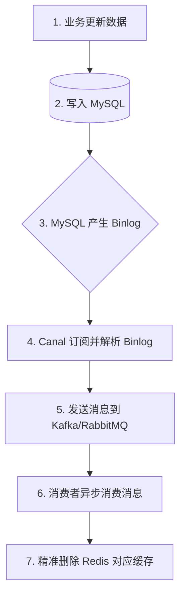

# 六、MySQL 与 Redis 核心

本章涵盖 MySQL 与 Redis 底层存储原理、高并发防护机制、双写一致性以及线上优化方案。

---

## 39. InnoDB 索引结构与检索性能

InnoDB 是 MySQL 的默认事务型存储引擎，其索引是以 **B+ 树** 结构实现的。

### B+ 树的物理结构优势

- **非叶子节点只存储索引键值**：这使得非叶子节点能容纳更多的键值，整棵树的分叉数（扇出）极大。对于 16KB 的数据页，通常只需 3 层即可存储数千万条行记录，检索时仅需 3 次磁盘 I/O。
- **所有叶子节点存储真实数据且双向链表连接**：非常适合进行范围查询和排序扫描。

### 聚簇索引与非聚簇索引

- **聚簇索引（Clustered Index）**：
  - **物理特点**：索引结构与行数据物理上存储在一起。B+ 树的叶子节点直接存储了**完整的行记录数据**。
  - **限制**：每张表有且仅有一个聚簇索引（默认是主键，若无主键则选择第一个非空唯一索引，若仍无则系统隐式生成一个 RowID）。
- **非聚簇索引（Secondary Index，辅助索引）**：
  - **物理特点**：叶子节点不存储完整的行记录，只存储**索引键值与对应行记录的聚簇索引键值（即主键 ID）**。

### 回表与覆盖索引

- **回表（Table Lookup）**：当通过非聚簇索引查询数据且所选字段不完全包含在索引树中时，MySQL 必须先通过非聚簇索引找到主键 ID，再拿着主键 ID 去聚簇索引树上检索出完整的数据行。这会产生二次磁盘 I/O 检索。
- **覆盖索引（Covering Index）**：如果一个非聚簇索引树的键值中已经包含了查询语句所需要的所有字段（例如联合索引 `(name, age)`，查询 `SELECT name, age FROM users WHERE name = 'Tom'`），MySQL 就可以直接从这棵辅助索引树上获取所需数据并直接返回，**避免了回表操作**，性能大幅提升。

---

## 40. 索引规则与失效边缘场景

### 最左前缀匹配原则

在联合索引（如 `index(a, b, c)`）中，查询条件必须从索引的最左列开始，并且不能跳过中间的列。

- 例如，`WHERE a = 1 AND b = 2` 可以走索引；但 `WHERE b = 2 AND c = 3` 无法走索引。
- **范围查询阻断**：如果查询条件中出现了范围查询（如 `>`、`<`、`between`、`like 'xxx%'`），那么联合索引中该列右边的所有列将无法再走索引（例如 `a = 1 AND b > 2 AND c = 3`，此时 `c` 无法走索引）。

### 索引下推（Index Condition Pushdown, ICP）

- **背景**：在没有 ICP 之前，当使用联合索引进行过滤时（如 `a = 1 AND b LIKE '%Tom%' AND c = 3`），MySQL 只能在存储引擎层先用 `a` 字段过滤出数据，然后将大量数据返回到 Server 层，在 Server 层对 `b` 和 `c` 进行二次过滤。
- **优化**：开启 ICP 后，MySQL 会把过滤条件中属于联合索引范围的字段（如 `b` 和 `c`）直接“下推”到存储引擎层。存储引擎在读取数据页时，直接在引擎层过滤掉不符合条件的行，大大减少了回表次数和传输到 Server 层的数据量。

### 索引失效的典型场景

1. **对索引列进行函数或表达式操作**：如 `WHERE YEAR(create_time) = 2026`，这会破坏索引树的有序性，使其退化为全表扫描。
2. **隐式类型转换**：如字段为字符类型，查询写成 `WHERE phone = 13800000000`（未加引号）。MySQL 会隐式调用 `CAST` 函数，导致索引失效。
3. **前导模糊查询**：如 `WHERE name LIKE '%Tom'`（百分号在最左侧），由于无法确定首字符，无法在 B+ 树中进行二分查找。

---

## 41. MVCC 原理与幻读攻克

MVCC（Multi-Version Concurrency Control，多版本并发控制）是 InnoDB 实现非锁定读和高并发事务隔离的核心机制。

### MVCC 实现原理

MVCC 的底层核心主要由 **Undo Log 版本链** 与 **ReadView** 组成。

#### Undo Log 版本链

- InnoDB 在每行记录后都有两个隐式物理字段：
  - `DB_TRX_ID`：最近修改该行记录的事务 ID。
  - `DB_ROLL_PTR`：回滚指针，指向该行记录被修改前的旧版 Undo Log 记录。
- 多个事务对同一行记录进行修改时，旧版本的数据会被存放在 Undo Log 中，通过回滚指针串联成一个单向链表。

#### ReadView 结构

当一个事务在执行 `SELECT` 时，系统会为其生成一个一致性视图（ReadView），包含以下核心字段：
- `m_ids`：生成 ReadView 时，系统内当前正在活跃（未提交）的事务 ID 列表。
- `min_trx_id`：活跃事务 ID 列表中的最小值。
- `max_trx_id`：系统准备分配给下一个事务的 ID 值（即最大活跃事务 ID + 1）。
- `creator_trx_id`：创建当前 ReadView 的事务 ID。

#### 可见性判断算法

当事务读取某行记录时，会拿着该行当前的 `DB_TRX_ID` 与 ReadView 中的字段进行对比：
1. 若 `DB_TRX_ID < min_trx_id`：说明该版本的事务在 ReadView 生成前已提交，**可见**。
2. 若 `DB_TRX_ID >= max_trx_id`：说明该版本的事务在 ReadView 生成后才启动，**不可见**。
3. 若 `min_trx_id <= DB_TRX_ID < max_trx_id`：
   - 若 `DB_TRX_ID` 在 `m_ids` 列表中：说明该版本事务尚未提交，**不可见**。
   - 若不在：说明该版本事务已提交，**可见**。
4. 若读取到不可见版本，则顺着 Undo Log 版本链向下寻找前一个旧版本，直到找到可见版本为止。

#### 隔离级别的差异

- **RC（Read Committed）**：事务中**每次执行 SELECT** 时，都会重新生成一次最新的 ReadView，因此能读到其他事务新提交的数据（导致不可重复读）。
- **RR（Repeatable Read）**：事务中**只有在第一次执行 SELECT** 时才会生成 ReadView，后续查询均复用该 ReadView，确保多次读取数据一致。

### RR 如何很大程度解决幻读

幻读是指同一个事务在多次相同范围查询中，看到了其他事务新插入（`INSERT`）并提交的数据。

InnoDB 在可重复读（RR）级别下，通过两种手段攻克幻读：
1. **快照读（普通 SELECT）**：基于 MVCC 机制，由于复用第一次生成的 ReadView，因此事务看不到其他事务在 ReadView 生成后新插入的行，从逻辑上规避了幻读。
2. **当前读（SELECT ... FOR UPDATE / LOCK IN SHARE MODE / UPDATE）**：通过 **Next-Key Lock**（行锁临键锁，即行锁与间隙锁 Gap Lock 的组合）进行控制。在查询范围时，不仅锁定当前行，还会锁定数据之间的“间隙”，阻止其他事务在这些间隙中插入新记录，从物理上杜绝了幻读的发生。

---

## 42. 事务隔离级别与两阶段提交

### 事务隔离级别与解决问题

| 隔离级别 | 脏读 | 不可重复读 | 幻读 | 底层加锁/版本控制机制 |
| :--- | :--- | :--- | :--- | :--- |
| **读未提交（RU）** | 允许 | 允许 | 允许 | 不加锁，不作版本过滤。 |
| **读已提交（RC）** | 解决 | 允许 | 允许 | 每次 `SELECT` 重新生成 ReadView。 |
| **可重复读（RR）** | 解决 | 解决 | 解决（绝大部分） | 事务首个 `SELECT` 生成 ReadView，当前读加 Next-Key Lock。 |
| **串行化（Serializable）** | 解决 | 解决 | 解决 | 读写全部加锁（共享锁/排他锁），退化为单线程。 |

### Binlog 与 Redo Log 的两阶段提交（2PC）

为了保证 MySQL 中的物理崩溃恢复日志（Redo Log）和逻辑备份日志（Binlog）之间的数据一致性，避免主从数据不一致，MySQL 采用了两阶段提交机制。



#### 崩溃恢复策略

若系统在步骤 4 和 7 之间崩溃，重启后 MySQL 扫描 Prepare 状态的 Redo Log，并检查对应的事务 ID 是否存在于 Binlog 中：
- 若 Binlog 中已经完整记录了该事务，则将 Redo Log 设为 `commit` 并提交。
- 若 Binlog 中没有该事务，则利用 Undo Log 将事务回滚，确保主库和备份库的数据完美一致。

---

## 43. 慢查询诊断与深分页优化

### 执行计划（Explain）关键指标

通过 `EXPLAIN` 分析慢 SQL 时，重点关注以下字段：

- **`type`（连接类型）**：性能从好到差依次为：`system` > `const` > `eq_ref` > `ref` > `range` > `index` > `ALL`。要求生产 SQL 必须达到 `range` 或以上，严禁出现 `ALL`（全表扫描）。
- **`key`**：MySQL 实际使用的索引名称。如果为 `NULL`，说明未走索引。
- **`rows`**：预估需要读取和过滤的行数，该值越小越好。
- **`Extra`（额外信息）**：
  - `Using index`：使用了覆盖索引，性能极佳。
  - `Using index condition`：使用了索引下推。
  - `Using filesort`：使用了文件排序（无法利用索引排序，需要额外的内存或磁盘排序空间），需要重点优化。
  - `Using temporary`：使用了临时表，多见于 `GROUP BY` 或 `DISTINCT`，开销巨大。

### 深分页（Deep Paging）优化

在执行大偏移量分页时（如 `LIMIT 1000000, 10`），MySQL 会扫描前 1000010 条记录，并将前 1000000 条丢弃，如果涉及回表，会产生上百万次无意义的磁盘 I/O。

#### 优化方案

1. **游标/滚动分页（Cursor-based）**：
   - 限制不能跳页，只能点击“下一页”。
   - 记录上一页最后一条的主键 ID（如 `id = 1000000`），查询写为：

     ```sql
     SELECT * FROM users WHERE id > 1000000 LIMIT 10;
     ```

     能直接利用主键索引进行快速定位，扫描行数永远为 10 行。
2. **延迟关联（Deferred Join）**：
   - 先通过覆盖索引只查询出主键 ID（不进行回表），然后再通过子查询与主表进行内连接获取完整行数据：

     ```sql
     SELECT u.* FROM users u 
     INNER JOIN (
         SELECT id FROM users ORDER BY age LIMIT 1000000, 10
     ) tmp ON u.id = tmp.id;
     ```

     这样将百万次回表操作压缩到了仅有 10 次。

---

## 44. 分库分表设计与分布式 ID

### 基因法路由（Gene-based Routing）

在分库分表（如按用户 ID 分表）时，如果要支持按商户或订单 ID 查询，通常会发生“跨库多表广播扫描”。

- **原理**：将用户 ID（User ID）的后几位二进制（如后 6 位，即 64 分表）作为“基因”，在创建订单时，将这几位基因强制拼接到订单 ID（Order ID）的特定位置。
- **效果**：当用户根据 Order ID 查询订单时，路由算法只需提取 Order ID 中的基因部分，即可直接计算出该订单存在于哪张用户表中，避免了全表广播，实现单键精准路由。

### 雪花算法（Snowflake）与时钟回拨

#### 64位 ID 划分

- `1位` 符号位（恒为 0）。
- `41位` 时间戳（可支持 69 年）。
- `10位` 工作机器 ID（可支持 1024 台机器）。
- `12位` 序列号（单机单毫秒内可产生 4096 个 ID）。

#### 时钟回拨应对方案

若服务器发生 NTP 时间校准导致时间回拨，雪花算法可能会生成重复的 ID。

- **轻微回拨（小于 5 毫秒）**：线程直接自旋等待时间追平。
- **严重回拨**：
  - 维护多个**备用工作机器 ID（Worker ID）**。一旦发生回拨，自动切换到备用 Worker ID 继续生成 ID，避免冲突。
  - 记录历史最大生成时间戳。若当前时间小于历史最大时间，则通过序列号继续递增生成，或向后顺延时间戳。

---

## 45. Redis 基础结构与底层编码演进

Redis 核心数据类型在不同版本中进行了深度的编码重构。

- **ziplist（压缩列表）**：连续内存块，非常节省空间，但在修改或新增时需要重新分配内存，且在节点较多时存在“连锁更新（Cascade Update）”崩溃风险。
- **listpack（紧凑列表）**：自 Redis 5 引入，并在 **Redis 7 中彻底取代了 ziplist**。它消除了节点中记录前一个节点长度的属性，将长度记录移到了节点尾部，从而**彻底根治了连锁更新问题**。

### 五大结构底层编码对照表

| 基础结构 | Redis 7+ 底层编码实现 |
| :--- | :--- |
| **String** | `int`（整型）或 `raw`/`embstr`（简单动态字符串 SDS）。 |
| **List** | **`quicklist`**（双向链表与 `listpack` 的结合体）。 |
| **Hash** | **`listpack`**（小容量时）或 **`hashtable`**（大容量时）。 |
| **Set** | **`intset`**（整数集合，全为整数时）或 **`hashtable`**。 |
| **ZSet** | **`listpack`**（小容量时）或 **`skiplist`**（跳表，大容量时）。 |

---

## 46. Redis 缓存三大问题防护

### 缓存穿透（Cache Penetration）

- **现象**：查询一个**数据库和缓存中都不存在**的数据（如黑客恶意构造的负数 ID）。导致所有请求穿透缓存直达数据库，造成数据库宕机。
- **解决方案**：
  1. **布隆过滤器（Bloom Filter）**：在缓存前加一层布隆过滤器，保存所有可能存在的 Key。若过滤器判断不存在，直接拦截返回。
  2. **缓存空对象（Cache Null）**：当数据库查询为空时，依然向缓存中写入一个带有较短过期时间（如 5 分钟）的 `null` 值或特定占位符，防止重复穿透。

### 缓存击穿（Cache Breakdown）

- **现象**：一个**热点 Key**（如爆款商品的库存），在承受极高并发访问的同时**突然过期**。瞬间海量请求直达数据库进行重建，压垮数据库。
- **解决方案**：
  1. **互斥锁（Mutex Lock）**：在缓存失效时，只允许一个线程抢占分布式锁去查询数据库并重建缓存，其他线程等待并重试：

     ```java
     if (redis.get(key) == null) {
         if (lock.tryLock()) {
             dbData = queryDb();
             redis.set(key, dbData);
             lock.unlock();
         } else {
             Thread.sleep(50);
             retry();
         }
     }
     ```

  2. **逻辑过期（Logical Expiration）**：热点数据物理上永不过期。在数据内部封装一个逻辑过期时间。当线程发现逻辑过期时，异步开启一个后台线程去重建缓存，当前线程直接返回旧的过期数据。

### 缓存雪崩（Cache Avalanche）

- **现象**：**大量缓存 Key 在同一时间大面积失效**，或者 Redis 服务器发生宕机。导致全网请求洪峰瞬间涌入数据库，造成雪崩式瘫痪。
- **解决方案**：
  1. **随机过期时间**：为每个 Key 的过期时间加上一个随机抖动值（如 1 到 5 分钟），避免它们在同一时间集体过期。
  2. **双层缓存架构**：使用本地多级缓存（如 Caffeine）作为第一道防线。
  3. **服务限流降级**：配置熔断保护（如 Sentinel），对非核心数据直接降级返回默认值。

---

## 47. 分布式锁演进与 RedLock 争议

### SET NX PX 机制的缺陷

传统简单的分布式锁写法如下：

```bash
SET lock_key unique_value NX PX 30000
```

#### 致命问题

如果线程 A 拿到锁后，业务执行超时超过了 30 秒，锁被 Redis 自动释放。此时线程 B 拿到锁开始执行。随后线程 A 业务执行完毕，调用 `DEL lock_key`，会**误释放掉线程 B 的锁**，导致锁机制失效。

- **解决手段**：
  1. 在释放锁时，必须使用 **Lua 脚本** 判断锁的值是否等于自己持有的 `unique_value`，只有相等才能执行 `DEL`。
  2. 引入 **Redisson 看门狗（Watchdog）** 机制。

### Redisson Watchdog（看门狗）续期原理

- 当线程成功获取锁后，若没有显式指定锁过期时间，Redisson 会默认启动一个后台守护线程（看门狗），每隔 `lockWatchdogTimeout / 3`（默认 10 秒）向 Redis 发送一次续期命令，将锁的超时时间重新设置为 30 秒。
- 只有当持锁线程主动调用 `unlock()`，或者当前 JVM 崩溃，看门狗才会停止续期，从而既防止了锁提前释放，又避免了死锁。

### RedLock（红锁）争议

为了解决主从架构下，主库写入锁后尚未同步给从库即宕机，导致从库被提升为主库后锁丢失、被其他线程重复获取的问题，Antirez 提出了 RedLock。

- **原理**：在 N 个（通常为 5 个）完全独立的 Redis 节点上同时申请锁，只有当在过半数（>= 3）节点上成功获取锁，且总耗时小于锁的有效时间，才认为最终获取锁成功。
- **Martin Kleppmann 的质疑**：
  1. **时钟漂移风险**：RedLock 强依赖于物理服务器的时钟一致性。如果其中一台机器发生 NTP 时钟向前跳跃，锁会提前过期，导致锁失效。
  2. **垃圾回收停顿（GC Pause）**：如果客户端在获取锁后发生了长达数秒的 Full GC 停顿，锁在 Redis 侧已过期，但客户端恢复后仍自认为持有锁，继续执行写操作会产生冲突。
- **生产建议**：高并发且对一致性要求极高的金融级场景，优先使用 **ZooKeeper 临时顺序节点** 实现分布式锁（强一致性 CP 模型）；对于普通高并发场景，带看门狗的普通 Redis 单节点/哨兵模式锁已足够。

---

## 48. Redis 持久化与集群机制

### RDB 与 AOF 混合持久化

- **RDB（快照）**：周期性对全量数据进行二进制压缩存储。启动恢复快，但数据丢失多。
- **AOF（日志）**：追加记录每次写指令。数据安全性高，但文件体积大、恢复慢。
- **混合持久化（Redis 4.0 起推荐）**：
  - AOF 重写时，将当前内存状态以 RDB 二进制格式写入 AOF 文件开头，后续新增的写指令仍以 AOF 文本格式追加。
  - 这种设计兼顾了 RDB 的快速加载与 AOF 的高数据安全性。

### Cluster 集群哈希槽与主从网络抖动

- **哈希槽（Hash Slot）**：Redis Cluster 拥有固定的 **16384** 个哈希槽。集群中的每个 Master 节点负责管理一部分槽位。当存取一个 Key 时，通过：

  ```bash
  slot = CRC16(key) & 16383
  ```

  计算出槽位值，再路由到对应的物理节点。
- **主从脑裂与网络抖动防范**：
  - **脑裂问题**：主节点因网络故障与集群失联，但仍在工作，且集群选举出了新主节点。原主节点恢复后被降为从节点，清空本地数据进行同步，导致失联期间写入的数据全部丢失。
  - **配置优化**：

    ```properties
    # 限制主节点必须有至少 1 个健康的从节点连接才能写入
    min-replicas-to-write 1
    # 主从同步时延阈值（秒）
    min-replicas-max-lag 10
    # 调整集群节点失联判定时间，防止因网络瞬时抖动造成频繁的主从倒换
    cluster-node-timeout 15000
    ```

---

## 49. 缓存与数据库双写一致性方案

在数据更新时，如何保证 Redis 与 MySQL 的数据一致性。

### 为什么“先更新数据库，再删除缓存”最稳

我们来看两种常见顺序在并发下的表现：

#### 方案 A：先删除缓存，再更新数据库

1. 线程 1 准备更新数据，先删除了 Redis 缓存。
2. 此时并发线程 2 发起读取请求，发现缓存失效，去读取数据库，读到了**旧值**。
3. 线程 2 将读取到的旧值写入 Redis 缓存。
4. 线程 1 将新值写入数据库。
5. 结果：**缓存为旧值，数据库为新值，产生永久不一致**。必须通过昂贵的“延迟双删”才能修复。

#### 方案 B：先更新数据库，再删除缓存（Cache Aside Pattern）

1. 缓存刚好失效。
2. 线程 2 读取数据库，读到旧值。
3. 线程 1 更新数据库，将新值写入，并执行**删除缓存**操作。
4. 线程 2 将读到的旧值写入 Redis 缓存。
5. 结果：由于写库操作（步骤 3）通常比读库写缓存（步骤 2、4）慢得多，因此线程 2 写入缓存的动作几乎总是发生在线程 1 删除缓存之前，所以不一致的概率极低。

### 终极强一致性闭环方案

如果对一致性有绝对的要求，推荐使用以下闭环：



- **延迟双删**：更新库后，先删一次缓存，等待几百毫秒（确保读线程写缓存已完成），再删除一次，做兜底防范。
- **Canal 订阅 Binlog 异步删除**：将缓存删除逻辑与业务代码解耦。即使业务线程删除失败，Canal 仍能通过消费 MQ 消息进行重试删除，保证了最终一致性。
