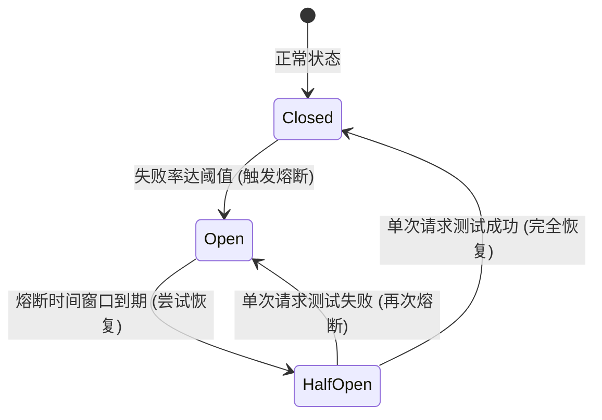
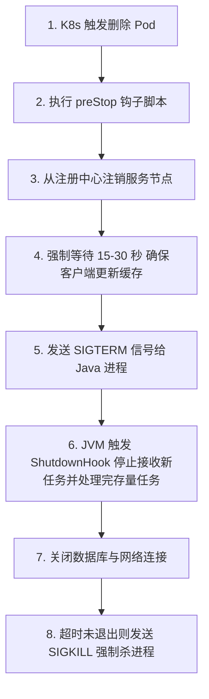

# 七、分布式与微服务治理

本章涵盖分布式一致性理论、主流分布式事务选型、微服务高可用流量控制、RPC 架构以及云原生优雅演进。

---

## 50. 分布式一致性理论与分布式事务对比

在分布式系统下，跨网络节点的协同需要遵循特定的一致性理论。

### CAP 与 BASE 定理

- **CAP 定理**：
  - **一致性（Consistency）**：所有节点在同一时刻看到的数据完全一致。
  - **可用性（Availability）**：服务在有限时间内必须返回正常的响应，不能发生超时或崩溃。
  - **分区容错性（Partition Tolerance）**：系统在遇到任意网络分区（丢包、断网）时，仍能对外提供服务。
  - **权衡**：网络分区的发生是不可避免的（必须满足 P），因此分布式系统只能在 **CP**（舍弃可用性，保证强一致，如 ZooKeeper）与 **AP**（舍弃强一致，保证可用性，如 Eureka/Nacos）之间进行二选一。
- **BASE 定理**：是对 CAP 中 AP 的延伸：
  - **基本可用（Basically Available）**：允许在故障时损失部分可用性（如响应变慢或降级）。
  - **软状态（Soft State）**：允许不同节点的数据存在中间过渡状态，不影响系统整体可用性。
  - **最终一致性（Eventually Consistent）**：所有副本经过一段时间的同步后，最终达到一致状态。

### 分布式事务方案深度对比

| 方案 | 一致性 | 实现机制 | 优点 | 缺点 / 适用场景 |
| :--- | :--- | :--- | :--- | :--- |
| **2PC（两阶段提交）** | 强一致 | 协调者发起 Prepare 和 Commit 两阶段控制。 | 实现简单，强一致。 | 阻塞性强，性能差，单点故障风险。适用于强一致数据库事务（如 Seata XA）。 |
| **TCC（补偿事务）** | 最终一致 | 业务层手动实现 Try、Confirm、Cancel 三个接口。 | 性能好，锁定资源少。 | 业务侵入性极大，需要自行处理幂等和悬挂。适用于金融扣款等核心资产流转。 |
| **Saga** | 最终一致 | 拆分为多个本地事务，失败时按相反顺序调用补偿事务。 | 适用于长事务、跨系统集成。 | 无法保证隔离性，可能产生脏读。适用于长流程业务流转（如旅游预订）。 |
| **本地消息表** | 最终一致 | 发送端持久化事务与消息，通过定时任务加 MQ 保证必达。 | 简单可靠，解耦。 | 严重依赖数据库本地事务，存在消息积压时效性低问题。适用于跨系统轻量级通知。 |
| **Seata AT** | 最终一致 | 基于数据源代理，自动解析 SQL 生成前后快照（Undo Log）。 | 业务零侵入，开发成本极低。 | 强依赖关系型数据库，高并发下存在全局行锁竞争。适用于大多数微服务业务场景。 |

---

## 51. 注册中心对比与配置推送原理

### Nacos 与 Eureka 的架构差异

- **Eureka**：
  - **定位**：纯粹的 **AP** 系统。
  - **同步机制**：节点间通过 Peer to Peer 进行数据复制。当网络分区发生时，Eureka 节点会进入自我保护模式，不注销任何服务实例，保证服务列表的可用性，但数据可能会存在严重的时滞。
- **Nacos**：
  - **定位**：**支持 AP 与 CP 的动态切换**（默认 AP）。
  - **机制**：
    - 临时实例采用 **AP 模式**（Distro 协议，非强一致的对等复制，追求极限吞吐）。
    - 持久实例采用 **CP 模式**（Raft 协议，通过多数派选举保证强一致性，适用于核心配置、持久化命名空间注册）。

### Nacos 配置推送与长轮询（Long Polling）机制

Nacos 配置中心的数据热推送没有采用单纯的“服务端 Push”或“客户端拉取（Pull）”，而是采用了高效的**基于长轮询的 Pull 机制**。

1. 客户端发起配置监听请求，超时时间设置为 30 秒。
2. Nacos 服务端收到请求后，不立刻返回，而是将请求挂起。
3. **推送触发条件**：
   - **配置未变更**：服务端挂起请求，直到 29.5 秒时仍无变更，则向客户端返回一个“数据未变更”的空响应，客户端收到后立即重新发起下一次长轮询。
   - **配置发生变更**：如果挂起期间配置被修改，服务端会立刻感知，并主动将挂起的请求提前唤醒，将变更的配置元信息返回给客户端。
4. 客户端收到变更通知后，发起一次轻量级的 HTTP 读请求获取最新配置内容，更新本地缓存，从而实现了秒级的配置热更新，且极大地减轻了服务端的连接轮询压力。

---

## 52. 流量控制与限流算法

在高并发微服务架构中，限流是防止服务过载崩溃的第一道屏障。

### 核心限流算法

- **计数器 / 固定窗口（Fixed Window）**：
  - **原理**：限制单位时间内的请求总量（如 1 秒内限流 100 次）。
  - **缺陷**：存在**临界窗口突变问题**。如果前一秒的最后 100 毫秒涌入 100 个请求，后一秒的前 100 毫秒又涌入 100 个请求，在中间这 200 毫秒内系统承受了 200 个请求，超出了系统承载上限。
- **滑动窗口（Sliding Window）**：
  - **原理**：将时间划分为多个更细粒度的小网格（如 1 秒划分为 10 个 100 毫秒网格）。随着时间推移，统计窗口向前滑动，每次仅统计滑动窗口内的总数。
  - **提升**：消除了固定窗口的临界突刺问题，网格划分越细，限流越平滑。Sentinel 内部使用 `LeapArray` 实现了高效的滑动窗口算法。
- **漏桶算法（Leaky Bucket）**：
  - **原理**：请求像水滴一样先进入漏桶中，漏桶以**恒定的速率**流出水滴（处理请求）。若流入速度过快，水满溢出（拒绝请求）。
  - **特点**：强行平滑了出水速率，突发流量会被积压在桶中或被直接拒绝，无法应对突发流量。
- **令牌桶算法（Token Bucket）**：
  - **原理**：系统以恒定的速度向令牌桶中放入令牌（直至桶满）。每次请求来临前，必须先从桶中获取一个令牌，拿到令牌则执行，拿不到则拒绝。
  - **特点**：不仅能限制平均请求速率，由于桶中平时可以积攒令牌，因此**允许应对短时间内的突发流量**，是生产中最常用的限流算法。

### Sentinel 与 Hystrix/Resilience4j 的对比

- **Hystrix**（Netflix 已停更）：采用**线程池隔离**（Thread Pool Isolation）或信号量隔离。线程池隔离开销大，每个依赖需要创建独立的线程池，产生较多上下文切换开销。
- **Resilience4j**：专为 Java 8/11 函数式编程打造的轻量级容错库，不依赖多线程，采用装饰器模式实现，性能较好。
- **Sentinel**：阿里开源，支持丰富的限流维度（QPS、并发线程数、系统自适应、热点参数限流）。采用**责任链模式**（Slot Chain），默认采用信号量和滑动窗口统计，无线程切换开销，支持极其直观的实时控制台动态限流规则配置。

---

## 53. 服务熔断降级策略设计

熔断降级（Circuit Breaking）用于防止微服务链路中因单个依赖节点宕机而导致整条链路被拖垮，引发服务雪崩。

### 熔断器状态机转换



- **Closed（关闭）**：流量正常通过。系统统计失败率，若达到设定的阈值，熔断器断开，进入 Open 状态。
- **Open（开启）**：流量直接被拦截，不再发起远程调用，直接本地执行 Fallback 降级逻辑。
- **Half-Open（半开启）**：熔断一段时间（如 5 秒）后，熔断器允许放行**单个或极少数请求**去探测下游服务。如果调用成功，熔断器自动闭合（回到 Closed）；若再次失败，重新进入 Open 状态并重置冷却时间。

### 预防服务雪崩的综合设计

1. **超时控制**：所有远程调用（RPC/HTTP）必须设置合理的超时时间（如 1.5 秒），严禁出现无超时无限挂起的调用。
2. **熔断降级**：结合熔断器，在依赖超时或错误率飙高时进行降级，返回兜底的静态默认值或友情提示。
3. **资源隔离**：使用线程池隔离或信号量隔离，确保某个故障服务不会将共享的 Tomcat 线程池占满。
4. **弹性伸缩与就绪检查**：配合 K8s 等环境，在流量洪峰时自动扩容，并配置就绪检查，确保只有初始化完成的节点才能接收流量。

---

## 54. RPC 底层原理与 Dubbo 架构

### RPC（远程过程调用）核心交互链路

1. **客户端 Stub（代理）**：将本地接口调用转化为包含类名、方法名、参数类型、参数值的数据对象。
2. **序列化器**：将上述数据对象转换为二进制字节流，便于跨网络传输。
3. **网络传输**：通过 Socket / Netty 等网络底座发送给服务端。
4. **服务端反序列化**：将字节流恢复为 Java 对象。
5. **服务端 Stub（反射/Invoker）**：根据方法签名，反射调用服务端的真实业务实现类，获取结果并原路返回。

### Dubbo 10 层架构设计模型

Dubbo 采用高度解耦的十层设计模型：
- **Service**（业务层）：用户编写的具体接口与实现类。
- **Config**（配置层）：解析 XML/Annotation 配置。
- **Proxy**（服务代理层）：动态生成客户端 Stub 与服务端 Receiver 代理。
- **Registry**（注册中心层）：服务注册与服务发现机制。
- **Cluster**（路由与集群容错层）：实现负载均衡、集群容错策略（如 Failover 失败自动切换、Failfast 快速失败等）。
- **Monitor**（监控层）：统计 RPC 调用次数和响应时延。
- **Protocol**（远程调用协议层）：封装具体的 RPC 协议（如 Dubbo 协议、gRPC 等），是 Invoker 的核心转换层。
- **Exchange**（信息交换层）：封装请求-响应模式，将异步通信转换为同步。
- **Transport**（网络传输层）：对 Mina、Netty 等网络通信框架的抽象封装。
- **Serialize**（序列化层）：具体的字节流序列化方案（如 Hessian2、Kryo、Protobuf）。

---

## 55. 接口幂等性设计与重试陷阱

幂等（Idempotence）是指同一个操作无论执行多少次，其产生的结果和系统状态都与执行一次时完全相同。

### 接口幂等落地防重方案

1. **数据库唯一索引（Unique Index）**：
   - 适用于支付流水表、交易表等。
   - 以商户号 + 唯一业务流水号建立联合唯一索引。一旦重复请求进入，直接抛出数据库主键冲突异常，事务回滚。
2. **防重 Token 令牌机制**：
   - 适用于表单提交、重复点击。
   - 步骤：
     1. 客户端发起请求前，先调用接口获取一个全局唯一的 Token，服务端将其存入 Redis 并设置过期时间。
     2. 客户端带着这个 Token 发起真正的业务请求。
     3. 服务端在 Redis 中执行原子删除命令 `EVAL "return redis.call('del', KEYS[1])"`。若删除成功，说明是第一次请求，放行执行业务；若返回 0，说明 Token 已不存在，直接拦截拒绝。
3. **状态机幂等（State Machine）**：
   - 适用于订单流转。
   - 在更新状态时，SQL 条件中必须带有前置期望状态：

     ```sql
     UPDATE orders SET status = 'PAID' WHERE id = 101 AND status = 'UNPAID';
     ```

     无论重复调用多少次，只有第一次会更新成功，后续调用受影响行数均为 0。

### 重试风暴（Retry Storm）防范

在分布式 RPC 环境下，超时重试机制（如 Dubbo 默认重试 2 次）在网络抖动或服务雪崩时，会产生毁灭性的灾难。

- **重试风暴**：当某服务因负载过高响应变慢时，所有上游调用方因为超时开始重试。这使得下游服务瞬间接收到 3 倍以上的请求量，彻底被压死再也无法恢复。
- **防范策略**：
  1. **限制重试比例（Retry Budget）**：在一个时间窗口内，只允许对最多 10% 的请求进行重试，超出预算则直接认输报错。
  2. **退避算法（Backoff）**：重试时，不能立即再次发起，必须使用**指数退避（Exponential Backoff）加随机抖动（Jitter）**，避免所有重试请求在同一时刻集中到达。
  3. **非幂等接口禁用重试**：如新增订单、划扣款等非幂等接口，重试次数必须设置为 0。

---

## 56. 云原生优雅上下线

在 Kubernetes 环境下，为了实现微服务的平滑发布与滚动升级，必须做好优雅的上下线。

### 优雅上线（服务预热）

- **痛点**：Java 类在初次加载和 JIT 编译时会消耗大量 CPU，此时若大流量瞬间涌入，会导致大量的请求时延飙高或超时。
- **K8s 就绪探针（Readiness Probe）**：配置就绪检查，确保应用不仅容器启动成功，而且内部的 Spring 容器也已经完全加载就绪。
- **Dubbo 服务预热（Warmup）**：Dubbo 可以在注册时带上 `warmup` 参数（如 10 分钟）。客户端在调用新上线的节点时，会在前 10 分钟内逐步线性递增其权重，让新节点进行充分的 JIT 热身，防止大流量瞬间压垮刚启动的应用。

### 优雅下线

当 Pod 准备销毁时，如果立刻粗暴停机，会导致正在处理的请求被强制中断，或者上游网关仍向正在销毁的节点发送流量。

#### 下线安全流程



- **第一步：主动注销**：在 preStop 阶段，主动通知 Nacos/Eureka 节点下线。
- **第二步：缓冲等待**：休眠 15 秒以上。因为注册中心同步实例到各客户端存在网络时延，这段缓冲时间能确保所有客户端都拿到了最新的路由表，不再向该节点发送新请求。
- **第三步：优雅停机**：Java 进程收到 `SIGTERM`（不要使用 `kill -9`），Spring Boot 容器会停止接收新的 HTTP 请求，并等待正在执行的活跃请求执行完毕，随后正常关闭数据库连接池并退出。
