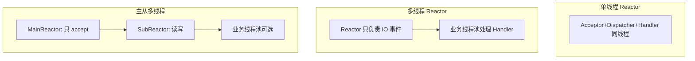

## Netty 与 NIO 核心面试真题

本专栏覆盖 JDK NIO 三件套、Reactor 模型、Netty 线程模型、ByteBuf、粘包拆包与 RPC 实战等高频题。建议先阅读 [JDK NIO](0-jdk-nio-fundamentals.md)、[Netty 底座](1-netty-io.md)、[ByteBuf](2-netty-zero-copy-buf.md)、[编解码](4-netty-codec-practice.md)。

---

## 模块：高性能网络

### Q1：BIO、NIO、AIO 的本质差异是什么？

**答：**

| 模型 | 线程与连接 | 典型 API | 适用 |
| :--- | :--- | :--- | :--- |
| BIO | 一连接一线程，阻塞读写 | `InputStream.read` | 连接少、逻辑简单 |
| NIO | 少量线程 + 多路复用 | `Selector` / `Channel` / `Buffer` | 高并发连接 |
| AIO | 内核回调完成通知 | `AsynchronousSocketChannel` | Linux 上优势不如预期，Java 生态更常用 NIO+Netty |

Netty 在 Linux 上底层是 **epoll** 边缘/水平触发封装，对应用暴露事件回调。

---

### Q2：请画清 Reactor 单线程、多线程、主从多线程模型

**答：**



- **单线程**：所有 accept/read/write 在同一线程，实现简单，受限于单核与业务阻塞。
- **多线程**：IO 线程与业务线程分离，避免业务阻塞 IO。
- **主从**：Boss 只负责接入，Worker 组负责已建立连接的读写 —— **Netty 默认模型**。

---

### Q3：Netty 的线程模型里 BossGroup 与 WorkerGroup 分别做什么？

**答：**

- **BossGroup（Parent）**：监听 ServerSocket，处理 `OP_ACCEPT`，把新连接注册到 Worker。
- **WorkerGroup（Child）**：对已接受的 `SocketChannel` 处理 `OP_READ/OP_WRITE`，驱动 `ChannelPipeline`。
- 每个 `EventLoop` 绑定一个线程，一个 `EventLoop` 管理多个 Channel；**同一 Channel 全生命周期 IO 事件都在同一 EventLoop 线程**，避免 pipeline 内竞态。

业务若可能阻塞（RPC 调下游、重计算），应丢到业务线程池，禁止阻塞 EventLoop。

---

### Q4：什么是粘包/拆包？Netty 如何解决？

**答：**

TCP 是字节流，不保留应用层消息边界：

- **粘包**：多条消息粘成一次读。
- **拆包**：一条消息分多次读。

解决思路：定长、分隔符、长度域、应用协议（HTTP）。

Netty 常用：

- `LineBasedFrameDecoder` / `DelimiterBasedFrameDecoder`
- **`LengthFieldBasedFrameDecoder` + `LengthFieldPrepender`**（私有协议首选）
- HTTP 编解码器、WebSocket 帧聚合器

详见 [编解码实战](4-netty-codec-practice.md)。

---

### Q5：ByteBuf 相比 `ByteBuffer` 的优势？池化与泄漏检测怎么做？

**答：**

| 点 | JDK ByteBuffer | Netty ByteBuf |
| :--- | :--- | :--- |
| 指针 | 单 position | readerIndex / writerIndex 分离 |
| 扩容 | 不方便 | 可动态扩容 |
| 复合缓冲 | 弱 | `CompositeByteBuf` 零拷贝组合 |
| 引用计数 | 无 | `refCnt`，池化必须 `release` |
| 池化 | 需自建 | `PooledByteBufAllocator`（Jemalloc 思想） |

泄漏检测：`-Dio.netty.leakDetection.level=PARANOID`（或 SIMPLE/ADVANCED），配合虚引用采样报告未 `release` 的 Buf。

---

### Q6：Netty 中的零拷贝指什么？和 OS 零拷贝是一回事吗？

**答：**

两层含义常被混谈：

1. **用户态/框架层**：`CompositeByteBuf`、`slice`/`duplicate` 共享底层数组、`FileRegion`/`DefaultFileRegion` 配合 `transferTo` 等，减少**内存拷贝与合并成本**。
2. **操作系统层**：`sendfile` / `transferTo` 减少用户态↔内核态拷贝。

Netty “零拷贝”更多强调 **避免不必要的 byte[] 复制**；真正的 OS 零拷贝要看是否走到 `FileRegion` + 支持 sendfile 的传输。

---

### Q7：Pipeline 入站出站顺序？编解码器如何放置？

**答：**

- **Inbound**：从头到尾（`fireChannelRead` 向后传）。
- **Outbound**：从尾到头（`write` 向前传）。

推荐顺序：

```text
入站：LengthFieldBasedFrameDecoder → 业务 Decoder → 业务 Handler
出站：业务 Encoder ← LengthFieldPrepender ← write
```

心跳、日志、权限 Handler 按“越靠近网络越通用、越靠近业务越具体”排布。

---

### Q8：Epoll 空轮询 Bug 是什么？Netty 如何规避？

**答：**

旧版 Linux epoll 在特定场景下 Selector 被异常唤醒且无事件，导致 CPU 100% 空转。

Netty 策略：统计 Selector 空轮询次数，超过阈值则重建 Selector，把原注册的 Channel 转移过去，避免死循环空转。这是 Netty 生产稳定性的经典考点。

---

### Q9：如何设计 Netty 心跳与断线重连？

**答：**

1. 服务端/客户端加 `IdleStateHandler`（读空闲、写空闲、全空闲）。
2. 空闲触发时发 Ping，超时则 `ctx.close()`。
3. 客户端 `channelInactive` / 连接失败时，用 **带退避的重连**（指数退避 + 上限 + 抖动），避免惊群。
4. 重连成功后重新跑认证与订阅逻辑。

详见 [心跳保活](5-netty-heartbeat.md)。

---

### Q10：用 Netty 做 RPC，请求-响应如何匹配？如何避免阻塞 EventLoop？

**答：**

1. 协议头带 **全局唯一 requestId**。
2. 客户端发送前 `Map<requestId, Promise/CompletableFuture>` 注册。
3. 线程 `future.get(timeout)` **等待的是业务线程**，发送本身异步写 Channel。
4. 响应入站 Handler 按 requestId 取出 Promise 并 `trySuccess`。
5. 超时扫描清理 Map，防止泄漏。

这与 Dubbo 的 `DefaultFuture` 模型同构，见 [简易 RPC 实战](7-netty-rpc-practice.md) 与 [Dubbo RPC 内核](../spring/19-dubbo-rpc-kernel.md)。

---

### Q11：`ChannelHandler` 是否需要 `@Sharable`？线程安全注意什么？

**答：**

- 默认 Handler **不共享**，每个 Channel 的 pipeline 各有实例。
- 若 Handler 无状态、可复用，标 `@ChannelHandler.Sharable` 并保证**无可变共享状态**。
- 有状态 Handler（解码半包缓存）绝对不能共享。
- 跨线程访问 Channel 用 `eventLoop().execute(() -> ...)` 或 `writeAndFlush` 自带的线程切换语义。

---

### Q12：Netty 与 Spring MVC / WebFlux 怎么选？

**答：**

| 场景 | 更合适 |
| :--- | :--- |
| 标准 HTTP CRUD、生态中间件 | Spring MVC |
| 高并发 HTTP、网关、响应式 | WebFlux（底层 Reactor Netty） |
| 私有 TCP 协议、IM、RPC、物联网 | 直接 Netty |
| 既要 Spring 又要私有协议 | Netty 独立进程或 Spring 中嵌入 ServerBootstrap |

---

## 总结

面试抓三条主线：**多路复用与 Reactor 线程模型**、**ByteBuf/Pipeline 工程细节**、**协议边界（粘包）与 RPC 异步匹配**。能画出 Boss/Worker 与 requestId 时序，基本就站上中高级水位。
