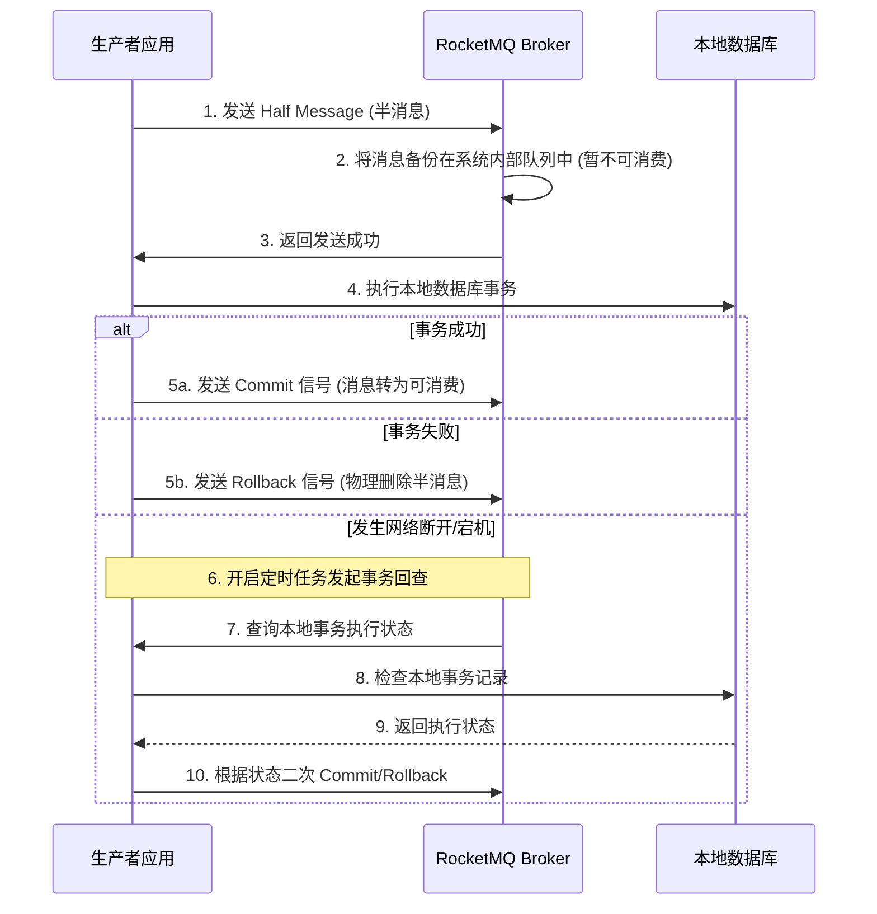

# 八、消息队列底层架构

本章涵盖高吞吐消息队列的硬件吞吐优化、数据不丢失保障、顺序与事务消息设计以及高并发消息积压排产方案。

---

## 57. Kafka 高性能高吞吐的物理基石

Kafka 之所以能实现单机每秒数十万的高吞吐量，主要依赖于对磁盘和操作系统的极致性能压榨。

1. **磁盘顺序写（Sequential Write）**：
   - 传统磁盘的随机读写寻道耗时极长，而顺序写的速度堪比内存。
   - Kafka 的每个分区（Partition）都是一个由大小相等的段（Segment）文件组成的**追加写日志**（Append-only Log）。所有的写操作只在文件末尾进行顺序写入，避免了磁头的来回寻道，使得磁盘 I/O 效率极大提升。
2. **零拷贝（Zero Copy）技术**：
   - **传统网络读取发送**：数据先从磁盘拷贝到内核的页缓存，再拷贝到 JVM 堆内存（用户态），接着拷贝到 Socket 缓冲区（内核态），最后发送到网卡。一共经历了 4 次拷贝与 4 次上下文切换。
   - **Kafka 发送消息**：利用 Linux 的 **`sendfile` 系统调用**。数据从磁盘读取到页缓存后，直接将页缓存中的描述符写入 Socket，网卡直接从页缓存读取数据进行发送。整个过程直接在内核态完成，**数据无需经过 JVM 用户态**，实现了“零拷贝”，使网络发送性能提升数倍。
3. **页缓存（Page Cache）机制**：
   - Kafka 不推荐在 JVM 内部做应用级缓存，而是直接利用操作系统的 Page Cache。
   - 消息写入时只写入到操作系统的 Page Cache 即可宣告成功，后续由 OS 异步刷盘。读取时若能命中 Page Cache 也是极速，并且避免了 JVM 堆内存中频繁 GC 产生的停顿。
4. **消息批量处理与压缩**：
   - 客户端不是单条发送消息，而是会将消息暂存在本地缓冲区，达到一定大小（如 16KB）或超时时间后打包**批量发送**，并在客户端直接进行压缩（支持 Snappy、Lz4、Zstd 格式），大幅降低了网络带宽损耗。

---

## 58. Kafka 数据不丢失配置与 ISR 机制

在对数据可靠性要求极高的场景中，必须配置好消息持久化和同步确认参数。

### ISR（In-Sync Replicas）同步副本集机制

- **Leader 副本**：负责读写流量。
- **Follower 副本**：只负责从 Leader 同步数据。
- **ISR 集合**：包含所有与 Leader 保持同步（数据落后不超过设定阈值）的 Follower 副本集合。
- **动态变动**：如果某个 Follower 在规定时间内（`replica.lag.time.max.ms`）未能向 Leader 发起同步请求，它将被踢出 ISR 集合。只有 ISR 内部的副本才有资格在 Leader 挂掉时被选举为新 Leader。

### 消息不丢失的完整黄金配置

- **发送端（Producer）**：
  - **`acks = -1`（或 `all`）**：这是最安全的级别。Leader 在收到消息后，必须等待 **ISR 集合中所有的 Follower** 全部同步完成，才向客户端返回成功确认。
  - **`retries = 3`**：设置重试次数，应对网络瞬时抖动导致的写入失败。
- **服务端（Broker）**：
  - **`min.insync.replicas = 2`**：限制 ISR 集合中的最小存活副本数。若 ISR 数量少于此配置，Broker 将拒绝写入，防范了只剩 Leader 单点写入导致的数据丢失风险。
  - **`unclean.leader.election.enable = false`**：禁止非 ISR 集合中的 Follower 被选举为 Leader，防止数据倒退。
- **消费端（Consumer）**：
  - **`enable.auto.commit = false`**：**禁用自动提交 Offset**。必须在业务代码完全处理完毕并确保入库后，再通过手动调用 `commitSync()` 提交位移，防止因“先提交后消费崩溃”导致的消息丢失。

---

## 59. 线上消息积压排查与紧急处理

当监控中出现 Consumer Group 的 Lag（积压延迟）持续上升时，说明消费端的处理速度远远落后于生产端的写入速度。

### 紧急排查流程

1. **排查消费端日志**：确认消费端是否发生了频繁的 Full GC、数据库连接池耗尽、或者消费逻辑陷入了死循环。
2. **分析耗时指标**：分析是否由于下游接口变慢，导致单条消息消费处理时延骤增。
3. **确认分区数与消费者数**：Kafka 的并发消费单位是 Partition。一个 Partition 只能被同一个 Consumer Group 中的一个消费者消费。如果消费者数量大于分区数，多出的消费者将无所事事。

### 紧急处理预案

如果积压量巨大（千万级），靠常规消费几乎无法追平，必须采取**临时扩容消费方案**：

1. **临时扩容分区与服务**：
   - 紧急新建一个带有几倍分区数（如 30 个分区）的临时 Topic（Queue）。
   - 编写一个只负责路由转发的临时消费者程序，该程序不执行真实的业务逻辑，只负责快速从积压的 Topic 中拉取数据，并轮询转发写入到新建的临时 Topic 中。
   - 部署 30 台全新的消费者服务，挂在新的临时 Topic 下进行全力并发消费。
   - **效果**：短时间内将消费并发度提升数倍，快速消耗积压数据。
2. **服务恢复后回滚**：积压数据清理完毕后，将所有配置恢复原样，下线临时 Topic 与服务。

---

## 60. 顺序消息与分布式事务消息原理

### 顺序消息（Ordered Message）的实现

在消息队列中，要求局部消息（如同一订单的“创建”、“支付”、“发货”）必须严格按顺序消费。

- **发送端**：必须保证这组消息被路由到**同一个 Partition（Queue）**中。在 Kafka 中，可以通过指定特定的 Key（如 `order_id`）来触发哈希路由：

  ```java
  producer.send(new ProducerRecord<>(topic, orderId, message));
  ```

- **消费端**：在 Kafka 中，一个分区在同一时刻只分配给一个消费者实例，消费者内部必须使用单线程顺序处理，或者使用内存队列进行同 Key 串行化，严禁直接使用普通的多线程线程池打乱顺序。

### RocketMQ 事务消息底层原理

RocketMQ 采用**两阶段提交加补偿回查**的机制实现了可靠的分布式事务消息。



#### 核心机制说明

- **半消息暂存**：Half 消息在发送到 Broker 后，会被自动修改 Topic 名称存入系统级的 `RMQ_SYS_TRANS_HALF_TOPIC` 中，使得消费者暂时无法拉取到该消息，保证了一阶段的安全隔离。
- **事务回查**：如果由于各种原因一阶段后没有任何反馈，RocketMQ 会定期扫描半消息队列，反向调用生产者接口进行状态确认，从而保证了事务的最终一致性。

---

## 61. 重复消费与幂等性防重落地

消息队列在网络抖动、重试或者 Broker 主从倒换时，无法做到绝对的“只消费一次（Exactly Once）”，因此**消费端必须实现幂等去重**。

### 消费幂等落地方案

1. **唯一业务去重表（以订单支付为例）**：
   - 消费端收到消息后，首先获取消息中的唯一业务键（如 `payment_serial_no`）。
   - 将这个业务键插入一张数据库的 `msg_consume_log` 消息去重表中（该字段建有唯一索引）。
   - **流程**：
     - 若插入成功，说明该消息是首次被消费，开启本地事务处理真实业务，处理完毕后提交事务。
     - 若插入抛出主键冲突异常，说明该消息已被处理，消费端直接返回成功，忽略该重复请求。
2. **Redis 标记防重（高并发非强一致场景）**：
   - 消费端拿到消息 ID 或业务 Key，通过 Redis 执行 `SET key value NX PX 3600000`。
   - 如果返回失败，说明消息正在消费中或已消费完毕，直接进行拦截。

---

## 62. 延迟消息底层设计对比

延迟消息指消息发送后，不希望被立即消费，而是等待特定延迟时间后再进行消费。

### 方案对比

- **RocketMQ 固定等级延迟**：
  - **实现**：不支持任意时间设定，只支持 18 个固定时间等级（如 1s, 5s, 10s ... 2h）。
  - **原理**：Broker 内部有 18 个内置的系统级延迟队列（`SCHEDULE_TOPIC_XXXX`）。半消息写入时会被放入对应等级的延迟队列中，系统通过一个定时器（Timer）每隔一段时间拉取该队列，判断时间到期后，将消息还原发回到真实的 Topic 中。
- **Kafka 时间轮（Timing Wheel）**：
  - **原理**：Kafka 内部没有原生延迟 Topic，但其内部管理延迟操作（如请求超时）使用了**层级时间轮**（Hierarchical Timing Wheel）。
  - **设计**：由多个不同刻度的轮槽组成，每个槽代表一定的跨度（如 20ms）。当延迟任务进入时，根据到期时间放入对应的槽中。指针随着时间流逝向前推进，到期的槽中的任务会被依次执行。对于长延迟，当刻度走完一圈时，任务会向下“降级”降落到下一级时间轮中，效率极高。
- **基于 Redis ZSet 自己实现延迟消息**：
  - **实现**：将消息 ID 作为 ZSet 的 `member`，将到期时间的时间戳作为 `score`。
  - **扫描逻辑**：启动分布式定时调度任务，或者使用独立的守护线程，周期性执行：

    ```bash
    ZRANGEBYSCORE delay_queue 0 current_timestamp LIMIT 10
    ```

    获取所有已到期的消息进行消费，消费完成后通过 `ZREM` 原子删除，实现灵活的秒级精确延迟。
