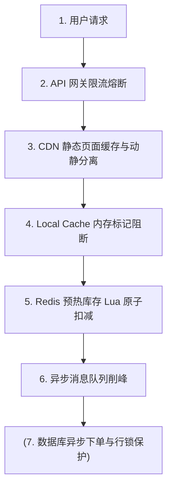
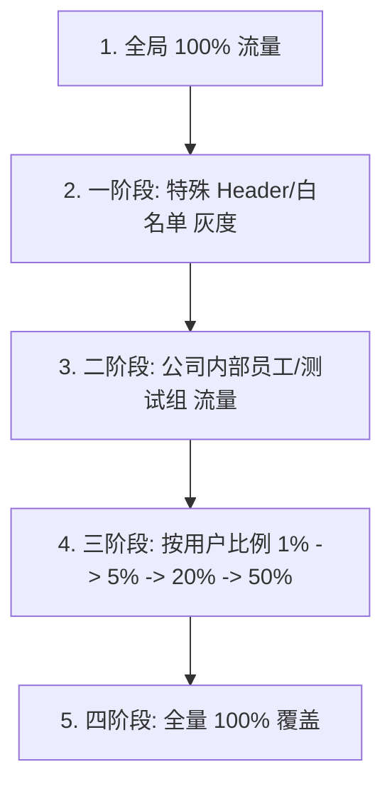

# 九、高并发场景设计

本章涵盖高并发秒杀系统、千万级短链发号器、Feed 流排行榜架构设计、千万级灰度平滑发布以及海量数据处理算法。

---

## 63. 高并发秒杀系统架构设计

秒杀系统具有瞬间流量极大（读多写少）、时效性高、防超卖要求严格的典型特征。

### 架构演进策略



#### 核心设计维度说明

1. **流量削峰与动静分离**：
   - 静态页面和静态资源直接推送到 CDN 边缘节点。
   - 网关层部署严格的限流（如 Sentinel 限流 10% 真实请求进入后端）。
2. **库存预热与 Redis 原子扣减（防超卖）**：
   - 秒杀开始前，提前将商品库存数量加载到 Redis 缓存中。
   - 使用 **Lua 脚本** 实现原子的“查库存 -> 判断 -> 减库存”操作，确保并发状态下不超卖：

     ```lua
     local stock = tonumber(redis.call('get', KEYS[1]))
     if stock and stock > 0 then
         redis.call('decr', KEYS[1])
         return 1
     else
         return 0
     end
     ```

3. **异步下单**：
   - Redis 扣减成功后，立即向客户端返回“排队中...”，同时向消息队列（MQ）发送一条轻量级的下单消息。
   - 后台消费者集群消费消息，异步在数据库中创建订单，生成真实的物理交易，平滑了对数据库的物理冲击压力。

---

## 64. 短链系统架构设计

短链系统用于将长 URL（如数百字节的营销链接）转换为 6 位的短链接（如 `https://t.cn/AbCdEf`），极大地节省了短信字数并便于追踪。

### 发号策略选型

短链的核心是生成唯一的短 Key。6 位的 62 进制数（`[0-9][a-z][A-Z]`）可支持 $62^6 \approx 568$ 亿个短链接。

- **发号器方案**：
  - 采用高性能分布式发号器（如雪花算法、Redis 自增键），生成一个唯一的递增整数（如 `10002345`）。
  - 将该十进制整数转换为 **Base62 编码**，得到一个 6 位以内的字符串，即为短链接 Key。
  - **优势**：绝对唯一，无冲突，生成效率极高。
- **Hash 冲突防范方案**：
  - 直接对长链接进行 MD5 / MurmurHash 计算，截取前 6 位。
  - **解决冲突**：如果发生 Hash 冲突（长 URL 不同但 Hash 相同），则在长 URL 尾部拼接一个随机字符串进行二次 Hash，直到不冲突为止。

### 301 重定向与 302 重定向选择

- **301 永久重定向（Moved Permanently）**：
  - 浏览器收到后，会将其缓存在本地。后续再次访问时，直接从本地缓存中跳转到长 URL，不请求短链服务器。
  - **优缺点**：降低了短链服务器的负载，但**无法精准统计链接的真实点击次数与点击地域**。
- **302 临时重定向（Found）**：
  - 浏览器每次请求短链，都会请求短链服务器，由服务器返回 302 及目标 URL。
  - **优缺点**：虽然增加了短链服务器的请求压力，但**可以实时且精准地收集每次点击的点击量、终端属性与地域数据，便于数据分析**。推荐选用 302。

### 缓存与布隆过滤器防空刷

- 大部分高频短链在被访问时，直接通过 Redis 进行缓存加速（Key 为短链 Key，Value 为长链接）。
- 为了防止黑客构造大量不存在的短链接发起恶意穿透刷爆数据库，在 Redis 之前架设一层**布隆过滤器**，存储所有合法的短链 Key，非法 Key 直接予以拦截。

---

## 65. Feed 流排行榜与计数器架构

### 实时排行榜（Leaderboard）

- **选型**：Redis 的 **ZSet（有序集合）**。
- **设计**：以用户 ID 作为 `member`，以用户的积分/战力作为 `score`。
- **核心命令**：
  - 更新积分：`ZADD rank 9800 user_101`
  - 获取前 10 名：`ZREVRANGE rank 0 9 WITHSCORES`
  - 获取指定用户排名：`ZREVRANK rank user_101`
- **千万级热点 ZSet 拆分优化**：
  - ZSet 在单个 Key 过大且高并发读写时会产生单 Key 瓶颈。
  - **优化**：将排行榜进行分桶设计（如 100 个分桶，根据 `user_id % 100` 路由到不同 ZSet 统计）。当需要全局排行时，定时通过后台任务聚合各分桶的 TopN 数据，在前端做最终展示。

### Feed 流架构设计

Feed 流是指持续展示用户关注好友动态的信息流（如朋友圈、微博）。

- **推模式（Push / 写扩散）**：
  - **机制**：用户发布动态时，直接遍历关注该用户的所有粉丝列表，将这条动态 ID 写入到所有粉丝各自的“收件箱”中。
  - **优缺点**：粉丝读取极快（直接读收件箱），但写代价极大。如果一个大 V（百万粉丝）发一条微博，需要瞬间写上百万次粉丝收件箱，造成写洪峰。
- **拉模式（Pull / 读扩散）**：
  - **机制**：用户发布动态只写入自己的“发件箱”。粉丝刷新时，主动去关注的所有好友的发件箱中拉取动态，并在内存中根据时间线（Timeline）进行 Merge 排序展示。
  - **优缺点**：发布动态极快，但粉丝刷新时读代价大。如果用户关注了上千个好友，刷新会产生大量的聚合查询。
- **混合模式（推拉结合）**：
  - **方案**：对于普通用户，使用推模式（写扩散到粉丝收件箱）；对于拥有超大粉丝量的大 V，发布动态时不进行写扩散，只保留在发件箱中。
  - **读取**：当粉丝（普通用户）刷新时，一方面读取自己收件箱（普通好友推过来的动态），另一方面主动去关注的大 V 的发件箱中拉取，最后在内存中合并展示。

---

## 66. 千万级 QPS 服务平滑灰度上线

要求在千万级 QPS 的庞大业务流量下，在一周内将新服务平滑、无感地灰度发布上线。

### 灰度分段演进策略

灰度发布应遵循“按比例、按维度、由内到外”的原则逐步推进。



### 全链路 Trace 与路由染色

1. **网关染色（Gateway Coloring）**：
   - 流量入口网关（如 Spring Cloud Gateway / APISIX）解析请求属性。
   - 对符合灰度规则（如特定用户区间、特定地域）的请求，在 Request Header 中注入灰度标记 `x-gray-tag: version-2`。
2. **全链路透传（Context Propagation）**：
   - 所有下游微服务（无论是通过 HTTP 的 Feign 还是 RPC 的 Dubbo 调用）都在拦截器中读取这个 Header，并将其通过 Ribbon/Dubbo 路由判定，优先路由给带有 `version-2` 标签（K8s Pod 标签）的灰度服务节点。
   - **可观测性**：配合 Prometheus 与 SkyWalking，实时监控灰度集群的吞吐量、CPU、Error Rate 以及 Full GC 指标，一旦指标出现倾斜或报错，网关自动关闭灰度路由实现秒级回滚。

---

## 67. 海量数据算法处理专题

### TopK 问题（如从 10 亿个数中找出最大的 1000 个数）

- **单机内存不足方案（小顶堆）**：
  1. 建立一个大小为 1000 的**小顶堆**，初始化装入前 1000 个数。
  2. 从第 1001 个数开始遍历数据，与堆顶元素进行比较。
  3. 若当前数大于堆顶元素，则用该数替换堆顶元素，并重新调整小顶堆的结构。
  4. 遍历完毕后，小顶堆中保留的 1000 个数即为最大的 Top1000。
  5. **复杂度**：时间复杂度 $O(N \log K)$，空间复杂度 $O(K)$。
- **分布式集群方案（MapReduce 分治）**：
  1. 将 10 亿个数水平切分存放到 100 个不同的子机器节点上。
  2. 每台机器在本地使用小顶堆找出自己的本地 Top1000。
  3. 将 100 台机器生成的 $100 \times 1000 = 100000$ 个数汇聚到 Master 协调器节点上，由 Master 进行最终的排序，过滤出全局 Top1000。

### 两个大文件（各 100 亿个 URL）找共同 URL

- **痛点**：文件体积巨大（如每个文件上百 GB），无法直接加载到内存中。
- **分治哈希方案（Hash Partitioning）**：
  1. 依次读取文件 A，计算每个 URL 的 Hash 值，通过 `hash(URL) % 1000` 将 URL 写入到 1000 个子文件（$A_0, A_1 ... A_{999}$）中。相同的 URL 必然会被路由到序号相同的子文件中。
  2. 用同样的方法处理文件 B，生成 1000 个子文件（$B_0, B_1 ... B_{999}$）。
  3. 此时，问题被拆解为对比对应的子文件（如 $A_0$ 与 $B_0$）。
  4. **内存匹配**：由于子文件体积仅为原来的千分之一，可以用一个 `HashSet` 将 $A_i$ 载入内存中，然后遍历 $B_i$ 的每一条 URL，检查是否存在于 `HashSet` 中，存在则写入结果集，从而实现了在有限内存下的海量数据高效求交集。
