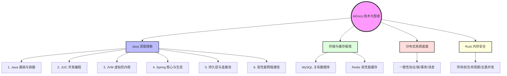

## AiDocs 硬核技术知识库

欢迎来到 **AiDocs**。本知识库是一套专门为中高级软件工程师打造的**系统化、源码级、直击底层原理**的硬核技术知识图谱。

这里不仅有开发框架的常规使用，更涵盖了 JVM 虚拟机内核、高性能网络引擎、分布式一致性协议、关系型数据库底层、无 GC 内存安全以及大厂高并发应急排障实战。

---

## 🗺️ 全景技术图谱

---

## 📂 核心技术专栏导航

### ☕ [Java Core 深度探索](java/readme.md)
从基础容器到 Linux 底层网络，全面打通 Java 专家的技术栈。
- **第一阶段 (基础与并发)**：[Java 集合框架底层源码](java/basic/collection-framework.md) | [AQS 机制与显式锁](java/concurrent/aqs-locks.md) | [线程池 ThreadPoolExecutor 全解](java/concurrent/threadpool.md)
- **第二阶段 (JVM 与调优)**：[内存模型与垃圾回收 (GC)](java/jvm/memory-gc.md) | [类加载体系与字节码强化](java/jvm/classloader-bytecode.md) | [JIT 之逃逸分析](java/jvm/escape-analysis.md)
- **第三阶段 (框架生态)**：[Spring Bean 生命周期与三级缓存](java/spring/bean-lifecycle.md) | [Spring Boot 扩展机制与 SPI](java/spring/springboot-extension.md) | [MyBatis 持久层原理与 SQL 调优](java/persistence/mybatis-hikaricp.md)
- **第四阶段 (高性能与实战)**：[Netty 高性能网络编程](java/network/netty-io.md) | [Arthas 实战与 FGC 救火排查](java/jvm/tuning-tools.md) | [Java 核心面试真题专题](java/readme.md)

---

### 💾 关系型数据库与高性能缓存
在海量高吞吐系统中，数据存储与一致性是系统最脆弱也是最核心的地方。
- **MySQL 关系型数据库**：
  - [InnoDB 索引物理结构与 B+ 树路由](database/mysql/index-engine.md)
  - [InnoDB MVCC 多版本链与 Read View 隔离算法](database/mysql/mvcc-locks.md)
  - [物理回滚日志 (Undo) 与主从复制机制](database/mysql/logs-replication.md)
  - [MySQL 慢查询调优与高性能开发规约](database/mysql/optimization.md)
- **Redis 高性能缓存**：
  - [自研多路复用 I/O 线程模型与核心数据结构](cache/redis/datastructures-io.md)
  - [Redis 哨兵与 Cluster 集群高可用构筑](cache/redis/highavailability.md)
  - [缓存与 MySQL 数据双写强一致性方案](cache/redis/consistency-eviction.md)
  - [击穿、穿透、雪崩工业级防御 (Redisson DCL / 布隆过滤器)](cache/redis/interview-redis.md)

---

### 🌐 [分布式系统核心底盘](distributed/system/lock-zookeeper.md)
探究跨物理机器如何保持协同、数据一致及网络容错。
- **一致性协议**：[Paxos 与 Raft 强一致性共识算法](distributed/system/consensus.md)
- **分布式锁**：[基于 ZooKeeper / Curator 临时顺序节点的排他锁实现](distributed/system/lock-zookeeper.md)
- **分布式事务**：[2PC, 3PC 及 TCC 补偿事务模型底层设计](distributed/system/transactions.md)
- **消息队列**：[高吞吐 RocketMQ / Kafka 零拷贝与 ACK 可靠性模型](distributed/system/message-queue.md)

---

### 🦀 [Rust 极速探索](rust/ownership-lifetimes.md)
进入无 GC、具备编译期内存安全的现代化系统级编程语言领域。
- **所有权与生命周期**：[所有权借用检查器与编译期生命周期约束](rust/ownership-lifetimes.md)
- **内存模型**：[RAII、裸指针、RefCell 与智能指针底层物理内存](rust/memory-management.md)
- **无畏并发**：[Send 与 Sync 约束下的多线程无显示锁高并发安全](rust/concurrency.md)

---

## 🛠️ 开始学习
您可以使用侧边栏菜单进行按模块系统学习，也可以直接点击上述链接跳转到指定章节。如果是在准备面试，每个专题的文章底部都附带了该模块的**核心面试真题与底层源码分析**，祝您斩获心仪的 Offer！
