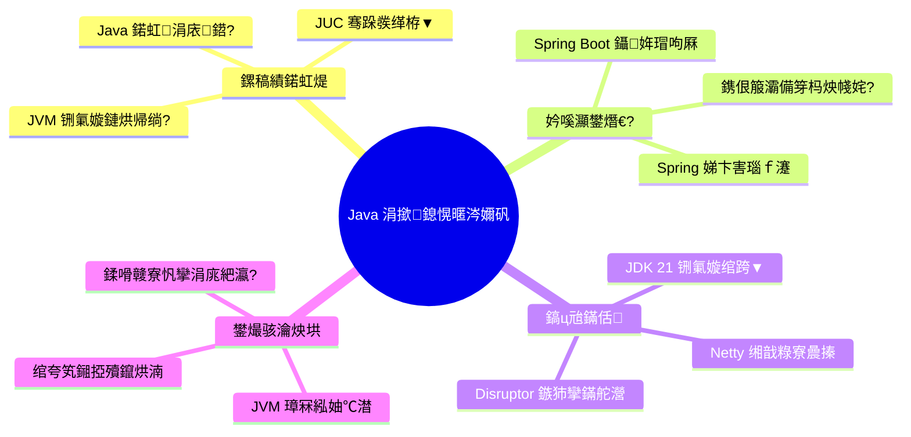

---
title: Java 鏍稿績鎶€鏈煡璇嗕綋绯?
hide_title: true
sidebar_label: 浠嬬粛 & 璺嚎鍥?
sidebar_position: 0
slug: /java/
---

## Java 鏍稿績鎶€鏈煡璇嗕綋绯?

娆㈣繋鏉ュ埌 Java 娣卞害鎺㈢储涔嬫梾銆傛湰浣撶郴鏃ㄥ湪涓鸿拷姹傛瀬鑷存€ц兘銆佹复鏈涙礊瀵熷簳灞傚師鐞嗙殑宸ョ▼甯堟彁渚涗竴濂?**绯荤粺鍖栥€佹簮鐮佺骇** 鐨勭煡璇嗗浘璋便€?

---

## 馃椇锔?宸ョ▼甯堣繘闃惰矾绾垮浘

---

## 绗竴闃舵:鏍稿績鍩虹煶涓庡簳灞傚師鐞?(Core Foundation)

娣卞叆瑙ｆ瀽 Java 璇█鏈€寮曚互涓哄偛鐨勫苟鍙戞ā鍨嬩笌鍐呭瓨鏈哄埗銆?

### 1.1 Java 鍩虹涓庡鍣?(Basic & Collections)

- [Java 鏍稿績鍩虹煶:Object 鏂规硶銆佸紓甯搞€佸弽灏勩€佹硾鍨嬩笌 SPI](basic/1-java-core-fundamentals.md):鍓栨瀽 `Object` 鍏ぇ濂戠害銆佸紓甯镐綋绯汇€佸弽灏勪笌 `MethodHandle`銆佹硾鍨嬫摝闄や笌妗ユ帴鏂规硶銆佹敞瑙ｄ笌 SPI 鎵╁睍銆?
- [Java 鍩虹涓庨泦鍚堟牳蹇冮潰璇曠湡棰榏(basic/3-interview-basic.md):娣卞叆搴曞眰鍓栨瀽 `String` 涓嶅彲鍙樻€с€乣HashMap` 涓?`ConcurrentHashMap` 鎵╁婕旇繘鏈哄埗銆?
- [Java 闆嗗悎妗嗘灦搴曞眰婧愮爜娣卞墫](basic/0-collection-framework.md):鎺㈢┒ `ArrayList`銆乣LinkedList` 鐗╃悊缁撴瀯,娣卞害瑙ｆ瀽 `LinkedHashMap` 鏋勭瓚 LRU 鍙?`TreeMap` 绾㈤粦鏍戞棆杞钩琛°€?
- [Java 鏂扮壒鎬ф紨杩涗笌鏍稿績搴曞眰鍘熺悊](basic/2-java8-21-features.md):鍓栨瀽 Lambda `invokedynamic`銆丼tream 鎯版€ф眰鍊间笌 JDK 21 铏氭嫙绾跨▼ Carrier 璋冨害鏈哄埗銆?

### 1.2 JUC 楂樺苟鍙戞繁搴﹀疄璺?(Concurrency)

- [JMM 鍐呭瓨妯″瀷涓?happens-before 鍘熺悊](concurrent/0-jmm-memory-model.md):鍥捐В MESI 涓庡唴瀛樺睆闅?鎺ㄥ volatile 鍙岄噸璇箟涓?happens-before 鍏ぇ瑙勫垯銆?
- [AQS 鏈哄埗涓庢樉寮忛攣瀹炵幇](concurrent/1-aqs-locks.md):娣卞叆 AQS `state` 鍙橀噺涓庡弻鍚?CLH 闃熷垪,瀵规瘮鍏钩涓庨潪鍏钩閿併€?
- [HashMap 涓?ConcurrentHashMap 婧愮爜](concurrent/2-hashmap-concurrenthashmap.md):浠?JDK 7 鍒?8 鐨勬紨杩?閫忔瀽妗堕攣涓?CAS銆?
- [ThreadLocal 涓?CAS 鏍稿績瑙ｆ瀽](concurrent/3-threadlocal-cas.md):鍥捐В鍐呭瓨娉勬紡鎴愬洜鍙?`LongAdder` 鍒嗘鐑偣浼樺寲銆?
- [绾跨▼姹?ThreadPoolExecutor 鍏ㄨВ](concurrent/4-threadpool.md):鎺屾彙 `ctl` 浣嶈繍绠椾笌鍔ㄦ€佽皟浼樻€濊矾銆?
- [CompletableFuture 寮傛缂栨帓涓庡簳灞傚師鐞哴(concurrent/5-completable-future.md):鍥炶皟閾俱€丆ompletion 鏍堜笌 `tryFire` 妯″瀷,鐢熶骇绾ф湇鍔¤仛鍚堢綉鍏冲疄鎴樸€?
- [骞跺彂瀹瑰櫒涓庡悓姝ュ伐鍏锋簮鐮佺簿鏋怾(concurrent/6-concurrent-collections-sync.md):`CountDownLatch`銆乣CyclicBarrier`銆乣Semaphore`銆丆OW 闆嗗悎涓庢棤閿侀槦鍒楀叏鏅姣斻€?

### 1.3 JVM 铏氭嫙鏈哄唴鏍?(Virtual Machine)

- [鍐呭瓨妯″瀷涓庡瀮鍦惧洖鏀?(GC)](jvm/0-memory-gc.md):浠庝笁鑹叉爣璁板埌 ZGC 鏌撹壊鎸囬拡銆佽灞忛殰鎶€鏈€?
- [绫诲姞杞戒綋绯讳笌瀛楄妭鐮佸己鍖朷(jvm/1-classloader-bytecode.md):瑙ｆ瀯鍙屼翰濮旀淳妯″瀷鍙?Java Agent 鍔ㄦ€佹彃妗╁師鐞嗐€?
- [JIT 杩涢樁涔嬮€冮€稿垎鏋怾(jvm/2-escape-analysis.md):瑙ｅ瘑鏍囬噺鏇挎崲涓庨攣娑堥櫎銆?

---

## 绗簩闃舵:浼佷笟绾ф鏋舵繁搴﹀墫鏋?(Framework Ecosystem)

涓嶄粎浠呮槸浣跨敤,鏇磋鎺屾彙 Spring 瀹囧畽鐨勮繍鍔ㄨ寰嬨€?

### 2.1 Spring 鏍稿績鍏ㄦ櫙

- [IoC 瀹瑰櫒涓?Bean 鐢熷懡鍛ㄦ湡](spring/0-bean-lifecycle.md):浠庡疄渚嬪寲鍒伴攢姣佺殑 $4$ 闃舵鍏ㄦ祦绋嬨€?
- [AOP 鍔ㄦ€佷唬鐞嗕笌閾惧紡璋冪敤](spring/1-ioc-aop.md):瑙ｅ瘑涓轰粈涔堝彧鏈変笁绾х紦瀛樿兘瑙ｅ喅 AOP 寰幆渚濊禆銆?
- [BeanDefinition 涓庡鍣ㄥ垵濮嬪寲](spring/2-beandefinition-internals.md):鎺㈢储 Spring 濡備綍鎰熺煡寮€鍙戣€呭畾涔夌殑 Bean 涓庨厤缃被 CGLIB 澧炲己鍘熺悊銆?
- [Context Refresh 鍒锋柊娴佺▼](spring/3-spring-context-refresh.md):娣卞害鎷嗚В Spring 瀹瑰櫒鍚姩鐨?$12$ 涓牳蹇冩楠や笌鍚庣疆澶勭悊鍣ㄦ墽琛岄『搴忋€?
- [澹版槑寮忎簨鍔℃満鍒朵笌澶辨晥鍦烘櫙](spring/4-transaction.md):浠?`TransactionInterceptor` 璋冪敤閾惧埌 ThreadLocal 杩炴帴缁戝畾,杩樺師 $12$ 绉嶅け鏁堟牴鍥犮€?
- [Spring 甯哥敤娉ㄨВ鍙婂叾搴曞眰鍘熺悊瑙ｆ瀽](spring/5-annotations.md):鍓栨瀽 `@Autowired`銆乣@Resource` 涓?`@Configuration` 鐨勮閰嶆敞鍏ラ摼璺€?
- [Spring 甯哥敤璁捐妯″紡婧愮爜绾ф繁搴﹁В鏋怾(spring/6-design-patterns.md):鎺㈢┒宸ュ巶銆佸崟渚嬨€佷唬鐞嗐€佹ā鏉挎柟娉曚笌瑙傚療鑰呮ā寮忕瓑鍦?Spring 婧愮爜涓殑钀藉湴銆?
- [Spring 浜嬩欢椹卞姩鏈哄埗涓庝笟鍔¤В鑰(spring/7-spring-events.md):瑙ｅ瘑浜嬩欢鍙戝竷骞挎挱鍣ㄥ師鐞嗕笌浜嬪姟鍚屾鍣?`@TransactionalEventListener` 鐨?Phase 闃舵銆?

### 2.2 Spring MVC 璇锋眰澶勭悊妯″瀷

- [Spring MVC 宸ヤ綔娴佽璁(spring/8-springmvc-principles.md):鐞嗚В `DispatcherServlet` 涓?`HandlerMapping` 鐨勫崗浣溿€?
- [Spring MVC 楂樼骇寮哄寲鐗规€(spring/9-springmvc-advanced.md):鎷︽埅鍣ㄣ€佽繃婊ゅ櫒涓庡弬鏁拌В鏋愬櫒娣卞害瀹氬埗銆?

### 2.3 Spring Boot 涓庡井鏈嶅姟搴曞骇

- [Spring Boot 鍚姩鍘熺悊涓庤嚜鍔ㄨ閰峕(spring/10-springboot-core.md):瑙ｆ瀯 `@EnableAutoConfiguration` 涓?`spring.factories`銆?
- [Spring Boot 鏍稿績鍐呴儴鏈哄埗](spring/11-springboot-internals.md):`Environment` 鐜鎶借薄涓庣洃鍚櫒妯″紡銆?
- [Spring Boot 鎵╁睍鏈哄埗涓?SPI 鍘熺悊](spring/12-springboot-extension.md):瑙ｆ瀽 Spring SPI 宸ュ巶鍔犺浇鍣ㄣ€佽嚜瀹氫箟 Starter 娴佺▼鍙婄敓鍛藉懆鏈熸墿灞曠偣銆?
- [Spring Boot FatJar 杩愯鏈哄埗](spring/13-springboot-fatjar.md):瑙ｅ瘑濡備綍閫氳繃 `JarLauncher` 鍔犺浇宓屽 Jar銆?
- [Spring Boot 楂樼骇鎵╁睍涓庤皟浼榏(spring/14-springboot-advanced.md):鑷畾涔?Starter 涓?Endpoint 鐩戞帶銆?
- [Spring 鐢熸€佹紨杩涗笌 Spring Cloud 缁撳悎](spring/15-springboot-springcloud.md):浠?Boot 鍒板垎甯冨紡寰湇鍔℃灦鏋勩€?

### 2.4 鎸佷箙灞傘€佽繛鎺ユ睜涓庣紦瀛?(Persistence & Cache)

- [MyBatis 鎸佷箙灞傚師鐞嗕笌 HikariCP 杩炴帴姹燷(persistence/0-mybatis-hikaricp.md):HikariCP 鏃犻攣鍖?`LocalBag` 瀹瑰櫒涓?MyBatis 鎻掍欢璐ｄ换閾俱€?
- [Spring Cache 缂撳瓨鎶借薄涓庡０鏄庡紡缂撳瓨鍘熺悊](spring/16-spring-cache.md):鍓栨瀽 AOP 缂撳瓨鎷︽埅鍣ㄣ€丼pEL 閿敓鎴愪互鍙婂嚮绌?绌块€?闆穿鐨勭敓浜х骇闃叉姢銆?

---

## 绗笁闃舵:楂樻€ц兘璁＄畻涓庨€氫俊 (Performance)

鍦ㄥ井绉掔骇绔炰簤涓?鎺㈢储 Linux 搴曞眰涓庣‖浠剁紦瀛樼殑鏋侀檺銆?

- [JDK NIO 鏍稿績涓変欢濂?Channel銆丅uffer 涓?Selector](network/0-jdk-nio-fundamentals.md):Buffer 鐘舵€佹満銆丆hannel 闈為樆濉炪€丼elector 澶氳矾澶嶇敤涓?Reactor 闆忓舰銆?
- [Netty 楂樻€ц兘缃戠粶缂栫▼搴曞骇](network/1-netty-io.md):Epoll 绌鸿疆璇?Bug 瑙勯伩涓庡爢澶栧唴瀛橀浂鎷疯礉銆?
- [Netty 闆舵嫹璐濅笌 ByteBuf 鍐呭瓨绠＄悊](network/2-netty-zero-copy-buf.md):娣卞害鎷嗚В鐩存帴鍐呭瓨銆丆ompositeByteBuf銆佸熀浜?Jemalloc 鎬濇兂鐨?PoolArena 鍐呭瓨鍒嗛厤浣撶郴鍙婅櫄寮曠敤娉勬紡妫€娴嬨€?
- [JDK 21 铏氭嫙绾跨▼璇﹁В](concurrent/7-virtual-threads.md):瑙ｅ瘑杩愯鍦ㄧ敤鎴锋€佺殑杞婚噺鍗忕▼妯″瀷銆?
- [Disruptor 鏃犻攣鐜舰闃熷垪](concurrent/8-disruptor.md):LMAX 鏋舵瀯涓嬬殑棰勫垎閰嶄笌闆?GC 鏈哄埗銆?
- [CPU Cache Line 浼叡浜皟浼榏(concurrent/9-cache-line-sharing.md):浣跨敤 `@Contended` 娑堥櫎 MESI 鍗忚绔炰簤銆?

---

## 绗洓闃舵:鐢熶骇绾у疄鎴樹笌闈㈣瘯澶嶇洏 (Workshop)

- [鎬ц兘璇婃柇涓庡湪绾挎帓闅滆壓鏈痌(jvm/3-tuning-tools.md):Arthas 瀹炴垬涓?MAT 鍐呭瓨娉勯湶杩借釜銆?
- [绾夸笂鏁呴殰娣卞害澶嶇洏璁板綍](jvm/4-prod-troubleshooting-cases.md):鍥涘ぇ缁忓吀 OOM 涓?CPU $100\%$ 鏍瑰洜鍒嗘瀽銆?
- [JVM 鍚姩鍙傛暟榛勯噾閰嶇疆妯℃澘](jvm/5-prod-practice.md):鍦ㄧ敓浜х幆澧冮厤缃?G1/ZGC銆?

- **鏍稿績闈㈣瘯鐪熼涓庡簳灞傚師鐞嗕笓棰?*

  - [Java 鍩虹涓庨泦鍚堥潰璇曠湡棰榏(basic/3-interview-basic.md)
  - [JUC 骞跺彂缂栫▼闈㈣瘯鐪熼](concurrent/10-interview-concurrent.md)
  - [JVM 铏氭嫙鏈洪潰璇曠湡棰榏(jvm/6-interview-jvm.md)
  - [Spring 妗嗘灦鐢熸€侀潰璇曠湡棰榏(spring/31-interview-spring.md)
  - [MySQL 鍏崇郴鍨嬫暟鎹簱闈㈣瘯鐪熼](../database/mysql/7-interview-mysql.md)
  - [Redis 楂樻€ц兘缂撳瓨闈㈣瘯鐪熼](../cache/redis/6-interview-redis.md)

---

## 鍒嗗竷寮忚仈鍔ㄦ帹鑽?

- **鍒嗗竷寮忛攣瀹炵幇**:鍏宠仈瀛︿範 [鍒嗗竷寮?ZooKeeper 閿乚(../distributed/system/lock-zookeeper.md)銆?
- **鍒嗗竷寮忕紦瀛?*:鍏宠仈瀛︿範 [Redis 楂樺苟鍙戝満鏅痌(../cache/redis/4-scenarios.md)銆?
