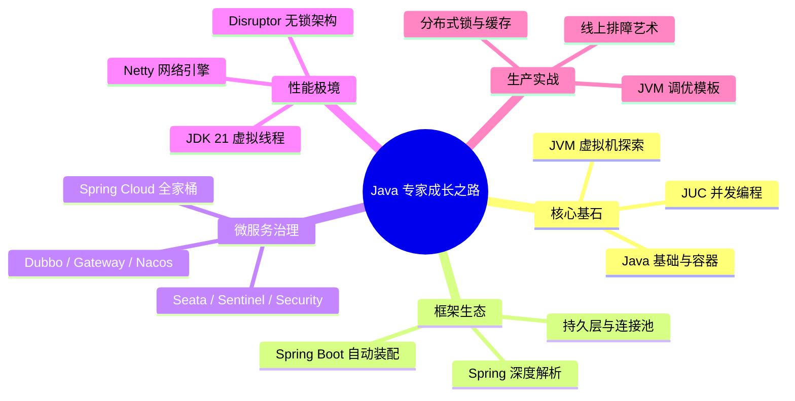

## Java 核心技术知识体系

欢迎来到 Java 深度探索之旅。本体系旨在为追求极致性能、渴望洞察底层原理的工程师提供一套 **系统化、源码级** 的知识图谱。

---

## 工程师进阶路线图

---

## 第一阶段：核心基石与底层原理 (Core Foundation)

深入解析 Java 语言最引以为傲的并发模型与内存机制。

### 1.1 Java 基础与容器 (Basic & Collections)

- [Java 集合框架底层源码深剖](basic/0-collection-framework.md)：探究 `ArrayList`、`LinkedList` 物理结构，深度解析 `LinkedHashMap` 构筑 LRU 及 `TreeMap` 红黑树旋转平衡。
- [Java 核心基石：Object 方法、异常、反射、泛型与 SPI](basic/1-java-core-fundamentals.md)：剖析 `Object` 六大契约、异常体系、反射与 `MethodHandle`、泛型擦除与桥接方法、注解与 SPI 扩展。
- [Java 新特性演进与核心底层原理](basic/2-java8-21-features.md)：剖析 Lambda `invokedynamic`、Stream 惰性求值与 JDK 21 虚拟线程 Carrier 调度机制。
- [Java 引用体系与 Cleaner 机制](basic/5-references-cleaner.md)：全面梳理强软弱虚四级引用特性，详解 Cleaner 机制对废弃 `finalize` 析构方法的完美替代。
- [Java 基础与集合核心面试真题](../interview/java/3-interview-basic.md)：深入底层剖析 `String` 不可变性、`HashMap` 与 `ConcurrentHashMap` 扩容演进机制。
- [Java I/O 体系与序列化深剖](basic/4-io-serialization.md)：探究字节流与字符流关系、`BufferedInputStream` 内部缓冲区、装饰器模式应用，以及 Java 原生序列化和第三方协议对比。

### 1.2 JUC 高并发深度实践 (Concurrency)

- [JMM 内存模型与 happens-before 原理](concurrent/0-jmm-memory-model.md)：图解 MESI 与内存屏障，推导 volatile 双重语义与 happens-before 八大规则。
- [AQS 机制与显式锁实现](concurrent/1-aqs-locks.md)：深入 AQS `state` 变量与双向 CLH 队列，对比公平与非公平锁。
- [AQS ConditionObject 核心机制](concurrent/13-condition-object-internals.md)：深度解密 AQS 内部双队列协同、线程物理挂起与节点迁移、以及中断两阶段退出的核心算法。
- [HashMap 与 ConcurrentHashMap 源码](concurrent/2-hashmap-concurrenthashmap.md)：从 JDK 7 到 8 的演进，透析桶锁与 CAS。
- [ThreadLocal 与 CAS 核心解析](concurrent/3-threadlocal-cas.md)：图解内存泄漏成因及 `LongAdder` 分段热点优化。
- [Unsafe 类与 JDK 9+ VarHandle 内存访问](concurrent/12-varhandle-unsafe.md)：探究 JVM Unsafe 危险黑魔法、`VarHandle` 精细化多级内存屏障及五大访问控制模式。
- [线程池 ThreadPoolExecutor 全解](concurrent/4-threadpool.md)：掌握 `ctl` 位运算与动态调优思路。
- [CompletableFuture 异步编排与底层原理](concurrent/5-completable-future.md)：回调链、Completion 栈与 `tryFire` 模型，生产级服务聚合网关实战。
- [并发容器与同步工具源码精析](concurrent/6-concurrent-collections-sync.md)：`CountDownLatch`、`CyclicBarrier`、`Semaphore`、COW 集合与无锁队列全景对比。
- [JDK 21 虚拟线程详解](concurrent/7-virtual-threads.md)：解密运行在用户态的轻量协程模型。
- [Disruptor 无锁环形队列](concurrent/8-disruptor.md)：LMAX 架构下的预分配与零 GC 机制。
- [CPU Cache Line 伪共享调优](concurrent/9-cache-line-sharing.md)：使用 `@Contended` 消除 MESI 协议竞争。
- [JUC 并发编程面试真题](../interview/java/10-interview-concurrent.md)：AQS、线程池、并发容器与虚拟线程高频考点复盘。
- [ForkJoinPool 与并行流原理](concurrent/11-forkjoin-parallelstream.md)：解密分治法与工作窃取（Work-Stealing）底层机制，拆解全局共享 commonPool 的性能饥饿与并行流线程安全陷阱。

### 1.3 JVM 虚拟机内核 (Virtual Machine)

- [内存模型与垃圾回收 (GC)](jvm/0-memory-gc.md)：从三色标记到 ZGC 染色指针、读屏障技术。
- [类加载体系与字节码强化](jvm/1-classloader-bytecode.md)：解构双亲委派模型及 Java Agent 动态插桩原理。
- [Tomcat & OSGi 类加载隔离与打破双亲委派实战](jvm/6-classloader-plugins.md)：以 Tomcat 与 OSGi 拓扑为例，拆解类隔离、JSP 独立刻画及插件热插拔卸载与元空间防泄露内核。
- [JDK 演进：GraalVM AOT 与静态编译](jvm/7-graalvm-aot.md)：深剖提前编译、封闭性假设、初始化时空分类及 Spring Native 毫秒冷启和极低 RSS 调优。
- [JIT 进阶之逃逸分析](jvm/2-escape-analysis.md)：解密标量替换与锁消除。
- [性能诊断与在线排障艺术](jvm/3-tuning-tools.md)：Arthas 实战与 MAT 内存泄露追踪。
- [线上故障深度复盘记录](jvm/4-prod-troubleshooting-cases.md)：四大经典 OOM 与 CPU 100% 根因分析。
- [JVM 启动参数黄金配置模板](jvm/5-prod-practice.md)：在生产环境配置 G1/ZGC。
- [JVM 虚拟机面试真题](../interview/java/6-interview-jvm.md)：GC、类加载、调优与故障排查高频考点。

---

## 第二阶段：企业级框架深度剖析 (Framework Ecosystem)

不仅仅是使用，更要掌握 Spring 宇宙的运动规律。

### 2.1 Spring 核心全景

- [IoC 容器与 Bean 生命周期](spring/core/0-bean-lifecycle.md)：从实例化到销毁的 4 阶段全流程。
- [AOP 动态代理与链式调用](spring/core/1-ioc-aop.md)：解密为什么只有三级缓存能解决 AOP 循环依赖。
- [BeanDefinition 与容器初始化](spring/core/2-beandefinition-internals.md)：探索 Spring 如何感知开发者定义的 Bean 与配置类 CGLIB 增强原理。
- [Context Refresh 刷新流程](spring/core/3-spring-context-refresh.md)：深度拆解 Spring 容器启动的 12 个核心步骤与后置处理器执行顺序。
- [声明式事务机制与失效场景](spring/core/4-transaction.md)：从 `TransactionInterceptor` 调用链到 ThreadLocal 连接绑定，还原 12 种失效根因。
- [Spring 常用注解及其底层原理解析](spring/core/5-annotations.md)：剖析 `@Autowired`、`@Resource` 与 `@Configuration` 的装配注入链路。
- [Spring 常用设计模式源码级深度解析](spring/core/6-design-patterns.md)：探究工厂、单例、代理、模板方法与观察者模式等在 Spring 源码中的落地。
- [Spring 事件驱动机制与业务解耦](spring/core/7-spring-events.md)：解密事件发布广播器原理与事务同步器 `@TransactionalEventListener` 的 Phase 阶段。
- [Spring AOP 代理选择与切面链路](spring/core/17-aop-proxy-chain.md)：JDK/CGLIB 代理选型、切面链构建与执行顺序。
- [Spring 循环依赖深度进阶](spring/core/18-circular-dependency-advanced.md)：构造器注入边界、`@Async` 导致循环依赖崩溃的根因与避坑。
- [Spring 核心扩展点与 SPI](spring/core/20-extension-points-spi.md)：`BeanPostProcessor`、`BeanFactoryPostProcessor` 与 `SpringFactoriesLoader`。

### 2.2 Spring MVC 请求处理模型

- [Spring MVC 工作流设计](spring/mvc/8-springmvc-principles.md)：理解 `DispatcherServlet` 与 `HandlerMapping` 的协作。
- [Spring MVC 高级强化特性](spring/mvc/9-springmvc-advanced.md)：拦截器、过滤器与参数解析器深度定制。
- [Spring MVC 执行流程与远程调用](spring/mvc/22-mvc-remote-call.md)：`RestTemplate`、Feign 动态代理与负载均衡调用链路。
- [反应式编程规范与响应式 WebFlux 底层设计](spring/mvc/23-reactive-webflux.md)：深剖 Thread-per-Request (Servlet) 与 Event-Loop 线程模型对决、Project Reactor (Flux/Mono) 核心机制及 Schedulers 线程漂移、生产级无损排障实战。

### 2.3 Spring Boot 与自动装配

- [Spring Boot 启动原理与自动装配](spring/boot/10-springboot-core.md)：解构 `@EnableAutoConfiguration` 与 `spring.factories`。
- [Spring Boot 核心内部机制](spring/boot/11-springboot-internals.md)：`Environment` 环境抽象与监听器模式。
- [Spring Boot 扩展机制与 SPI 原理](spring/boot/12-springboot-extension.md)：解析 Spring SPI 工厂加载器、自定义 Starter 流程及生命周期扩展点。
- [Spring Boot FatJar 运行机制](spring/boot/13-springboot-fatjar.md)：解密如何通过 `JarLauncher` 加载嵌套 Jar。
- [Spring Boot 高级扩展与调优](spring/boot/14-springboot-advanced.md)：自定义 Starter 与 Endpoint 监控。
- [Spring Boot 条件装配与自动配置内核](spring/boot/29-springboot-conditional-autoconfig.md)：`@Conditional` 家族与 `AutoConfigurationImportSelector`。
- [Spring Cache 缓存抽象与声明式缓存原理](spring/boot/16-spring-cache.md)：剖析 AOP 缓存拦截器、SpEL 键生成以及击穿/穿透/雪崩的生产级防护。
- [Spring Security 安全架构与过滤器链](spring/boot/28-spring-security-architecture.md)：`SecurityFilterChain`、认证授权流程与 CSRF/JWT 避坑。

### 2.4 Spring Cloud 微服务与中间件

- [Spring Boot 生态演进与 Spring Cloud 结合](spring/cloud/15-springboot-springcloud.md)：从 Boot 到分布式微服务架构。
- [Spring Cloud 微服务起步](spring/cloud/30-springcloud-quickstart.md)：架构演进与全家桶协同实战。
- [Dubbo 核心架构与高性能 RPC](spring/cloud/19-dubbo-rpc-kernel.md)：10 层架构、自适应 SPI 与 Netty 异步双工通信。
- [Spring Cloud Gateway 流量入口](spring/cloud/21-gateway-advanced.md)：Route / Predicate / Filter 与令牌桶限流。
- [Nacos 动态配置管理与多租户隔离](spring/cloud/23-nacos-config-advanced.md)：配置推送、命名空间隔离与热更新。
- [Seata AT 模式内核](spring/cloud/24-seata-at-kernel.md)：无锁化两阶段提交原理。
- [Seata 分布式事务全解](spring/cloud/25-seata-distributed-transaction.md)：AT 模式深度剖析与实战。
- [Sentinel 滑动窗口与限流算法](spring/cloud/26-sentinel-algorithm-core.md)：`LeapArray` 与高性能限流内核。
- [Sentinel 流量治理与故障容错](spring/cloud/27-sentinel-governance.md)：熔断、降级与系统自适应保护。
- [微服务可观测性：Spring Boot 3.x/Cloud Micrometer 与 OpenTelemetry 链路透传](spring/cloud/32-microservices-observability.md)：精剖三位一体可观测性设计，详解 W3C 跨网络连接拦截、Logback traceId MDC 持久化以及线程池自愈。
- [Spring 框架生态面试真题](../interview/java/31-interview-spring.md)：IoC、AOP、事务、Boot 与微服务高频考点。

### 2.5 持久层与连接池 (Persistence)

- [MyBatis 持久层原理与 HikariCP 连接池](persistence/0-mybatis-hikaricp.md)：HikariCP 无锁化 `LocalBag` 容器与 MyBatis 插件责任链。
- [Druid 连接池内核机制精剖与 HikariCP 对比调优](persistence/3-druid-connection-pool.md)：分析 Druid 基于 AST 语法解析的防 SQL 注入规则，连接泄露精确追踪与弹性保活（keep-alive），以及两大连接池大厂参数对比调优模板。
- [分布式架构：ShardingSphere 分库分表与读写分离内核机制精剖](persistence/4-sharding-sphere.md)：梳理千万级大表 B+ 树寻址痛点，精剖 ShardingSphere 进行 SQL 解析、路由、改写、执行及合并的五部曲核心流，并给出读写分离 100ms 延迟下的 Hint 主库强制自愈实战方案。
- [MyBatis 核心组件与 SQL 执行全流程](persistence/1-mybatis-core-flow.md)：从 `SqlSessionFactory` 到 `ResultSet` 映射的完整链路。
- [MyBatis 插件原理与二级缓存](persistence/2-mybatis-cache-plugin.md)：拦截器责任链、一二级缓存与 Redis integration。
- [MyBatis 与连接池面试真题](../interview/java/3-interview-mybatis.md)：Executor、缓存、插件与 HikariCP 高频考点。

---

## 第三阶段：高性能计算与通信 (Performance)

在微秒级竞争中，探索 Linux 底层与硬件缓存的极限。

- [JDK NIO 核心三件套：Channel、Buffer 与 Selector](network/0-jdk-nio-fundamentals.md)：Buffer 状态机、Channel 非阻塞、Selector 多路复用与 Reactor 雏形。
- [Netty 高性能网络编程底座](network/1-netty-io.md)：Epoll 空轮询 Bug 规避与堆外内存零拷贝。
- [Netty 零拷贝与 ByteBuf 内存管理](network/2-netty-zero-copy-buf.md)：深度拆解直接内存、CompositeByteBuf、基于 Jemalloc 思想的 PoolArena 内存分配体系及虚引用泄漏检测。
- [Netty 快速起步](network/3-netty-quickstart.md)：从 Hello World 走进高性能网络编程。
- [Netty 协议编解码实战](network/4-netty-codec-practice.md)：粘包拆包、长度域协议与序列化选型。
- [Netty 心跳保活与断线重连](network/5-netty-heartbeat.md)：IdleStateHandler 与客户端重连策略。
- [Netty HTTP 与 WebSocket](network/6-netty-http-websocket.md)：HTTP 服务与长连接实战。
- [Netty 简易 RPC 框架实战](network/7-netty-rpc-practice.md)：编解码 + 心跳 + 异步调用组装完整 RPC。
- [Netty 与 NIO 面试真题](../interview/java/8-interview-netty.md)：Reactor、ByteBuf、粘包拆包与 RPC 高频考点。

---

## 第四阶段：生产级实战与面试复盘 (Workshop)

- [性能诊断与在线排障艺术](jvm/3-tuning-tools.md)：Arthas 实战与 MAT 内存泄露追踪。
- [线上故障深度复盘记录](jvm/4-prod-troubleshooting-cases.md)：四大经典 OOM 与 CPU 100% 根因分析。
- [JVM 启动参数黄金配置模板](jvm/5-prod-practice.md)：在生产环境配置 G1/ZGC。

### 🚀 2026 特别企划

- **[2026 Java 后端核心考点突击指南](../interview/java/0-intro.md)**：包含 70 道黄金面试题，直击 Java 21-26 新特性、虚拟线程、Spring Boot 4.0、大模型接入及云原生实战。

### 核心面试真题与底层原理专题

- [Java 基础与集合面试真题](../interview/java/3-interview-basic.md)
- [JUC 并发编程面试真题](../interview/java/10-interview-concurrent.md)
- [JVM 虚拟机面试真题](../interview/java/6-interview-jvm.md)
- [Spring 框架生态面试真题](../interview/java/31-interview-spring.md)
- [MyBatis 与连接池面试真题](../interview/java/3-interview-mybatis.md)
- [Netty 与 NIO 面试真题](../interview/java/8-interview-netty.md)
- [MySQL 关系型数据库面试真题](../interview/database/7-interview-mysql.md)
- [Redis 高性能缓存面试真题](../interview/cache/6-interview-redis.md)

---

## 分布式联动推荐

- **分布式锁实现**：关联学习 [分布式 ZooKeeper 锁](../distributed/system/1-lock-zookeeper.md)。
- **分布式缓存**：关联学习 [Redis 高并发场景](../cache/redis/4-scenarios.md)。
- **分布式事务**：关联学习 [Seata 分布式事务全解](spring/cloud/25-seata-distributed-transaction.md)。
- **流量治理**：关联学习 [Sentinel 流量治理](spring/cloud/27-sentinel-governance.md)。
