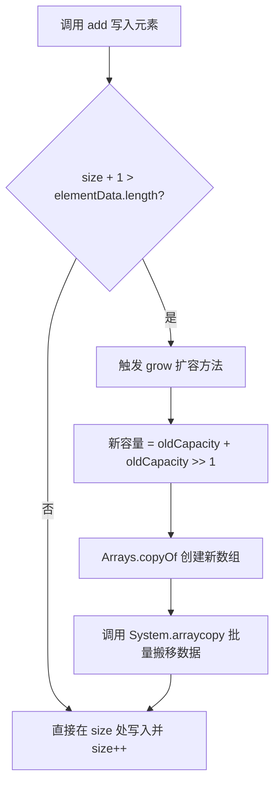
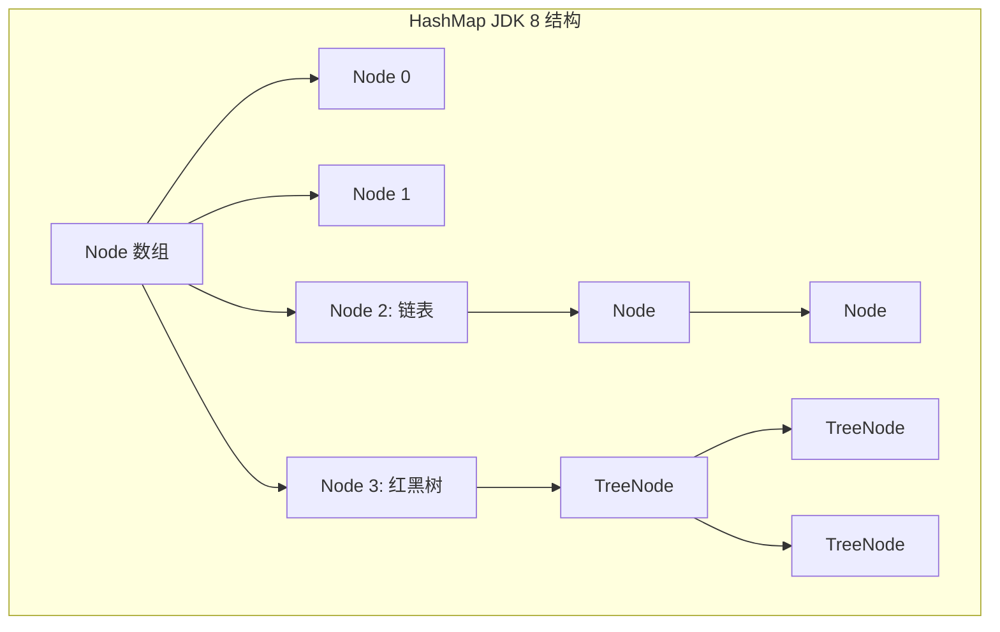
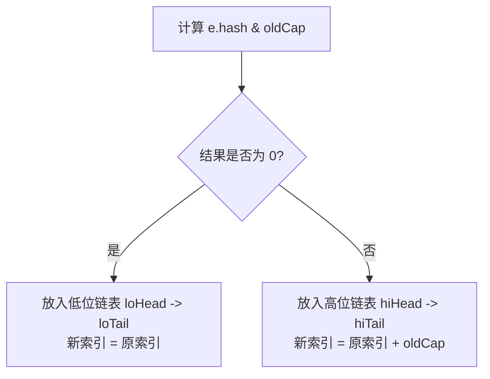
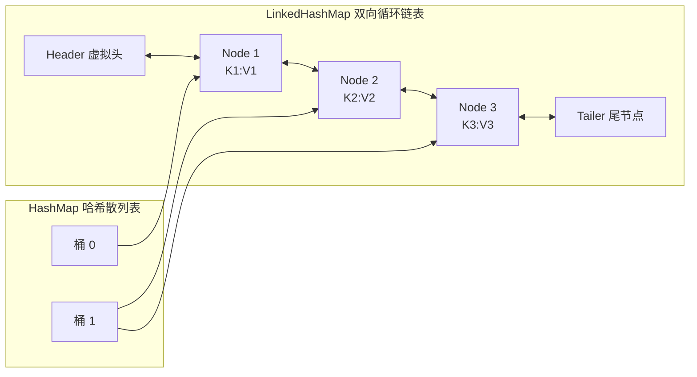

## 深入 Java 集合框架源码与物理结构

在 Java 面试与高并发生产实战中，集合框架（Java Collections Framework）是承载数据的底层容器基石。理解它们不仅要停留在“如何使用”，更要深入到 JDK 底层源码，透解其数据结构设计、扩容物理代价以及排序和顺序控制机制。

本篇将深度剖析 `ArrayList`、`LinkedList`、`HashMap`、`LinkedHashMap` 以及 `TreeMap` 核心源码与底层演进。

---

## 一、 ArrayList 动态数组核心源码剖析

`ArrayList` 底层是一个 **Object 数组**（`transient Object[] elementData`），提供 $O(1)$ 的随机访问性能，但在随机插入与删除时，需要通过物理内存拷贝来搬移数据，性能开销呈 $O(N)$。

### 1. 延迟初始化与默认容量

在 JDK 8 及之后，为了节约内存开销，在执行 `new ArrayList()` 时，并不会立即在堆内存中创建大小为 10 的数组，而是让底层数组指向一个空数组常量 `DEFAULTCAPACITY_EMPTY_ELEMENTDATA`。只有在**第一次调用 `add` 方法**向容器添加元素时，才会触发真正容量为 **10** 的数组初始化。

### 2. 扩容（`grow`）算法与物理开销

当元素个数达到数组最大承载量时，会触发扩容机制。其核心源码逻辑在内部私有方法 `grow` 中：

```java
private void grow(int minCapacity) {
    // 1. 获取当前数组的容量
    int oldCapacity = elementData.length;
    // 2. 利用位运算，将容量提升至原来的 1.5 倍
    int newCapacity = oldCapacity + (oldCapacity >> 1);
    
    // 3. 校验扩容后的新容量是否满足所需的最小容量
    if (newCapacity - minCapacity < 0)
        newCapacity = minCapacity;
    if (newCapacity - MAX_ARRAY_SIZE > 0)
        newCapacity = hugeCapacity(minCapacity);
        
    // 4. 底层利用 System.arraycopy 发起物理内存块拷贝，创建新数组并转移数据
    elementData = Arrays.copyOf(elementData, newCapacity);
}
```



> [!WARNING]
> **性能隐患**：由于扩容涉及到 `Arrays.copyOf` 进而调用 Native 方法 `System.arraycopy` 进行全量内存数据的块拷贝，性能代价高昂。在生产环境中，**如果能预估数据量大小，强制在初始化时指定容量**（如 `new ArrayList(100)`），可完美避免高频扩容带来的堆碎片和性能抖动。

---

## 二、 LinkedList 双向链表结构与定位优化

`LinkedList` 是典型的双向链表，内部通过头结点 `first` 和尾结点 `last` 维护整条链条，每个物理节点被包装为内部类 `Node` 实例：

```java
private static class Node<E> {
    E item;
    Node<E> next;
    Node<E> prev;

    Node(Node<E> prev, E element, Node<E> next) {
        this.item = element;
        this.next = next;
        this.prev = prev;
    }
}
```

### 1. 插入与查询特征

- **高频插入/删除**：如果仅仅是头尾插入（通过 `addFirst`/`addLast`），时间复杂度为 $O(1)$，不需要像 `ArrayList` 一样搬移内存，只需修改前后节点的 `prev`/`next` 指针即可。
- **随机访问**：如果需要获取第 $i$ 个元素，必须沿着链表指针进行线性轮询扫描，最坏时间复杂度为 $O(N)$。

### 2. 源码中的定位折半优化（`node` 方法）

为了降低线性扫描的开销，JDK 底层在根据索引定位节点时做了一个简单的**折半查找**优化：

```java
Node<E> node(int index) {
    // 1. 如果 index 小于 size 的一半，则从头节点(first)向后正向遍历
    if (index < (size >> 1)) {
        Node<E> x = first;
        for (int i = 0; i < index; i++)
            x = x.next;
        return x;
    } 
    // 2. 如果 index 落在后半段，则从尾节点(last)向前逆向遍历
    else {
        Node<E> x = last;
        for (int i = size - 1; i > index; i--)
            x = x.prev;
        return x;
    }
}
```

通过该优化，虽然无法改变其 $O(N)$ 的本质，但可以将平均定位查找的指针移动次数直接减半。

---

## 三、 HashMap 核心原理与底层源码剖析

`HashMap` 是 Java 集合框架中最核心的 Key-Value 容器。它在单线程下提供了极高的存取性能。关于其多线程下的并发安全缺陷及 `ConcurrentHashMap`，请参阅 [2-hashmap-concurrenthashmap.md](file:///d:/Documents/GitHub/AiDocs/docs/java/concurrent/2-hashmap-concurrenthashmap.md)。

### 1. 底层数据结构

- **JDK 7**：采用 **数组 + 单向链表** 的结构。
- **JDK 8**：采用 **数组 + 链表 + 红黑树** 的结构。



### 2. 核心参数与树化阈值

- **默认初始容量（`DEFAULT_INITIAL_CAPACITY`）**：16（必须是 2 的幂）。
- **最大容量（`MAXIMUM_CAPACITY`）**：$2^{30}$。
- **默认负载因子（`DEFAULT_LOAD_FACTOR`）**：0.75。平衡了时间与空间成本，过高导致冲突增加，过低导致频繁扩容。
- **树化阈值（`TREEIFY_THRESHOLD`）**：8。
- **退树化阈值（`UNTREEIFY_THRESHOLD`）**：6。
- **最小树化容量（`MIN_TREEIFY_CAPACITY`）**：64。

> **树化阈值与退树化阈值成因分析**
>
> 1. **哈希碰撞的概率分布**：根据泊松分布（Poisson Distribution），在负载因子为 0.75 的情况下，同一个桶（Bucket）中冲突节点长度达到 8 的概率仅为 **0.00000006**（约亿分之六）。树化是极小概率事件，旨在防御哈希碰撞拒绝服务攻击（DoS 攻击）。
> 2. **性能与空间的权衡**：红黑树节点（`TreeNode`）占用的空间是普通链表节点（`Node`）的两倍，且红黑树在自平衡时需要进行旋转变色。当节点数较少时，链表遍历速度并不输于红黑树。
> 3. **防止频繁震荡**：如果树化和退树化阈值相同（例如都是 8），当节点数在 8 附近反复增删时，会导致红黑树和链表频繁相互转换，极度消耗系统性能。设置 6 作为退树化阈值提供了缓冲区。

### 3. 扰动函数设计与哈希冲突优化

在获取 Key 的 HashCode 后，HashMap 并不会直接使用，而是通过扰动函数进行二次哈希运算：

```java
static final int hash(Object key) {
    int h;
    return (key == null) ? 0 : (h = key.hashCode()) ^ (h >>> 16);
}
```

它将 key 的 `hashCode` 高 16 位与低 16 位进行**异或（^）运算**。

**设计原因**：
计算数组下标采用 `(n - 1) & hash`。由于数组初始容量 `n` 较小（默认 16），`n - 1` 的二进制高位均为 0，做与运算时，只有 `hashCode` 的低位参与了路由计算。
通过扰动函数将高 16 位与低 16 位进行混合，把高位传输到低位，即使在数组容量较小时，也能充分利用高位信息，减少哈希碰撞。

### 4. 容量为 2 的幂次方的原因

1. **位运算代替取模，提升吞吐量**：
   当容量 $n$ 是 2 的幂次方时，取模运算 `hash % n` 可以等价地替换为位运算 `(n - 1) & hash`。位运算的执行效率远高于除法取模运算。
2. **减少哈希碰撞，空间分布更均匀**：
   如果 $n$ 是 2 的幂次方，则 $n-1$ 的二进制表示低位全是 1（例如 $16-1 = 15$，二进制为 `1111`）。此时进行 `&` 运算，结果完全取决于 `hash` 的低四位值，每个桶都能被均匀散列。
   如果 $n$ 不是 2 的幂（例如 15，$n-1 = 14$，二进制为 `1110`），那么与运算结果的最后一位永远是 0。这意味着所有奇数下标的桶（如 1, 3, 5...）都无法存放数据，造成了空间极大浪费，且冲突概率翻倍。

### 5. 扩容机制与高低链表分流

当元素总量达到阈值（`threshold = capacity * loadFactor`）时，触发扩容，每次扩容为原容量的 **2 倍**。

- **JDK 7 头插法隐患**：JDK 7 采用头插法，在多线程并发扩容迁移时会导致链表逆序，从而可能产生**环形链表死循环**。
- **JDK 8 高低链表优化**：JDK 8 废弃了头插法，改用**尾插法**。在扩容迁移时，通过判断 `(e.hash & oldCap) == 0` 将节点分流：
  - 如果为 `0`：说明旧容量的高位对应 hash 位是 0，新索引位置依然在 **原索引**。
  - 如果不为 `0`：说明旧容量的高位对应 hash 位是 1，新索引位置变更为 **原索引 + oldCap**。



这避免了重新计算哈希值，高低链表只需要维持原相对顺序并整体迁移，效率极高。

---

## 四、 LinkedHashMap 核心原理与 LRU 缓存落地

`LinkedHashMap` 继承自 `HashMap`，它在 `HashMap` 极其优秀的高吞吐哈希结构基础上，为所有 Entry 节点额外维护了一套**物理双向链表**。该设计能完好保存元素的**插入顺序**（Insertion Order）或**访问顺序**（Access Order）。

关于 `LinkedHashMap` 在多线程下的使用以及并发缓存，请参阅 [2-hashmap-concurrenthashmap.md](file:///d:/Documents/GitHub/AiDocs/docs/java/concurrent/2-hashmap-concurrenthashmap.md)。

### 1. 物理结构示意图

`LinkedHashMap` 的节点 `Entry` 继承自 `HashMap.Node`，并增加了 `before` 和 `after` 两个指针域：



### 2. 访问顺序控制与 `afterNodeAccess` 源码

当在初始化时将构造参数 `accessOrder` 设置为 `true` 时，每当调用 `get` 方法访问某个 Key，底层都会通过拦截回调方法 `afterNodeAccess` 将被访问的节点**摘除并移动至链表的末尾**。

```java
void afterNodeAccess(Node<K,V> e) { // 将当前节点移到双向链表末尾
    LinkedHashMap.Entry<K,V> last;
    if (accessOrder && (last = tail) != e) {
        LinkedHashMap.Entry<K,V> p = (LinkedHashMap.Entry<K,V>)e, b = p.before, a = p.after;
        p.after = null;
        if (b == null)
            head = a;
        else
            b.after = a;
        if (a != null)
            a.before = b;
        else
            last = b;
        if (last == null)
            head = p;
        else {
            p.before = last;
            last.after = p;
        }
        tail = p;
        ++modCount;
    }
}
```

### 3. 大厂生产级 LRU（Least Recently Used）缓存极致实现

在 `LinkedHashMap` 每次执行 `put` 插入新节点时，都会触发 `afterNodeInsertion` 回调方法。该方法会通过调用 `removeEldestEntry(eldest)` 来判断是否需要剔除最老的元素：

```java
void afterNodeInsertion(boolean evict) { // p 为刚刚插入的节点
    LinkedHashMap.Entry<K,V> first;
    // 如果重写的 removeEldestEntry 返回 true，则会将链表头部的最老节点删除
    if (evict && (first = head) != null && removeEldestEntry(first)) {
        K key = first.key;
        removeNode(hash(key), key, null, false, true);
    }
}
```

利用这一特性，我们只需寥寥几行代码，即可实现一个**线程安全、具备最大容量限制的高性能 LRU 缓存**：

```java
package docs.java.basic.collection;

import java.util.LinkedHashMap;
import java.util.Map;

/**
 * 生产级高性能 LRU 局部缓存实现
 */
public class LocalLRUCache<K, V> extends LinkedHashMap<K, V> {
    
    private final int maxCapacity;

    public LocalLRUCache(int maxCapacity) {
        // 设置默认容量、加载因子，并且开启 accessOrder = true 依照访问顺序维护链表
        super(maxCapacity, 0.75f, true);
        this.maxCapacity = maxCapacity;
    }

    /**
     * 重写剔除最老元素断言，当元素数量超过设定的最大容量时返回 true
     */
    @Override
    protected boolean removeEldestEntry(Map.Entry<K, V> eldest) {
        return size() > maxCapacity;
    }
}
```

---

## 五、 TreeMap 红黑树强自排序机制剖析

`TreeMap` 的底层是一个**红黑树（Red-Black Tree）**。它不依赖哈希计算，而是通过节点间的键值比较来决定在树中的位置，这使得其内部所有键值对在任何时刻都处于**严格排序状态**。

### 1. 红黑树的五大物理性质

红黑树是一种自平衡的二叉查找树，它通过以下 5 大约束保证了最坏情况下的查找、插入和删除时间复杂度均能稳定在 $O(\log N)$：

1. **性质一**：节点非红即黑。
2. **性质二**：根节点必须是黑色（Root is Black）。
3. **性质三**：所有叶子节点（NIL 哨兵节点）都是黑色。
4. **性质四**：红色节点的子节点必须是黑色（**不能出现连续的红色节点**）。
5. **性质五**：从任意节点到其所有叶子节点的所有路径上，所包含的**黑色节点数量必须相同**（保证黑高平衡）。

### 2. 插入自平衡：旋转与变色

当向 `TreeMap` 插入新节点时，新节点默认被标记为**红色**（为了不打破性质五）。但如果其父节点也是红色，就会破坏性质四，此时红黑树需要通过**左旋（Left Rotate）**、**右旋（Right Rotate）**及**变色（Coloring）**来恢复平衡。

#### 旋转操作源码解析

```java
// TreeMap 底层左旋源码
private void rotateLeft(Entry<K,V> p) {
    if (p != null) {
        Entry<K,V> r = p.right; // 拿到右子节点
        p.right = r.left;       // 将右子节点的左子树挂到当前节点的右子树上
        if (r.left != null)
            r.left.parent = p;
        r.parent = p.parent;    // 调整父节点引用
        if (p.parent == null)
            root = r;
        else if (p.parent.left == p)
            p.parent.left = r;
        else
            p.parent.right = r;
        r.left = p;             // 当前节点成为其原右子节点的左节点
        p.parent = r;
    }
}
```

```mermaid
graph TD
    subgraph 左旋 (Rotate Left)
        direction LR
        P1[节点 P] --> L1[左子树]
        P1 --> R1[节点 R]
        R1 --> RL1[子树 RL]
        R1 --> RR1[右子树 RR]
        
        Link1["==== 左旋后 ====>"]
        
        R2[节点 R] --> P2[节点 P]
        R2 --> RR2[右子树 RR]
        P2 --> L2[左子树]
        P2 --> RL2[子树 RL]
    end
```

### 3. 自定义比较器与排序路由

`TreeMap` 能够维持排序的动力源自 `Comparable` 接口或构造传入的 `Comparator`。在插入新节点（`put`）时，TreeMap 从根节点出发进行二分查找，决定向左子树还是右子树延伸：

```java
public V put(K key, V value) {
    Entry<K,V> t = root;
    // ... 略去根节点为空的创建逻辑
    int cmp;
    Entry<K,V> parent;
    // 优先采用自定义的比较器 comparator
    Comparator<? super K> cpr = comparator;
    if (cpr != null) {
        do {
            parent = t;
            cmp = cpr.compare(key, t.key); // 比对 key 决定路由
            if (cmp < 0)
                t = t.left;  // 键小于当前节点，走左子树
            else if (cmp > 0)
                t = t.right; // 键大于当前节点，走右子树
            else
                return t.setValue(value); // 键相等，覆盖原值
        } while (t != null);
    }
    // ... 插入并执行 fixAfterInsertion(e) 旋转变色自平衡
}
```

> [!IMPORTANT]
> **开发警示**：由于 `TreeMap` 仅依靠 `compare` 或 `compareTo` 返回值是否为 `0` 来判定两个键是否相等，**而完全不使用 `equals` 和 `hashCode`**。因此，如果两个不同对象的比较结果返回了 `0`，它们将被 TreeMap 判定为同一个键而遭到覆盖。编写比较器时，**务必确保比较规则与 `equals` 的一致性**。
