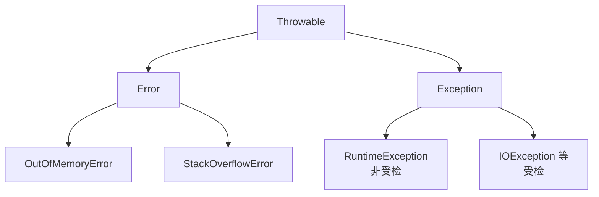

## Java 核心基石:Object 方法、异常、反射、泛型与 SPI

本篇聚合 Java 语言层面最底层、最高频的“地基”知识:`Object` 通用契约、异常体系、反射机制、泛型擦除与注解、SPI 扩展机制。这些是面试官爱问、框架底层最爱用的“隐式约定”,理解它们是阅读 [Spring IoC 容器与 Bean 生命周期](../spring/0-bean-lifecycle.md) 与 [ClassLoader 体系](../jvm/1-classloader-bytecode.md) 的前置基础。

---

## 一、 `Object` 类的六大核心方法

`java.lang.Object` 是所有类的隐式父类,其定义的六大方法构成了 Java 对象协作的“通用契约”。

### 1. `equals(Object)`:等价性判定

默认实现是 `this == obj`,即**引用相等**。重写时必须满足四大性质:

| 性质 | 含义 |
| :--- | :--- |
| 自反性 | `x.equals(x) == true` |
| 对称性 | `x.equals(y) == y.equals(x)` |
| 传递性 | `x.equals(y) && y.equals(z) ⇒ x.equals(z)` |
| 一致性 | 多次调用结果稳定(对象未修改) |

且 `equals` 与 `null` 比较恒为 `false`,与 `equals` 相等的两个对象的 `hashCode` 必须相等(**反之不必**)。

```java
// 经典反例:只重写 equals 不重写 hashCode,放入 HashMap 作 key 会被散到不同桶
public class User {
    private String name;
    public boolean equals(Object o) { return o instanceof User u && name.equals(u.name); }
    // 必须同步重写
    public int hashCode() { return Objects.hash(name); }
}
```

### 2. `hashCode()`:散列基石

JDK 约定:

- 同一对象多次调用必须返回相同整数(对象未变)。
- 两个 `equals` 相等的对象 `hashCode` 必须相等。
- 两个 `hashCode` 相等的对象**不一定** `equals`(哈希冲突)。

HotSpot 默认实现基于对象内存地址 + 线程局部状态计算的随机数(`Thread-Local Marsaglia Xorshift`),保证地址不同对象的哈希尽量分散。重写时应使用关键字段:

```java
@Override
public int hashCode() {
    return Objects.hash(name, age); // Objects.hash 调用 Arrays.hashCode
}
```

> 警告:把可变字段纳入 `hashCode` 会导致作为 HashMap key 时“失踪”——对象被 put 后修改了 key 字段,导致下次 get 散列到错的桶。

### 3. `toString()`:可读化

默认为 `类名@十六进制 hashCode`,框架中无一例外会重写以提升日志与调试可读性。

### 4. `clone()`:浅拷贝与深拷贝

```java
protected native Object clone() throws CloneNotSupportedException;
```

- 浅拷贝:字段直接复制引用,内部可变对象仍共享。
- 调用必须实现 `Cloneable` 标记接口,否则抛 `CloneNotSupportedException`。

> **不推荐使用 `clone()`**:1)破坏 `final` 字段语义;2)未调用构造方法;3)浅拷贝陷阱大。推荐“拷贝构造方法”或 copy 库(如 MapStruct)。

### 5. `finalize()`:已被弃用

JDK 9 起标记 `@Deprecated(since="9", forRemoval=true)`,JDK 18+ 默认 `--finalization=disabled`。原因:

- GC 时机不可控,finalize 队列优先级低。
-finalize 异常被吞没,无法定位。
- resurrect 对象会引发“第二次 finalize 跳过”Bug。

替代方案:`java.lang.ref.Cleaner`(基于 PhantomReference)。

### 6. `wait` / `notify` / `notifyAll`:对象监视器

详见 [JMM 内存模型](../concurrent/0-jmm-memory-model.md) 与 [AQS 机制与显式锁实现](../concurrent/1-aqs-locks.md)。这些方法必须在持有该对象的监视器锁(`synchronized(obj)`)时调用,否则抛 `IllegalMonitorStateException`。

---

## 二、 异常体系与最佳实践



### 1. 三类异常的语义边界

| 类型 | 例子 | 性质 | 处理建议 |
| :--- | :--- | :--- | :--- |
| `Error` | `OutOfMemoryError`、`StackOverflowError` | JVM 系统级错误,不该 catch | 让 JVM 退出,排查根因 |
| 受检异常(Checked) | `IOException`、`SQLException` | 编译器强制处理 | 业务可控时 catch;不可控时包装抛出 |
| 运行时异常(Runtime) | `NullPointerException`、`IllegalArgumentException` | 编程错误 | 不应 catch,修复代码 |

### 2. 业务异常设计

```java
public class BizException extends RuntimeException {
    private final String code;   // 错误码便于网关统一外发
    private final String traceId;

    public BizException(ErrorCode ec, Object... args) {
        super(ec.format(args));
        this.code = ec.getCode();
        this.traceId = TraceContext.current();
    }
}
```

要点:

- 自定义异常继承 `RuntimeException`,避免接口签名污染。
- 携带错误码与 TraceId,配合网关统一返回。
- 避免在底层 DAO 抛出业务语义异常(`UserNotFoundException`),应在 Service 层做语义转换。

### 3. `try-with-resources` 与 `AutoCloseable`

```java
try (Connection c = ds.getConnection();
     PreparedStatement ps = c.prepareStatement(sql)) {
    ps.execute();
}
```

编译器自动生成 `addSuppressed` 与 `close`,即使主异常与 close 异常都不丢失(`Throwable.getSuppressed`)。任何实现 `AutoCloseable` 的类都可用,推荐优先采用。

---

## 三、 反射机制与 MethodHandle

### 1. 反射 API 全景

```java
Class<?> clz = Class.forName("com.demo.User");
Constructor<?> ctor = clz.getDeclaredConstructor(String.class);
ctor.setAccessible(true);
Object obj = ctor.newInstance("Alice");

Field f = clz.getDeclaredField("name");
f.setAccessible(true);
f.set(obj, "Bob");

Method m = clz.getDeclaredMethod("greet");
m.setAccessible(true);
m.invoke(obj);
```

> `setAccessible(true)` 在 JDK 17+ 模块系统下需要 `--add-opens` 开启跨模块反射,否则 `InaccessibleObjectException`。

### 2. 性能与缓存

`Method.invoke` 内部:

- 前若干次走 Native 路径,JIT 收集 profile;
- 当调用次数达到阈值(默认 15),生成 `MethodAccessor` 字节码,后续直接调用,**与直接调差距缩至 3-5 倍**;
- 但每次 `getMethod` 都要遍历方法表,这是真正的热点。生产框架(Spring、MyBatis)都会缓存 `Method`/`Field` 实例。

### 3. `MethodHandle`:更现代的“动态调用”

```java
MethodHandles.Lookup lookup = MethodHandles.lookup();
MethodHandle mh = lookup.findVirtual(String.class, "length", MethodType.methodType(int.class));
int len = (int) mh.invoke("hello");
```

- `MethodHandle.invokeExact` 类型签名检查在**字节码层**完成,无装箱开销。
- 与 `invokedynamic` 字节码结合,是 Lambda 与 DACA 实现底层;详见 [Java 新特性演进与核心底层原理](2-java8-21-features.md)。
- JDK 9+ 性能与反射接近,但更灵活,可作为高性能反射替代。

---

## 四、 泛型:类型擦除与桥接方法

Java 泛型采用**类型擦除**(Type Erasure),编译后所有泛型类型变成 `Object`(或上界),只在编译期做静态类型检查。

### 1. 擦除后的字节码

```java
public class Box<T> { T value; }
// 编译后等价于
public class Box { Object value; }
```

`List<String>` 与 `List<Integer>` 共享同一个 `Class` 实例,运行期无法区分类型参数——这导致如下限制:

| 现象 | 原因 |
| :--- | :--- |
| `new T()` 不可写 | T 擦除为 Object/上界,无法确定构造谁 |
| `new T[10]` 不可写 | 数组协变与泛型不擦除的矛盾 |
| `instanceof List<String>` 非法 | 运行期无 String 信息 |
| 静态字段不能用类的类型参数 | 类的 T 是实例参数,静态上下文无实例 |

### 2. 桥接方法(Bridge Method):泛型+多态的产物

```java
abstract class Holder<T> { abstract void set(T v); }
class StrHolder extends Holder<String> { void set(String v) {} }
```

擦除后父类变成 `set(Object)`,子类只覆盖了 `set(String)`,二者的方法签名不同并不构成覆盖。编译器自动合成一个桥接方法:

```java
// 合成的桥接方法
void set(Object v) { set((String) v); }
```

这就是反射 `getDeclaredMethods()` 时偶尔能看到方法签名与声明不符的原因。

### 3. 通配符 PECS 原则

```java
void consume(List<? extends Number> src) { Number n = src.get(0); /* 不能 add */ }
void produce(List<? super Number> dst)    { dst.add(1);            /* 不能 get */ }
```

记忆:**Producer Extends, Consumer Super**。`? extends` 是只读生产者,`? super` 是只写消费者。

### 4. 类型令牌与 `TypeReference`

由于擦除,运行期需要保留泛型的场景(如 JSON 解析 `List<User>`)只能用 **Type Token**:

```java
TypeReference<List<User>> ref = new TypeReference<>() {};
Type t = ref.getType(); // List<User>
List<User> list = JSON.parseObject(str, ref);
```

`TypeReference` 利用匿名内部类的 `getGenericSuperclass()` 在字节码常量池中保留 `List<User>` 信息。

---

## 五、 注解与 SPI 扩展机制

### 1. 注解的运行期保留

```java
@Retention(RetentionPolicy.RUNTIME)
@Target({ElementType.METHOD, ElementType.TYPE})
public @interface Cached { long ttl() default 60L; }
```

RetentionPolicy:

- `SOURCE`:仅源码,编译丢弃(如 `@Override`)。
- `CLASS`:编译进 class 但默认不加载(默认值)。
- `RUNTIME`:运行期可见,反射可读(Spring、MyBatis 用此)。

Spring 与ORM 框架大量使用 `RUNTIME` 注解 + 反射实现声明式 API,如 `@Transactional`、`@RequestMapping`、`@Insert`。

### 2. 注解处理器(APT,Compile-Time)

`javax.annotation.processing.Processor` 在编译期运行,可生成新源码、修改字节码:

- Lombok 通过 `lombok.launch.AST` 修改语法树生成 getter/setter。
- MapStruct 根据接口注解生成转换实现类。

编译期注解不增加运行期开销,优于 RUNTIME 反射方案,详见 [Spring Boot 核心内部机制](../spring/11-springboot-internals.md) 的配置类 CGLIB 增强。

### 3. Java SPI:解耦扩展的点

`ServiceLoader` 是 JDK 内置的服务发现机制,在 `META-INF/services/<接口全限定名>` 文件中写一行实现类全名,即可在运行期被发现:

```java
ServiceLoader<Decoder> loaders = ServiceLoader.load(Decoder.class);
for (Decoder d : loaders) { d.decode(...); }
```

特点:

- 全部实现一次性实例化、单线程迭代,不能按 key 取指定实现。
- 没有 IoC,无依赖注入,无配置。

**Spring Boot SPI**(`spring.factories` / `AutoConfiguration.imports`)改良:支持按类名加载类而不立即实例化,带条件化装配(`@Conditional`),是 Spring Boot 自动装配的基石。详见 [Spring Boot 启动原理与自动装配](../spring/10-springboot-core.md) 与 [Spring Boot 扩展机制与 SPI 原理](../spring/12-springboot-extension.md)。

---

## 六、 实战:用反射 + 注解 + SPI 实现简易缓存装饰器

```java
@Retention(RUNTIME) @Target(METHOD)
public @interface Cached { long ttl() default 60; }

public class CacheAdvisor {
    private final Cache<Value> cache = Caffeine.newBuilder().build();

    public <T> T invoke(Method m, Object[] args, Supplier<T> fallback) {
        if (!m.isAnnotationPresent(Cached.class)) return fallback.get();
        String key = m.getName() + Arrays.hashCode(args);
        return (T) cache.get(key, k -> fallback.get(),
            m.getAnnotation(Cached.class).ttl(), TimeUnit.SECONDS);
    }
}
```

实战中应由 Spring AOP + `@Cacheable` 完成,见 [Spring Cache 缓存抽象与声明式缓存原理](../spring/16-spring-cache.md);此处仅作为语言机制整合演示。

---

## 七、 面试高频与陷阱

- **`==` 与 `equals` 区别?** — `==` 比较基本类型的值或引用地址;`equals` 默认也是地址,但 Integer/String/自定义重写后比较值。
- **`String` 池与 `new String("a")`?** — `new String` 一定在堆创建新对象,字面量 `"a"` 在字符串常量池;JDK 7+ 池存的是引用而非对象。
- **为什么要重写 hashCode?** — `equals` 相等但 hashCode 不等会导致 HashMap/HashSet 重复或丢失。
- **泛型擦除的代价?** — 不能 `new T()`、不能用基本类型参数(`List<int>` 不合法)、运行期无类型信息。
- **反射为什么慢?** — `Method.invoke` 需要参数装箱、可见性检查、每调用校验;缓存 + JIT 优化后差距在 3-5 倍。
- **`@Override` 标注的角色?** — 编译期校验方法签名是否真正覆盖父类,防止“写错方法名仍是新方法”的隐性 Bug。
- **SPI 与 Spring SPI 区别?** — `ServiceLoader` 全量实例化,无法条件化;Spring SPI 支持 `@Conditional` 按需装配。

---

## 八、 小结

地基类知识看似平淡,但它们是上层所有框架的“语法原语”:

- `Object` 契约支撑了 HashMap/HashSet 与日志可读化。
- 异常体系划清了“错误”与“异常”的边界。
- 反射是 Spring IoC、MyBatis 代理、ORM 注解原理的入口。
- 泛型擦除解释了 Lombok、Jackson、MapStruct 为何要 TypeToken。
- 注解 + SPI 提供了开闭原则在 Java 世界的事实实现。

掌握这些,再加上 [Java 集合框架底层源码深剖](0-collection-framework.md) 与 [Java 新特性演进与核心底层原理](2-java8-21-features.md),即构成 Java 语言层的完整认知。下一站可以走进 [JVM 虚拟机内核](../jvm/0-memory-gc.md) 与 [Spring 全家桶源码](../spring/0-bean-lifecycle.md),将语言底层与运行时和框架的“胶水层”一并打通。
