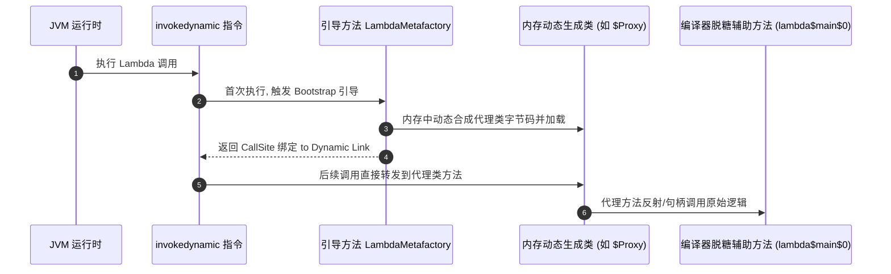
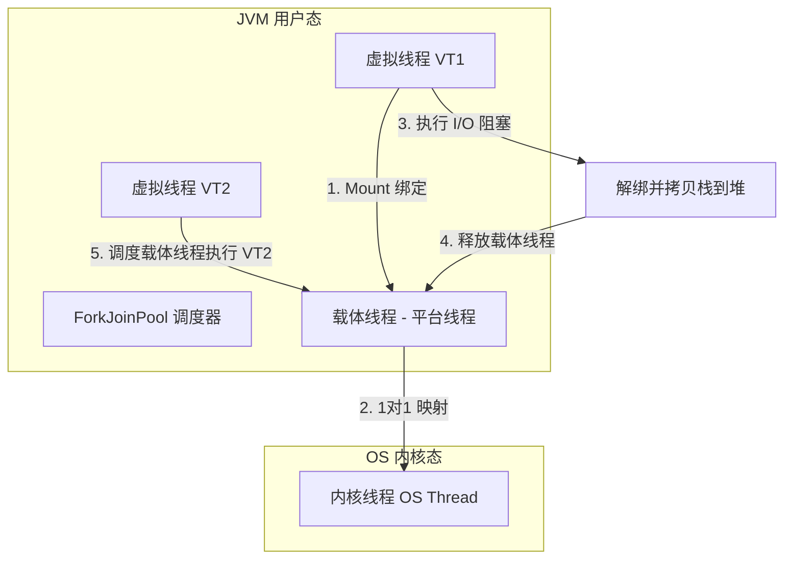

## Java 新特性演进与核心底层原理（JDK 8 - 21）

现代 Java 从 JDK 8 步入快速发布轨道后，正逐步向现代化、高吞吐和强表现力的语言演进。理解这些新特性的底层原理（尤其是字节码与运行时机制），是编写高性能、可伸缩 Java 程序的关键。

---

## 一、 JDK 8 核心基石：Lambda 表达式与 Stream 引擎

### 1. Lambda 表达式的字节码实现内幕

在 Java 8 之前，匿名内部类在编译后会生成独立的 `.class` 文件（如 `Test$1.class`），这会导致类加载变慢和包体积膨胀。

Java 8 对 Lambda 的处理并没有使用匿名内部类，而是基于 JVM 的 **`invokedynamic`（动态方法调用）** 指令和 **`LambdaMetafactory`** 实现：

1. **编译期脱糖（Desugaring）**：
   编译器在编译含有 Lambda 的类时，会首先在当前类内部生成一个私有的静态/成员辅助方法（命名类似 `lambda$main$0`），Lambda 的具体执行代码就被搬移到这个方法体中。
2. **字节码转换**：
   Lambda 的调用点被翻译为 `invokedynamic` 指令。该指令会关联一个**引导方法（Bootstrap Method, BSM）**，其指向 JDK 标准库的 `java.lang.invoke.LambdaMetafactory.metafactory(...)`。
3. **运行期动态生成代理**：
   当 `invokedynamic` 被首次执行时，JVM 会调用上述引导方法。`LambdaMetafactory` 会利用底层字节码框架（ASM）在**内存中动态构建并装载一个轻量级的实现类**。这个类会实现目标函数式接口，在其实现方法中去调用步骤 1 产生的 `lambda$main$0` 辅助方法。
4. **方法句柄绑定**：
   引导方法返回一个 `CallSite`（调用点）对象，内部持有一个指向动态生成类实例的 `MethodHandle`（方法句柄）。后续的调用将直接通过该句柄流转，无需再次经过引导方法解析，性能逼近普通方法调用。



### 2. Stream 惰性求值与 ForkJoinPool 并行流原理

- **惰性求值（Lazy Evaluation）**：
  Stream 的链式操作分为**中间操作**（`filter`、`map`）和**终端操作**（`collect`、`forEach`）。
  中间操作不会执行任何过滤或转换，而是以双向链表形式将所有操作步骤封装并挂载在 `Pipeline`（管道节点）对象上。只有当调用终端操作时，整个链表才会从头至尾遍历数据源，这种单次循环遍历（Loop Fusion）避免了产生中间临时集合，极大地提升了 CPU 缓存友好度。
- **ForkJoinPool 工作窃取（Work-Stealing）**：
  当我们使用 `parallelStream()` 时，底层任务会被委派给公共的 **`ForkJoinPool.commonPool()`**。
  - **任务拆分（Fork）**：将数据集合按双分法（Binary Split）递归拆分为子任务，直到子任务容量小于设定的阈值。
  - **任务合并（Join）**：等待各分支任务执行完成，并进行结果合并。
  - **工作窃取算法**：每个工作线程都维护一个双端任务队列（Deque）。当某个线程完成了自己队列中的所有任务后，为了不让 CPU 空闲，它会从其他繁忙线程的队列**尾部**“窃取”任务来执行，从而实现了极其均衡的负载分发。

---

## 二、 JDK 9 - 17 生产特性演进

### 1. Project Jigsaw 模块化系统（JDK 9）

- **核心目的**：解决类路径乱象（Classpath Hell）和 JVM 强行打包全部 RT.jar 导致体积过大的痛点。
- **实现手段**：通过 `module-info.java` 明确定义模块的边界，显式指明对外暴露的包（`exports`）和依赖的外部模块（`requires`）。
- **强封装性**：即使是反射，也无法强行访问未导出模块中的非 public 元素，提升了平台自身的安全性。

### 2. Record 记录类（JDK 16）

- **职责**：作为纯粹的只读数据载体（DTO/VO），彻底消除 Lombok 的依赖。
- **底层原理**：
  - `record` 类在编译后会自动继承 `java.lang.Record` 基类。
  - 该类被隐式声明为 `final`，所有的成员变量均被隐式声明为 `private final`。
  - 编译器会在字节码中自动生成全参构造器、所有属性的 getter 方法（无 `get` 前缀）、以及健全的 `equals()`、`hashCode()` 和 `toString()` 方法。

### 3. Sealed Classes 密封类（JDK 17）

- **职责**：控制继承树的深度与广度，提供更安全的代数数据类型。
- **声明方式**：使用 `sealed` 修饰类，并通过 `permits` 显式指定哪些子类能够继承该类。
- **子类约束**：被允许的子类必须声明为 `final`（不可再继承）、`sealed`（继续密封）或 `non-sealed`（放开限制）。

```java
// 定义一个密封接口，仅允许 Circle 和 Square 继承/实现
public sealed interface Shape permits Circle, Square {}

public final class Circle implements Shape { public double radius() { return 1.0; } }
public final class Square implements Shape { public double side() { return 2.0; } }
```

---

## 三、 JDK 21 性能极境：虚拟线程与模式匹配

### 1. 虚拟线程（Virtual Threads - Project Loom）

虚拟线程是 JDK 21 引入的革命性并发模型。它是一种运行在用户态的**轻量级协程**，旨在用极低的开销解决传统的“一请求一线程（Thread-Per-Request）”模型下线程数受限的问题。

#### 1.1 平台线程与虚拟线程的对比

| 特征维度 | 传统平台线程 (Platform Thread) | 虚拟线程 (Virtual Thread) |
| :--- | :--- | :--- |
| **映射关系** | 与操作系统内核线程（OS Thread）1:1 映射。 | 很多个虚拟线程映射到少量的平台线程（M:N 关系）。 |
| **内存开销** | 默认占用 1MB 的栈空间，开销大。 | 栈空间动态调整，起步仅需数百字节，开销极小。 |
| **上下文切换** | 涉及内核态与用户态的转换，开销高达数微秒。 | 完全在 JVM 用户态调度切换，开销仅需数十纳秒。 |
| **启动上限** | 单机通常只能支撑数千个实例，受物理内存限制。 | 单机可以轻松启动数百万个实例。 |

#### 1.2 底层调度与挂起原理：Carrier Thread

虚拟线程的运转基于调度器（ForkJoinPool）和**载体线程（Carrier Thread）**：

- **调度器**：虚拟线程并不直接运行在 CPU 上，而是由 JVM 内部的 ForkJoinPool 负责调度。这个 ForkJoinPool 中的工作线程就是**载体线程**（通常数量等同于 CPU 核心数）。
- **挂起与保存（Yielding）**：
  当虚拟线程执行到阻塞操作（如 `Socket.read()`、`ReentrantLock.lock()`、`Thread.sleep()`）时：
  1. JVM 捕获到阻塞信号，将当前的虚拟线程与载体线程进行**解绑（Unmount）**。
  2. 虚拟线程的调用栈和寄存器状态会被拷贝并保存到 **JVM 堆内存（Heap）** 中。
  3. 载体线程（底层的内核线程）完全**不被阻塞**，可以立即去运行队列中拉取其他虚拟线程执行。
- **恢复与唤醒（Resuming）**：
  当网络数据就绪或锁被释放时，底层的异步通知器会将该虚拟线程重新放入调度器队列中。调度器为其分配一只可用的载体线程，将堆内存中的栈数据重新拷入载体线程的运行栈中进行**绑定（Mount）**，继续向下执行。



#### 1.3 锁钉死问题（Pinning）
>
> [!WARNING]
> 虚拟线程目前存在一个非常关键的限制：**锁钉死（Pinning）**。
> - **原因**：当虚拟线程在 `synchronized` 块或 `synchronized` 方法内部执行阻塞操作时，JVM 无法将其与载体线程进行解绑。这是因为 JVM 底层 C++ 部分的限制，导致此时的载体线程会被强行锁定挂起。
> - **危害**：如果大量的虚拟线程都在 `synchronized` 内部发生阻塞，会导致底层的平台线程池全部被锁死，虚拟线程模型直接瘫痪。
> - **解决方案**：在采用虚拟线程的架构中，必须将老旧的 `synchronized` 锁替换为 **`ReentrantLock`**，后者得到了 Loom 框架的良好适配，不会引发 Pinning 问题。

---

## 四、 面试精选 Q&A

### Q1：Java 21 虚拟线程可以直接替换线程池（ExecutorService）吗？

- **答案**：可以，但使用方式有本质差别。
- **机制差异**：传统的线程池的核心目的是**池化与复用**资源，因为创建和销毁平台线程的开销太高昂。而虚拟线程极其廉价且无需复用。
- **最佳实践**：我们不需要通过 `ThreadPoolExecutor` 去池化虚拟线程。当有异步或并发任务时，直接使用 `Executors.newVirtualThreadPerTaskExecutor()` 针对每个任务都单独 `new` 一个虚拟线程执行，用完即弃。

### Q2：模式匹配（Pattern Matching）在 JDK 17 到 21 中有何演进？

模式匹配通过将“类型判断”与“强制类型转换”合并，显著精简了代码逻辑：

- **JDK 17（instanceof 模式匹配）**：

  ```java
  // 传统做法：判断后强转
  if (obj instanceof String) {
      String s = (String) obj;
      System.out.println(s.length());
  }
  // JDK 17 做法：判断的同时自动强转为临时变量 s
  if (obj instanceof String s) {
      System.out.println(s.length());
  }
  ```

- **JDK 21（switch 模式匹配与模式保护）**：
  `switch` 表达式开始支持匹配类型、解构 Record，并且可以结合 `when` 子句执行更细致的过滤（模式保护）：

  ```java
  // Switch 模式匹配
  static String formatterPatternSwitch(Object r) {
      return switch (r) {
          case Integer i -> String.format("int %d", i);
          case Long l    -> String.format("long %d", l);
          case Double d  -> String.format("double %f", d);
          case String s when s.length() > 5 -> String.format("Long String: %s", s);
          case String s  -> String.format("Short String: %s", s);
          default        -> r.toString();
      };
  }
  ```
