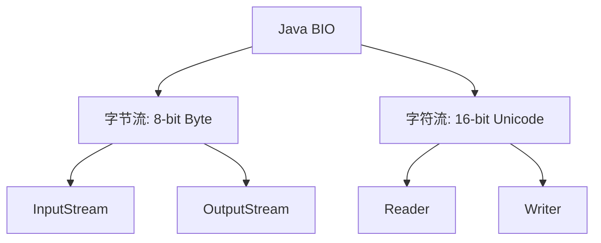
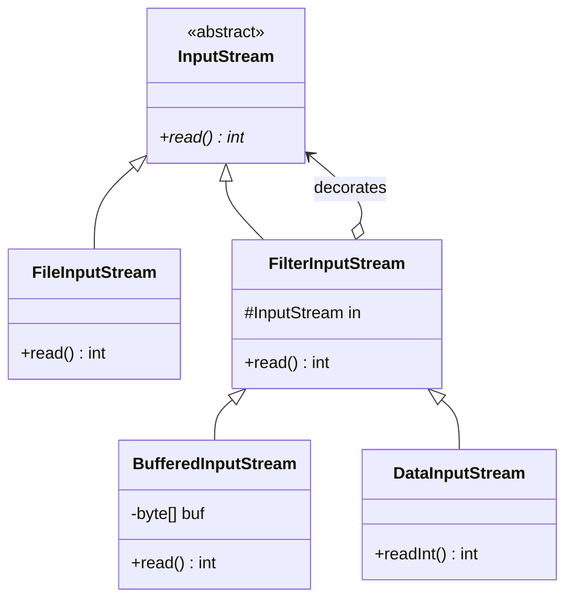

## Java I/O 体系与序列化深剖

Java 的 I/O 流与对象序列化是支撑分布式通信、网络框架、持久化存储以及高性能计算的核心基础。本文将深度解析传统 BIO 体系、装饰器模式应用、原生序列化底层安全陷阱，以及主流第三方序列化协议的选型对比。

---

## 一、 传统 Java BIO 体系与装饰器模式

Java 传统的 I/O（BIO）以“流”（Stream）为基本单位，分为字节流与字符流两大流派。

### 1. 字节流与字符流的本质关系



- **字节流**：以 8 位字节（byte）为最小单位，直接操作二进制数据，适用于图片、音视频、文件拷贝。
- **字符流**：以 16 位字符（char）为最小单位，底层会将字节通过字符集（Charset）解码为 Unicode 字符，适用于文本处理。
- **转换纽带**：`InputStreamReader`（将字节流转换为字符流）和 `OutputStreamWriter`（将字符流转换为字节流）是连接两者的桥梁，内部依托于 `StreamDecoder` 与 `StreamEncoder` 进行编码转换。

### 2. `BufferedInputStream` 内部缓冲区原理

直接读取磁盘或网络数据性能极低。`BufferedInputStream` 引入了 **8KB 内部缓冲区**（`protected volatile byte buf[]`）以提升性能：

- 当调用 `read()` 时，系统首先尝试从 `buf` 缓冲区中获取数据。
- 若缓冲区为空，则一次性通过物理 I/O 从底层系统读取 8192 字节（默认大小）填满缓冲区，后续的 `read` 直接从内存读取。
- **性能差异**：单字节循环读取时，带缓冲的 I/O 比不带缓冲的快 **2-3 个数量级**。

### 3. 装饰器模式在 I/O 体系中的经典应用

Java I/O 最具特色的是其**动态组合能力**，这是通过**装饰器模式（Decorator Pattern）**实现的，避免了类爆炸。

以 `InputStream` 为例：



- **抽象构件（Component）**：`InputStream`，定义读取数据的基本接口。
- **具体构件（ConcreteComponent）**：`FileInputStream`、`ByteArrayInputStream`，提供数据源的真实读取能力。
- **装饰器角色（Decorator）**：`FilterInputStream`，内部持有一个 `InputStream` 引用。
- **具体装饰器（ConcreteDecorator）**：`BufferedInputStream`（增加缓冲能力）、`DataInputStream`（增加强类型读取能力，如 `readInt()`）。

#### 代码组合示例

```java
// 动态为文件输入流包装“缓冲区能力”和“结构化数据读取能力”
try (DataInputStream dis = new DataInputStream(
        new BufferedInputStream(
            new FileInputStream("data.bin")
        )
     )) {
    int id = dis.readInt();
    double price = dis.readDouble();
}
```

---

## 二、 Java 原生序列化机制与安全机制

序列化（Serialization）是指将内存中的 Java 对象转化为字节序列的过程，主要用于网络传输与对象持久化。

### 1. `Serializable` 与 `serialVersionUID` 的底层作用

```java
public class User implements java.io.Serializable {
    private static final long serialVersionUID = 1L; // 显式版本号
    private String name;
}
```

- **`Serializable` 接口**：是一个**标记接口（Marker Interface）**，内部没有任何方法。实现此接口意味着类向 JVM 声明自己是“安全且允许被序列化”的。如果不实现此接口直接调用 `ObjectOutputStream.writeObject` 会抛出 `NotSerializableException`。
- **`serialVersionUID`**：对象的版本控制戳。
  - **隐式生成风险**：如果未显式声明，编译器会根据类结构（类名、字段、方法）算出一个哈希值作为 UID。一旦类发生了细微修改（例如增加一个字段或修改修饰符），重新编译后 UID 就会发生改变。
  - **严重后果**：读取旧的序列化文件时，由于 UID 不匹配，JVM 将直接抛出 `InvalidClassException`，导致反序列化失败，这在分布式应用版本迭代时是灾难性的。

### 2. 序列化定制：`writeObject` 与 `readObject`

在特定场景下，我们可能不希望某些敏感字段按照默认机制序列化，或者需要进行定制校验。可以在类中声明两个**私有的**（必须为 `private`）特异性方法：

```java
private void writeObject(java.io.ObjectOutputStream out) throws IOException {
    out.defaultWriteObject(); // 先执行默认的序列化逻辑
    // 额外对敏感字段进行加密或特殊写入
    String encryptedPassword = encrypt(this.password);
    out.writeObject(encryptedPassword);
}

private void readObject(java.io.ObjectInputStream in) throws IOException, ClassNotFoundException {
    in.defaultReadObject(); // 先执行默认的反序列化逻辑
    // 额外对加密字段进行解密
    this.password = decrypt((String) in.readObject());
}
```

### 3. 单例的死穴：`readResolve` 保护机制

原生反序列化在还原对象时，**不会调用该对象的任何构造方法**，而是直接从字节流中读取状态并在堆上分配对象。这会彻底瓦解单例模式（Singleton）：

```java
public class Singleton implements Serializable {
    private static final Singleton INSTANCE = new Singleton();
    private Singleton() {}

    // 必须声明该方法以保护单例
    protected Object readResolve() {
        return INSTANCE; // 强制返回已存在的全局单例，丢弃反序列化新生成的虚假对象
    }
}
```

---

## 三、 内存、性能与反序列化漏洞陷阱

### 1. `transient` 关键字的核心特征

- **作用**：被 `transient` 修饰的成员变量**不参与** Java 原生序列化。反序列化后，该字段会被恢复为其类型的默认值（引用类型为 `null`，基本类型为 `0` 或 `false`）。
- **经典应用**：`HashMap` 中的 `table` 数组以及 `ArrayList` 中的 `elementData` 数组都被声明为 `transient`。因为这些数组中可能存在大量空余位置，原生序列化会带来不必要的开销，因此它们通过 `writeObject`/`readObject` 进行了手动的、精简的序列化定制。
- **静态变量不受 transient 影响**：`static` 变量属于类级别的信息，而不是实例的一部分。因此，`static` 变量在任何时候都**不会**被序列化。即便给它加上 `transient` 修饰符，也不会有任何额外实际效果。

### 2. 原生反序列化漏洞根源

> [!WARNING]
> 在生产环境中，**不要反序列化任何来自不受信任源的字节流数据**！

原生反序列化是 Java 安全的重灾区。其核心缺陷在于：**在把字节流还原成真实对象的过程中，会触发一系列隐藏的隐式方法回调。**

- **攻击原理（Gadget 链）**：攻击者通过构造恶意的类依赖图（Gadget Chain），例如利用 Apache Commons Collections 库中的 `TransformedMap` 或 `LazyMap` 配合 `InvokerTransformer`。
- 当 `ObjectInputStream.readObject()` 被触发时，底层还原对象并隐式调用被反序列化对象的 `readObject()`。如果这个方法链最终通过反射去调用了 `Runtime.getRuntime().exec()`，就会导致远程代码执行（RCE）。
- **防护方案**：
  1. 使用安全的反序列化过滤器（如 JDK 9 引入的 `ObjectInputFilter`）。
  2. 舍弃 Java 原生序列化，改用不支持任意动态类型还原、更安全的序列化框架。

---

## 四、 主流第三方序列化协议对比

由于 Java 原生序列化**不支持跨语言、字节体积大（携带类元信息较多）、且存在高危安全漏洞**，在企业微服务（如 Dubbo、Spring Cloud）及大数据场景下，通常采用第三方高性能协议。

### 1. 五大常用协议维度对比

| 协议 | 序列化格式 | 字节开销 (压缩率) | 序列化速度 | 跨语言支持 | 安全性 | 兼容性 (Schema) |
| :--- | :--- | :--- | :--- | :--- | :--- | :--- |
| **Java 原生** | 二进制字节流 | 极高 (包含类描述) | 极慢 | 仅限 Java | 极低 (易受 RCE 攻击) | 差 (UID 易失效) |
| **Hessian 2** | 自解释二进制 | 较低 | 快 | 支持多语言 | 中 (存在特定黑名单漏洞) | 良好 (字段增减容错) |
| **Kryo** | 高性能二进制 | 极低 | 极快 | 仅限 Java | 中 (需小心注册机制) | 较好 (需要配置) |
| **Protobuf** | 强Schema二进制 | 极低 | 极快 | 极佳 (全平台) | 高 (不包含类元数据) | 极佳 (强向下向后兼容) |
| **JSON (Jackson)** | 纯文本格式 | 较高 (冗余 Key) | 较慢 (文本解析开销) | 极佳 | 中 (开启多态反序列化危险) | 极佳 |

### 2. 场景选型与架构决策

- **异构微服务集成 (跨语言)**：**强烈建议首选 Protobuf**。其字节流极度紧凑，通过 `.proto` 文件作为强契约，序列化和网络传输开销极小。
- **纯 Java 体系 RPC 通信 (如 Dubbo 默认)**：**推荐 Hessian 2**，它平衡了开发便利性与性能，不需要额外编写 Schema 文件，自动支持字段增减的向上/向下兼容。
- **本地 high并发缓存/大数据持久化**：**选择 Kryo**。它是一个针对 Java 深度优化的序列化框架，生成文件体积远小于 Java 原生，且速度比原生快数倍，特别适合 Spark / Storm 等大数据系统内部节点的数据交互。
- **Web API 与前后端对接**：**选择 JSON（Jackson / Fastjson）**。具备最佳的可读性与跨平台调试体验，适合前端与后端网关的数据交互，但对性能和网络带宽极度敏感的内部微服务调用应予以避免。

---

## 五、 面试高频真题

- **`BufferedInputStream` 为什么快？**
  答：因为引入了内存缓冲机制，默认一次读取 8KB 的数据填入缓冲区。每次读取数据时先从内存缓冲区获取，减少了昂贵的底层系统物理磁盘或网络 I/O 的调用频次。
- **如何防止反序列化破坏单例？**
  答：在单例类中定义一个 `protected` 或 `private` 的 `readResolve()` 方法，并直接返回已经创建的单例对象。JVM 在反序列化返回对象前如果检测到该方法，会丢弃反序列化产生的虚假实例，转而返回该方法中指定的实例。
- **为什么 `static` 变量不会被序列化？**
  答：因为序列化保存的是**对象的状态**（即实例变量），而 `static` 声明的变量是属于类本身的类变量，并不属于任何一个具体的实例对象，所以它不会被写入序列化流中。
- **原生反序列化漏洞是怎么回事？**
  答：因为原生反序列化的 `readObject()` 会根据输入的字节码重建对象并自动回调方法（如自定义的 `readObject()`）。如果传入数据被恶意构造，且应用中存在反射调用（如 Commons Collections 的 `InvokerTransformer`），就可能被恶意串联成反射链条，在还原对象时自动执行恶意代码，造成远程代码执行。

---

## 六、 小结

Java I/O 流通过**装饰器模式**实现了良好的弹性和扩展性，而**缓冲区机制**是提升传统 I/O 性能的关键。在进行对象持久化与跨服务调用时，应根据**跨语言能力、网络带宽、解析速度与安全性**来权衡选择序列化协议，极力避免在暴露的公网接口上使用高风险的 Java 原生反序列化。
