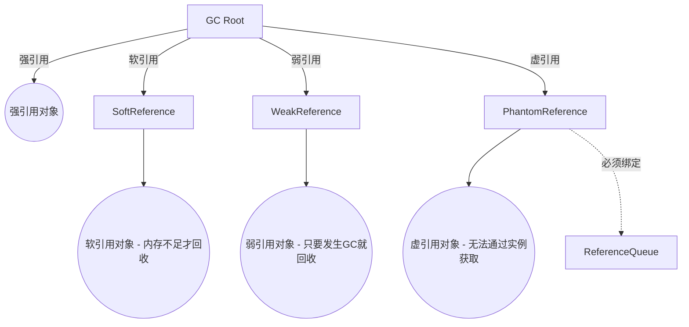
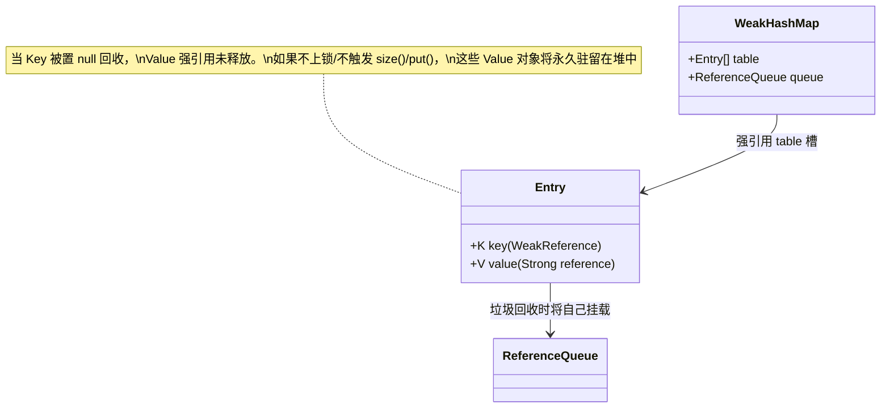

## Java 引用体系与 Cleaner 机制

在 Java 的自动内存管理体系中，强引用（Strong Reference）是开发者最常接触的基石。然而，面对缓存开发、本地/堆外资源清理（DirectBuffer）以及海量元数据追踪等极限场景，单一的强引用极易引发 OOM（OutOfMemoryError）。HotSpot 针对这些痛点设计了四级引用体系，并在 JDK 9 中使用 `java.lang.ref.Cleaner` 彻底替换了存在致命缺陷的 `Object.finalize()` 析构机制。

---

## 一、 四级引用体系深度对比

根据对象回收门槛从严到松，Java 将引用划分为：强引用（Strong Reference）、软引用（Soft Reference）、弱引用（Weak Reference）和虚引用（Phantom Reference）。



### 1. 核心属性对比映射

| 引用类型 | 对应底层类 | 获取原对象方式 (`get()`) | GC 回收时机与触发门槛 | 典型工业级应用场景 |
| :--- | :--- | :--- | :--- | :--- |
| **强引用** | 任何普通变量声明 | 直接关联 | 任何时候均不回收，宁可 OOM | 绝大多数常规业务逻辑 |
| **软引用** | `SoftReference` | 可返回对象（若未被回收） | 触发 GC 时且**内存依然溢出前夕** | 缓存（如内存不敏感的静态池） |
| **弱引用** | `WeakReference` | 可返回对象（若未被回收） | **只要发生 GC（不论内存是否充足）** | `WeakHashMap`、`ThreadLocalMap` |
| **虚引用** | `PhantomReference` | 恒返回 `null` | 追踪垃圾回收并关联外部通知机制 | `DirectByteBuffer`（堆外内存释放） |

---

## 二、 弱引用机制与 `WeakHashMap` 泄露避坑

### 1. 弱引用的自动清理（Self-Clearing）

只要进行过新生代（Minor GC）或老年代（Full GC）的垃圾回收器标记与回收阶段，未被强引用的弱引用对应对象（Referent）就会立即被宣告死亡：

```java
Object referent = new Object();
WeakReference<Object> weakRef = new WeakReference<>(referent);

referent = null; // 切断强引用
System.gc(); // 手动触发 Full GC

// 此时 weakRef.get() 必将返回 null，说明原对象已回收
assert weakRef.get() == null;
```

### 2. `WeakHashMap` 核心底层与“隐式内聚”泄露

`WeakHashMap` 的核心特征是其哈希槽 Entry 继承了 `WeakReference`，其中 `key` 被当作弱引用对象的 Referent，而 `value` 则是正常的强引用。

```java
// WeakHashMap 内部 Entry 构造器示意
private static class Entry<K,V> extends WeakReference<Object> implements Map.Entry<K,V> {
    V value;
    final int hash;
    Entry<K,V> next;
    // key 传给父类 WeakReference 保存，value 则直接显式强引用
    Entry(Object key, V value, ReferenceQueue<Object> queue, int hash, Entry<K,V> next) {
        super(key, queue);
        this.value = value;
        this.hash  = hash;
        this.next  = next;
    }
}
```

#### 致命的闭环泄漏

当 Map 中的 `key` 被垃圾回收回收后，其对应的哈希槽 Entry 在垃圾回收时会被推送到关联的 `ReferenceQueue`。但**如果此时该 Map 没有任何后续的主动操作（如 `get()`, `put()`, `size()`），这些无 Key 的强引用 `value` 将永远滞留在堆中，引发隐式内存泄露**！



* **解决方案**：在并发或多线程场景下，确保定时执行 `WeakHashMap.size()`，或者在不操作时显式清空，以触发内部清扫空 Key 的 `expungeStaleEntries()` 循环。更推荐的做法是考虑 guava 等第三方提供成熟清除监听器的 `Cache` 容器。

---

## 三、 从 `finalize` 到 `Cleaner` 的演进

在早期 JDK 中，开发者往往通过重写 `Object.finalize()` 期望在对象被销毁前清理 Native 堆、关闭句柄底座等：

```java
// ❌ 已经被 JDK 9 全面废弃的废品代码，严禁在任何生产环境使用！
@Override
protected void finalize() throws Throwable {
    try {
        closeNativeFD(); 
    } finally {
        super.finalize();
    }
}
```

### 1. `finalize()` 的致命缺陷

1. **执行极慢且时间极度不可靠**：Finalizer 线程（如 HotSpot 的 `Finalizer` 辅助线程）属于最低优先级。当大批量待终结对象排队时，队列积压会立刻撑爆内存导致 OOM。
2. **发生对象赖活复活（Resurrection）**：在 `finalize()` 代码中，只要重新将 `this` 指派给某全局强引用，该对象就会奇迹般地复活，给 GC 判定带来混乱。
3. **性能雪崩、吞吐急剧下降**：JVM 必须给实现了 `finalize()` 方法的对象单独创建临时的 `Finalizer` 对象并进行双倍周期的标记跟踪，由于屏障阻碍，严重拉低 GC 回收吞吐量。
4. **异常被静默吞掉**：方法中抛出的未捕获异常会被 JVM 的 Finalizer 守护线程捕获并直接静默丢弃，从而掩盖资源泄露的底层逻辑。

---

### 2. JDK 9 纯净推荐：`java.lang.ref.Cleaner`

`Cleaner` 是通过封装 **虚引用（PhantomReference）** 构建的高级轻量回收中介。它最大的改良点在于：将**主业务对象（清理目标）**与**清理代码逻辑（Cleaner 异步任务）**彻底进行物理脱耦。

#### 核心要素与运作拓扑

* 必须在独立的“清理行为类”（通常是实现了 `Runnable` 接口并声明为 `static` 的嵌套类）中编写销毁动作。
* **绝对不要**在清理线程任务中捕获或强引用宿主类对象的 `this`，否则由于隐式外部强引用，宿主类对象将**永远无法被回收**。

```java
import java.lang.ref.Cleaner;

/**
 * 生产级堆外句柄物理释放演示
 */
public class HardResource implements AutoCloseable {

    // 创建全局统一管理的 Cleaner 分发线程池实例
    private static final Cleaner CLEANER = Cleaner.create();

    // 静态内部类：绝对不持有外部 HardResource 的 this 强指针
    private static class State implements Runnable {
        private final long fileDescriptor; // 清理所需的物理外置数据

        State(long fileDescriptor) {
            this.fileDescriptor = fileDescriptor;
        }

        @Override
        public void run() {
            // 真实的物理资源彻底销毁底层调用
            System.out.println("【Cleaner 激活】 硬件句柄被销毁: 0x" + Long.toHexString(fileDescriptor));
            // releaseFD(fileDescriptor);
        }
    }

    private final State state;
    private final Cleaner.Cleanable cleanable;

    public HardResource(long fileDescriptor) {
        this.state = new State(fileDescriptor);
        // 将当前宿主对象与清理状态绑定，注册到全局 Cleaner
        this.cleanable = CLEANER.register(this, state);
    }

    @Override
    public void close() {
        // 主动释放资源：优雅实现，防止只依赖 GC 导致的回收延迟
        cleanable.clean();
    }
}
```

---

## 四、 工业级实战：`DirectByteBuffer` 与虚引用链路

JDK 中的 Direct 堆外纯净字节缓冲 `DirectByteBuffer` 对 Cleaner 与虚引用的运用达到了极致。

### 1. 底层数据分配与登记

当执行 `ByteBuffer.allocateDirect(1024)` 时：
1. HotSpot 自行分配底层的堆外 OS 物理纯净内存（`unsafe.allocateMemory`）。
2. 在 JVM 堆中创建一个 `DirectByteBuffer`（作为句柄，只占用几十字节极小空间）。
3. 关键动作：通过 `DirectByteBuffer` 创建一个 `sun.misc.Cleaner`（JDK 自带的专用虚引用实现）。

```mermaid
graph LR
    subgraph JVM 堆 (Java Heap)
        DBB[DirectByteBuffer 实例]
        Ref[Cleaner 虚引用]
    end
    subgraph 物理堆外内存 (Off-Head OS Memory)
        NativeMem[1024 字节物理内存]
    end
    DBB -->|address 执存虚拟地址| NativeMem
    Ref -->|referent 虚引用追踪| DBB
    Ref -->|"内置 clean() 执行器"| CleanAction[Deallocator 底层调用]
```

### 2. 回收链路的闭环流转

1. 宿主对象 `DirectByteBuffer` 在堆中完全失去所有强指向标志。
2. 触发 GC。因为 `DirectByteBuffer` 仅处于虚引用中，回收判定极快通过。
3. GC 在移除了宿主句柄 `DirectByteBuffer` 的同时，将其 `Cleaner` 排入内质的偏置通知队列。
4. 特殊守护线程 `ReferenceHandler` 遍历捕获此回收节点，触发 `clean()` 处理。
5. 实质执行 `Unsafe.freeMemory(address)`，堆外纯净物理内存获得完全退还，完美避开本地堆外泄漏！
