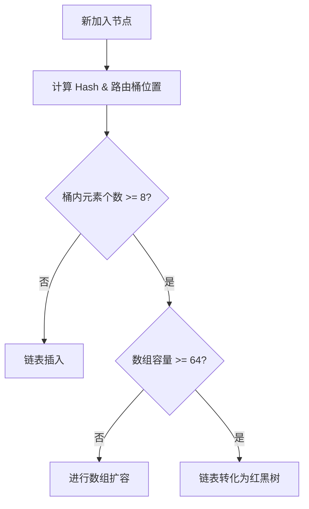

# Java 基础与集合核心面试真题

本专栏致力于为中高级 Java 开发人员提供最硬核、直击底层原理、结合生产实战的 Java 基础与集合框架面试真题剖析。每个知识点都配有详尽的答案、核心源码流程、以及辅助理解的 Mermaid 架构图或数学模型。

---

## 📂 模块一：Java 基础与集合框架

### Q1：为什么 Java 中的 `String` 设计成不可变（Immutable）的？底层是如何保证的？

#### 1. 核心设计目的

`String` 的不可变性是 Java 安全性、性能与多线程并发安全的重要基础，主要表现在以下三个维度：

- **字符串常量池（String Pool）的最佳化**：

  若字符是可变的，当一个变量修改了其内容，其他指向该地址的变量将被迫同步修改。不可变性使得 JVM 可以通过共享相同的字符串字面量来极大地节省堆内存。

- **线程安全（Thread Safety）**：

  由于 `String` 对象是只读的，在多线程并发环境中无需添加任何显式锁或同步机制，即可实现天然的安全共享。

- **Hash 值的缓存与安全性**：

  `String` 的哈希值常用于 Map 的 Key（例如 `HashMap` 的 Key）。在对象构建时，其哈希值便被缓存计算（通过变量 `hash`），不可变性保证了 Hascode 在其生命周期内恒定不变，提升了查找性能。公式：
  `hash = s[0] * 31^(n-1) + s[1] * 31^(n-2) + ... + s[n-1]`

- **底层安全隔离**：

  网络连接 URL、数据库账号密码、类加载器加载的核心类库名都以 `String` 传递。如果其可变，可能会遭遇黑客在运行时动态篡改，导致致命的安全漏洞。

#### 2. 底层实现原理

In JDK 8 中，`String` 底层使用 `char[]` 数组存储；在 JDK 9 以后改用 `byte[]` 加上编码标记（Coder）。其通过如下手段实现不可变性：

- **`final` 修饰数组与类**：

  ```java
  public final class String implements java.io.Serializable, Comparable<String>, CharSequence {
      private final char value[]; // JDK 8 底层数组
      private int hash; // 缓存哈希值
  }
  ```

  - 类被 `final` 修饰，保证了其**不能生命子类**，杜绝了子类通过继承劫持并修改类行为的可能。
  - 数组变量 `value` 被 `final` 修饰，表明该引用无法指向其他数组。

- **防范指针外露（Defensive Copying）**：

  单靠 `final` 无法阻止外部通过修改数组中某个元素来改变其内容。为此，`String` 内部所有涉及返回内容的方法（如 `substring`、`concat`），都会利用 `Arrays.copyOf` 构建一个**全新**的 `String` 对象返回，绝不暴露原有底层数组引用。

---

### Q2：深入解构 `HashMap` 的底层扩容机制（以 JDK 1.8 为例）及“树化/退树化”边界？

`HashMap` 采用了经典的**哈希桶 + 单向链表 + 红黑树**结构，其高吞吐的核心来自自适应的动态调整。



#### 1. 关键参数指标

- **默认初始容量（Default Initial Capacity）**：$16$，必须是 $2$ 的幂次方。

- **加载因子（Load Factor）**：$0.75$。此阈值平衡了时间开销与空间回收，过高会导致冲突加剧，过低会频繁触发扩容。

- **树化阈值（Treeify Threshold）**：$8$。

- **退树化阈值（Untreeify Threshold）**：$6$。

- **最小树化容量限制（Min Treeify Capacity）**：$64$。

#### 2. 扩容（`resize`）步骤与原理

当 `HashMap` 中的元素总量达到阈值时（`threshold = capacity * loadFactor`），触发双倍扩容：

- **容量翻倍，仍保持为 $2^n$**：

  这样可借助位运算代替传统模运算来分配索引，定位算式：利用 `(n - 1) & e.hash` 快速路由。

- **高低链表分流（JDK 1.8 优化）**：

  JDK 1.8 舍弃了 JDK 1.7 的头插法（避免了多线程并发扩容导致的环形链表死循环问题），改用尾插法并采用**高低链技术**。
  扩容时，只需通过判断 `(e.hash & oldCap) == 0`：

  - 若为 $0$，则该节点在扩容后的位置依然是 **原索引**（低位链表 `loHead` -> `loTail`）。
  - 若不为 $0$，则位置转变为 **原索引 + oldCap**（高位链表 `hiHead` -> `hiTail`）。

  此设计避免了重分配时再次计算 Hash，节点的分化极其高效。

#### 3. 为什么树化阈值是 8？为什么退树化是 6？

- **泊松分布概率模型**：

  在理想状态下，哈希碰撞在哈希桶中的发生遵循**泊松分布**（Poisson Distribution）：
  `P(k) = (e^(-λ) * λ^k) / k!`
  这里 `λ = 0.5`（默认加载因子下），一个桶中链表长度达到 8 的概率大约是近千万分之一。红黑树节点占用的内存空间是普通链表节点的两倍，为了防止哈希碰撞恶意攻击、且保障非极端场景下极少的空间开销，阈值定为 8。

- **防范振荡转换（Hysteresis）**：

  退树化阈值设为 $6$ 而不是 $7$，是为了在频繁插入 and 删除、导致长度在 $7$ 与 $8$ 之间不断波动时，避免红黑树和链表频繁地进行相互转换（频繁的重平衡和重建会严重拖慢性能）。

---

### Q3：`ConcurrentHashMap` 核心锁粒度从 JDK 1.7 到 1.8 发生了怎样的革命性演化？

`ConcurrentHashMap` 是企业高并发高可用方案的核心容器。两种版本的并发控制模型差异如下：

| 特征维度 | JDK 1.7 分段锁机制 | JDK 1.8 CAS + synchronized 锁 |
| :--- | :--- | :--- |
| **底层核心结构** | Segment 数组 + HashEntry 数组 | Node 数组 + 链表 / 红黑树 |
| **锁的控制粒度** | **Segment 级别**（默认并发度为 $16$） | **桶首节点（Node）级别**（粒度极细） |
| **核心锁定技术** | 继承 `ReentrantLock` 独占锁 | `synchronized` 锁 + CAS 无锁操作 |
| **内存额外开销** | 每一个 Segment 都需要创建独立锁对象，空间开销大 | 仅在有冲突时锁定桶首节点，无需额外创建大量锁对象 |
| **并发吞吐能力** | 受限于 Segment 数量。相同段内请求必须串行 | 冲突只集中于单哈希槽，其余槽完全独立并发，吞吐呈线性提升 |

#### JDK 1.8 核心原理解析

1. **CAS 无锁入桶**：

   如果向 `ConcurrentHashMap` 写入元素时，对应的哈希桶首节点 `volatile Node<K,V> f` 为 `null`，不进行任何重量级锁定。直接利用无锁 CAS（`compareAndSwapObject`）尝试将新节点作为首节点存入。

2. **synchronized 桶首锁**：

   若该槽位已有首节点，发生哈希碰撞，此时程序转而使用 `synchronized` 锁住**该桶的首节点 `f`**，然后进行链表或红黑树的遍历及覆盖。

3. **分流扩容协助（ForwardingNode）**：

   扩容期间，若线程发现桶节点已被置为 `ForwardingNode` 类型，该线程会主动协助进行数据的复制迁移（多线程协作扩容，`helpTransfer`），迁移完毕后老数组对应槽位指向该占位符。
