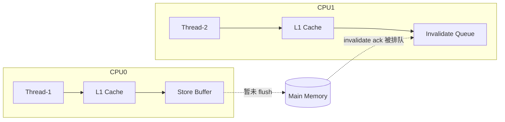
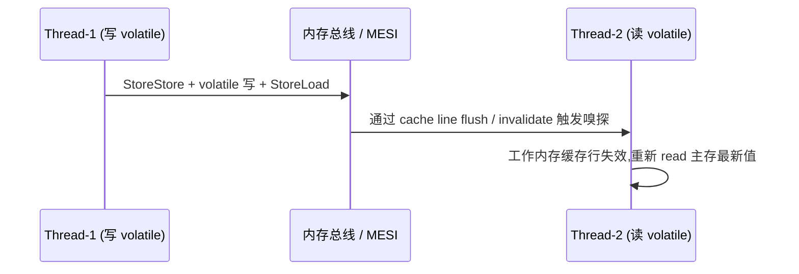

---
title: Java 内存模型与 happens-before 原理
hide_title: true
sidebar_label: JMM 内存模型
---

## Java 内存模型与 happens-before 原理

Java 内存模型（Java Memory Model, JMM）是 Java 语言规避硬件内存层次结构差异、保证多线程程序在任意平台上具备**一致可见性**与**有序性**的规范抽象。它与 JVM 运行时数据区（堆、栈、方法区）是**两个不同维度**的概念:后者描述内存的物理划分,前者描述共享变量的访问语义。理解 JMM 是掌握 `volatile`、`synchronized`、CAS 与 AQS 的根基。

---

## 一、 为什么需要 JMM:硬件层面的可见性与有序性困境

现代 CPU 与内存之间存在巨大速率鸿沟,内核通过多层硬件缓存（L1/L2/L3）与写缓冲（Store Buffer）、无效化队列（Invalidate Queue）来掩盖延迟,这给多核并发带来了两大顽疾。

### 1. 工作内存可见性问题

每个 CPU 核心拥有自己的 L1/L2 缓存,线程对共享变量的写入通常先停留在本核缓存与写缓冲中,**不会立即同步**到主内存,其他核心读到的便是陈旧值。



经典的 "**我改了你没看见**" 例子:

```java
boolean stop = false; // 主内存

// Thread-1
while (!stop) { /* 自旋 */ }

// Thread-2
stop = true; // 可能停留在 CPU1 的 Store Buffer 中,JIT 甚至可能将 stop 提升到寄存器
```

若无同步机制,`Thread-1` 可能永远无法观测到 `stop` 的修改而陷入死循环。

### 2. 指令重排序问题

为了提升执行吞吐,编译器、JIT 与 CPU 流水线都会对指令进行重排序（Reordering）。重排序遵循 **as-if-serial 语义**:单线程下程序执行结果不被改变,但**多线程间的语义可能被破坏**。

```java
int x = 0, y = 0;
// Thread-1
x = 1;     // op1
y = 2;     // op2
// Thread-2
if (y == 2 && x == 0) { /* 在重排序下可能成立 */ }
```

若 `op2` 被提前到 `op1` 之前执行,`Thread-2` 便能观测到 `y == 2 && x == 0` 这一在源代码看来"不可能"的状态。

---

## 二、 JMM 的两大抽象:主内存与工作内存

JMM 规定所有共享变量（包括实例字段、静态字段与构成数组的元素,但**不包括局部变量与方法参数**）存储在主内存中,每条线程拥有自己的工作内存（Working Memory,对应 CPU 缓存与寄存器抽象）。

线程对变量的操作必须遵循如下 8 大原子协议:

| 操作 | 主体 | 含义 |
| :--- | :--- | :--- |
| `read` | 主内存 → 工作内存 | 读取变量值 |
| `load` | 工作内存 | 把 read 得到的值放入工作内存的变量副本 |
| `use` | 工作内存 → 执行引擎 | 将变量值传给执行引擎 |
| `assign` | 执行引擎 → 工作内存 | 将运算结果赋给变量副本 |
| `store` | 工作内存 → 主内存 | 将变量值传输到主内存 |
| `write` | 主内存 | 把 store 来的值写入主内存变量 |
| `lock` | 主内存 | 将变量标识为线程独占 |
| `unlock` | 主内存 | 释放变量锁,允许其他线程锁定 |

> 关键约束:`read`/`load`、`store`/`write` 必须成对出现;不允许 `assign` 后丢弃、`use` 前未 `load`;一个变量同一时刻只能被一条线程 `lock`,但可被同一线程多次 `lock`;执行 `lock` 前必须清空工作内存中的值,下次 `use` 必须重新 `read`/`load`。

---

## 三、 三大核心特性与落地点

| 特性 | 含义 | 关键字 |
| :--- | :--- | :--- |
| 原子性（Atomicity） | 操作不可分割,要么全做要么不做 | `synchronized`、`lock`/`unlock`,基础 `read`/`load`/`use`/`assign`/`store`/`write` 亦天然原子 |
| 可见性（Visibility） | 一条线程修改了共享变量,其他线程能立即感知 | `volatile`、`synchronized`、`final`(初始化安全) |
| 有序性（Ordering） | 本线程内观察代码顺序执行,跨线程通过 happens-before 约束 | `volatile` 写禁止重排序、`synchronized` 加解锁序列化 |

### 1. `volatile` 双重语义:可见性与禁止重排序

`volatile` 的实现依赖 CPU **内存屏障**:

- 在 `volatile` 写之前插入 `StoreStore` 屏障,之后插入 `StoreLoad` 屏障,确保写之前的普通写先刷新到主内存,且后续读不会被重排到写之前。
- 在 `volatile` 读之后插入 `LoadLoad` 与 `LoadStore` 屏障,确保后续读写不会提前到 volatile 读之前。



底层在 x86 上对 `StoreLoad` 屏障对应 `lock addl $0,0(%rsp)` 这条带 `lock` 前缀的指令,它强制清空写缓冲、等待所有 invalidate 完成ack。

### 2. 典型应用:DCL 单例的 `volatile` 不可省

```java
public class Singleton {
    private static volatile Singleton instance;

    public static Singleton getInstance() {
        if (instance == null) {                 // 第一次检查,避免无意义加锁
            synchronized (Singleton.class) {
                if (instance == null) {         // 第二次检查
                    instance = new Singleton(); // 非原子:new → 生成引用 → 调构造
                }
            }
        }
        return instance;
    }
}
```

`instance = new Singleton()` 在字节码上分三步:

1. 分配内存得到引用 `ref`;
2. 调用构造方法初始化对象;
3. 将 `ref` 赋给 `instance`。

若不加 `volatile`,步骤 2 与 3 可能被重排序为 1 → 3 → 2,此时另一线程在第一次检查时看到 `instance != null` 就直接返回了**未完成初始化**的对象引用,引发 NPE。`volatile` 通过禁止写-写重排序保证语义正确。

---

## 四、 happens-before:JMM 对程序员的承诺

JMM 在底层屏障之上为开发者提供了一套**可推理的偏序关系**——`happens-before`:如果操作 A happens-before B,那么 A 的结果对 B 可见,且 A 的执行顺序先于 B。

### 1. 八大 happens-before 规则

| 规则 | 描述 |
| :--- | :--- |
| 程序顺序规则 | 同一线程内,前一个操作 happens-before 后一个操作 |
| 监视器锁规则 | 对同一锁的 `unlock` happens-before 后续的 `lock` |
| volatile 变量规则 | 对同一 volatile 的写 happens-before 后续的读 |
| 线程启动规则 | `Thread.start()` happens-before 该线程的所有动作 |
| 线程终止规则 | 线程的所有动作 happens-before 该线程的 `Thread.join()` 返回 |
| 线程中断规则 | `Thread.interrupt()` 调用 happens-before 被中断线程检测到中断 |
| 对象终结规则 | 构造方法执行结束 happens-before `finalize()` 方法 |
| 传递性规则 | 若 A happens-before B,B happens-before C,则 A happens-before C |

### 2. 传递性案例推理

```java
int a = 0;            // 普通变量
volatile boolean flag = false;

// Thread-1
a = 42;               // (1)
flag = true;          // (2) volatile 写

// Thread-2
if (flag) {           // (3) volatile 读
    int x = a;        // (4) 此时 a 一定为 42
}
```

推理链:

- 程序顺序:(1) hb (2),(3) hb (4)。
- volatile 规则:(2) hb (3)。
- 传递性:(1) hb (2) hb (3) hb (4),故 (1) hb (4),因此 (4) 一定能读到 `a = 42`。

这是“用一个 volatile 锁定安全发布对象”模式的本质。

---

## 五、 long/double 的非原子写与 final 的初始化安全

### 1. 64 位变量的撕裂写

JMM 允许将 64 位的 `long`/`double` 普通变量写拆成两次 32 位写,因此可能出现“读到一半旧值一半新值”的**撕裂读**。解决方法:声明为 `volatile`,此时 JMM 保证读写原子性。

### 2. `final` 字段的初始化安全

`final` 字段在构造方法返回时,要求对其他线程的可见性满足“**只要看到对象引用,就一定看到 final 字段已初始化完毕**”的保证,这是通过在构造方法返回前插入 `StoreStore` 屏障实现的。这是**不可变对象**安全发布的底层支撑。

```java
public final class ImmutablePoint {
    private final int x;   // 安全:不会被重排序到构造方法之外
    private final int y;

    public ImmutablePoint(int x, int y) {
        this.x = x;
        this.y = y;
    }
    // 只要持有 ImmutablePoint 引用,x/y 一定可见且不变
}
```

---

## 六、 内存屏障与硬件一致性协议

JMM 屏障的真正落地依赖 CPU 缓存一致性协议,以 x86 的 **MESI** 为例:

| 缓存行状态 | 含义 | 监听行为 |
| :--- | :--- | :--- |
| M (Modified) | 本核修改过,与内存不一致 | 嗅探到读请求则写回内存并降级为 S |
| E (Exclusive) | 本核独占副本,与内存一致 | 收到写请求升级为 M |
| S (Shared) | 多核共享副本,均为最新 | 收到写请求则向其他核发 invalidate |
| I (Invalid) | 缓存行无效 | 再次访问需从内存或其他核加载 |

`volatile` 写指令带 `lock` 前缀时,会触发本核缓存行由 M/E/S 升级刷出,并向其他核广播 invalidate,其他核在下次访问时缓存 miss,从而读到最新值。这便是“硬件级可见性”的真相。

> ARM 等弱内存模型架构没有 x86 的“TSO（Total Store Order）”保护,在 ARM 上 `volatile` 与 `synchronized` 会插入更多屏障,对性能压力更大。这也是 HotSpot Intrinsic 在不同架构上落地差异的原因。

---

## 七、 JMM 与 JUC 的内在联系

- **`synchronized`**:同一线程的多次 `lock` 可重入,`unlock` 与下次 `lock` 构成 happens-before;退出同步块时强制刷写主内存,进入时强制重新加载,保证了可见性。
- **CAS / `Unsafe` 类**:`compareAndSwapXxx` 本质是 `lock cmpxchg` 指令,自带全屏障语义,既是原子性的保证,也是有序性的保证。
- **AQS 的 `state`**:用 `volatile int state` + CAS 完成“可见性标记 + 原子变更”,正是上述原理在 JUC 中的极致应用,详见 [AQS 机制与显式锁实现](1-aqs-locks.md)。
- **并发容器**:`ConcurrentHashMap` 节点的 `val` 与 `next` 用 `volatile` 修饰,确保读不阻塞时也能读到最新链表结构,详见 [HashMap 与 ConcurrentHashMap 源码](2-hashmap-concurrenthashmap.md)。

---

## 八、 面试高频与常见陷阱

- **“volatile 能保证原子性吗?”** — 对单次 read/load/use/assign/store/write 原子,但 `i++` 是“读-改-写”复合操作,不原子;需用 `AtomicInteger` 或 `synchronized`。
- **“为什么 DCL 要 volatile?”** — 见本文第三节 DCL 案例,核心是禁止构造方法与赋值引用的重排序。
- **“synchronized 与 volatile 谁性能更好?”** — 视场景;`volatile` 无锁但只能修饰单变量,`synchronized` 互斥保证原子性,JIT 锁升级后性能差距已大幅缩小,详见 [AQS 机制与显式锁实现](1-aqs-locks.md)。
- **“final 还要 volatile 吗?”** — 不可变字段不需要,引用不可变但对象内部状态可变的字段仍需保证内部可见性。

---

## 九、 小结

JMM 是 Java 提供给并发编程者的**契约层抽象**:底层依赖硬件缓存一致性协议与内存屏障,上层通过 happens-before 关系约束可见性与有序性。掌握 JMM,才能从“会用 `volatile`/`synchronized`”走向“理解为什么必须这么用”。建议顺着 [ThreadLocal 与 CAS 核心解析](3-threadlocal-cas.md)、[AQS 机制与显式锁实现](1-aqs-locks.md) 与 [HashMap 与 ConcurrentHashMap 源码](2-hashmap-concurrenthashmap.md) 一并对照阅读,形成 JUC 全景理解。
