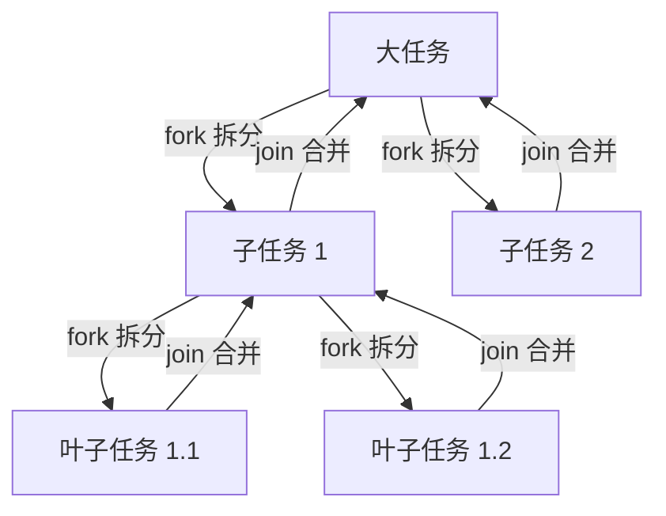
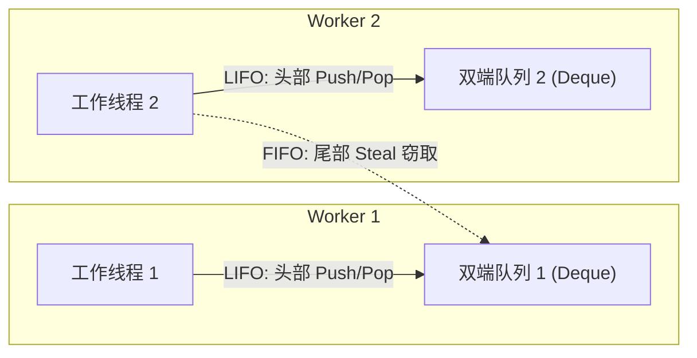

## ForkJoinPool 与并行流原理

在多核 CPU 时代，如何榨干硬件性能是并发编程的核心命题。Java 7 引入的 `ForkJoinPool` 与 Java 8 引入的 `Parallel Streams`（并行流），为开发者提供了一套开箱即用的、基于分治与工作窃取算法的并行计算利器。本文将深入剖析其底层架构、算法逻辑及生产环境下的性能与线程安全陷阱。

---

## 一、 ForkJoinPool 核心设计思想

传统的 `ThreadPoolExecutor` 适用于**任务相互独立、执行时间较为均衡**的场景。然而，对于可以递归拆分的“大任务”（如快速排序、斐波那契数列、大规模矩阵计算），传统线程池会遇到严重的线程饥饿与阻塞问题。

`ForkJoinPool` 则是专门为**分治思想（Divide and Conquer）**设计的线程池。



### 1. 核心任务抽象：`ForkJoinTask`

`ForkJoinPool` 执行的任务必须是 `ForkJoinTask` 的子类。最常用的是以下两个抽象类：

- **`RecursiveAction`**：递归执行，**无返回值**（如大数组并发赋值）。
- **`RecursiveTask<V>`**：递归执行，**有返回值**（如并发累加计算）。

#### 典型使用骨架（以 RecursiveTask 为例）：

```java
public class MyTask extends RecursiveTask<Integer> {
    private static final int THRESHOLD = 100; // 拆分阈值
    private final int start;
    private final int end;

    public MyTask(int start, int end) {
        this.start = start;
        this.end = end;
    }

    @Override
    protected Integer compute() {
        if ((end - start) <= THRESHOLD) {
            // 达到阈值，直接单线程计算
            return directCompute();
        } else {
            // 任务拆分
            int middle = (start + end) / 2;
            MyTask subTask1 = new MyTask(start, middle);
            MyTask subTask2 = new MyTask(middle, end);
            
            // 异步执行子任务
            subTask1.fork(); 
            subTask2.fork();
            
            // 等待子任务结果并合并
            return subTask1.join() + subTask2.join();
        }
    }
}
```

---

## 二、 工作窃取（Work-Stealing）算法底层机制

`ForkJoinPool` 的核心在于**工作窃取算法（Work-Stealing）**。

### 1. 为什么传统线程池无法优雅应对分治？

在传统线程池中，如果线程 A 提交了两个子任务并调用 `Future.get()` 等待它们完成，线程 A 将被**阻塞挂起**。在递归场景下，所有线程很快都会因为等待子任务而陷入阻塞，导致线程池“死锁”（Thread Starvation Deadlock）。

### 2. 双端队列（Deque）调度机制

为了解决上述阻塞问题，`ForkJoinPool` 为每个工作线程（`ForkJoinWorkerThread`）都分配了一个独立的**双端队列（WorkQueue）**：



- **本地操作（LIFO/后进先出）**：工作线程 1 自己产生的子任务（通过 `fork()` 提交）会放入自己队列的**头部**。线程 1 也会优先从自己队列的**头部**获取任务执行。
  - **优势**：后放入的子任务由于刚被创建，其相关数据极大概率还在 CPU 缓存（L1/L2 Cache）中。采用 LIFO 优先执行这些任务，能最大化利用 CPU 缓存局部性，减少主内存访问开销。
- **工作窃取（FIFO/先进先出）**：当工作线程 2 自己的队列变空时，为了防止 CPU 闲置，它会随机选择工作线程 1 的队列，并从其**尾部**窃取一个任务来执行。
  - **优势**：
    1. 窃取尾部的任务（通常是大任务拆分出来的较早的任务，工作量较大），可以避免频繁窃取。
    2. 拥有线程在头部操作，窃取线程在尾部操作，最大程度减少了在同一个双端队列上的锁竞争（Compare-And-Swap 冲突）。

### 3. `join()` 的非阻塞实现

当线程调用 `subTask.join()` 时，它**不会**像传统线程那样进入操作系统的线程挂起状态，而是执行以下优化步骤：

1. 检查 `subTask` 是否已经完成，若完成直接返回结果。
2. 若未完成且该任务就在当前线程的队列头部，直接弹出并执行。
3. 若任务已被其他线程窃取，当前线程会尝试“窃取”其他队列的任务，或者执行队列中的其他任务，直到目标任务完成。
4. 这种“不停工”的策略保证了所有 CPU 核心在整个计算周期内都维持极高负载。

---

## 三、 全局共享的 `commonPool()` 机制

Java 8 的 `CompletableFuture`（默认情况）和 `Parallel Streams` 都依托于一个全局共享的 `ForkJoinPool` 实例——`commonPool()`。

### 1. 核心参数默认配置

- **初始化时机**：懒加载，在首次使用并行流或 CommonPool 时创建。
- **默认线程数**：`Runtime.getRuntime().availableProcessors() - 1`。
- **为什么减 1？**
  - 因为提交并行任务的主线程（Caller Thread）自身也会参与到计算中（作为计算单元之一），因此线程池只需要创建 `CPU核心数 - 1` 个工作线程，即可占满全部物理 CPU 核心。

### 2. 生产环境的“多米诺骨牌”隐患

> [!CAUTION]
> 绝不要在全局共享的 `commonPool()` 或默认并行流中执行**任何慢 I/O 操作**（如 HTTP 调用、数据库长查询、大文件读写）！

由于整个 JVM 进程内的所有并行流和未指定线程池的 `CompletableFuture` 都在共享同一个 `commonPool()`，一旦某个业务模块在并行流中发起了一个阻塞耗时 2 秒的 HTTP 请求，就会瞬间占满 CommonPool 的所有线程。

这会导致：
- 其他毫无关联的业务模块的并行流计算全部卡死。
- 系统吞吐量雪崩，且在线程栈 Dump 中很难一眼定位这部分隐式阻塞。

---

## 四、 并行流（Parallel Streams）的性能与线程安全陷阱

并行流简化了并发编程，但也是“新手刺客”。

### 1. 经典的并发写入数据丢失

并行流底层是通过多线程并发执行任务的。如果在流中操作非线程安全的容器，会导致严重灾难：

```java
// 致命错误：ArrayList 非线程安全
List<Integer> result = new ArrayList<>();
IntStream.range(0, 10000).parallel().forEach(result::add);
System.out.println(result.size()); // 输出结果大概率小于 10000，且可能偶发 ArrayIndexOutOfBoundsException
```

- **根因**：`ArrayList` 的 `add()` 操作不具备原子性，多线程并发扩容与写入会导致数据覆盖。
- **修复方案**：避免在 `forEach` 中修改共享变量。应使用 `collect(Collectors.toList())`，其底层会利用收集器（Collector）的并发拆分合并机制，安全地聚合结果。

### 2. 共享池隔离方案

如果必须要执行带有 I/O 阻塞的并行任务，可以通过**自定义 ForkJoinPool 包装执行**来实现物理隔离：

```java
ForkJoinPool customPool = new ForkJoinPool(8); // 独立线程池
try {
    List<String> results = customPool.submit(() ->
        urls.parallelStream() // 此时并行流将使用 customPool 内的线程，而非 commonPool
            .map(this::fetchHtmlFromUrl)
            .collect(Collectors.toList())
    ).get();
} finally {
    customPool.shutdown(); // 注意释放资源
}
```

- **原理解密**：并行流在获取执行池时，会通过 `ForkJoinTask.inForkJoinPool()` 判断当前线程是否属于某个 `ForkJoinPool`。如果是，则直接复用当前工作线程所在的线程池。因此，外部包裹 `customPool.submit()` 能成功实现执行池的替换。

---

## 五、 面试真题与生产规约

### 1. 面试高频题

- **ForkJoinPool 与 ThreadPoolExecutor 的区别？**
  答：前者使用分治思想，支持任务拆分与结果合并；核心采用工作窃取算法，每个线程拥有独立的双端队列，空闲线程可以从其他线程队列尾部窃取任务执行，减少了线程阻塞和锁竞争。后者任务相互独立，所有线程共享一个阻塞队列。
- **并行流（Parallel Stream）一定比串行流（Sequential Stream）快吗？**
  答：不一定。并行流存在线程创建、任务拆分、线程上下文切换以及结果合并的开销。对于数据量较小（如少于 10000 个元素）或每个元素处理极快的计算，并行流可能更慢。必须结合 `N * Q` 公式评估（N 为元素数，Q 为单个元素计算耗时）。
- **`ForkJoinPool` 中使用 `fork()` 和 `join()` 的顺序有什么讲究？**
  答：应当先 `fork()` 所有子任务，再 `join()` 所有子任务。或者“先 `fork()` 子任务 1，然后直接在当前线程执行子任务 2 的 `compute()`，最后 `join()` 子任务 1”。如果写成 `sub1.fork(); sub1.join(); sub2.fork(); sub2.join();`，由于 `join()` 立即等待，程序将退化为单线程串行执行。

### 2. 生产规约（避坑指南）

- **规约 1**：不要在并行流中处理有状态的、非线程安全的共享变量。
- **规约 2**：含有外部 RPC 交互、I/O 读写等耗时操作，禁止使用默认并行流。必须使用独立定义的普通线程池或自定义的 `ForkJoinPool`。
- **规约 3**：对于计算密集型任务，并行流拆分出的数据源结构应尽量是易于切片的（如 `ArrayList`、数组），避免使用不易切片的结构（如 `LinkedList`、`BufferedReader.lines()`），因为后者的拆分（Spliterator）开销会抵消并行的优势。

---

## 六、 小结

`ForkJoinPool` 是现代 Java 高并发处理大批量计算任务的核心引擎。理解其**工作窃取**双端队列的 LIFO 与 FIFO 特征，有助于我们编写高性能的分治算法；而理清 `commonPool()` 的 JVM 共享边界，则是我们在微服务开发中规避全局线程饥饿、保障线上服务稳定性的基本底线。
