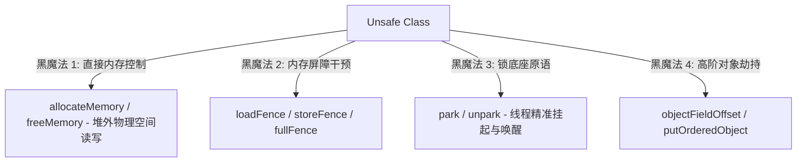
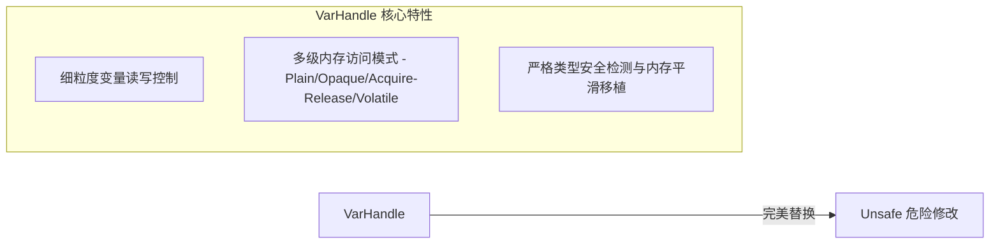

## JVM 魔法：Unsafe 与 JDK 9+ VarHandle 内存访问深度演进

在 Java 的安全沙箱世界中，通常不允许直接操作物理内存。然而，高并发底座（JUC 源码）、非阻塞通信（Netty）以及极速序列化框架（Kryo）为了榨干硬件性能，往往需要突破安全屏障，深入硬件层面进行极端优化。实现这一目的的传统武器是魔幻的 `sun.misc.Unsafe`，而在现代 Java 中，它正逐步让位于更安全、更内聚且具备精密多级内存屏障控制的 `java.lang.invoke.VarHandle`。

---

## 一、 `sun.misc.Unsafe` 的黑魔法与灾难

`Unsafe` 提供了硬件级别的底层内存操作接口。它是非安全的，因为绕过了 JVM 的内存安全检查器，直接交托给物理硬件处理。



### 1. `Unsafe` 的高频黑魔法 API 实战

由于 `Unsafe` 限制了非引导类加载器（Bootstrap ClassLoader）的直接实例化，我们在实战或阅读源码中必须通过反射打破限制来获取单例：

```java
import sun.misc.Unsafe;
import java.lang.reflect.Field;

public class UnsafeHolder {
    private static final Unsafe THE_UNSAFE;

    static {
        try {
            Field theUnsafeField = Unsafe.class.getDeclaredField("theUnsafe");
            theUnsafeField.setAccessible(true);
            THE_UNSAFE = (Unsafe) theUnsafeField.get(null);
        } catch (Exception e) {
            throw new RuntimeException("无法通过反射获取 Unsafe 实例", e);
        }
    }

    public static Unsafe getUnsafe() {
        return THE_UNSAFE;
    }
}
```

#### A. 堆外内存直接控制 (Off-Heap Control)

Direct 堆外物理空间（如 Netty 核心 ByteBuf）其越过 JVM 堆直接读写裸物理内存的代码：

```java
Unsafe unsafe = UnsafeHolder.getUnsafe();
long size = 1024L;
// 分配堆外 1024 字节空间
long memoryAddress = unsafe.allocateMemory(size);

try {
    // 写入数据：在 memoryAddress 地址写入整数 42
    unsafe.putInt(memoryAddress, 42);
    // 读取数据
    int val = unsafe.getInt(memoryAddress);
    System.out.println("堆外直接数据: " + val); // 42
} finally {
    // 必须手动释放，否则发生永久堆外物理内存泄漏，不触发虚拟 GC
    unsafe.freeMemory(memoryAddress);
}
```

#### B. 绕过构造器直接实例化

当你需要突破类构造约束（例如序列化组件反序列化对象时忽略构造方法、跳过零值初始化以及属性校验）时：

```java
public class ImmutableEntity {
    private final int secret;

    public ImmutableEntity() {
        throw new UnsupportedOperationException("禁止正常实例化！");
    }
}

// 突破限制
ImmutableEntity obj = (ImmutableEntity) unsafe.allocateInstance(ImmutableEntity.class);
// 此时 obj 已构建，绕过了构造函数拦截
```

### 2. `Unsafe` 的致命缺陷

1. **内存越界与崩溃（Segmentation Fault）**：极易产生非法物理地址访问，导致核心 JVM 进程当场崩溃退出（生成 `hs_err_pid.log`），无法依靠底座 `try-catch` 恢复。
2. **缺乏类型保障**：在任意偏移量（Offset）上均可强行写入、覆盖任何值，直接破坏 Java 类型系统的完整性。
3. **平台移植灾难**：内部大量原生指令（如 `lock cmpxchg`）存在软硬差异，极易在不同 CPU 架构上产生细微的并发死锁、主存不对齐错误。

---

## 二、 JDK 9+ 现代之光：`VarHandle`

为了在保障硬件级性能的前提下解决 `Unsafe` 带来的系统脆弱性，JDK 9 正式引入了 `java.lang.invoke.VarHandle`（变量句柄）。



### 1. `VarHandle` 解决三大痛点表现在

* **类型安全**：任何读写均进行方法句柄（MethodHandle）级的强校验，偏移量和目标域必须对齐并完全匹配其数据类型。
* **精细化多级屏障控制**：摒弃了之前“只有普通读写与 Volatile 两种极端”的做法，精细划分了内存访问级别，大幅提升极高并发下的吞吐效能。
* **JDK 演进守护**：`sun.misc.Unsafe` 已在 JDK 17-21 之后被完全隔离限制，且处于废弃弃用状态，`VarHandle` 成为底层（如 AQS `state`，`AtomicInteger`，`ConcurrentHashMap` 节点）的战略唯一首选。

---

## 三、 `VarHandle` 的五大变量访问模式与主内控制

`VarHandle` 通过定义精确的“变量访问方法”，直接对标底层 CPU 级别的多维度总线锁屏障与缓存写缓冲区行为：

### 1. 变量访问模式深度拆解

```java
import java.lang.invoke.MethodHandles;
import java.lang.invoke.VarHandle;

public class AtomicCounter {
    private volatile int value = 0;

    private static final VarHandle VALUE_HANDLE;

    static {
        try {
            // 利用查找对象（Lookup）反射解耦变量句柄
            VALUE_HANDLE = MethodHandles.lookup()
                .findVarHandle(AtomicCounter.class, "value", int.class);
        } catch (ReflectiveOperationException e) {
            throw new Error(e);
        }
    }

    // 接下来可以运用 VALUE_HANDLE 控制不同档次的屏障访问！
}
```

#### ① Plain 模式（普通访问）

* **特征**：没有任何主内存（Main Memory）可见性保护屏障。
* **物理动作**：等价于没有 synchronized / volatile 的无保障操作，极致性能开销，允许高度指令重排序、寄存器缓存驻留。
* **API**：`VALUE_HANDLE.set(this, newValue)` / `VALUE_HANDLE.get(this)`

#### ② Opaque 模式（不透明访问）

* **特征**：**保证程序顺序性，禁止指令重排序，但完全不保障多核可见性。**
* **物理动作**：在本地核心上，读取/写入不可被前后重排，但 CPU 核心之间的 Cache 写入何时同步是不保证的、可能读取到旧数据。
* **API**：`VALUE_HANDLE.setOpaque(this, newValue)` / `VALUE_HANDLE.getOpaque(this)`

#### ③ Acquire / Release 模式（单向半屏障）

* **特征**：最经典的 Lock-Free 共享通信底层实现。
  * **Release 写入**：确保当前线程该操作之前的读写指令绝不发生向本操作之后的重排。可以看作“在当前插入一个 StoreStore + LoadStore 屏障”。
  * **Acquire 读取**：确保当前线程该操作之后的读写指令绝不发生向本操作之前的重排。等价于“在当前插入一个 LoadLoad + LoadStore 屏障”。
* **典型场景**：线程甲产生生产数据后通过 `setRelease` 指派，线程乙通过 `getAcquire` 接收。可以不借用强 Volatile 即可百分百获得完美的可见性流秩序。
* **API**：`VALUE_HANDLE.setRelease(this, newValue)` / `VALUE_HANDLE.getAcquire(this)`

#### ④ Volatile 模式（全屏障）

* **特征**：完全可见性。
* **物理动作**：对标标准 `volatile` 读写，注入全屏障（`StoreLoad` 屏障），完全对齐 JVM 规范，且强制全局线性全序一致。
* **API**：`VALUE_HANDLE.getVolatile(this)` / `VALUE_HANDLE.setVolatile(this, newValue)`

#### ⑤ Witness 模式（带预期比对的控制）

* **特征**：用于执行高精密比较（例如 CAS），若修改失败则提供带有特定内存序（Acquire/Release）的旧值见证。
* **API**：`VALUE_HANDLE.compareAndExchange(this, expected, newValue)`

---

### 2. 内存屏障对比汇总（硬件级视界）

| 模式 | 运行速度（相对） | CPU 指令级动作 | JMM 内存栅栏图景 |
| :--- | :--- | :--- | :--- |
| **Plain** | 🚀🚀🚀🚀🚀（最快） | 纯内存/寄存器位移 | 无任何屏障支持 |
| **Opaque** | 🚀🚀🚀🚀 | 寄存器限制 | 局部控制，不触发 Core 双总线刷新 |
| **Acquire / Release** | 🚀🚀🚀 | Lence 局部限制 | 排除前向写（StoreStore）或后向读（LoadLoad）重排 |
| **Volatile** | 🚀 | `lock` 锁总线（x86） | 插入全能 `StoreLoad` 屏蔽，强制刷回 L1/L2 缓存 |

---

## 四、 Unsafe 到 VarHandle 的过渡实操

我们以最底层的 CAS 原语及 volatile 修改为例，对比两个时代的演进：

### 1. CAS 底层替换实现

```java
// ======= ⚠️ 传统 Unsafe 风格 =======
class OldAtomic {
    private volatile int state = 0;
    private static final Unsafe UNSAFE = UnsafeHolder.getUnsafe();
    private static final long STATE_OFFSET;

    static {
        try {
            // 需要直接算偏移量，极易导致错误操作其他相邻字段
            STATE_OFFSET = UNSAFE.objectFieldOffset(OldAtomic.class.getDeclaredField("state"));
        } catch (Exception e) { throw new Error(e); }
    }

    public boolean compareAndSet(int expect, int update) {
        return UNSAFE.compareAndSwapInt(this, STATE_OFFSET, expect, update);
    }
}

// =======  现代 VarHandle 风格 =======
class NewAtomic {
    private volatile int state = 0;
    private static final VarHandle STATE_HANDLE;

    static {
        try {
            // 利用类型安全反射定位句柄，完全杜绝了物理地址错位隐患
            STATE_HANDLE = MethodHandles.lookup()
                .findVarHandle(NewAtomic.class, "state", int.class);
        } catch (Exception e) { throw new Error(e); }
    }

    public boolean compareAndSet(int expect, int update) {
        // 严格检验 this、expect (int)、update (int)，类型错乱立即在编译/运行首行抛出异常
        return STATE_HANDLE.compareAndSet(this, expect, update);
    }
}
```

---

## 五、 全局内存屏障 API 的控制手法

除了依托具体字段挂载访问句柄，`VarHandle` 同样替代了 `Unsafe` 的 `loadFence()`、`storeFence()` 等“全局空置物理屏障”，以便在极其定制的代码执行段中直接强占 CPU 缓存流：

```java
import java.lang.invoke.VarHandle;

public class CustomFenceLogic {

    public void executeWithFences() {
        int localVal = 100;
        
        // 模拟复杂运算后...
        
        // 1. 插入 LoadLoad + LoadStore 半屏障：保障在该语句之前的读绝不与在该语句之后的读写重排
        VarHandle.acquireFence();
        
        // 2. 插入全能全序屏障（等价于 x86 lock）：完全切断两端，强制同步 Cache-Line
        VarHandle.fullFence();
        
        // 3. 插入 StoreStore + LoadStore 半屏障：保障在该语句之前的写绝不与在该语句之后的读写重排
        VarHandle.releaseFence();
    }
}
```

在 2026 年现代 Java 的主流高并发框架与中间件底座中，这种通过 `VarHandle` 极细粒度、多级可控的内存栅栏设计早已成熟。利用它取代高危的 `Unsafe`，是维护虚拟机高吞吐和整体平滑、安全运行的绝对核心钥匙。
