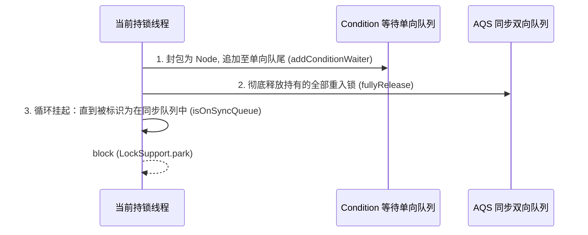
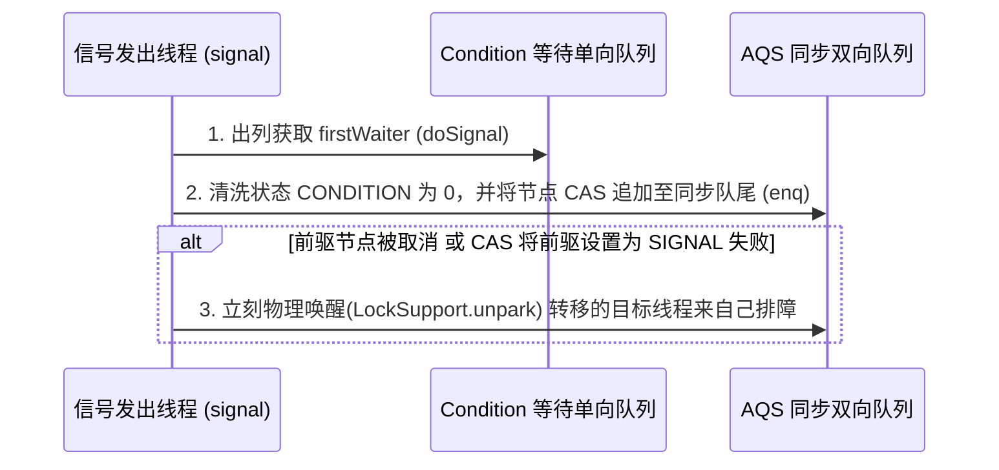

## JUC 深水区：AQS ConditionObject 挂起与节点迁移机制源码深剖

在 Java 高级并发编程中，`java.util.concurrent.locks.Condition` 接口提供了类似 `Object.wait()/notify()` 的等待-通知机制，但展现出更高的精准度与可控能力。其底层完全托管在 `AbstractQueuedSynchronizer`（AQS）的内部类 `ConditionObject` 中。

本篇将深入源码底层，拆解其内部双队列（**双向同步队列与单向等待队列**）之间的精妙协作，剖析线程挂起、锁释放、节点物理迁移、以及中断唤醒两阶段退出的核心算法。

---

## 一、 双队列物理模型拓扑

AQS 内部实际上共存着两种物理链接队列：
1. **同步队列（Sync Queue）**：一个基于 AQS `head / tail` 维护的双向 FIFO 阻塞队列，用于存放**争抢独占或共享锁**的未决线程节点。
2. **等待队列（Condition Queue）**：由 `ConditionObject` 实例持有的单向 FIFO 队列（维护 `firstWaiter / lastWaiter`），用于存放**处于挂起休眠状态、等待特定信号（Signal）唤醒**的线程。

```mermaid
graph TD
    subgraph AQS 同步队列 (Sync Queue - 双向)
        Head["Head / Dummy Node"] <--> NodeA["Node A: Thread X"] <--> NodeB["Node B: Thread Y"] <--> Tail[Tail]
    end

    subgraph ConditionObject 等待队列 (Condition Queue - 单向)
        FirstWaiter["firstWaiter: Thread P"] --> NextWaiter["Node Q: Thread Q"] --> LastWaiter["lastWaiter: Thread R"]
    end

    NodeA -.->|fullyRelease 释放锁| Head
    FirstWaiter -.->|signal 发生时| Tail
    style FirstWaiter fill:#f9f,stroke:#333,stroke-width:2px
    style Tail fill:#bbf,stroke:#333,stroke-width:2px
```

### 队列节点的交织与独立

* 同步队列在发生冲突时由 AQS 全局拦截和入队，通过 `prev` 和 `next` 指针双向维系。
* 等待队列是 `ConditionObject` 实例独有的，节点间仅通过 `nextWaiter` 指针构成单向 FIFO 拓扑。
* **一个 `Node` 的物理实例在生命周期中，会伴随状态改变在等待队列和同步队列之间进行迁移拔转**。

---

## 二、 释放与挂起内核：`await()` 源码级推进

当一条持有锁的线程调用 `condition.await()` 时，会触发以下三个连续物理操作：



### 1. 封包入等待队列：`addConditionWaiter()`

首先，必须在持有锁的前提下，执行入单向等待队列的步骤。此时该方法的内部不采用 CAS，因为**执行线程此时必然独占了锁**，无并发冲突风险。

```java
private Node addConditionWaiter() {
    if (!isHeldExclusively()) // 必须持有独占锁，否则直接抛异常
        throw new IllegalMonitorStateException();
    Node t = lastWaiter;
    // 如果尾部节点已被取消，则进行一次全链表清理（清除 CANCELLED 节点）
    if (t != null && t.waitStatus != Node.CONDITION) {
        unlinkCancelledWaiters();
        t = lastWaiter;
    }
    // 构造节点，明确 waitStatus 为 CONDITION (-2)
    Node node = new Node(Node.CONDITION);
    if (t == null)
        firstWaiter = node;
    else
        t.nextWaiter = node;
    lastWaiter = node;
    return node;
}
```

### 2. 彻底锁释放：`fullyRelease(Node)`

调用 `await` 会立刻将当前线程持有的重入嵌套锁（如 `ReentrantLock` 嵌套了 3 层，则 $state = 3$）**一次性完全释放**：

```java
final int fullyRelease(Node node) {
    try {
        int savedState = getState(); // 临时封存重入次数
        if (release(savedState)) { // 一次性释放
            return savedState; // 返回重入深度，以便唤醒后恢复现场
        }
        throw new IllegalMonitorStateException();
    } catch (Throwable t) {
        node.waitStatus = Node.CANCELLED; // 释放失败则标志节点取消
        throw t;
    }
}
```

### 3. 自旋判定与物理挂起：`isOnSyncQueue(Node)`

在释放完锁后，当前线程立刻进入 `while` 自旋，判定自己是否被转移回了 **AQS 同步队列**。若未转移，说明信号尚未到来，必须执行物理挂起。

```java
// 核心循环逻辑
while (!isOnSyncQueue(node)) {
    LockSupport.park(this); // 挂起线程，等待被唤醒（或发生中断）
    if ((interruptMode = checkInterruptWhileWaiting(node)) != 0)
        break; // 检测到中断，退出挂起循环
}
```

---

## 三、 唤醒与节点转移内核：`signal()` 核心机制

当其他持锁线程执行 `condition.signal()` 时，本质是将等待队列首位有效的节点（`firstWaiter`）**物理挪动并塞回 AQS 配套的同步队列尾部**，使其重新进入抢锁竞争状态。



### 1. 顶层分发：`doSignal(Node)`

从单向队列头部剔除该节点，并切断其后续引用，保护内存不产生虚连引用泄露。

```java
private void doSignal(Node first) {
    do {
        if ( (firstWaiter = first.nextWaiter) == null)
            lastWaiter = null;
        first.nextWaiter = null; // 切断单向排队链接
    } while (!transferForSignal(first) && (first = firstWaiter) != null);
    // 如果 transferForSignal 失败（节点可能已取消），则继续挑下一个节点尝试转移
}
```

### 2. 关键核心：在 `transferForSignal(Node)` 中执行物理迁移

这是 AQS 队列间流转至高技术力的分水岭方法：

```java
final boolean transferForSignal(Node node) {
    /*
     * Step 1: 尝试将状态从 CONDITION 转换至 0（默认初始同步态）
     * 如果修改失败，说明该节点已被取消（例如已超时或中断了），返回 false 让调用者寻找下一个
     */
    if (!node.compareAndSetWaitStatus(Node.CONDITION, 0))
        return false;

    /*
     * Step 2: 拼装插入 AQS 同步双向队列尾部 (enq)
     * enq 是 AQS 内部的死循环 CAS 入队机制，返回值为插入后该节点的前驱节点 (p)
     */
    Node p = enq(node); 
    int ws = p.waitStatus;

    /*
     * Step 3: 优化锁竞争行为
     * 如果前驱节点已被取消 (ws > 0)，或者通过 CAS 将前驱状态置为 SIGNAL (-1) 失败，
     * 说明前驱已无法稳妥唤醒我们，此时需要强行 unpark 唤醒该迁移线程，让其通过 acquireQueue 机制重新自理。
     */
    if (ws > 0 || !p.compareAndSetWaitStatus(ws, Node.SIGNAL))
        LockSupport.unpark(node.thread);
        
    return true;
}
```

---

## 四、 中断唤醒下的“两阶段退出”与安全防护

如果在挂起过程中由于 **异常外部线程执行 `thread.interrupt()`** 而被迫苏醒，AQS 必须确保不发生丢失信号（Signal Lost）和状态混乱问题。

### 1. 中断退出时机测定

在 `await` 自旋中苏醒后，首要任务是判断中断发生的具体时点：
* **`THROW_IE` (-1)**：中断发生在 `signal()` **之前**。此时节点还停留在等待队列中，需要自行将节点强制移入同步队列，随后在 `await` 退出时抛出 `InterruptedException`。
* **`REINTERRUPT` (1)**：中断发生在 `signal()` **之后**。说明信号已经传达，当前线程已被妥善放入同步队列。此时只需在 `await` 退出时通过 `selfInterrupt()` “重设物理中断标志”，由后续业务自理。

```java
private int checkInterruptWhileWaiting(Node node) {
    return Thread.interrupted() ?
        (transferAfterCancelledWait(node) ? THROW_IE : REINTERRUPT) : 0;
}
```

```java
final boolean transferAfterCancelledWait(Node node) {
    // 尝试 CAS 将 CONDITION 重置为 0
    if (node.compareAndSetWaitStatus(Node.CONDITION, 0)) {
        // CAS 成功说明：signal 还没来得及处理该节点（中断优先发生）
        enq(node); // 自行强行塞入同步队列参加排队
        return true; // 返回 true 标识为 THROW_IE 状态
    }
    
    // 如果 CAS 失败，说明 signal() 的 CAS 已经抢先一步成功，信号已送达。
    // 此时虽然中断了，但节点已经交由同步队列管理。我们需要自旋等待其被完全放入同步队列。
    while (!isOnSyncQueue(node)) {
        Thread.yield(); // 极短自旋，确保节点百分百被 enq 完毕
    }
    return false; // 返回 false 标识为 REINTERRUPT 状态
}
```

### 2. 完美的退场机制总结

通过两阶段中断状态隔离，AQS 提供了最完备的安全边界：
1. **防止信号丢失**：即使线程被提前中断唤醒，如果是 `REINTERRUPT` 场景，依然会正常走完 `signal` 迁移。
2. **严密的最终锁恢复**：无论是哪种中断退出，在 `await` 精准返回前均会执行 `acquireQueued(node, savedState)` 动作，重新夺回在 `fullyRelease` 中暂存丢弃的重入锁深度，确保业务层临界区的绝对独占安全性。
