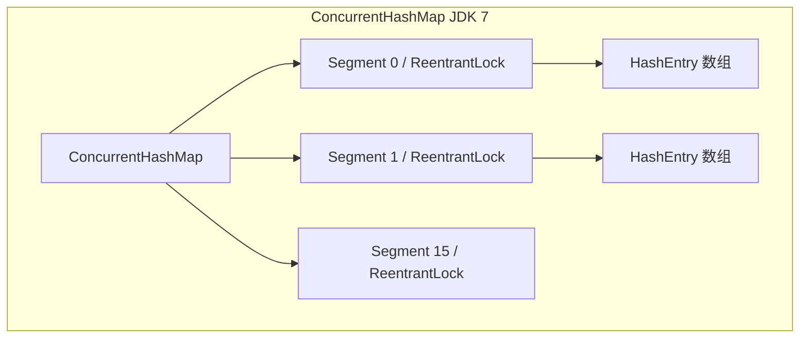
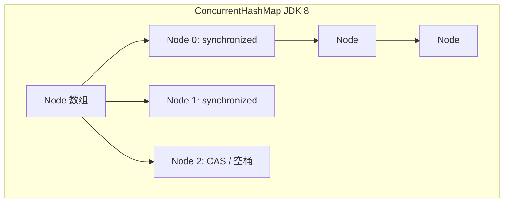

## HashMap 与 ConcurrentHashMap 源码级深度解析

在 Java 资深工程师的面试中，集合框架的底层原理是必考的硬核内容。其中，`HashMap` 的扩容机制、JDK 7 与 JDK 8 的重大变革，以及 `ConcurrentHashMap` 的并发安全设计与锁粒度演进，更是重中之重。

---

## 一、 HashMap 的线程不安全缺陷

`HashMap` 在设计之初就是面向单线程的。如果在多线程并发环境下使用 `HashMap`，将会引发严重的线程安全问题。

> [!NOTE]
> 关于 `HashMap` 单线程下的底层数据结构、核心参数、扰动函数和扩容计算，详见 [0-collection-framework.md](file:///d:/Documents/GitHub/AiDocs/docs/java/basic/0-collection-framework.md)。

### 1. JDK 7 的并发扩容死循环问题

在 JDK 7 中，`HashMap` 在多线程并发扩容时，可能会形成**环形链表**，导致后续 `get()` 操作进入死循环，CPU 飙高到 100%。

- **根源**：JDK 7 扩容时采用的是 **头插法**（Head Insertion）。在将旧链表迁移到新链表时，会逆序改变链表元素的顺序。
- **死循环过程**：

  设旧链表某个桶中有两个节点：`A -> B`。

  - 线程 1 和 2 同时进行扩容。线程 1 执行到 `Entry<K,V> next = e.next;` 时被挂起，此时对于线程 1 而言：`e = A`，`next = B`。
  - 线程 2 顺利完成了扩容与迁移。由于是头插法，新桶中的顺序变为了 `B -> A`。
  - 线程 1 被唤醒继续执行。它将 `A` 插入新桶头部，然后处理 `B`（此时 `B.next` 已经指向了 `A`）。当处理 `B` 时，又将 `B` 插入头部，并把 `B.next` 指向 `A`。接着处理 `A`，由于 `A.next` 此时为 `null`，但之前的操作已经让 `A.next` 指向了 `B`，从而形成了 `A <-> B` 的环形结构。

> **JDK 8 的解决方案**：
> JDK 8 彻底废弃了头插法，改用 **尾插法**（Tail Insertion）。在扩容迁移时，保持链表节点原有的顺序，从而避免了环形链表的产生。

### 2. JDK 8 的并发数据覆写问题

虽然 JDK 8 改用尾插法避免了死循环问题，但 `HashMap` 依然不是线程安全的。在多线程并发写入时，会导致数据丢失或覆写：

1. **碰撞覆写**：当两个线程同时调用 `put` 且计算出的桶位（Bucket Index）相同时，如果该桶位为 `null`，两线程均会尝试写入该位置。它们会并发读取该位置为 `null`，然后先后写入，后写入的线程会覆盖先写入线程的数据。
2. **Size 计数不准**：`HashMap` 中的 `size` 计数没有加锁控制，多线程并发 `size++` 会导致实际元素个数与 `size` 记录值不一致。

---

## 二、 ConcurrentHashMap 锁粒度演进

`ConcurrentHashMap` 是线程安全的哈希表，其底层架构在 JDK 7 和 JDK 8 中发生了翻天覆地的变化。

### 1. JDK 7 的 Segment 分段锁架构

- **底层结构**：由 `Segment` 数组和 `HashEntry` 数组组成。
- **锁机制**：`Segment` 继承自 `ReentrantLock`。每个 `Segment` 守护着一个 `HashEntry` 数组。
- **并发度**：默认并发度为 16（即有 16 个 Segment），理论上最多支持 16 个线程并发写入。



---

### 2. JDK 8 的 CAS + synchronized 锁粒度优化

- **底层结构**：彻底废弃了 `Segment` 分段锁，改用与 `HashMap` 相同的 **Node 数组 + 链表 + 红黑树** 结构。
- **锁机制**：采用 **CAS 操作 + `synchronized` 关键字**。
- **锁粒度**：**锁住的是每个桶（Bucket）的头节点（Node）**。
- **并发度**：并发度直接等同于数组的长度（默认 16，随着扩容而增加），极大地减少了锁竞争。



> **高频追问：为什么 JDK 8 放弃 ReentrantLock 而选择 synchronized？**
>
> 1. **减少内存开销**：JDK 7 的每个 `Segment` 都是一个继承自 `ReentrantLock` 的对象，会消耗大量内存。而 JDK 8 锁住桶的头节点，无需额外创建大量的锁对象。
> 2. **JVM 级别的极致优化**：`synchronized` 是 JVM 级别的关键字，在 JDK 1.6 引入锁升级机制（偏向锁、轻量级锁、重量级锁）后，其性能得到了极大提升。此外，JVM 可以对 `synchronized` 进行锁粗化、锁消除等编译器层面的优化，这是 API 级别的 `ReentrantLock` 无法做到的。
> 3. **数据结构演进**：JDK 8 引入了红黑树。当链表转化为红黑树后，锁住头节点依然能完美控制整棵树的并发写入。

---

## 三、 ConcurrentHashMap 核心源码剖析（JDK 8）

### 1. 初始化：懒加载与 `sizeCtl` 的控制

`ConcurrentHashMap` 的构造函数中并不会初始化 Node 数组，而是延迟到第一次 `put()` 时进行懒加载。其初始化过程通过 `sizeCtl` 变量进行并发控制：

```java
private final Node<K,V>[] initTable() {
    Node<K,V>[] tab; int sc;
    while ((tab = table) == null || tab.length == 0) {
        if ((sc = sizeCtl) < 0)
            Thread.yield(); // 失去 CPU 执行权：说明有其他线程正在进行初始化
        else if (U.compareAndSetInt(this, SIZECTL, sc, -1)) { // CAS 将 sizeCtl 设为 -1，代表抢占到初始化锁
            try {
                if ((tab = table) == null || tab.length == 0) {
                    int n = (sc > 0) ? sc : DEFAULT_CAPACITY;
                    @SuppressWarnings("unchecked")
                    Node<K,V>[] nt = (Node<K,V>[])new Node<?,?>[n];
                    table = tab = nt;
                    sc = n - (n >>> 2); // sc = 0.75 * n，即扩容阈值
                }
            } finally {
                sizeCtl = sc;
            }
            break;
        }
    }
    return tab;
}
```

---

### 2. 写入流程 `putVal` 源码级解析

```java
final V putVal(K key, V value, boolean onlyIfAbsent) {
    if (key == null || value == null) throw new NullPointerException(); // Key/Value 严禁为 null
    int hash = spread(key.hashCode()); // 扰动函数，计算哈希值
    int binCount = 0;
    for (Node<K,V>[] tab = table;;) {
        Node<K,V> f; int n, i, fh; K fk; V fv;
        if (tab == null || (n = tab.length) == 0)
            tab = initTable(); // 1. 数组为空，进行初始化
        else if ((f = tabAt(tab, i = (n - 1) & hash)) == null) {
            // 2. 对应的桶为空，直接通过 CAS 尝试放入新节点，无需加锁
            if (casTabAt(tab, i, null, new Node<K,V>(hash, key, value)))
                break;                   
        }
        else if ((fh = f.hash) == MOVED)
            // 3. 发现头节点的 hash 值为 MOVED (-1)，说明当前集群正在进行扩容迁移
            tab = helpTransfer(tab, f); // 当前线程加入协助扩容
        else {
            V oldVal = null;
            // 4. 桶不为空且未在扩容，锁住当前桶的头节点
            synchronized (f) {
                if (tabAt(tab, i) == f) {
                    if (fh >= 0) { // fh >= 0 说明是链表节点
                        binCount = 1;
                        for (Node<K,V> e = f;; ++binCount) {
                            K ek;
                            if (e.hash == hash &&
                                ((ek = e.key) == key || (ek != null && key.equals(ek)))) {
                                oldVal = e.val;
                                if (!onlyIfAbsent)
                                    e.val = value;
                                break;
                            }
                            Node<K,V> pred = e;
                            if ((e = e.next) == null) {
                                pred.next = new Node<K,V>(hash, key, value); // 尾插法插入新节点
                                break;
                            }
                        }
                    }
                    else if (f instanceof TreeBin) { // 说明是红黑树节点
                        Node<K,V> p;
                        binCount = 2;
                        if ((p = ((TreeBin<K,V>)f).putTreeVal(hash, key, value)) != null) {
                            oldVal = p.val;
                            if (!onlyIfAbsent)
                                p.val = value;
                        }
                    }
                }
            }
            if (binCount != 0) {
                if (binCount >= TREEIFY_THRESHOLD)
                    treeifyBin(tab, i); // 5. 链表长度达到 8，尝试树化
                if (oldVal != null)
                    return oldVal;
                break;
            }
        }
    }
    addCount(1L, binCount); // 6. 统计元素个数，并判断是否需要扩容
    return null;
}
```

---

### 3. 并发扩容协助机制（`helpTransfer`）

当线程在 `put` 时发现桶的头节点是 `ForwardingNode`（其 hash 值为 `MOVED = -1`），说明 `ConcurrentHashMap` 正在进行扩容。

- **核心思想**：**多线程协同扩容**。
- **机制**：
  - 扩容线程会向 TC 申请分配一个“迁移任务区间”（默认每个线程负责迁移 16 个桶）。
  - 线程负责将自己区间内的旧桶数据迁移到新数组中。迁移完毕后，将旧桶的头节点设置为 `ForwardingNode`，指向新数组。
  - 其他写线程发现 `ForwardingNode` 后，不会被阻塞，而是主动调用 `helpTransfer` 协助迁移，迁移完成后再将数据写入新数组。这种设计极大地缩短了扩容期间的停顿时间。

---

## 四、 高频面试题与追问

### 1. ConcurrentHashMap 的 get 方法加锁分析

**答**：

**不需要加锁**。`get` 方法是完全无锁的，极其高效。

**原因**：

1. **`volatile` 保证可见性**：

   Node 节点的 `val` 字段和 `next` 指针都被 `volatile` 修饰：

   ```java
   transient volatile Node<K,V>[] table; // 数组本身被 volatile 修饰
   volatile V val;                       // 节点值被 volatile 修饰
   volatile Node<K,V> next;              // 下一个节点指针被 volatile 修饰
   ```

   这保证了任何一个写线程对节点值或链表结构的修改，对其他读线程都是立即可见的。

2. **Copy-On-Write 思想与 ForwardingNode**：

   在扩容期间，读线程如果访问到已经迁移完的桶，会遇到 `ForwardingNode`。该节点会引导读线程去新数组中进行查询，因此读写操作可以并发进行，互不阻塞。
