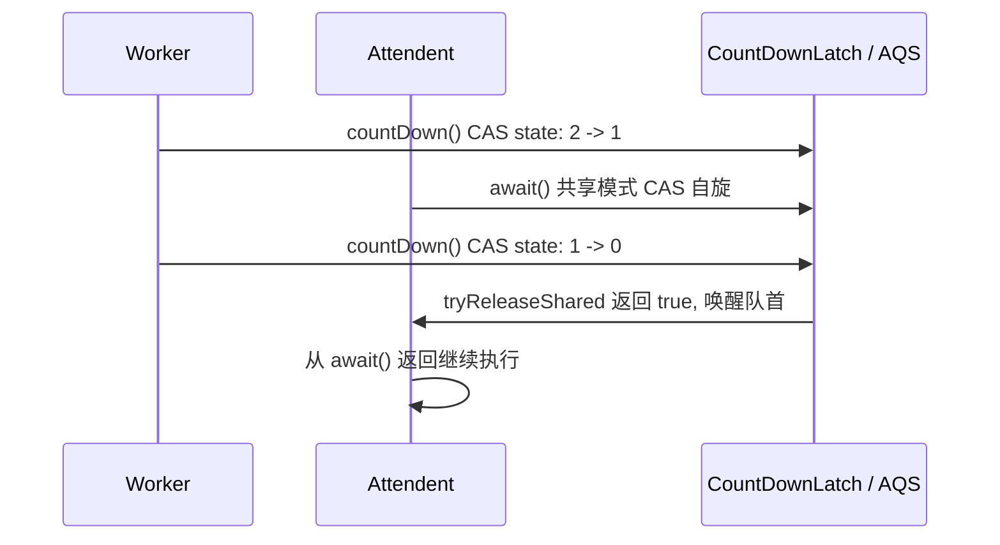
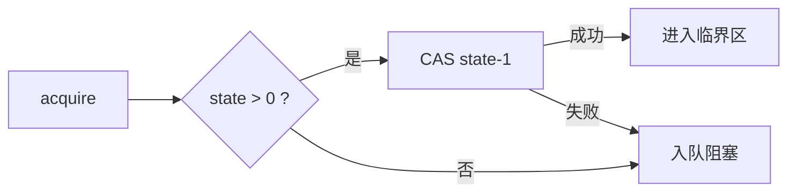
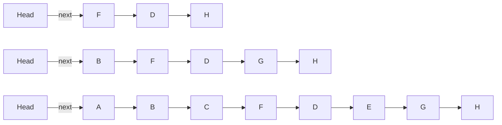
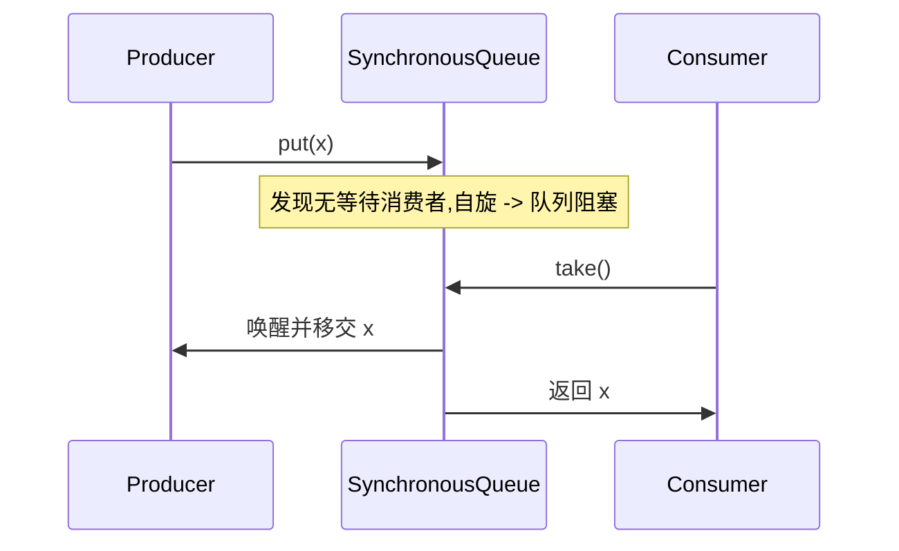

---
title: 并发容器与同步工具源码精析
hide_title: true
sidebar_label: 并发容器与同步工具
---

## 并发容器与同步工具源码精析

`java.util.concurrent` 不仅提供了 [AQS 显式锁](1-aqs-locks.md) 与 [线程池](4-threadpool.md),还提供了一系列面向**高并发场景**的并发容器与同步工具。它们通过 CAS、分段锁、写时复制、`VarHandle` 等无锁化或细粒度锁技术把同步成本压到最低,是构建高性能中间件、缓存与协同流程的必备积木。

---

## 一、 同步工具协力者(Synchronizer)

### 1. `CountDownLatch`:一次性倒计时

`CountDownLatch` 内部继承自 AQS,把 `state` 用作**计数器**,构造时传 `count` 并 `setState(count)`。



- `countDown` 调 `releaseShared(1)` → `tryReleaseShared`:CAS 把 state 减一,直到为 0 时返回 `true`,触发 `doSharedInterrupt` 唤醒所有等待线程。
- `await` 调 `acquireSharedInterruptibly(1)` → `tryAcquireShared`:若 `state == 0` 返回 1 表示成功,否则阻塞。

**不可重置**:state 不会自动重置,这是 `CountDownLatch` 与 `CyclicBarrier` 的本质区别。

### 2. `CyclicBarrier`:可循环栅栏

```java
CyclicBarrier barrier = new CyclicBarrier(N, () -> System.out.println("一批到了"));
// 多线程
barrier.await(); // 阻塞直到 N 个线程都到达
```

| 特性 | `CountDownLatch` | `CyclicBarrier` |
| :--- | :--- | :--- |
| 计数 | 不可重置 | `reset()` 可重置,可循环使用 |
| 主体 | 由外部线程 `countDown` | 由**到达线程**自己 `await` |
| 底层 | AQS `state` | `ReentrantLock` + `Condition` |
| 异常 | 1 个抛异常不影响他人 | 任一抛异常或被中断,**所有**等待被打破 |

其实现是 `lock.lockInterruptibly()` + `trip.await()`;最后一根线程到达时执行 `command` 并 `trip.signalAll()`,最后调用 `nextGeneration()` 把 `count` 重置为初始值并换一代(`generation` 引用变化,以实现 `reset`)。

### 3. `Semaphore`:信号量许可证

```java
Semaphore permits = new Semaphore(10);
permits.acquire();     // -1, 不足则阻塞
try { /* 临界区 */ }   // 用于限流、资源池容量控制
finally { permits.release(); }
```

底层同样是 AQS 共享模式:`state` 为许可证数量。

- **公平**:`new Semaphore(N, true)`,`acquire` 前先检查队列有无等待者。
- **非公平**(默认):直接 CAS 抢,失败再入队。



### 4. `Phaser`:多阶段相位

`Phaser` 是 JDK 7 引入的高级同步器,支持:

- 动态注册/注销 parties(`register`、`bulkRegister`、`arriveAndDeregister`)。
- 多阶段同步,`phase` 自增。
- 分层 `phaser`(父-子),解决超大 parties 数量下的 AQS 队列瓶颈。

适用“多阶段 Lambda,Gene"这类需要灵活分阶段合并的算法。

### 5. `Exchanger`:两两交换

```java
Exchanger<String> ex = new Exchanger<>();
// Thread-A
String got = ex.exchange("from-A");
// Thread-B
String got2 = ex.exchange("from-B");
// 交换后 A 拿到 from-B,B 拿到 from-A
```

底层用 `Node` + `arena` 数组,无锁 CAS 配对;多线程两两交换时会成对配对,顺序保证较弱。

---

## 二、 并发 List

### 1. `CopyOnWriteArrayList`:写时复制

```java
public boolean add(E e) {
    synchronized (lock) {
        Object[] es = array;
        Object[] ne = new Object[es.length + 1];
        System.arraycopy(es, 0, ne, 0, es.length);
        ne[es.length] = e;
        array = ne;             // volatile 数组引用,刷新可见性
        return true;
    }
}
public E get(int i) { return (E) array[i]; } // 无锁直接读
```

- **读完全无锁**,性能极高,适合“**写极少、读极多**”的配置类、监听器列表场景。
- **写**:`synchronized` + 复制整个数组,内存与 GC 压力大,不适频繁写。
- **弱一致性**:每次读都严格读到**当时快照**,迭代过程中新增的元素**看不到**,不会有 `ConcurrentModificationException`,但也无法读到迭代之后的修改。

### 2. 为什么不能用 `Collections.synchronizedList`?

`synchronizedList` 是为**整个集合加一把全局锁**,读也要竞争锁,在 COW 的“读多写少”场景下性能反不如;但**写多**场景上 `synchronized` 会少一次内存复制。两者适用面互补。

---

## 三、 并发 Map

`ConcurrentHashMap` 的并发设计已有 [独立章节](2-hashmap-concurrenthashmap.md) 深度拆解,本节聚焦其余两个高阶 Map。

### 1. `ConcurrentSkipListMap`:基于跳表的并发有序 Map

底层由多层链表索引构成(每个节点 $p = 0.5$ 概率被提升一层),查找/插入/删除均为 $O(\log n)$,且全程无锁(CAS 链接)。



- 实现 `NavigableMap`,支持 `subMap`、`headMap` 等**范围视图**。
- 时间复杂度 $O(\log n)$,高于 `HashMap` 的 $O(1)$,但能保持有序且不必扩容,内存利用率稳定。

### 2. `ConcurrentLinkedQueue` / `ConcurrentLinkedDeque`

参见下一节“无锁队列”。

---

## 四、 阻塞队列家族:线程池的能量池

| 队列 | 底层 | 是否有界 | 场景 |
| :--- | :--- | :--- | :--- |
| `ArrayBlockingQueue` | 数组 + 一把 `ReentrantLock` | 是 | 高吞吐、稳定公平 |
| `LinkedBlockingQueue` | 链表 + 双锁(头尾各一把) | 默认无界 | `Executors.newFixedThreadPool` 默认使用,**有 OOM 风险** |
| `SynchronousQueue` | 无元素容量 + TransferStack/Queue | 容量 0 | `newCachedThreadPool`,纯 hand-off |
| `PriorityBlockingQueue` | 二叉堆 + 锁+CAS | 无界 | 优先级任务 |
| `DelayQueue` | `PriorityQueue` + 锁 + 时间戳 | 无界 | 延迟任务、定时器、缓存过期 |
| `LinkedTransferQueue` | 无锁(Doug Lea 实现) | 无界 | 高性能 hand-off |
| `LinkedBlockingDeque` | 双端链表 + 一把锁 | 有界 | 工作窃取 |

### 1. `ArrayBlockingQueue` 双条件变量精妙

```java
Lock lock = new ReentrantLock();
Condition notFull  = lock.newCondition();
Condition notEmpty = lock.newCondition();

public void put(E e) throws InterruptedException {
    lock.lockInterruptibly();
    try {
        while (count == items.length) notFull.await();
        enqueue(e);
        notEmpty.signal();
    } finally { lock.unlock(); }
}
```

只使用一把锁 + 两个条件变量,精巧地分离“等待空位”和“等待元素”两类消费者,避免相互误唤醒。

### 2. `SynchronousQueue`:零容量直接传递



内部用栈(非公平 `TransferStack`)或队列(公平 `TransferQueue`)匹配生产者-消费者,本身不持有任何元素。这是 `Executors.newCachedThreadPool` 的核心设计:让线程数随任务量动态扩展。

### 3. `DelayQueue`:定时任务引擎

`DelayQueue<E extends Delayed>` 用堆排序,每次出队只取已到期的 `getDelay <= 0` 的元素。

- 入队时 `siftUp`,出队 `siftDown`,与 `PriorityQueue` 一致。
- `take()` 若队首未到期则 `available.awaitNanos(delay)` 等待剩余时间。

Java 的 `ScheduledThreadPoolExecutor` 内部类似机制,但用**堆 + leader-follower 模式**:同一时刻只有一个线程(`leader`)在 `available.awaitNanos(delay)` 等待,其他线程 `await()` 无超时,降低虚假唤醒开销。

---

## 五、 无锁队列:`ConcurrentLinkedQueue` 与 `LinkedTransferQueue`

`ConcurrentLinkedQueue` 基于 Michael & Scott 1996 论文实现,核心:

- 入队:把新节点 CAS 拼到 tail.next,再尝试 CAS 移动 tail(若失败由下一入队线程补做,不影响正确性)。
- 出队:CAS 前移 head.next;head 可能滞后于真实队首,靠 `advanceHead` 懒调整。

```java
public boolean offer(E e) {
    Node<E> newNode = new Node<>(e);
    for (Node<E> t = tail, p = t;;) {
        Node<E> q = p.next;
        if (q == null) {
            if (NEXT.compareAndSet(p, null, newNode)) {
                if (p != t) TAIL.compareAndSet(this, t, newNode);
                return true;
            }
        } else if (p == q) p = (t != (t = tail)) ? t : head;
        else               p = (p != t && t != (t = tail)) ? t : q;
    }
}
```

特点:

- 全程 CAS,完全不阻塞。
- “**尾跳一格**”允许 tail 暂时不指向真正末尾,通过 `hop` 思想降低 CAS 次数(每两次 offer 才更新一次 tail),以提升吞吐。
- **size() 是 $O(n)$**:因为不允许维护全局计数器(会引入争用与不一致)。

---

## 六、 写时复制集合与 `ConcurrentHashMap` 对比矩阵

| 机制 | 读 | 写 | 一致性 | 场景 |
| :--- | :--- | :--- | :--- | :--- |
| `ConcurrentHashMap` | 无锁 CAS + volatile | 桶级 CAS / synchronized | 强,**有条件**的弱一致迭代 | 通用并发 Map |
| `CopyOnWriteArrayList` | 无锁读 | 全表加锁复制 | 快照弱一致,迭代不抛 CME | 监听器、配置 |
| `Collections.synchronizedMap` | 全锁 | 全锁 | 强一致 + 串行慢 | 兼容老代码 |
| `ConcurrentSkipListMap` | 无锁 CAS | 无锁 CAS | 弱一致迭代 | 需要排序 |

> 迭代器一致性的差异:并发容器普遍采用“**Hierarchy Iterator 弱一致**”——迭代开始时建立一个 snapshot 引用,但允许读到迭代过程中其他线程的修改(`ConcurrentHashMap`),或严格读快照(`CopyOnWriteArrayList`)。

---

## 七、 实战模式

### 1. 容器化限流:`Semaphore`

```java
@RestController
public class GatewayController {
    private final Semaphore limit = new Semaphore(100);

    @GetMapping("/api")
    public String api() throws InterruptedException {
        if (!limit.tryAcquire(1, TimeUnit.SECONDS)) {
            throw new TooManyRequestsException();
        }
        try { return bizLogic(); }
        finally { limit.release(); }
    }
}
```

更精细的分布式限流应见 [../distributed/system] 系列;单机限流 `Semaphore` 简单粗暴但有效。

### 2. 批量调用合并:`CyclicBarrier`

```java
int parties = 10;
CyclicBarrier barrier = new CyclicBarrier(parties, () -> flushBuffer());
for (int i = 0; i < parties; i++) {
    pool.submit(() -> {
        buffer.add(query());
        barrier.await();       // 攒满 10 即触发 flushBuffer
        return null;
    });
}
```

### 3. 启动协同:`CountDownLatch`

```java
CountDownLatch ready = new CountDownLatch(N);
CountDownLatch start = new CountDownLatch(1);
for (int i = 0; i < N; i++) {
    pool.submit(() -> {
        ready.countDown();      // 各线程就绪
        start.await();          // 等主线程统一发令
        return runRace();
    });
}
ready.await(); // 主线程等待全部就绪
start.countDown(); // 发令枪
```

模拟 “压测所有线程同时起跑” 的精确并发点。

---

## 八、 面试高频

- **`CountDownLatch` 与 `CyclicBarrier` 区别?** — 见第一小节对比表,核心是可重置性、谁占用计数、底层实现。
- **`Semaphore` 公平非公平差在哪?** — 公平模式 acquire 时检查 AQS 队列是否有人等待,避免插队;吞吐略低但避免线程饥饿。
- **`CopyOnWriteArrayList` 适用场景?** — 只读 90%+ 的场景如监听器、配置;绝不用于高频写。
- **为什么 `ConcurrentLinkedQueue.size()` 是 $O(n)$?** — 因为维护全局 count 需要争用 CAS 牺牲性能,Doug Lea 选择牺牲 size 换取吞吐。

---

## 九、 小结

同步工具(CountDownLatch/CyclicBarrier/Semaphore/Phaser)是“线程协同的语法糖”,底层全部基于 [AQS](1-aqs-locks.md);并发容器则覆盖有序、无序、阻塞、无锁等多种语义。选择合适容器的核心是问自己两件事:**读多写多?** 与 **是否需要阻塞?**。前者决定 `CopyOnWrite` vs `ConcurrentHashMap` vs `SkipListMap`,后者决定 `BlockingQueue` vs `ConcurrentLinkedQueue`。配合 [线程池 ThreadPoolExecutor 全解](4-threadpool.md) 中各队列的实战描述,可形成完整的“队列选型决策树”。
