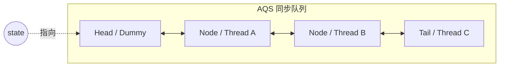
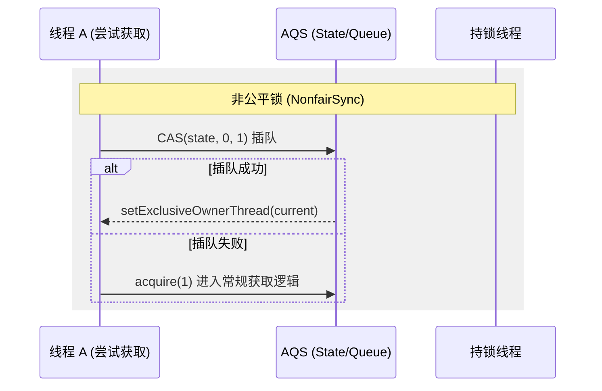
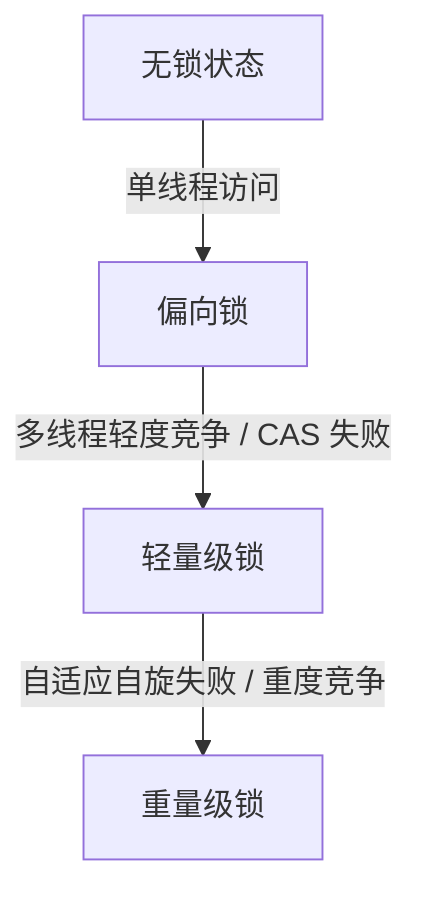

# AQS 机制与锁实现深度解析

在 Java 高级与资深工程师的面试中，并发编程的底层原理是必考项。其中，`AbstractQueuedSynchronizer`（AQS）和 `synchronized` 的锁升级机制是重中之重。本篇将从源码与底层原理出发，深度剖析这两个核心知识点。

---

## 一、 AQS (AbstractQueuedSynchronizer) 核心原理

AQS 是 Java 并发包（`java.util.concurrent`）的核心基石，像 `ReentrantLock`、`Semaphore`、`CountDownLatch`、`ReentrantReadWriteLock` 等都是基于 AQS 实现的。

### 1. AQS 的核心结构

AQS 内部主要维护了两个部分：

- **状态变量 `state`**：一个被 `volatile` 修饰的 `int` 类型变量，代表共享资源的状态。
- **CLH 队列**：一个 FIFO（先进先出）的双向队列，用于存放等待获取资源的线程。



```java
public abstract class AbstractQueuedSynchronizer extends AbstractOwnableSynchronizer {
    // 等待队列的头节点，懒加载。除了初始化，只能通过 setHead 方法修改
    private transient volatile Node head;
    // 等待队列的尾节点，懒加载。只能通过 enq 方法添加新的等待节点
    private transient volatile Node tail;
    // 同步状态变量
    private transient volatile int state;

    // CAS 原子更新 state
    protected final boolean compareAndSetState(int expect, int update) {
        return U.compareAndSetInt(this, STATE, expect, update);
    }
}
```

### 2. Node 节点的状态（`waitStatus`）

CLH 队列中的每个线程都会被封装成一个 `Node` 节点。在 JDK 8 中，`Node` 的 `waitStatus` 决定了线程的等待状态：

- **`CANCELLED` (1)**：表示线程获取锁的请求已经取消（由于超时或中断）。
- **`SIGNAL` (-1)**：表示后继节点的线程处于等待状态，当前节点在释放锁或取消时，必须唤醒（`unpark`）其后继节点。
- **`CONDITION` (-2)**：表示节点在等待队列中，节点线程等待在 `Condition` 上，当其他线程对 `Condition` 调用了 `signal()` 后，该节点会从等待队列转移到同步队列中。
- **`PROPAGATE` (-3)**：共享模式下，释放锁的动作需要传播到其他节点。
- **`0`**：新节点入队时的默认状态。

> **注意**：在 JDK 9+ 中，AQS 进行了重构，引入了 `VarHandle`，并将 `Node` 拆分为了 `ExclusiveNode` 和 `SharedNode`，但其核心的 FIFO 双向链表和状态传播逻辑依然保持一致。

### 3. 独占模式与共享模式

AQS 支持两种资源共享方式：

- **独占模式（Exclusive）**：每次只能有一个线程持有锁，如 `ReentrantLock`。此时 $state$ 通常表示锁的重入次数。
  - 需实现 `tryAcquire(int)` 和 `tryRelease(int)`。
- **共享模式（Shared）**：多个线程可同时持有锁，如 `Semaphore`（许可数）、`CountDownLatch`（计数器）。
  - 需实现 `tryAcquireShared(int)` 和 `tryReleaseShared(int)`。

---

## 二、 ReentrantLock 源码级解析

`ReentrantLock` 是典型的独占式可重入锁，其内部通过继承 AQS 实现了 `FairSync`（公平锁）和 `NonfairSync`（非公平锁）。

### 1. 公平锁与非公平锁的实现差异

公平锁和非公平锁在获取锁时的核心差异在于：**非公平锁在调用 `lock()` 时会先尝试插队，而公平锁会严格按照队列顺序排队。**



```java
static final class NonfairSync extends Sync {
    final void lock() {
        // Step 1: 直接尝试 CAS 插队
        if (compareAndSetState(0, 1))
            setExclusiveOwnerThread(Thread.currentThread());
        else
            // Step 2: 失败则进入普通获取流程
            acquire(1);
    }
}
```

#### 关键区别点：`hasQueuedPredecessors()`

在公平锁的 `tryAcquire` 实现中，多了一个 `hasQueuedPredecessors()` 的判断：

```java
protected final boolean tryAcquire(int acquires) {
    final Thread current = Thread.currentThread();
    int c = getState();
    if (c == 0) {
        // 公平锁：必须先检查队列中是否已经有前驱节点在排队
        if (!hasQueuedPredecessors() &&
            compareAndSetState(0, acquires)) {
            setExclusiveOwnerThread(current);
            return true;
        }
    }
    // ... 可重入逻辑 ...
}
```

```java
static final class FairSync extends Sync {
    final void lock() {
        acquire(1); // 直接进入 AQS 标准获取流程，不进行初始 CAS 抢占
    }

    protected final boolean tryAcquire(int acquires) {
        final Thread current = Thread.currentThread();
        int c = getState();
        if (c == 0) {
            // 核心区别：hasQueuedPredecessors() 校验队列中是否有前驱节点在排队
            if (!hasQueuedPredecessors() &&
                compareAndSetState(0, acquires)) {
                setExclusiveOwnerThread(current);
                return true;
            }
        }
        else if (current == getExclusiveOwnerThread()) {
            int nextc = c + acquires;
            if (nextc < 0)
                throw new Error("Maximum lock count exceeded");
            setState(nextc);
            return true;
        }
        return false;
    }
}
```

### 2. `hasQueuedPredecessors()` 源码剖析

这是公平锁判断是否需要排队的核心方法：

```java
public final boolean hasQueuedPredecessors() {
    Node t = tail; // Read fields in reverse order of write
    Node h = head;
    Node s;
    // h != t 说明队列不为空
    // ((s = h.next) == null) 说明有线程正在初始化队列（CAS 成功但未建立 next 指针）
    // (s.thread != Thread.currentThread()) 说明队列中第一个排队的线程不是当前线程
    return h != t &&
        ((s = h.next) == null || s.thread != Thread.currentThread());
}
```

### 3. 锁释放流程 `unlock()`

无论是公平锁还是非公平锁，释放锁的逻辑都是相同的，因为它们都调用了 AQS 的 `release(1)`：

```java
public void unlock() {
    sync.release(1);
}

// AQS 释放锁模板方法
public final boolean release(int arg) {
    if (tryRelease(arg)) { // 调用 ReentrantLock 实现的 tryRelease
        Node h = head;
        if (h != null && h.waitStatus != 0)
            unparkSuccessor(h); // 唤醒后继节点
        return true;
    }
    return false;
}

// ReentrantLock 实现的 tryRelease
protected final boolean tryRelease(int releases) {
    int c = getState() - releases;
    if (Thread.currentThread() != getExclusiveOwnerThread())
        throw new IllegalMonitorStateException();
    boolean free = false;
    if (c == 0) {
        free = true;
        setExclusiveOwnerThread(null); // 彻底释放锁，清空持有者线程
    }
    setState(c); // 更新 state，由于是独占锁，此处不需要 CAS，直接 setState 即可
    return free;
}
```

---

## 三、 JVM synchronized 锁升级过程

在 JVM 中，`synchronized` 是基于 Monitor（管程）实现的。为了减少获得锁和释放锁带来的性能消耗，JDK 1.6 引入了锁升级机制。锁的状态保存在 Java 对象头的 **Mark Word** 中。

### 1. Mark Word 结构（以 64 位 JVM 为例）

| 锁状态 | 25bit | 31bit | 1bit (unused) | 4bit (分代年龄) | 1bit (是否偏向) | 2bit (锁标志位) |
| :--- | :--- | :--- | :--- | :--- | :--- | :--- |
| **无锁** | 未使用 | HashCode | 0 | 分代年龄 | 0 | 01 |
| **偏向锁** | 线程 ID | Epoch | 0 | 分代年龄 | 1 | 01 |
| **轻量级锁** | 指向栈中锁记录（Lock Record）的指针 | 指向栈中锁记录（Lock Record）的指针 | 指向栈中锁记录（Lock Record）的指针 | 指向栈中锁记录（Lock Record）的指针 | 指向栈中锁记录（Lock Record）的指针 | 00 |
| **重量级锁** | 指向互斥量（Monitor）的指针 | 指向互斥量（Monitor）的指针 | 指向互斥量（Monitor）的指针 | 指向互斥量（Monitor）的指针 | 指向互斥量（Monitor）的指针 | 10 |
| **GC 标记** | 空 | 空 | 空 | 空 | 空 | 11 |

### 2. 锁升级链路



**无锁 -> 偏向锁**：

- 当一个对象刚被创建，且没有被任何线程锁定时，处于无锁状态（若开启了偏向锁延迟，则可能直接进入可偏向状态）。
- 当第一个线程访问同步块并获取锁时，JVM 会通过 CAS 操作将线程 ID 写入对象头的 Mark Word 中，并将偏向标识设为 `1`。
- 以后该线程进入和退出同步块时，只需简单测试 Mark Word 中是否存储着指向当前线程的偏向锁，无需进行 CAS 操作。

**偏向锁 -> 轻量级锁**：

- 当有其他线程尝试竞争偏向锁时，偏向锁会升级为轻量级锁。此时会发生偏向锁撤销，在全局安全点（Safe Point）暂停持有偏向锁的线程，检查其状态。如果线程已结束或退出同步块，则将对象头设为无锁或可偏向状态；如果线程仍在同步块中，则升级为轻量级锁。
- 竞争线程通过 **CAS** 尝试将对象头中的 Mark Word 替换为指向自己栈帧中 `Lock Record` 的指针。

**轻量级锁 -> 重量级锁**：

- 当自旋超过一定次数（或自适应自旋失败），或者又有多线程同时竞争时，轻量级锁会升级为重量级锁。
- 重量级锁将未抢到锁的线程直接阻塞（进入 EntryList），不再消耗 CPU，但线程挂起和唤醒涉及用户态与内核态的切换，开销极大。

### 3. 关键变革：JDK 15+ 废弃偏向锁

> **面试高分点**：在 JDK 15 中，偏向锁被标记为废弃（Deprecated），并在 JDK 18 中被默认禁用。
> **原因**：
>
> 1. **现代应用场景变化**：现代多线程应用中，高并发、多线程竞争是常态，单线程独占锁的场景变少，偏向锁带来的性能提升无法弥补其撤销带来的开销。

---

## 四、 高频面试题与追问

### 1. 为什么非公平锁的吞吐量比公平锁高？

**答**：公平锁在释放锁时，必须唤醒队列中的下一个线程，这涉及到线程上下文切换的开销（通常需要几个微秒）。而非公平锁在释放锁时，如果有新线程刚好到来，新线程可以直接抢占锁并执行，无需等待上下文切换。这样可以充分利用 CPU 的时间片，减少线程挂起的概率，从而提高整体吞吐量。

### 2. AQS 为什么使用双向链表？单向链表不行吗？

**答**：

1. **避免不必要的唤醒**：新加入的节点需要判断前驱节点的状态。如果是双向链表，可以直接通过 `prev` 找到前驱节点，判断其是否为 `head`，从而决定是否尝试获取锁。
2. **取消节点时的清理**：当某个节点因为超时或中断取消获取锁时（状态变为 `CANCELLED`），需要将其从队列中移除。双向链表可以 $O(1)$ 地找到其前驱和后继节点，完成链表重组，而单向链表需要 $O(N)$ 遍历。
3. **唤醒机制的可靠性**：在释放锁唤醒后继节点时，如果后继节点被取消了，AQS 会从尾部 `tail` 向前遍历找到最靠近 `head` 的有效节点进行唤醒。这必须依赖 `prev` 指针。

### 3. synchronized 与 ReentrantLock 有什么区别？

**答**：

1. **实现层面**：`synchronized` 是 JVM 级别的关键字，基于 Monitor 实现；`ReentrantLock` 是 JDK 级别的 API，基于 AQS 实现。
2. **锁释放**：`synchronized` 在执行完同步块或发生异常时由 JVM 自动释放锁；`ReentrantLock` 必须手动在 `finally` 块中调用 `unlock()` 释放，否则容易造成死锁。
3. **功能特性**：
   - `ReentrantLock` 支持响应中断（`lockInterruptibly`）、支持超时获取锁（`tryLock`）、支持公平锁与非公平锁。
   - **条件唤醒**：`synchronized` 只能通过 `wait/notify` 配合一个等待队列；`ReentrantLock` 可以通过 `Condition` 绑定多个等待队列，实现精准唤醒。
