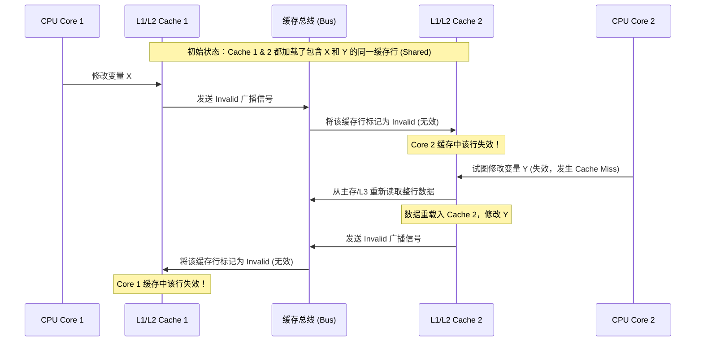

# 缓存行伪共享与 @Contended 极致优化

在高并发的多线程编程中，许多开发者都将精力集中在**锁优化**、**无锁算法（CAS）**和**线程隔离（ThreadLocal）**上。然而，在硬件级别，还隐藏着一个对并发吞吐量有毁灭性打击的性能隐形杀手——**缓存行伪共享（False Sharing）**。

本篇将从 CPU 硬件缓存架构出发，深度剖析伪共享的成因与 MESI 协议，探讨传统的字节填充规避方案，并详解现代 JDK 通过 `@Contended` 注解榨干 CPU 缓存性能的底层原理。

---

## 一、 CPU 缓存架构与缓存行（Cache Line）

在现代计算机体系中，CPU 运算速度与内存（DRAM）读写速度之间存在着几个数量级的巨大鸿沟。为了缓解这一矛盾，CPU 内部引入了多级高速缓存（Cache）机制。

### 1. 多级缓存体系与延迟对比

通常 CPU 拥有 L1、L2、L3 三级高速缓存。当核心需要读取数据时，会逐级向下寻找：

| 存储级别 | 典型访问延迟 (时钟周期) | 速度与延迟感性认识 |
| :--- | :--- | :--- |
| **CPU 寄存器** | < 1 ns (1 cycle) | 瞬间完成 |
| **L1 高速缓存** | ~1 ns (4 cycles) | 极快 |
| **L2 高速缓存** | ~3 ns (12 cycles) | 很快 |
| **L3 高速缓存 (多核共享)** | ~15 ns (40 cycles) | 稍慢 |
| **主内存 (DRAM)** | ~60 ns (200 cycles) | 极慢 (如去外地取货) |

### 2. 什么是缓存行（Cache Line）？

CPU 高速缓存并不是以单个字节为单位进行数据存取的，而是以固定的 **缓存行（Cache Line）** 为基本单位进行数据读取和刷写。

* 在目前主流的 x86 和 ARM 处理器架构中，一个缓存行的大小通常是 **64 字节（Bytes）**。
* 当 CPU 从内存读取一个 `long` 类型的变量（8 字节）时，它会把该变量相邻的、占满 64 字节的整块内存数据一次性拉取到 CPU 缓存中。

```
[ 缓存行 (64 字节) ]
+----------+----------+----------+----------+----------+----------+----------+----------+
| 变量 A   | 变量 B   | 变量 C   | ...      | ...      | ...      | ...      | 变量 H   |
| (8 字节) | (8 字节) | (8 字节) | (8 字节) | (8 字节) | (8 字节) | (8 字节) | (8 字节) |
+----------+----------+----------+----------+----------+----------+----------+----------+
```

---

## 二、 伪共享（False Sharing）的成因

为了保证多个 CPU 核心的缓存数据是一致的，硬件层面运行着缓存一致性协议（如常见的 **MESI 协议**）。

* **MESI 协议核心逻辑**：当一个 CPU 核心修改了其本地缓存行中的某个变量时，它必须通过总线通知其他核心，将其他核心中对应的相同缓存行标记为 **“Invalid（无效）”** 状态。其他核心若想再次读写该行，必须重新从 L3 缓存或物理内存中拉取最新数据。

### 🚀 伪共享场景还原

假设有两个变量 `X` 和 `Y`（都是 `long` 类型，各占 8 字节），它们不幸地被连续分配在同一个 64 字节的缓存行内。
有两个 CPU 核心（Core 1 和 Core 2）分别并发地修改这两个完全独立的变量：

* **Core 1** 频繁修改 `X`。
* **Core 2** 频繁修改 `Y`。



**后果**：
尽管 Core 1 和 Core 2 在逻辑上操作的是完全不同的两个变量，但因为它们在硬件层面共用同一个缓存行，导致两个核心在修改变量时频繁地使对方的缓存行失效。
这造成了无休止的 **Cache Miss（缓存未命中）**、连续的内存重读和**总线锁风暴**，使得原本能够并发的程序在多核下甚至运行得比单线程还要慢！

---

## 三、 传统解决之道：硬编码字节填充（Padding）

在早期的 JDK 版本中，高并发框架的开发者通常会采用**硬编码字节填充**的奇技淫巧来隔离缓存行。

### 💡 经典案例：Disruptor 2.x 的 `Sequence` 填充

`Sequence` 类用于追踪缓冲区的位置，高频被读写。为了让 `value` 独占一个缓存行，它前后排布了多个无用的 `long` 变量：

```java
// 早期 Disruptor 的做法
class ValuePadding {
    // 前置填充：7个 long 类型变量，占 56 字节
    protected long p1, p2, p3, p4, p5, p6, p7;
}

class Value extends ValuePadding {
    // 核心变量：8 字节
    protected volatile long value;
}

class Sequence extends Value {
    // 后置填充：7个 long 类型变量，占 56 字节
    protected long p9, p10, p11, p12, p13, p14, p15;
}
```

通过这种前后包裹填充的方式，不论该对象在内存中如何对齐，都能确保核心变量 `value` 不会与外界其他任何变量共处在同一个 64 字节的缓存行内。

> [!CAUTION]
> **硬编码填充的硬伤**：
> 1. 代码极具欺骗性，容易被不了解硬件特性的其他开发人员当成“垃圾无用代码”直接清理掉。
> 2. 现代 JIT 编译器在优化时，可能会识别出这些未使用的字段并直接将其“裁剪”掉，或者重排字段顺序，导致填充失效。

---

## 四、 Modern JDK 的最优解：`@Contended` 注解

为了优雅地从 JVM 层面彻底解决伪共享问题，JDK 8 正式引入了 **`sun.misc.Contended`** 注解（在 JDK 9 以后被移入 `jdk.internal.vm.annotation.Contended`）。

### 1. `@Contended` 的工作原理

当 JVM 加载被 `@Contended` 修饰的字段或类时，它会在对象的内存布局中进行特殊的字节对齐填充：

* **默认填充 128 字节**：JVM 默认在标记的字段前后填充 128 个空字节（这个宽度是 64 字节 Cache Line 的两倍，可覆盖大部分 CPU 预取机制的宽度）。
* **字段重排保护**：JVM 确保这些标记字段在内存布局中与其他非标记字段物理隔离，不受编译器字段重排的干扰。

```
[ ... 其他非 Contended 字段 ... ] 
|--- [ 128 字节填充对齐防线 ] ---| 
[ 被 @Contended 修饰的字段 ] 
|--- [ 128 字节填充对齐防线 ] ---|
```

### 2. JDK 内部类中经典应用源码分析

#### 🔍 源码一：`LongAdder` 中的分段计数器 `Cell`

`LongAdder` 的高性能在于利用分段 CAS 降低并发压力。如果这些分段 `Cell` 挨在一起，修改其中一个就会导致其他全部失效，性能将大打折扣。因此，`Cell` 直接被标记为 `@Contended`：

```java
// java.util.concurrent.atomic.Striped64.Cell 源码片段
@sun.misc.Contended // 👈 类级别标记，确保每一个 Cell 对象在堆内存中独立占满缓存行
static final class Cell {
    volatile long value;
    Cell(long x) { value = x; }
    final boolean cas(long cmp, long val) {
        return UNSAFE.compareAndSwapLong(this, valueOffset, cmp, val);
    }
    // ...
}
```

#### 🔍 源码二：`Thread` 中的高并发伪随机种子

每个线程调用 `ThreadLocalRandom.current().nextInt()` 时，都需要更新各自的 `threadLocalRandomSeed`。为了防止多个线程的种子互相干扰产生伪共享，字段被标记为 `@Contended`：

```java
// java.lang.Thread 源码片段
public class Thread implements Runnable {
    // ...
    /** The current seed for a ThreadLocalRandom */
    @sun.misc.Contended("tlr") // 👈 属于组名为 "tlr" 的 Contended 隔离区
    long threadLocalRandomSeed;

    @sun.misc.Contended("tlr")
    int threadLocalRandomProbe;
    // ...
}
```

---

## 五、 实战：如何在业务中开启 `@Contended`

默认情况下，`@Contended` 注解是受限制的，只允许由 Boot ClassLoader（引导类加载器）加载的 JDK 核心类库生效。如果是用户的业务代码类直接使用，JVM 在加载时会默默忽略该注解。

### 🚀 开启限制的 JVM 参数

如果要在你自己的高并发数据结构或业务类中启用 `@Contended` 优化，**必须在 JVM 启动参数中加入以下配置**：

```bash
-XX:-RestrictContended
```

#### 💡 业务实战代码示例

```java
import jdk.internal.vm.annotation.Contended; // JDK 9+ 的包路径，JDK 8 为 sun.misc.Contended

public class HighConcurrencyMetrics {

    // 两个指标会被不同的线程频繁写入，打上同一个 Contended 注解
    // 会将它们分别划分在不同缓存行，彻底规避伪共享
    @Contended
    private volatile long successCount = 0;

    @Contended
    private volatile long failureCount = 0;

    public void incrSuccess() {
        // 频繁 CAS 累加，无缓存伪共享干扰
    }
}
```
