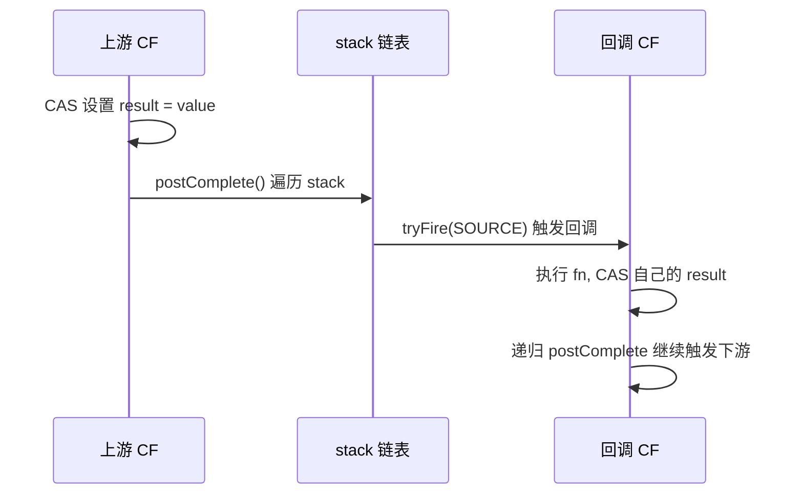

## CompletableFuture 异步编排与底层原理

JDK 8 引入的 `java.util.concurrent.CompletableFuture` 是 Java 生态中最强大的异步编排工具,它以**回调式非阻塞**模型替代传统的 `Future.get()` 阻塞查询,提供了完备的串/并联、异常处理与组合 API,是构建高并发响应式微服务、网关聚合(Multi-Call 合并)与并行任务编排的事实标准。

---

## 一、 从 Future 到 CompletableFuture:为什么需要异步回调

### 1. `Future` 的三大局限

```java
Future<Integer> f = executor.submit(() -> compute());
Integer r = f.get(); // 阻塞等待!
Integer r2 = f.get(1, SECONDS); // 阻塞等待,超时抛 TimeoutException
// 无法注册"完成后做什么"
```

- 同步阻塞:获取结果必须 `get()` 阻塞,无法主动通知。
- 无法链式:任务完成后的下一步动作必须由调用方循环编排。
- 无法组合:多个 `Future` 聚合、合并、竞争难以优雅表达。

### 2. `CompletableFuture` 的核心承诺

| 能力 | API |
| :--- | :--- |
| 回调注册 | `thenApply`、`thenAccept`、`thenRun` |
| 异常补偿 | `exceptionally`、`handle`、`whenComplete` |
| 任务编排 | `thenCompose`(单值串联)、`thenCombine`(双值合并) |
| 聚合并行 | `allOf`(全完成)、`anyOf`(任一完成) |
| 显式完成 | `complete(value)`、`completeExceptionally(ex)`、`cancel(may)` |

> 关键:`CompletableFuture` 本身不是“计算”,它是一个**占位容器**,可以由异步线程在完成后填入结果或异常,并触发已注册的回调链。

---

## 二、 异步与同步方法族命名规则

API 方法名遵循 `<执行时机><回调类型><执行线程>` 的命名规律,记忆如下:

| 后缀 | 函数式签名 | 输入 | 输出 |
| :--- | :--- | :--- | :--- |
| `Run` | `Runnable` | 无 | 无 |
| `Accept` | `Consumer<T>` | `T` | 无 |
| `Apply` | `Function<T,R>` | `T` | `R` |
| `Combine` | `BiFunction<T,U,R>` | `T,U` | `R` |
| `Compose` | `Function<T,CompletionStage<R>>` | `T` | `CompletableFuture<R>` |

URL 前缀决定执行线程:

- 默认(`thenApply`):若前一步在 `Thread-A` 完成,则本步**和 Thread-A 同步执行**;否则使用提交时所在线程。
- `Async`(`thenApplyAsync`):提交到 `ForkJoinPool.commonPool()` 异步执行。
- `Async(executor)`(`thenApplyAsync(fn, pool)`):提交到**指定线程池**执行(生产推荐)。

---

## 三、 编排模式实例

### 1. 串联:查用户 → 查订单 → 计算总价

```java
ExecutorService pool = Executors.newFixedThreadPool(8);

CompletableFuture<Integer> pipeline = CompletableFuture
    .supplyAsync(() -> userDao.find(userId), pool)              // 查用户
    .thenApplyAsync(user -> orderDao.find(user.getId()), pool)  // 查订单
    .thenApplyAsync(order -> calcPrice(order), pool);           // 计算价格

Integer total = pipeline.join(); // 最终一次性阻塞
```

### 2. 合并:两个独立任务结果组合

```java
CompletableFuture<User> userF = CompletableFuture.supplyAsync(() -> userDao.find(userId), pool);
CompletableFuture<Account> acctF = CompletableFuture.supplyAsync(() -> accountDao.find(userId), pool);

CompletableFuture<Profile> merged = userF.thenCombine(acctF, Profile::new);
```

### 3. 全部完成:批量并行调用聚合

```java
List<CompletableFuture<Item>> futures = itemIds.stream()
    .map(id -> CompletableFuture.supplyAsync(() -> itemService.fetch(id), pool))
    .collect(Collectors.toList());

CompletableFuture<Void> all = CompletableFuture.allOf(
    futures.toArray(new CompletableFuture[0]));

CompletableFuture<List<Item>> result = all.thenApply(v ->
    futures.stream()
        .map(CompletableFuture::join)  // 此时必已完成,join 不阻塞
        .collect(Collectors.toList()));

List<Item> items = result.join();
```

### 4. 任一完成:多源容灾快者获胜

```java
CompletableFuture<Object> first = CompletableFuture.anyOf(
    CompletableFuture.supplyAsync(() -> fetchFromRedis(), pool),
    CompletableFuture.supplyAsync(() -> fetchFromDB(), pool),
    CompletableFuture.supplyAsync(() -> fetchFromRemote(), pool));
Object data = first.join();
```

---

## 四、 异常处理三剑客

| API | 行为 | 终结时机 |
| :--- | :--- | :--- |
| `exceptionally(fn)` | 仅当上游抛出异常时调用,返回补偿值 | 异常分支才触发 |
| `handle(BiFunction<T,Throwable,R>)` | 无论成功/失败都会被调用,可同时拿到结果与异常 | 总是触发 |
| `whenComplete(BiConsumer<T,Throwable>)` | 类似 `try-finally`,不能改变结果;仅观察 | 总是触发 |

```java
CompletableFuture<String> safe = CompletableFuture
    .supplyAsync(() -> dangerousCall(), pool)
    .handleAsync((r, ex) -> {
        if (ex != null) {
            log.warn("降级返回默认值", ex);
            return "default";
        }
        return r.toUpperCase();
    }, pool);
```

注意:`exceptionally` 只能捕获上游异常,**下游异常不会向上传播** —— 链路中任一节点的异常都会被同节点的 handler 捕获,再决定是否继续抛出。

---

## 五、 底层实现:CompletionStage 与 Completion 链表

`CompletableFuture` 内部维护两个字段:

```java
volatile Object result;       // 结果或 AltResult(异常包装)
volatile Completion stack;    // 已注册的回调链(栈结构)
```

注册 `thenApply` 时,会构造一个 `UniApply` 节点(实现 `Completion` 接口),通过 CAS 与无锁 Treiber 栈推入 `stack` 链表。当上游调用 `complete(value)` 或 `completeExceptionally(ex)` 时:



`tryFire(mode)` 的 `mode` 取值:

- `SYNC`:同步执行回调(在完成者所在线程)。
- `ASYNC`:提交到 Executor 异步执行。
- `NOMARK`:内部嵌套触发时不重复标记。

### 1. `complete` 防止重入

`complete(value)` 使用 CAS 把 result 从 `null` 转换为实际值,只有一个线程能成功,后续 `complete` 直接失败返回 `false`,保证了**完成动作的唯一性**。

### 2. 死锁陷阱:依赖线程池的 `thenCombine`

```java
ExecutorService pool = Executors.newFixedThreadPool(4);

CompletableFuture<Void> chained = CompletableFuture
    .supplyAsync(() -> taskA(1), pool)
    .thenCombine(
        CompletableFuture.supplyAsync(() -> taskA(2), pool),
        (a, b) -> a + b)
    .thenAcceptAsync(System.out::println, pool);

chained.join(); // 主线程阻塞等待
```

若 `pool` 是有界线程池,`thenCombine` 的合并分支需要执行 `fn` 时,两条上游任务可能占满了 pool,导致合并 fn 永远拿不到线程 —— 这是经典的 **线程饥饿死锁(Thread Starvation Deadlock)**。

> 对策:`supplyAsync` 用业务池,合并/收尾阶段用独立池;或使用 `thenCombine(fn)`(不带 Async)直接在 taskA 完成线程上执行合并 fn,不占额外线程。

---

## 六、 `ForkJoinPool.commonPool()` 的陷阱

未显式指定 `executor` 时,所有 `*Async` 任务都提交到 `ForkJoinPool.commonPool()`,该池的并行度默认为 `$\text{parallelism} = \max(1, \text{Runtime.availableProcessors()} - 1)$`。其坑如下:

- 全局共享:所有模块、所有 `CompletableFuture`、所有 `parallelStream` 都挤在这一个池,任一慢任务拖垮全局。
- 无法隔离:业务高峰时若有一项任务执行慢,会被其他业务路径误伤。
- 并行度低:高核数机器上看似充足,但容器化部署时 `availableProcessors` 可能只读到了上限为 2 的 cgroup,严重不足。

### 推荐实践:全局共享自定义池

```java
public final class AsyncPool {
    private static final ThreadPoolExecutor BIZ = new ThreadPoolExecutor(
        32, 32,
        60L, TimeUnit.SECONDS,
        new LinkedBlockingQueue<>(10_000),
        new ThreadFactoryBuilder().setNameFormat("biz-async-%d").build(),
        new ThreadPoolExecutor.CallerRunsPolicy());

    public static Executor biz() { return BIZ; }

    static {
        // JVM 关闭时优雅下线,避免任务丢失
        Runtime.getRuntime().addShutdownHook(new Thread(BIZ::shutdown));
    }
}
```

并通过 `-Djava.util.concurrent.ForkJoinPool.common.parallelism=N` 或业务自定义池覆盖默认池。

---

## 七、 异步链与 Java Agent 的关系(JDK 21 虚拟线程)

JDK 21 之前,`CompletableFuture` 的异步线程本质仍是 OS 平台线程。若一个异步任务内部又调用了阻塞 IO(如 `httpClient.send(...).body()`),它会**独占该平台线程**直到 IO 完成。

JDK 21 的虚拟线程将阻塞 IO 改为可卸载(unmount),`CompletableFuture` 在虚拟线程中执行 `Thread.sleep` 或阻塞 IO 时不会阻塞 carrier。两者结合可做到:

- 轻 IO 场景:`CompletableFuture` + commonPool(老生态)。
- 高 IO 场景:虚拟线程 + `Executors.newVirtualThreadPerTaskExecutor()`,更简洁、可读,推荐新项目全部使用虚拟线程。详见 [JDK 21 虚拟线程详解](virtual-threads.md)。

---

## 八、 生产级应用模式

### 1. 服务聚合网关(Multi-Call)

```java
public ProductDetail detail(Long id) {
    CompletableFuture<Product> baseF = CompletableFuture.supplyAsync(() -> prodService.get(id), pool);
    CompletableFuture<List<Comment>> cmtF = CompletableFuture.supplyAsync(() -> cmtService.list(id), pool);
    CompletableFuture<String>      promoF = CompletableFuture.supplyAsync(() -> promoService.text(id), pool);

    return CompletableFuture.allOf(baseF, cmtF, promoF)
        .thenApply(v -> new ProductDetail(baseF.join(), cmtF.join(), promoF.join()))
        .orTimeout(300, TimeUnit.MILLISECONDS) // JDK 9+: 总耗时上限
        .exceptionally(ex -> ProductDetail.degraded())
        .join();
}
```

关键点:

- 三个底层服务并行,串行延迟由三者之和降为三者最大值。
- `orTimeout` 实现软超时,超时后 `exceptionally` 自动降级,避免整体雪崩。

### 2. 重试与退避

```java
public static <T> CompletableFuture<T> retry(Supplier<CompletableFuture<T>> sup, int n) {
    return sup.get().handle((r, ex) -> {
        if (ex == null) return CompletableFuture.completedFuture(r);
        if (n <= 0)     return CompletableFuture.failedFuture(ex);
        try { Thread.sleep((long) (100 * Math.pow(2, 5 - n))); }
        catch (InterruptedException ie) { Thread.currentThread().interrupt(); }
        return retry(sup, n - 1);
    }).thenCompose(x -> x);
}
```

借助 `thenCompose` 把“重试得到的下一阶段 CompletionStage”串联起来,与 [ThreadLocal 与 CAS 核心解析](threadlocal-cas.md) 中的乐观重试机制相通。

---

## 九、 面试高频答疑

- **`thenApply` 与 `thenCompose` 区别?** — 返回类型不同:前者 `R`,后者 `CompletableFuture<R>`。需要再串联下一阶段异步任务时必须用 `thenCompose`,否则会得到 `CompletableFuture<CompletableFuture<R>>`。
- **回调发生在哪个线程?** — 看 `*Async` 后缀;无 Async 时,若上游在异步线程完成则用上游线程;否则用提交者线程。
- **`allOf` 返回啥?** — `CompletableFuture<Void>`,不直接拿结果;需要再 `thenApply` 遍历所有 future 调 `join` 才能聚合出 List。
- **是否会抛出异常?** — `get()` 抛 `ExecutionException` 包装;`join()` 抛 `CompletionException`。两者都会把上游异常包装为运行时异常。

---

## 十、 小结

`CompletableFuture` 是 Java 异步编排的标杆,但回调式编程依然有“嵌套地狱”、“异常传播复杂”的固有缺陷。新项目推荐结合 [JDK 21 虚拟线程详解](virtual-threads.md) 使用线性同步代码风格,可读性更佳;老项目改造则借助 `CompletableFuture` + 自定义线程池即可大幅提升吞吐。配套学习 [线程池 ThreadPoolExecutor 全解](threadpool.md) 与 [JMM 内存模型](jmm-memory-model.md),可形成完整的异步协同认知。
