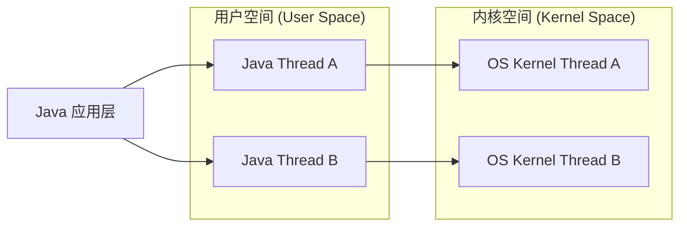
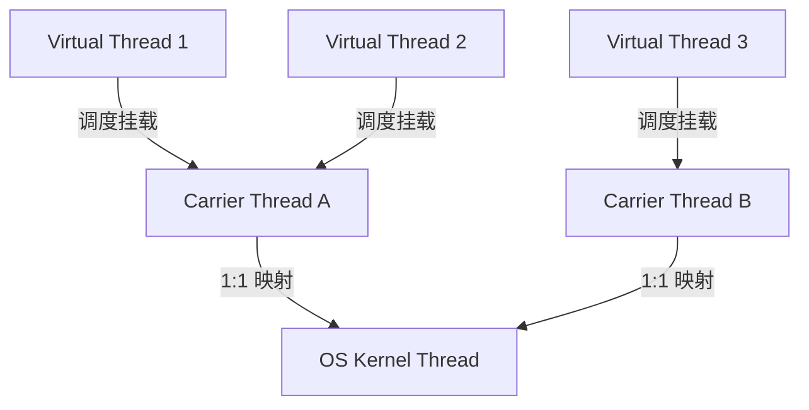

# JDK 21+ 虚拟线程与协程深度解构

在高并发企业级应用中，传统的“一请求一线程（Thread-Per-Request）”模型一直受限于系统物理线程的瓶颈。随着 JDK 21 正式发布，**Project Loom（项目织机）** 带来了期待已久的 **虚拟线程（Virtual Threads）**，这是一场针对 JVM 并发模型的彻底革命。

本篇将从传统线程痛点出发，深度解构 Java 虚拟线程的底层实现、M:N 调度原理、非阻塞 I/O 革命以及在实战中必须避免的“线程固定 (Pinning)”陷阱。

---

## 一、 传统 Java 线程模型的“穷途末路”

在 JDK 21 之前，Java 中的 `java.lang.Thread` 采用的是 **1:1 线程模型**。即一个 Java 线程直接对应一个操作系统的内核线程（Kernel Thread）。



这种 1:1 模型存在着三大无法逾越的瓶颈：

1. **高内存开销**：每个物理线程都有固定的栈内存空间（Linux 默认通常为 1MB）。如果系统有 10000 个活跃线程，仅线程栈就会吃掉 10GB 内存。
2. **上下文切换开销巨大**：当线程因 I/O 阻塞或等待锁而被挂起时，CPU 必须在内核态与用户态之间切换，保存并恢复 CPU 寄存器和程序计数器，频繁的上下文切换（Context Switch）极大地损耗了 CPU 算力。
3. **响应式编程的妥协**：为了解决并发上限问题，业界演进出了以 WebFlux、RxJava、Netty 为代表的异步响应式编程。虽然提高了吞吐，但却彻底割裂了代码逻辑（回调地狱），使得断点调试（Debug）和堆栈追踪（Stack Trace）变得异常痛苦。

---

## 二、 虚拟线程：轻量级用户态协程

虚拟线程是 JDK 21 引入的一种**轻量级、运行在用户态的协程（Coroutine）**。

与平台线程（Platform Thread，即传统 Java 线程）相比，虚拟线程有如下变革：

* **极低的内存占用**：虚拟线程的栈空间最初只需数百字节，并随着调用栈的深度动态按需增长和收缩，且它的栈信息以 Java 对象的形态存储在堆内存中。
* **极低的创建与销毁成本**：由于无需向操作系统申请资源，创建一个虚拟线程的开销比创建普通 Java 线程小几个数量级，甚至可以与创建普通的 Java 实例（如一个 `new Object()`）相媲美。
* **M:N 协程模型**：JVM 将数以百万计的虚拟线程（M）调度映射到极少数的平台线程（N）上运行。

---

## 三、 虚拟线程底层调度机制

虚拟线程的调度并不是由操作系统内核完成的，而是由 **JVM 自身的调度器** 来管理的。

### 1. Carrier Thread（载体线程）

JVM 内部维护了一个静态的线程池作为虚拟线程的调度器（Scheduler），默认使用 **`ForkJoinPool`** 驱动。
这个 ForkJoinPool 里的平台线程，就被称为 **载体线程（Carrier Thread）**。

* 载体线程的数量默认等于系统的 CPU 核心数（`Runtime.getRuntime().availableProcessors()`）。
* 虚拟线程本身不具备执行代码的能力，必须通过 JVM 调度，**挂载（Mount）**到某一个载体线程上才能执行。



### 2. 挂载（Mount）与卸载（Unmount）

* **挂载（Mount）**：调度器选择一个虚拟线程，将其栈帧数据从堆内存复制到载体线程的本地栈上，载体线程开始执行该虚拟线程的代码。此时，`Thread.currentThread()` 返回的是该虚拟线程，而底层执行的仍是载体线程。
* **卸载（Unmount）**：当虚拟线程遇到了阻塞操作（如 I/O、`Thread.sleep()`、等待 JUC 锁等）时，JVM 会自动将该虚拟线程从当前的载体线程上断开。此时，虚拟线程的栈帧信息会被写回堆内存中，载体线程则被解放出来，去运行其他处于就绪状态的虚拟线程。

---

## 四、 非阻塞 I/O 的技术革命

在传统线程中，一旦发生阻塞 I/O（如向数据库发 SQL、读写文件、进行 HTTP 请求），物理线程就会被操作系统挂起，进入等待队列。

而虚拟线程之所以能够实现“以同步阻塞写法，换取异步非阻塞的高性能”，底层在于 **JDK 对网络与同步原语的重构**。

### 🚀 卸载与 Poller（I/O 多路复用）协作流程

当一个虚拟线程在载体线程上执行并准备发起一次 Socket 读取时：

1. **进入内核拦截**：JDK 21 对 `SocketChannel`、`ServerSocketChannel` 等底层 API 进行了重构。底层检测到当前运行在 `VirtualThread` 之上。
2. **发生阻塞，卸载线程**：如果数据未就绪，底层不再直接调用操作系统的阻塞 I/O，而是通过 `LockSupport.park()` 让当前虚拟线程**挂起**。JVM 捕获该原语，将该虚拟线程从载体线程上**卸载（Unmount）**。
3. **注册 Poller**：JVM 内部的 `Poller`（基于 Linux `epoll` 或 macOS `kqueue` 等多路复用机制）将该 Socket 读事件注册到事件循环中。
4. **载体线程执行其他任务**：此时载体线程完全自由，立刻去调度队列里拉取下一个就绪的虚拟线程执行。
5. **事件就绪，唤醒重载**：当数据到达，操作系统的 `epoll` 通知 JVM，JVM 的 `Poller` 会将之前挂起的虚拟线程标记为就绪状态，并把它扔回调度器（ForkJoinPool）的队列中。
6. **再次挂载**：调度器挑出一个可用的载体线程，将该虚拟线程**重新挂载（Mount）**，从之前被 `park` 的代码行继续向下执行。

这一全套的换栈与调度逻辑，完全在 **JVM 用户态** 完成，彻底避免了操作系统级的线程上下文切换成本！

---

## 五、 虚拟线程的死穴：线程固定（Pinning）

虽然虚拟线程极其强大，但在特定场景下，它会出现**无法从载体线程上卸载（Unmount）**的现象，这被称为 **线程固定（Pinning）**。

### 1. 触发 Pinning 的两大场景

当虚拟线程遇到阻塞，但在其调用栈中存在以下两种情况时，它将被“锁死”在载体线程上：

1. **处于 `synchronized` 块或 `synchronized` 方法内部**。
2. **正在执行本地方法（JNI，Java Native Interface）调用**。

当发生 Pinning 时，虚拟线程一旦阻塞，底层的载体线程也将同步被操作系统锁死。如果所有的载体线程都被 Pin 住了，整个 JVM 的虚拟线程调度器就会陷入瘫痪（无可用平台线程去跑其他虚拟线程）。

### 💡 避坑实践：从 `synchronized` 走向 `ReentrantLock`

为了避免 Pinning 发生，在重构高并发库或编写应用时，**应将高频、长时间发生 I/O 阻塞的 `synchronized` 代码块，全部替换为 `java.util.concurrent.locks.ReentrantLock`。**

```java
// ❌ 错误示范：在 synchronized 中进行网络 I/O，导致载体线程 Pinning
public synchronized String fetchData() {
    return httpClient.sendRequest(); // 发生阻塞，锁死物理载体线程
}

//  正确示范：使用 ReentrantLock，阻塞时虚拟线程可顺利卸载
private final ReentrantLock lock = new ReentrantLock();

public String fetchData() {
    lock.lock();
    try {
        return httpClient.sendRequest(); // 发生阻塞时，虚拟线程可顺利卸载，让出载体线程
    } finally {
        lock.unlock();
    }
}
```

---

## 六、 虚拟线程实战指南与常见误区

### 1. 快速上手

在 JDK 21+ 中，创建虚拟线程有多种方式：

```java
// 方式一：直接创建并运行虚拟线程
Thread.startVirtualThread(() -> {
    System.out.println("运行在虚拟线程中: " + Thread.currentThread());
});

// 方式二：使用 Thread.Builder
Thread vt = Thread.ofVirtual()
                  .name("my-virtual-thread")
                  .unstarted(() -> { /* 任务 */ });
vt.start();

// 方式三：使用 ExecutorService 适配线程池接口（推荐）
try (var executor = Executors.newVirtualThreadPerTaskExecutor()) {
    executor.submit(() -> {
        // 执行并发任务
    });
} // 自动关闭，等待所有虚拟线程执行完毕
```

### 2. 颠覆传统的实战误区

1. **绝对不要池化虚拟线程**：

   在过去，为了复用昂贵线程，我们使用 `ThreadPoolExecutor`。
   而在虚拟线程的世界中，**“虚拟线程池”是一个彻头彻尾的伪命题**。虚拟线程非常廉价，设计初衷就是“随用随建，用完即丢”。

2. **如何限制并发资源数**：

   在 1:1 线程模型下，我们通过限制线程池大小（如最大 10 个线程）来限制对数据库连接等资源的并发访问。
   在虚拟线程下，如果你有 1000 个任务要并发，直接开启 1000 个虚拟线程即可。如果想限制数据库并发为 10，**应该在虚拟线程内部使用 `Semaphore` 信号量来控制并发资源**，而不是限制线程个数。

   ```java
   // 正确的限流方式
   private final Semaphore semaphore = new Semaphore(10); // 限制最大 10 个并发连接
   
   public void doWork() {
       try {
           semaphore.acquire();
           queryDatabase(); // 执行限流操作
       } catch (InterruptedException e) {
           Thread.currentThread().interrupt();
       } finally {
           semaphore.release();
       }
   }
   ```
