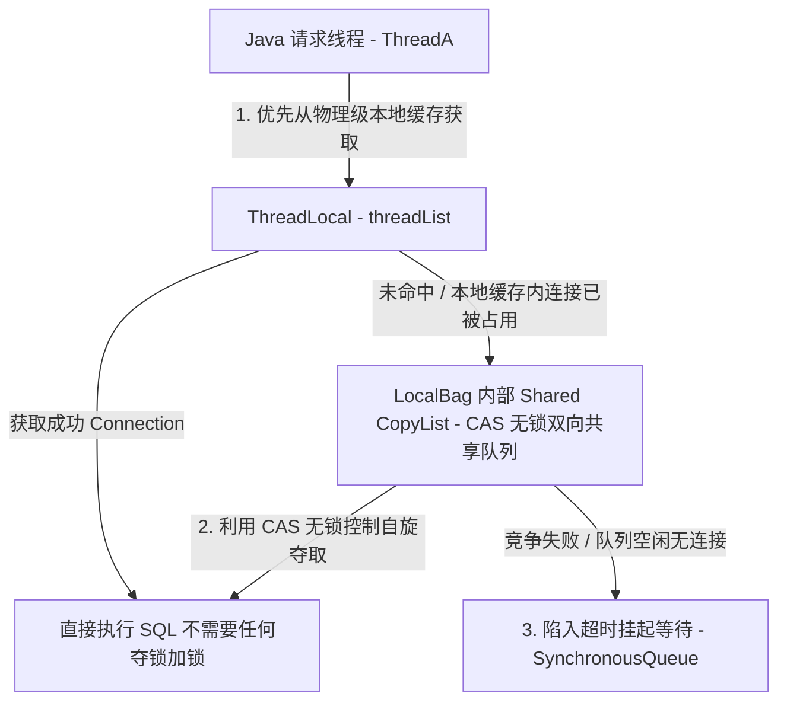
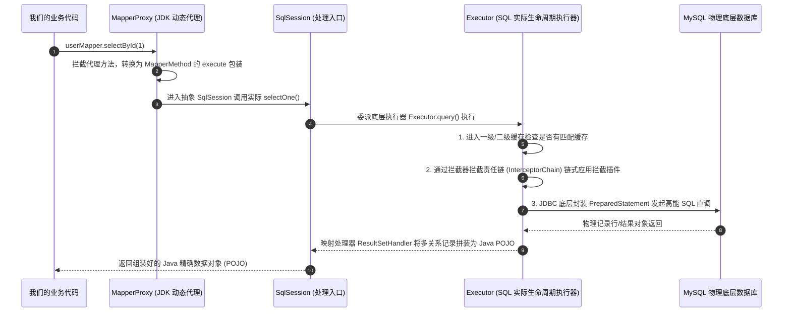

# MyBatis 持久层核心原理与 SQL 优化落地

在企业级 Java 高性能微服务应用底层，数据的持久化质量是决定全局处理能力的最大胜负手。在保证高性能并发连接的 HikariCP 连接池加持下，MyBatis 框架以其非凡的灵活性和 SQL 直调机制成为绝对的核心主宰。本篇将深度透解 HikariCP 与 MyBatis 的核心底层原理并给出实践方案。

---

## 一、 HikariCP 极致吞吐与无锁化性能神话

MyBatis 只是负责进行 SQL 映射关系与对象组装的映射框架，而承载数据的真正 Java 通信连接，离不开性能强劲的超快连接池 HikariCP。

HikariCP 能够击败传统的 C3P0、DBCP 和 Druid 本质并非依靠硬件优势，而是将 Java 并发包（JUC）极致应用到其数据结构和线程模型中的神操作：

### 1. `FastList` 自研高性能集合

在连接池归还和管理连接时，传统集合如 `ArrayList` 遍历移除（`remove`）或者校验逻辑极其繁琐。MyBatis 和 HikariCP 需要极度频发地将 Connection 实例化并进行操作。

- **省去多余越界检查**：`ArrayList` 的每个方法在对元素进行增删改时都需要严格做一遍类似 `rangeCheck(index)` 以及自增边界安全校验。
- **自定义移去规则**：在连接池中，最频发的操作通常是获取连接和逆序清空、归还连接。HikariCP 的 `FastList` 改变了普通 `remove(Object)` 元素的正序线性轮询手段，采用自尾部向头部（从右往左）逆序指针移动操作。由于归还的连接由于是最后用例极大概率处于末端，该模式可以将列表删减操作的时空复杂度从平均 $O(N)$ 直接压榨至 $O(1)$ 最优解。

### 2. 精准无锁池化：`LocalBag` 本地化抢夺设计

连接池最怕高并发下上万个并发线程拼命通过 `getConnection()` 争夺少量物理 Connection 连接句柄导致内核频繁打架挂起。HikariCP 通过无锁化（CAS）设计和段级线程级别（`ThreadLocal`）缓冲大施拳脚：



- **第一层：`ThreadLocal` 缓存隔离**：每个请求线程内持有一个本地线程缓存（属于私有个体的 threadList）。
- **流程机制**：当进行 `getConnection()` 申请获取时，最优秀的优先策略是直接检查当前线程持有的本地 `ThreadLocal` 缓存中是否存在未被使用、且有效的 Connection 元数据引用。若有直接领走。由于是线程内部数据拷贝，**整个过程完全不需要跨 cpu 核心，不包含任何显示锁（Lock）或者 CAS 竞争，吞吐瞬间起飞**。
- **第二层：`Shared CopyList` 共享队列**：如果第一层未命中（说明本地没有，或者本地连接正在被自己的其他嵌套查询压榨），线程会落入无锁并发容器（其核心是一个高频 CAS 的非阻塞 CopyOnWriteArrayList 双向局部列表）。线程发起 CAS 自旋轮询竞争，不触发线程锁死挂起。
- **第三层：`HandOff` 等待同步机制**：如果仍然连不上说明整个连接池被全部抢拔占尽，利用高能无锁让步通道 `SynchronousQueue` 触发毫秒级等待超时移交机制。

---

## 二、 MyBatis 源码架构：动态反射代理与插件开发

MyBatis 底层极其经典地使用了 JDK 的动态反射代理机制。我们写的一个没有实现类的 `UserMapper` 接口，在运行时却能无缝调用并返回我们想要的数据，全靠一套优雅的拦截过滤链路：

### 1. 代理织入全景图

当我们在 Spring 容器中调用 `userMapper.selectById(1)` 这一业务逻辑时，其核心工作流经历了以下 5 个阶段中：



### 2. MyBatis 生产级高级拦截插件模板深度重构

MyBatis 底层通过拦截器链机制（`InterceptorChain`）实现了完美的 AOP 模型。它支持对以下 4 大核心关键生命周期组件进行精细、深度重织和代码织入：

1. **`Executor`**：内部拦截底层连接池调度和 SQL 实际调度执行，在其中常用于拦截物理分布、多级缓存。
2. **`StatementHandler`**：负责拦截 SQL 语句编译，我们在其中常开发自动分库分表、改写 SQL。
3. **`ParameterHandler`**：负责拦截参数注入，可用其做数据加密脱敏。
4. **`ResultSetHandler`**：控制数据的反射组装，多用于进行解密以及复杂权限隔离。

以下是为您纯手工重构的一个**大厂生产级自动化数据脱敏与多租户 SQL 拦截改写通用处理器模板**：

```java
package docs.java.infrastructure.mybatis;

import org.apache.ibatis.executor.statement.StatementHandler;
import org.apache.ibatis.plugin.*;
import java.sql.Connection;
import java.util.Properties;

/**

 * MyBatis 高性能拦截器拦截器核心模板
 * 拦截 StatementHandler 底层的 prepare(Connection connection, Integer transactionTimeout) 阶段
 * 用于自动进行多租户逻辑鉴权注入与 SQL 动态装配

 */
@Intercepts({
    @Signature(
        type = StatementHandler.class,
        method = "prepare",
        args = {Connection.class, Integer.class}
    )
})
public class MyBatisTenantAndSecureInterceptor implements Interceptor {

    private String databaseType;

    /**

     * 核心拦截逻辑：利用责任链切面方法将自定义控制无缝织入 MyBatis

     */
    @Override
    public Object intercept(Invocation invocation) throws Throwable {
        // 1. 获取拦截的目标组件：即 StatementHandler 底层编译执行器
        StatementHandler statementHandler = (StatementHandler) invocation.getTarget();
        
        // 2. 利用 MetaObject 工具反射获取原始 SQL 表达式
        // MetaObject metaObject = SystemMetaObject.forObject(statementHandler);
        // String originSql = (String) metaObject.getValue("delegate.boundSql.sql");
        
        // --- 双剑合璧一：多租户条件动态装配拼装逻辑（占位） ---
        // TODO: 获取当前 Session/ThreadLocal 中的 TenantID 
        // TODO: 解析 originSql，若没有 tenant_id 条件对其进行动态 SQL 语法拼接改写
        
        // --- 双剑合璧二：敏感数据单行动态加密注入（占位） ---
        // TODO: 利用 ParameterHandler 对传入中包含 @Encrypted 注解标注的入参实施拦截并提前通过 AES 加密

        // 3. 执行责任链上的下一个拦截切片逻辑，保证 MyBatis 数据链路连贯
        return invocation.proceed();
    }

    /**

     * 将拦截器逻辑通过 JDK 内部动态代理重新包裹包装目标组件

     */
    @Override
    public Object plugin(Object target) {
        if (target instanceof StatementHandler) {
            return Plugin.wrap(target, this);
        }
        return target;
    }

    /**

     * 获取依赖注入属性完成高内聚配置

     */
    @Override
    public void setProperties(Properties properties) {
        this.databaseType = properties.getProperty("databaseType", "MySQL");
    }
}
```

---

## 三、 基于 ORM 底层原理的开发规约与 SQL 调优黄金守则

在高吞吐高并发 Java 中架构分布式数据库架构，在编写 SQL 和 MyBatis 的 Mapper 关联时，必须时刻警惕以下 3 大夺命陷阱：

### 1. 严禁全表扫：警惕隐式类型转换导致索引失效

如果表设计中，`id_card` 字段为 **Varchar** 类型：

- **致命写法**：在 MyBatis Mapper XML 映射中，传入参数没有精确指定数据类型，在拼接 SQL 处将其传入为数值：`WHERE id_card = 440101199001011234`
- **灾难重演**：由于 MySQL 底层将数值传递给 Varchar 时抛出隐式类型匹配转换规则，其在底层会将每一行的 `id_card` 隐式使用 `CAST(id_card AS SIGNED)` 函数进行运行时重构匹配。该隐式计算对该列的所有索引结构造成毁灭性打击，导致索失效而直接引发全表扫描，线上连接数和 CPU 瞬时飙至 100%。
- **黄金准则**：在 Mapper 表达式中严格通过 `#{idCard, jdbcType=VARCHAR}` 进行传参规避。

### 2. 精准防范 MyBatis 的 OOM：严禁在未做合理物理分页的情况下大批量加载数据

在多表联合统计场景中：

- **致命缺陷**：开发直接调用全量列表数据：`List<Order> listAll()`，并将底层多重分页全权放置在 JVM 堆中使用对 `list.subList()` 来进行纯 Java 级的分页展示（逻辑分页）。
- **严重危害**：大流量高并发下，MyBatis 底层 `ResultSetHandler` 从物理连接池套接字拉取所有海量记录行后，会在堆内存中由于反射而创造数百万个高占用体积的 POJO 记录对象。由于新生代、老年代空间被瞬间塞爆，且全部是强引用引用无法回收，极易疯狂引发 GC (Fine GC/Full GC) 导致整机挂起，紧接着拋出 `java.lang.OutOfMemoryError: Java heap space` 连接彻底断开。
- **黄金准则**：严禁仅依靠 Java 后端代码逻辑内存分页。对任何大吞吐统计及模糊报表查询，强制在 SQL 底层配合选用 MySQL 的物理极速分页指令：`LIMIT #{offset}, #{limit}` 或者使用 PageHelper 插件劫持做物理底盘分页拦截。

### 3. 多对多映射关系：严禁在 `Collection` 组件上使用 `Select` 子查询

在 Mapper 映射中，如果我们想拉取订单以及对应的全部子行明细：

- **致命设计**：在 `<resultMap>` 的 `<collection>` 连接上指定 `select="selectOrderItemById"` 属性（嵌套 Select 机制）。
- **N+1 查询大爆炸**：当通过一键查找拉取 $N$ 条主订单记录时，由于该机制，MyBatis 底层会由于递归反射，在后台默默再次发起执行另设的 $N$ 次子查询 SQL 来查找对应的列表，这就是典型的 **N+1 查询风暴**。原本 $1$ 条 SQL 可以全部解决的，由于没有选择联表，演化出惊人的 $N+1$ 连环物理查询抢占，瞬间耗尽 HikariCP 所有连接池资源。
- **黄金准则**：强制采用 `LEFT JOIN` 的 SQL 连接，仅发出一条两表级联联合查询 SQL，并在 `<resultMap>` 中配置好子类的属性属性节点映射即可实现高性能秒查。
